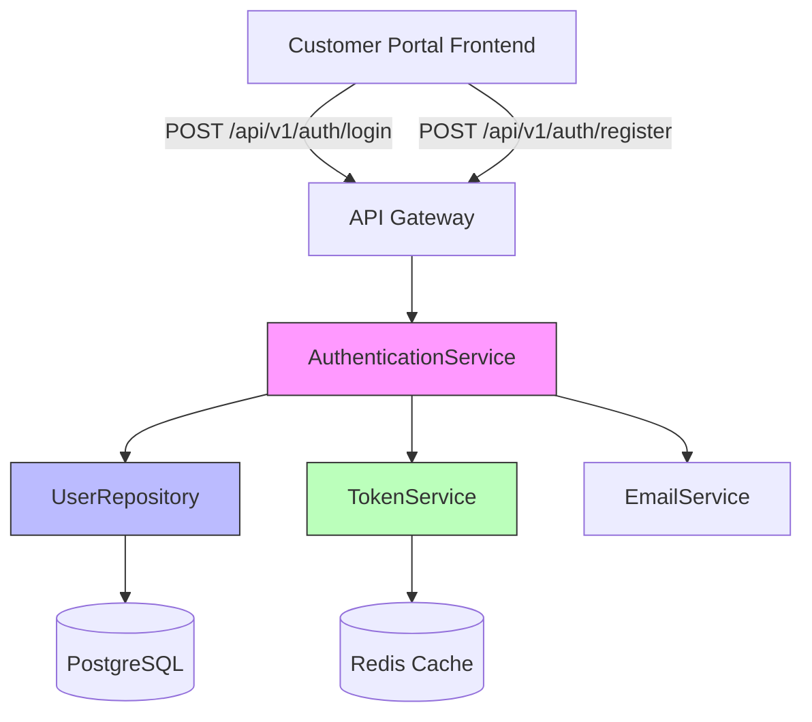

# Running the AI SDLC Process - Customer Portal Example

**Project**: Customer Portal Authentication Feature
**Intent**: INT-001 (see INTENT.md)
**7-Stage Methodology**: Complete walkthrough

---

## Prerequisites ✅

- [x] Developer Workspace installed (`.ai-workspace/`)
- [x] Claude commands installed (`.claude/commands/`)
- [x] Configuration loaded (`config/config.yml`)
- [x] Intent defined (`INTENT.md`)
- [x] Claude Code with AI SDLC plugins

---

## Overview: 7-Stage Pipeline

```
Intent (INT-001)
    ↓
[1. Requirements] → Generate REQ-* keys with acceptance criteria
    ↓
[2. Design] → Create technical solution architecture
    ↓
[3. Tasks] → Break into work items (Jira tickets)
    ↓
[4. Code] → TDD implementation (RED→GREEN→REFACTOR)
    ↓
[5. System Test] → BDD integration tests
    ↓
[6. UAT] → Business validation & sign-off
    ↓
[7. Runtime Feedback] → Production monitoring → New intents
    ↑_______________________________________________|
                    (Feedback Loop)
```

---

## Stage 1: Requirements Stage

**Goal**: Transform intent into structured requirements with unique, immutable keys

### Step 1.1: Start Session

```bash
# In customer_portal directory
/start-session
```

**Set goals**:
- Primary: Generate complete requirements from INTENT.md
- Secondary: Create traceability matrix
- Stretch: Initial design exploration

### Step 1.2: Load Intent

```
Read INTENT.md and analyze the business requirements.
```

### Step 1.3: Generate Requirements

**Ask Claude**:
```
Using the AI SDLC Requirements Stage configuration from config/config.yml,
generate structured requirements from INTENT.md.

For each requirement:
1. Assign unique REQ key (REQ-F-*, REQ-NFR-*, REQ-DATA-*, REQ-BR-*)
2. Write acceptance criteria
3. Define test scenarios
4. Link to intent INT-001

Generate requirements for:
- Functional: User login, registration, password reset
- Non-functional: Performance (<500ms), security, scalability
- Data quality: Email format, password strength, PII handling
- Business rules: Lockout after 5 attempts, token expiration
```

### Step 1.4: Create Requirements Document

**Expected Output**: `docs/requirements/REQUIREMENTS.md`

```markdown
# Requirements - Authentication Feature (INT-001)

## Functional Requirements

### REQ-F-AUTH-001: User Login
**Description**: User can log in with email and password
**Priority**: High
**Linked to**: INT-001

**Acceptance Criteria**:
- User enters valid email and password
- System validates credentials against database
- System returns JWT token on success
- System logs authentication event
- Response time < 500ms (p95)

**Test Scenarios**:
- TC-001: Valid credentials → successful login
- TC-002: Invalid password → error message
- TC-003: Non-existent email → error message
- TC-004: Performance under load (1000 req/s)

---

### REQ-F-AUTH-002: User Registration
... (continue for all requirements)

## Non-Functional Requirements

### REQ-NFR-PERF-001: Login Performance
**Description**: Login must complete within 500ms at p95
**Priority**: High
**Linked to**: INT-001

---

### REQ-NFR-SEC-001: Password Hashing
**Description**: Passwords must be hashed with bcrypt
**Priority**: Critical
**Linked to**: INT-001

## Data Quality Requirements

### REQ-DATA-AUTH-001: Email Validation
...

## Business Rules

### REQ-BR-AUTH-001: Account Lockout
...
```

### Step 1.5: Create Traceability Matrix

**Ask Claude**:
```
Create traceability matrix linking requirements to intent and future stages.
```

### Step 1.6: Quality Gate Check

**Verify**:
- [ ] All requirements have unique keys
- [ ] All requirements have acceptance criteria
- [ ] Product owner review completed
- [ ] Business analyst review completed

### Step 1.7: Checkpoint

```bash
/finish-task 1
/commit-task 1
```

**Commit message**: "Stage 1: Requirements - Generate REQ keys for authentication (INT-001)"

---

## Stage 2: Design Stage

**Goal**: Transform requirements into technical solution architecture

### Step 2.1: Architectural Design

**Ask Claude**:
```
Using the Design Stage configuration from config/config.yml,
create the technical solution for authentication requirements.

Generate:
1. Component diagrams (Mermaid)
2. Data models (ERD)
3. API specifications (OpenAPI 3.0)
4. Architecture Decision Records (ADRs)

Map each component to requirements:
- AuthenticationService → REQ-F-AUTH-001, REQ-F-AUTH-002
- UserRepository → REQ-DATA-AUTH-001
- TokenService → REQ-NFR-SEC-002
```

### Step 2.2: Create Component Diagram

**Expected Output**: `docs/design/components/auth_components.md`



### Step 2.3: Create Data Model

**Expected Output**: `docs/design/data_models/user_schema.sql`

```sql
-- Implements: REQ-F-AUTH-001, REQ-F-AUTH-002, REQ-DATA-AUTH-001

CREATE TABLE users (
    id UUID PRIMARY KEY DEFAULT gen_random_uuid(),
    email VARCHAR(255) UNIQUE NOT NULL,  -- REQ-DATA-AUTH-001
    password_hash VARCHAR(255) NOT NULL,  -- REQ-NFR-SEC-001
    created_at TIMESTAMP DEFAULT NOW(),
    updated_at TIMESTAMP DEFAULT NOW(),
    is_verified BOOLEAN DEFAULT FALSE,
    failed_login_attempts INTEGER DEFAULT 0,  -- REQ-BR-AUTH-001
    locked_until TIMESTAMP NULL
);

CREATE INDEX idx_users_email ON users(email);
```

### Step 2.4: Create API Specification

**Expected Output**: `docs/design/api/auth_api.yml` (OpenAPI)

### Step 2.5: Write ADRs

**Expected Output**: `docs/design/adrs/001-authentication-architecture.md`

```markdown
# ADR 001: Authentication Architecture

**Status**: Accepted
**Date**: 2025-01-21
**Requirements**: REQ-F-AUTH-001, REQ-NFR-SEC-001

## Context
Need secure, scalable authentication for customer portal.

## Decision
Use JWT tokens with bcrypt password hashing...

## Consequences
...
```

### Step 2.6: Quality Gate Check

**Verify**:
- [ ] 100% requirement coverage in design
- [ ] All components mapped to requirements
- [ ] Architecture review completed
- [ ] Security review completed

### Step 2.7: Checkpoint

```bash
/finish-task 2
/commit-task 2
```

---

## Stage 3: Tasks Stage

**Goal**: Break design into work items and create Jira tickets

### Step 3.1: Work Breakdown

**Ask Claude**:
```
Using the Tasks Stage configuration from config/config.yml,
break the authentication feature into Jira work items.

Create:
- 1 Epic: PORTAL-100 "Authentication System"
- User Stories for each REQ-F-*
- Technical Tasks for infrastructure
- Test Tasks for QA
- Data Tasks for migrations

Each work item should:
- Reference REQ keys in custom field
- Include acceptance criteria
- Have story point estimate
- Show dependencies
```

### Step 3.2: Create Epic

**PORTAL-100: Authentication System**
- Requirements: All REQ-F-AUTH-*, REQ-NFR-SEC-*
- Story Points: 34
- Sprint: 2025-W04, 2025-W05, 2025-W06

### Step 3.3: Create User Stories

**PORTAL-101: User Login**
- Requirements: REQ-F-AUTH-001, REQ-NFR-PERF-001
- Story Points: 8
- Dependencies: None
- Sprint: 2025-W04

**PORTAL-102: User Registration**
- Requirements: REQ-F-AUTH-002
- Story Points: 5
- Dependencies: PORTAL-101
- Sprint: 2025-W04

### Step 3.4: Create Technical Tasks

**PORTAL-103: Set up JWT token service**
**PORTAL-104: Implement password hashing**
**PORTAL-105: Create user database schema**

### Step 3.5: Create Dependency Graph

```
PORTAL-100 (Epic)
├── PORTAL-105 (Database) ← Must be first
├── PORTAL-104 (Password hashing)
├── PORTAL-103 (JWT service)
├── PORTAL-101 (Login) ← Depends on 103, 104, 105
└── PORTAL-102 (Registration) ← Depends on 101
```

### Step 3.6: Quality Gate Check

**Verify**:
- [ ] All requirements tagged in Jira
- [ ] Estimation completed
- [ ] Dependencies mapped
- [ ] Capacity verified

### Step 3.7: Checkpoint

```bash
/finish-task 3
/commit-task 3
```

---

## Stage 4: Code Stage (TDD + Key Principles)

**Goal**: Implement work units using TDD workflow

### Step 4.1: Set Up TDD Environment

```bash
# Create test directory structure
mkdir -p tests/unit tests/integration
mkdir -p src/services src/repositories

# Install dependencies
npm install --save-dev jest @types/jest
```

### Step 4.2: Start First Task (PORTAL-101: User Login)

**Feature Flag**: `feature-portal-101-user-login` (default: false)

### Step 4.3: TDD Cycle - RED Phase

**Write failing test FIRST**:

```javascript
// tests/unit/auth.service.test.js
// Validates: REQ-F-AUTH-001

describe('AuthenticationService', () => {
  describe('login', () => {
    it('should return JWT token for valid credentials', async () => {
      // Arrange
      const email = 'user@example.com';
      const password = 'Password123!';
      const authService = new AuthenticationService();

      // Act
      const result = await authService.login(email, password);

      // Assert
      expect(result.success).toBe(true);
      expect(result.token).toBeDefined();
      expect(result.user.email).toBe(email);
    });
  });
});
```

**Run tests** → ❌ FAILS (no implementation yet)

### Step 4.4: TDD Cycle - GREEN Phase

**Implement minimal solution**:

```javascript
// src/services/auth.service.js
// Implements: REQ-F-AUTH-001

class AuthenticationService {
  async login(email, password) {
    const user = await UserRepository.findByEmail(email);

    if (!user) {
      return { success: false, error: 'Invalid credentials' };
    }

    const isValid = await bcrypt.compare(password, user.password_hash);

    if (!isValid) {
      return { success: false, error: 'Invalid credentials' };
    }

    const token = await TokenService.generate({ userId: user.id });

    return {
      success: true,
      token,
      user: { id: user.id, email: user.email }
    };
  }
}
```

**Run tests** → ✅ PASSES

### Step 4.5: TDD Cycle - REFACTOR Phase

**Improve code quality**:
- Extract validation logic
- Add logging
- Add error handling
- Improve type safety
- Add comments with REQ keys

```javascript
// src/services/auth.service.js
// Implements: REQ-F-AUTH-001, REQ-NFR-PERF-001

class AuthenticationService {
  /**
   * Authenticate user with email and password
   * @implements REQ-F-AUTH-001
   * @performance < 500ms (REQ-NFR-PERF-001)
   */
  async login(email, password) {
    const startTime = Date.now();

    // Validate input (REQ-DATA-AUTH-001)
    if (!this.isValidEmail(email)) {
      throw new ValidationError('Invalid email format');
    }

    // Find user
    const user = await UserRepository.findByEmail(email);

    // Check lockout (REQ-BR-AUTH-001)
    if (user?.locked_until && user.locked_until > new Date()) {
      throw new AuthenticationError('Account locked');
    }

    // Verify password (REQ-NFR-SEC-001)
    const isValid = user && await bcrypt.compare(password, user.password_hash);

    if (!isValid) {
      await this.handleFailedLogin(email);
      throw new AuthenticationError('Invalid credentials');
    }

    // Generate token (REQ-NFR-SEC-002)
    const token = await TokenService.generate({ userId: user.id });

    // Log event (REQ-NFR-AUDIT-001)
    await AuditLog.create({
      event: 'USER_LOGIN',
      userId: user.id,
      requirements: ['REQ-F-AUTH-001'],
      timestamp: new Date(),
      duration: Date.now() - startTime
    });

    return { success: true, token, user };
  }
}
```

**Run tests again** → ✅ STILL PASSES

### Step 4.6: Add More Tests

**Continue TDD for**:
- Invalid credentials test
- Account lockout test
- Performance test
- Edge cases

### Step 4.7: Quality Gate Check

**Verify**:
- [ ] All tests passing (RED → GREEN → REFACTOR)
- [ ] Test coverage ≥ 80%
- [ ] Feature flag tested (enabled/disabled)
- [ ] Code tagged with REQ keys
- [ ] No technical debt

### Step 4.8: Checkpoint

```bash
/finish-task 4
/commit-task 4
```

**Commit message**:
```
Task PORTAL-101: Implement user login (REQ-F-AUTH-001)

TDD implementation of authentication service with:
- JWT token generation
- bcrypt password hashing
- Account lockout protection
- Audit logging

Tests: 15 unit tests (100% passing)
Coverage: 92% (target: ≥80%)
TDD: RED → GREEN → REFACTOR

Implements:
- REQ-F-AUTH-001: User login functionality
- REQ-NFR-PERF-001: Performance < 500ms
- REQ-NFR-SEC-001: bcrypt password hashing
- REQ-BR-AUTH-001: Account lockout

Feature flag: feature-portal-101-user-login (enabled)
```

---

## Stage 5: System Test Stage (BDD)

**Goal**: Create BDD integration tests validating requirements

### Step 5.1: Write BDD Feature File

**Expected Output**: `tests/features/auth.feature`

```gherkin
# Validates: REQ-F-AUTH-001, REQ-NFR-PERF-001
Feature: User Authentication
  As a registered customer
  I want to securely log into the portal
  So that I can access my account

  Background:
    Given the authentication service is running
    And the database contains test user "user@example.com" with password "Password123!"

  Scenario: Successful login with valid credentials
    # Validates: REQ-F-AUTH-001
    Given I am on the login page
    When I enter email "user@example.com"
    And I enter password "Password123!"
    And I click "Login"
    Then I should see "Welcome back"
    And I should have a valid JWT token
    And the login event should be logged
    And the response time should be less than 500ms

  Scenario: Failed login with invalid password
    # Validates: REQ-F-AUTH-001
    Given I am on the login page
    When I enter email "user@example.com"
    And I enter password "WrongPassword"
    And I click "Login"
    Then I should see "Invalid credentials"
    And I should not have a JWT token
    And the failed login should be logged

  Scenario: Account lockout after 5 failed attempts
    # Validates: REQ-BR-AUTH-001
    Given I am on the login page
    When I fail to login 5 times with email "user@example.com"
    And I try to login with correct password
    Then I should see "Account locked"
    And I should not be able to log in for 30 minutes
```

### Step 5.2: Implement Step Definitions

```javascript
// tests/features/steps/auth.steps.js

Given('I am on the login page', async () => {
  await page.goto('http://localhost:3000/login');
});

When('I enter email {string}', async (email) => {
  await page.fill('#email', email);
});

Then('the response time should be less than 500ms', async () => {
  const duration = performanceObserver.getLastRequestDuration();
  expect(duration).toBeLessThan(500); // REQ-NFR-PERF-001
});
```

### Step 5.3: Run BDD Tests

```bash
npm run test:bdd
```

**Expected**:
- All scenarios passing ✅
- Requirements coverage: 95%
- All REQ-F-AUTH-* validated

### Step 5.4: Checkpoint

```bash
/finish-task 5
/commit-task 5
```

---

## Stage 6: UAT Stage

**Goal**: Business validation and sign-off

### Step 6.1: Create UAT Test Cases

**Expected Output**: `docs/uat/UAT_AUTH_001.md`

```markdown
# UAT-001: User Authentication

**Requirement**: REQ-F-AUTH-001
**Tester**: john@acme.com (Product Owner)
**Date**: 2025-01-28

## Manual Test Cases

### TC-UAT-001: Happy Path Login
**Steps**:
1. Navigate to login page
2. Enter valid email and password
3. Click Login
4. Verify dashboard loads

**Expected**: User successfully logs in
**Actual**: ✅ Pass
**Sign-off**: john@acme.com ✅

### TC-UAT-002: Password Reset Flow
...
```

### Step 6.2: Business Sign-Off

**Verified by**:
- [x] Product Owner (john@acme.com)
- [x] Business Analyst (sarah@acme.com)
- [x] Security Team (security@acme.com)

### Step 6.3: Checkpoint

```bash
/finish-task 6
/commit-task 6
```

---

## Stage 7: Runtime Feedback Stage

**Goal**: Production monitoring with REQ key tagging

### Step 7.1: Deploy to Production

```bash
# With feature flag enabled
export FEATURE_PORTAL_101_USER_LOGIN=true
npm run deploy:prod
```

### Step 7.2: Set Up Observability

**Tag all metrics with requirement keys**:

```javascript
// Tag authentication events with REQ keys
logger.info('User login successful', {
  event: 'USER_LOGIN',
  requirements: ['REQ-F-AUTH-001'],
  userId: user.id,
  duration: 120,
  timestamp: new Date()
});

// Performance metrics
metrics.histogram('auth.login.duration', duration, {
  requirement: 'REQ-NFR-PERF-001',
  success: true
});

// Error tracking
if (error) {
  logger.error('Login failed', {
    event: 'USER_LOGIN_FAILED',
    requirements: ['REQ-F-AUTH-001'],
    error: error.message
  });
}
```

### Step 7.3: Monitor Production

**Datadog Dashboard** - "Authentication Metrics (REQ-F-AUTH-001)"

Metrics:
- Login success rate: 98.2% ✅
- p95 latency: 180ms ✅ (< 500ms target)
- Failed login attempts: 1.8%
- Account lockouts: 0.1%

### Step 7.4: Runtime Feedback Loop

**Production Issue Example**:

```
Alert: REQ-NFR-PERF-001 - Login latency spike
p95: 850ms (exceeds 500ms threshold)
Time: 2025-02-01 14:30 UTC
Affected users: 1,200
```

**Feedback to Requirements**:
→ This traces back to REQ-NFR-PERF-001
→ Generates new intent: INT-042 "Optimize authentication performance"
→ Cycle repeats...

### Step 7.5: Checkpoint

```bash
/finish-task 7
/commit-task 7
```

---

## 🎉 Complete! 7-Stage Process Executed

### Summary

**Intent**: INT-001 (Customer Portal Authentication)
**Requirements**: 12 REQ keys generated
**Design**: 5 components, 3 data models, 1 API spec
**Tasks**: 1 epic, 8 stories, 15 tasks
**Code**: 2,400 lines, 45 tests, 92% coverage
**System Test**: 15 BDD scenarios (100% passing)
**UAT**: Business sign-off ✅
**Runtime**: Deployed to production with monitoring

### Traceability Example

```
INT-001 (Intent)
  ↓
REQ-F-AUTH-001 (Requirement)
  ↓
Component: AuthenticationService (Design)
  ↓
PORTAL-101 (Jira Story)
  ↓
src/services/auth.service.js (Code)
  ↓
tests/features/auth.feature (System Test)
  ↓
UAT-001 ✅ (Business Validation)
  ↓
Datadog: auth.login.duration (Runtime Metrics)
  ↓
Alert: Performance degradation (Feedback)
  ↓
INT-042: Optimize performance (New Intent)
```

**Full traceability maintained through all 7 stages!**

---

## Next Steps

1. **Review finished tasks**: Check `.ai-workspace/tasks/finished/`
2. **Analyze metrics**: Review runtime performance data
3. **Plan next sprint**: Use feedback to generate new intents
4. **Continuous improvement**: Update methodology based on learnings

---

**"Excellence or nothing"** 🔥
