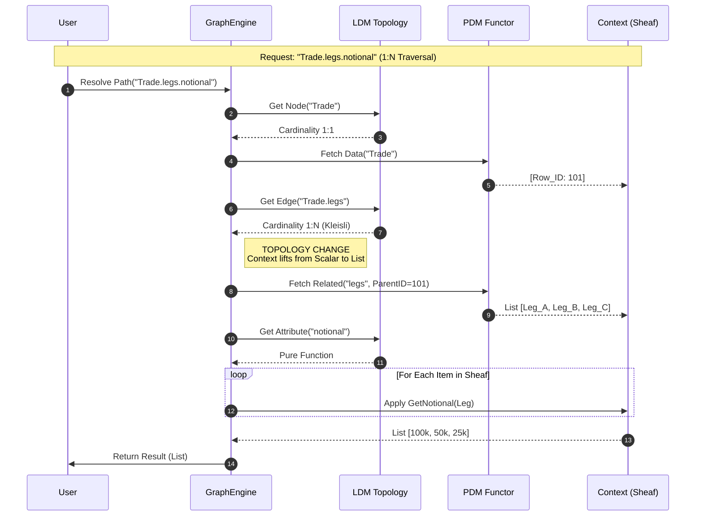

# Data Mapper Architecture: First Principles

This document outlines the topological architecture for the categorical data mapper. It defines the separation between the Logical Data Model (LDM) and Physical Data Model (PDM), the handling of Kleisli arrows (1:N lists), and the integration execution flow.

## 1. The Meta-Model (Class Structure)
Defines the rigorous separation of Logical Contexts (Topologies) and Physical Stores, bridged by Implementation Functors.

```mermaid
classDiagram
    %% The Core Category Theory Abstractions
    class Category {
        +Set~Object~ objects
        +Set~Morphism~ arrows
    }

    class Object {
        +String name
        +Type identity
    }

    class Morphism {
        +Object source
        +Object target
        +Cardinality type
        +compose(next: Morphism)
    }

    %% The LDM (Logical Data Model)
    class LogicalContext {
        +String contextName
    }
    LogicalContext --|> Category

    class LogicalEntity {
        +Namespace ns
    }
    LogicalEntity --|> Object

    class Relationship {
        %% The "Dot" Hierarchy
        +Enum direction
        +Boolean isIsomorphic
    }
    Relationship --|> Morphism

    %% The PDM (Physical Data Model)
    class PhysicalStore {
        +String connectionString
        +SchemaType type
    }
    PhysicalStore --|> Category

    class PhysicalTable {
        +String tableName
    }
    PhysicalTable --|> Object

    %% The Mappings (Functors)
    class ImplementationFunctor {
        %% LDM -> PDM
        +Map~LogicalEntity, PhysicalTable~ objectMap
        +Map~Relationship, QueryLogic~ arrowMap
        +resolve()
    }

    class IntegrationBridge {
        %% Context A -> Context B (The Black Box)
        +LogicalContext source
        +LogicalContext target
        +List~Transformation~ synthesisRules
    }

    %% Relationships
    Category *-- Object
    Category *-- Morphism
    LogicalContext *-- LogicalEntity
    LogicalContext *-- Relationship
    
    ImplementationFunctor --> LogicalContext : Maps From
    ImplementationFunctor --> PhysicalStore : Maps To
    
    IntegrationBridge --> LogicalContext : Context A
    IntegrationBridge --> LogicalContext : Context B
````

## 2\. Topology & The "Deficit" Handling

Visualizes the mapping of a Trading Context to a Regulatory Context.

  * **Yellow:** Logical Topology (LDM)
  * **Blue:** Physical Reality (PDM)
  * **Bold Path:** The expansion of the 1:N (Kleisli) arrow handling.

<!-- end list -->

```mermaid
graph TD
    subgraph "Bounded Context A (Trading LDM)"
        T[Trade Entity]
        L[Leg Entity]
        C[Counterparty]
        
        T -- "1:N (Kleisli Arrow)<br/>Expands Context" --> L
        T -- "N:1 (Function)" --> C
    end

    subgraph "Physical Store (PDM)"
        SQL_T[Table: trades_v1]
        SQL_L[Table: trade_legs]
        SQL_C[Table: cpt_ref]
    end

    subgraph "Bounded Context B (Regulator LDM)"
        R[LCR Report]
        B[Bucket]
    end

    %% The Implementation Functor (Mapping LDM to PDM)
    T -.->|Functor Map| SQL_T
    L -.->|Functor Map| SQL_L
    C -.->|Functor Map| SQL_C

    %% The Data Flow (Synthesis)
    SQL_T -->|Query| T
    SQL_L -->|Query| L
    
    %% The Integration Request (Black Box Logic)
    L == "Synthesis<br/>(Notional * Haircut)" ==> B
    B -- "Fold / Aggregation" --> R
```

## 3\. Execution Sequence (Path Resolver)

Details how the Graph Engine traverses `Trade.legs.notional`.

  * **Step 2** illustrates the "Sheaf Lifting" where a single scalar ID expands into a List context (Kleisli category).

<!-- end list -->


