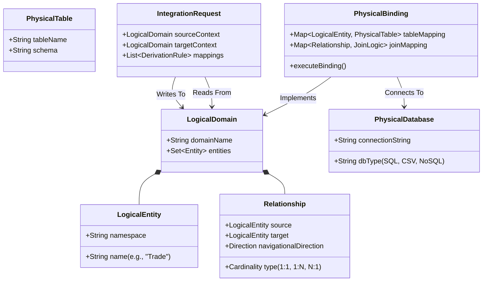
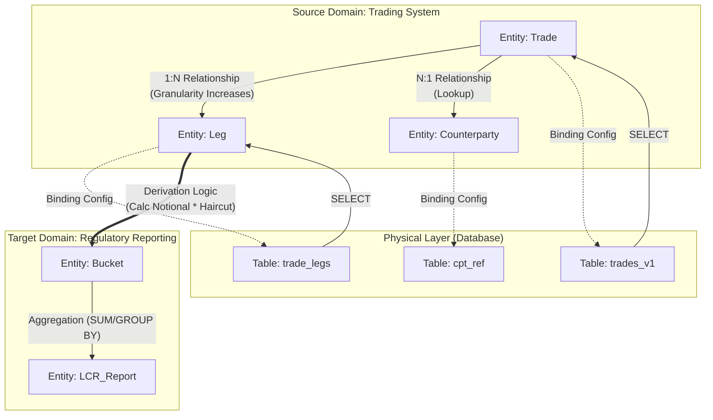
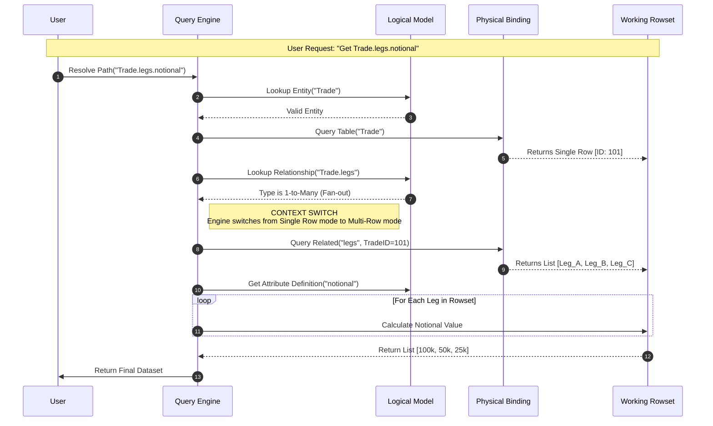

This is a critical step. To get buy-in from traditional Data Architects, we must map the mathematical rigor (CT) into standard Enterprise Architecture terminology (ER modeling, ETL patterns, and Logical vs. Physical separation).

Here is the **same architecture**, but translated into the language of **Data Architecture, SQL, and Entity-Relationship modeling**.

-----

# Architecture: Logical-Physical Mapping Engine

This document outlines the architecture for a metadata-driven Data Mapper. It enforces a strict separation between the **Logical Data Model (LDM)** (the business view) and the **Physical Data Model (PDM)** (the underlying database implementation).

## Key Concept Dictionary

Before reviewing the diagrams, please note the following terminology mappings used to standardize the architecture:

| Category Theory Term | Data Architect Term |
| :--- | :--- |
| **Category / Topology** | **Logical Domain / Bounded Context** |
| **Object** | **Entity / Business Object** |
| **Morphism (Arrow)** | **Relationship / Functional Dependency** |
| **Functor** | **Physical Binding (Mapping Config)** |
| **Kleisli Arrow (1:N)** | **One-to-Many Relationship (Granularity Shift)** |
| **Sheaf / Context** | **Rowset / Execution Context** |
| **Synthesis / Fold** | **Derived Attribute / Aggregation** |

-----

## 1\. The Meta-Model (Class Structure)

This diagram defines how we configure the system. We have a **Logical Layer** (Entities and Relationships) that is abstract. We have a **Physical Layer** (Tables and Columns). The **Binding Engine** links them together so business rules don't break when table names change.

-----

## 2\. Handling Granularity & Integration

This diagram visualizes a specific use case: **Mapping Trading Data to a Regulatory Report**.

It highlights the **Granularity Problem** (The "Deficit").

  * **Yellow:** The Logical definition (what the business sees).
  * **Blue:** The Physical tables (where data lives).
  * **Bold Path:** How the engine handles the "Fan-out" when moving from a single Trade to multiple Legs (1:N).

<!-- end list -->

-----

## 3\. Execution Sequence (The Path Resolver)

This shows what happens when a user or system requests a specific data point, such as `Trade.legs.notional`.

The engine acts as a **Query Compiler**. It resolves the logical path into physical queries, automatically handling the loop required when data expands from one row (Trade) to many rows (Legs).

