# Airline System Test Case - Design Document

**Document Type**: System Test Design
**Version**: 1.0
**Date**: 2025-12-15
**Status**: Implemented
**Test File**: `../scala/cdme/AirlineSystemSpec.scala`
**Location**: `src/test/resources/docs/`

> **Note**: This is a domain-specific test case design document demonstrating
> CDME capabilities with a realistic airline booking scenario. It is NOT part
> of the core CDME design - see `docs/design/design_spark/` for core
> implementation design.

---

## 1. Overview

This document describes the design of a complex system test case that validates CDME's ability to handle a realistic enterprise scenario: **Multi-Leg International Airline Booking System mapped to an Accounting System**.

### 1.1 Business Context

Airlines operate international flights between airports in different countries. Customers book journeys that may span multiple flight segments (legs), with travel and return dates potentially months apart. The Accounting system requires:

- **Daily revenue summaries** (not individual segments)
- **Currency normalization** to USD
- **Route-level aggregation** by airline
- **Cabin class breakdowns** for premium revenue tracking

### 1.2 Key Challenges Validated

| Challenge | CDME Capability Tested |
|-----------|------------------------|
| Multi-leg journeys | 1:N relationships, aggregation |
| International flights | Multi-hop traversals (Airport → Country → Currency) |
| Daily rollup | Grain transition (Atomic → Daily) |
| Currency conversion | N:1 lookups with calculation |
| Long date spans | Temporal aggregation (months between outbound/return) |
| Codeshare flights | Complex filtering and dual-key aggregation |

---

## 2. Domain Model

### 2.1 Entity Relationship Diagram

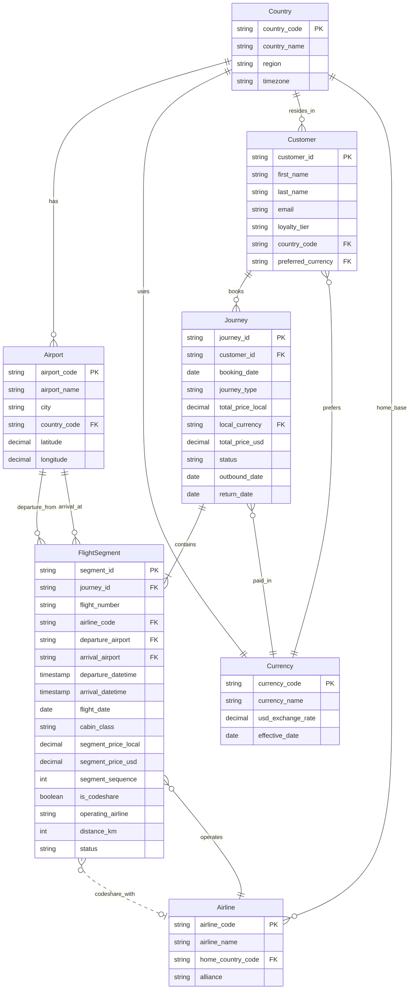

### 2.2 Class Diagram - Domain Entities

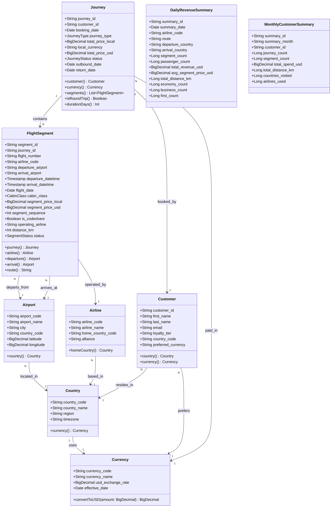

### 2.3 Enumeration Types

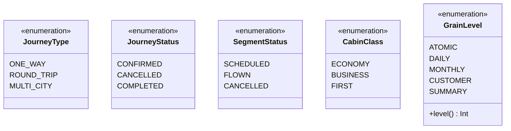

---

## 3. Grain Hierarchy

### 3.1 Grain Level Diagram

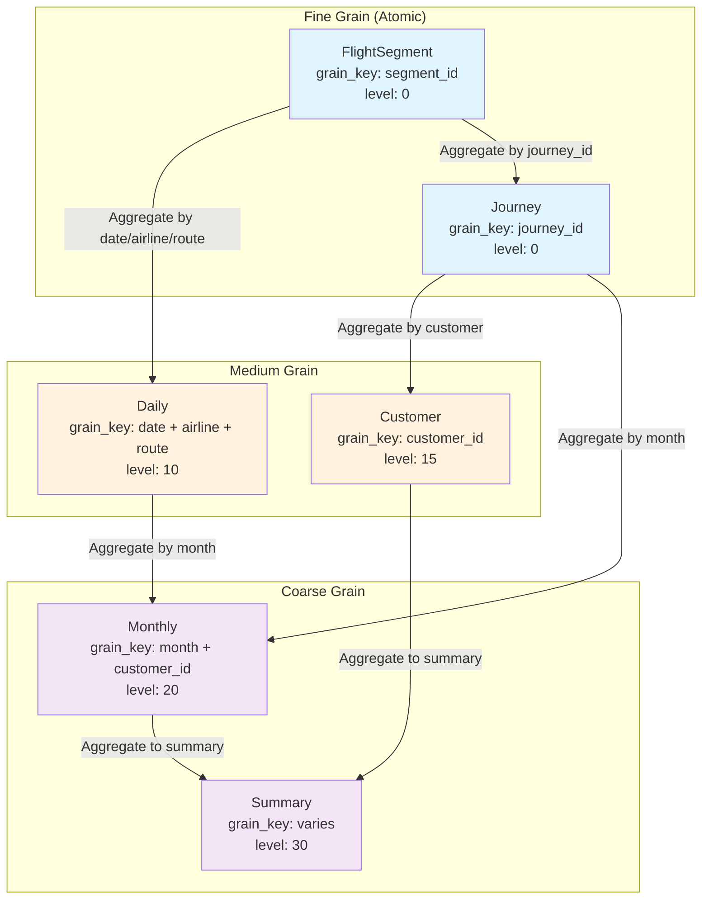

### 3.2 Grain Transition Rules

| From Grain | To Grain | Allowed? | Requirement |
|------------|----------|----------|-------------|
| Atomic (0) | Atomic (0) | ✅ Yes | None |
| Atomic (0) | Daily (10) | ✅ Yes | Aggregation required |
| Atomic (0) | Monthly (20) | ✅ Yes | Aggregation required |
| Daily (10) | Atomic (0) | ❌ No | Cannot refine grain |
| Daily (10) | Monthly (20) | ✅ Yes | Aggregation required |
| Monthly (20) | Daily (10) | ❌ No | Cannot refine grain |

---

## 4. Data Flow Architecture

### 4.1 Pipeline Overview

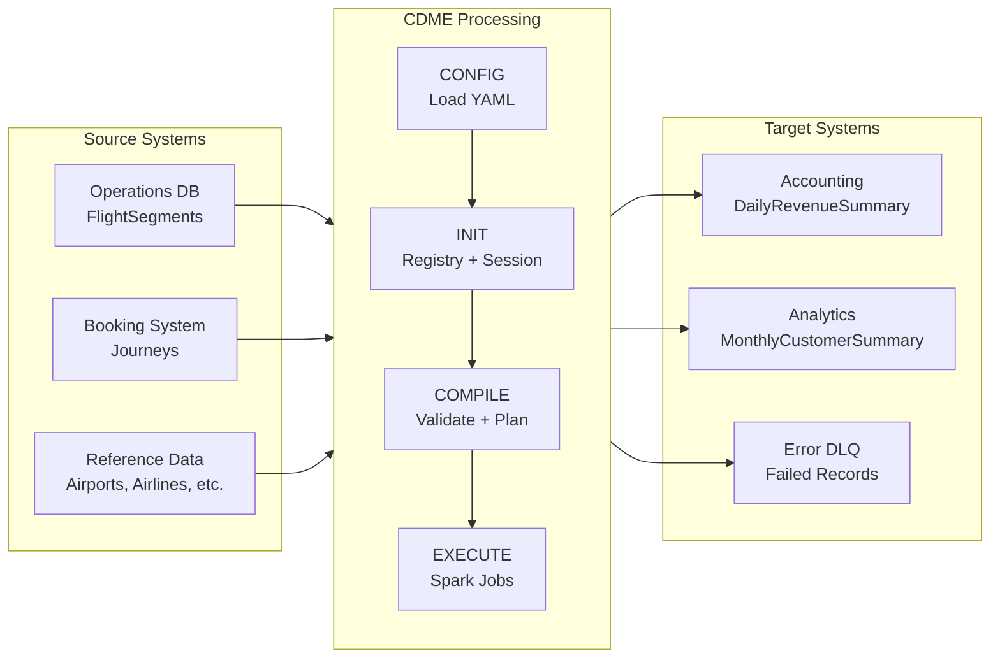

### 4.2 Daily Revenue Summary Pipeline

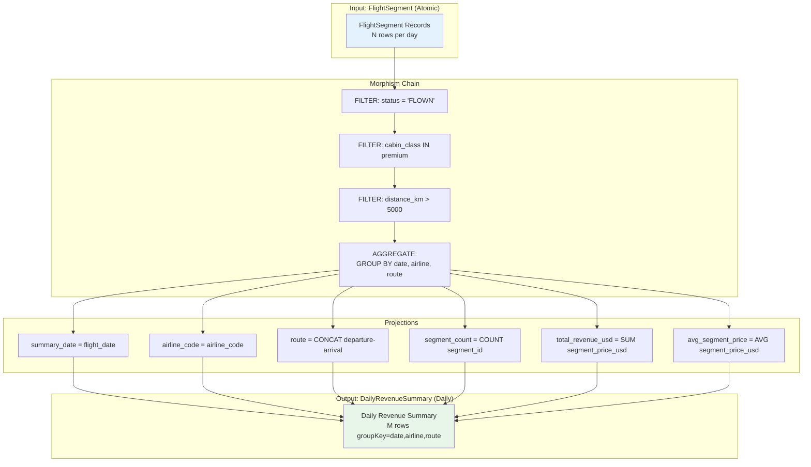

---

## 5. Sequence Diagrams

### 5.1 Mapping Compilation Sequence

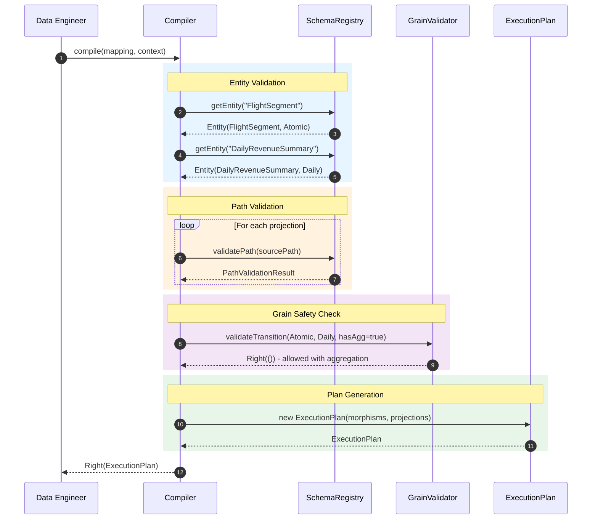

### 5.2 Execution Sequence with Error Handling

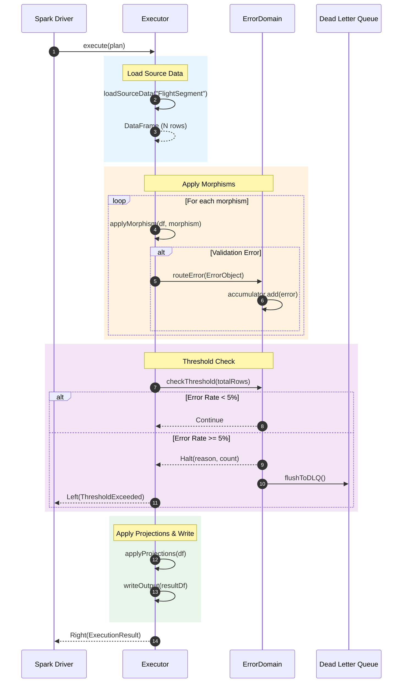

### 5.3 Multi-Hop Path Validation Sequence

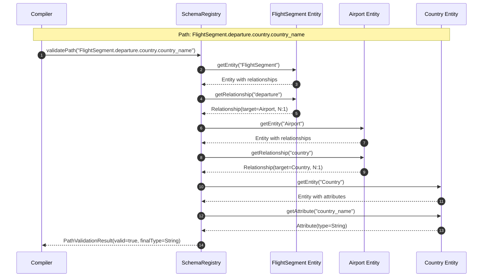

---

## 6. State Diagrams

### 6.1 Journey Lifecycle State Machine

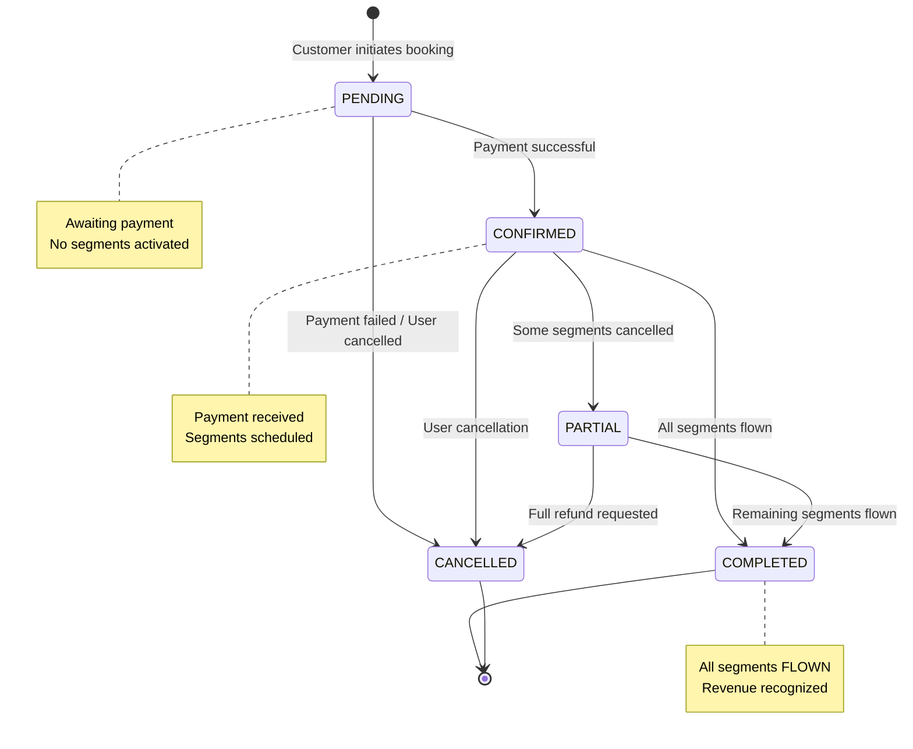

### 6.2 Flight Segment State Machine

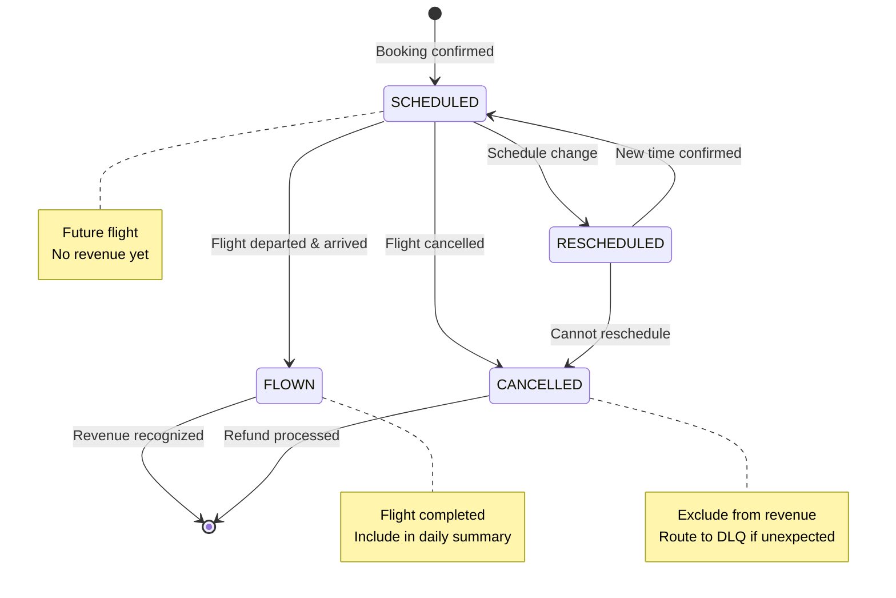

### 6.3 CDME Pipeline State Machine

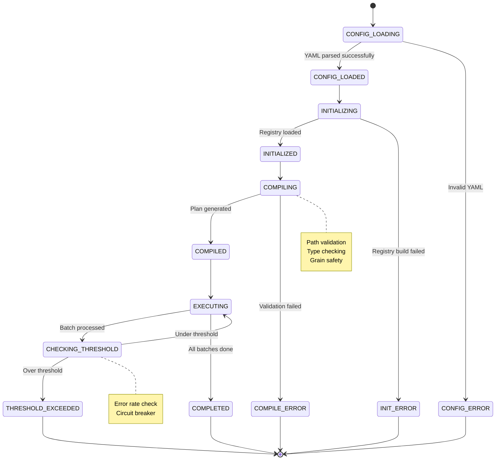

### 6.4 Error Domain State Machine

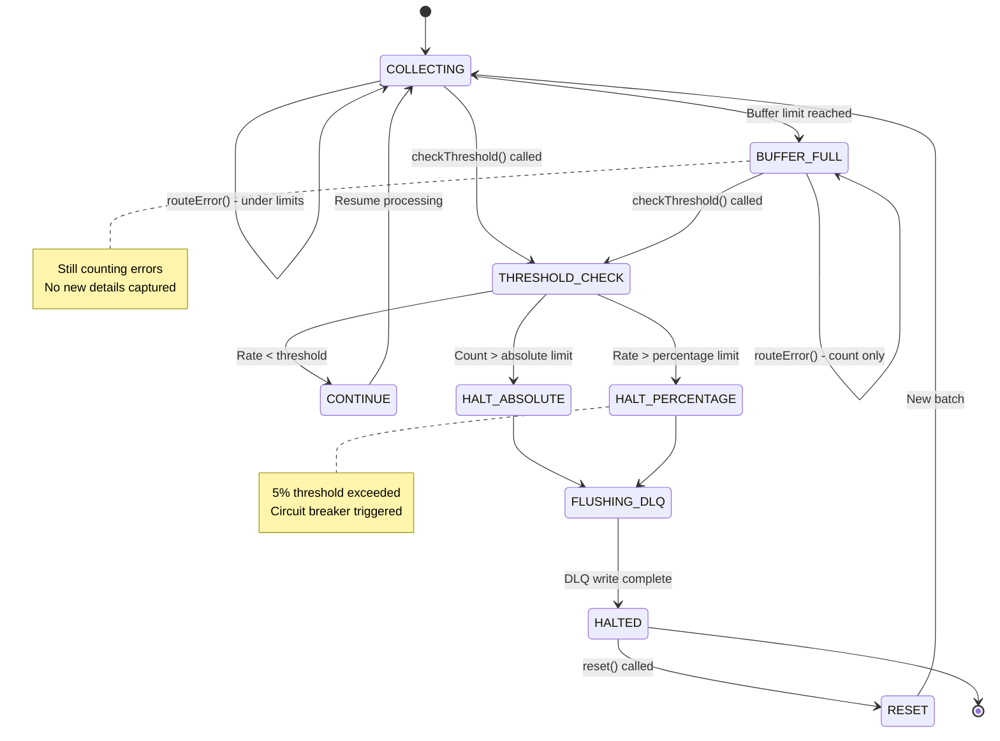

---

## 7. Component Architecture

### 7.1 CDME Component Diagram

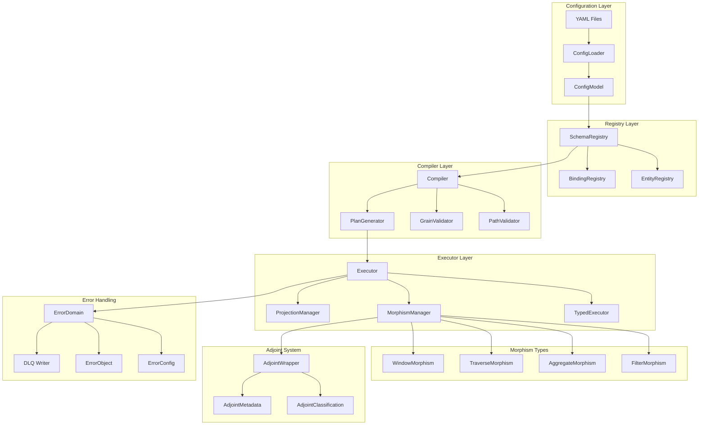

### 7.2 Algebra Integration

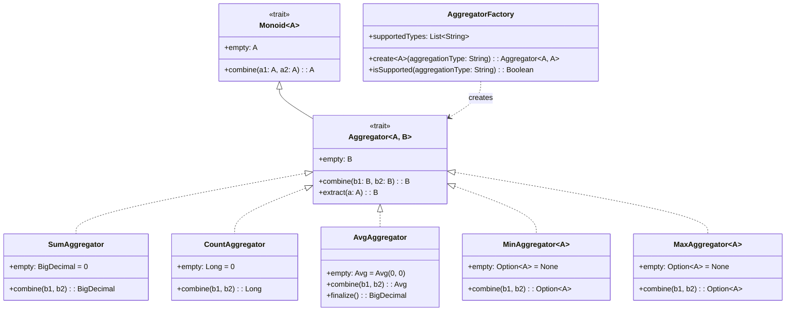

---

## 8. Mapping Configurations

### 8.1 Daily Revenue Summary Mapping

```yaml
mapping:
  name: daily_revenue_summary
  description: "Aggregate flight segments to daily airline route revenue"

  source:
    entity: FlightSegment
    epoch: "${epoch}"

  target:
    entity: DailyRevenueSummary
    grain:
      level: Daily
      key: [summary_date, airline_code, route]

  morphisms:
    - name: filter_flown
      type: FILTER
      predicate: "status = 'FLOWN'"

    - name: aggregate_daily
      type: AGGREGATE

  projections:
    - name: summary_date
      source: flight_date

    - name: airline_code
      source: airline_code

    - name: route
      source: "CONCAT(departure_airport, '-', arrival_airport)"

    - name: segment_count
      source: segment_id
      aggregation: COUNT

    - name: total_revenue_usd
      source: segment_price_usd
      aggregation: SUM

    - name: avg_segment_price_usd
      source: segment_price_usd
      aggregation: AVG

    - name: total_distance_km
      source: distance_km
      aggregation: SUM

  validations:
    - field: total_revenue_usd
      validationType: RANGE
      expression: "0:"
      errorMessage: "Revenue must be non-negative"
```

### 8.2 Premium International Analysis Mapping

```yaml
mapping:
  name: premium_international_revenue
  description: "Analyze premium cabin international flights"

  source:
    entity: FlightSegment
    epoch: "${epoch}"

  target:
    entity: DailyRevenueSummary
    grain:
      level: Daily
      key: [summary_date, airline_code]

  morphisms:
    # Chain of 4 business rule filters
    - name: filter_flown
      type: FILTER
      predicate: "status = 'FLOWN'"

    - name: filter_premium
      type: FILTER
      predicate: "cabin_class IN ('BUSINESS', 'FIRST')"

    - name: filter_longhaul
      type: FILTER
      predicate: "distance_km > 5000"

    - name: filter_high_value
      type: FILTER
      predicate: "segment_price_usd > 1000"

    - name: aggregate_daily
      type: AGGREGATE

  projections:
    - name: summary_date
      source: flight_date

    - name: airline_code
      source: airline_code

    - name: premium_segment_count
      source: segment_id
      aggregation: COUNT

    - name: premium_revenue_usd
      source: segment_price_usd
      aggregation: SUM

    - name: avg_premium_price
      source: segment_price_usd
      aggregation: AVG

    - name: total_premium_distance
      source: distance_km
      aggregation: SUM
```

### 8.3 Monthly Customer Summary Mapping

```yaml
mapping:
  name: monthly_customer_travel
  description: "Monthly customer travel pattern summary"

  source:
    entity: Journey
    epoch: "${epoch}"

  target:
    entity: MonthlyCustomerSummary
    grain:
      level: Monthly
      key: [summary_month, customer_id]

  morphisms:
    - name: filter_completed
      type: FILTER
      predicate: "status = 'COMPLETED'"

    - name: aggregate_monthly
      type: AGGREGATE

  projections:
    - name: summary_month
      source: "DATE_FORMAT(booking_date, 'yyyy-MM')"

    - name: customer_id
      source: customer_id

    - name: journey_count
      source: journey_id
      aggregation: COUNT

    - name: total_spend_usd
      source: total_price_usd
      aggregation: SUM

    - name: avg_journey_value
      source: total_price_usd
      aggregation: AVG
```

---

## 9. Test Scenarios Matrix

### 9.1 Feature Coverage

| Feature ID | Feature Name | Scenarios | Key Validations |
|------------|--------------|-----------|-----------------|
| SYS-001 | Complex Schema Registration | 3 | 9 entities, multi-hop paths |
| SYS-002 | Grain Transition | 3 | Atomic→Daily with aggregation |
| SYS-003 | Multi-Leg Journey | 2 | 1:N relationships, round-trips |
| SYS-004 | Currency Conversion | 2 | N:1 lookups, USD normalization |
| SYS-005 | Codeshare Analysis | 1 | Boolean filter, dual-key |
| SYS-006 | Monthly Customer | 2 | Atomic→Monthly aggregation |
| SYS-007 | Complex Filters | 1 | 4-filter chain + aggregate |
| SYS-008 | Window Functions | 2 | Running totals, rankings |
| SYS-009 | Error Detection | 2 | Invalid paths, missing entities |
| SYS-010 | Adjoint Integration | 2 | Reverse-join metadata |
| SYS-011 | Error Domain | 2 | Threshold checking |

### 9.2 Requirements Traceability

| Requirement | Test Coverage | Feature |
|-------------|---------------|---------|
| REQ-LDM-01 | Entity definitions | SYS-001 |
| REQ-LDM-02 | Cardinality types | SYS-001, SYS-003 |
| REQ-LDM-06 | Grain metadata | SYS-002, SYS-006 |
| REQ-TRV-01 | Context lifting | SYS-004 |
| REQ-TRV-02 | Grain safety | SYS-002 |
| REQ-ADJ-04 | Backward for aggregations | SYS-010 |
| REQ-ADJ-05 | Backward for filters | SYS-010 |
| REQ-TYP-03 | Error domain | SYS-011 |
| REQ-TYP-03-A | Batch threshold | SYS-011 |

---

## 10. Performance Considerations

### 10.1 Expected Data Volumes

| Entity | Daily Volume | Monthly Volume | Key Characteristics |
|--------|--------------|----------------|---------------------|
| FlightSegment | 500K | 15M | High cardinality, partitioned by date |
| Journey | 100K | 3M | 1:N with segments (avg 5 segments) |
| DailyRevenueSummary | 10K | 300K | Aggregated (50x reduction) |
| MonthlyCustomerSummary | 50K | 50K | Monthly snapshot |

### 10.2 Aggregation Strategy Selection

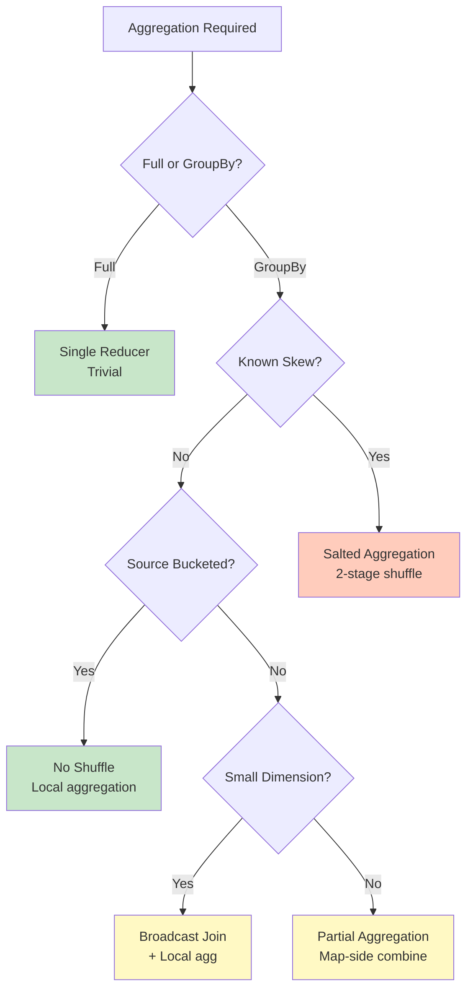

---

## 11. Appendix

### 11.1 Sample Data

**FlightSegment Example:**
```json
{
  "segment_id": "SEG-20241215-QF1-001",
  "journey_id": "JRN-20241201-C123",
  "flight_number": "QF1",
  "airline_code": "QF",
  "departure_airport": "SYD",
  "arrival_airport": "LHR",
  "departure_datetime": "2024-12-15T17:00:00Z",
  "arrival_datetime": "2024-12-16T05:30:00Z",
  "flight_date": "2024-12-15",
  "cabin_class": "BUSINESS",
  "segment_price_local": 8500.00,
  "segment_price_usd": 5525.00,
  "segment_sequence": 1,
  "is_codeshare": false,
  "distance_km": 17016,
  "status": "FLOWN"
}
```

**DailyRevenueSummary Example:**
```json
{
  "summary_id": "DRS-20241215-QF-SYDLHR",
  "summary_date": "2024-12-15",
  "airline_code": "QF",
  "route": "SYD-LHR",
  "departure_country": "AU",
  "arrival_country": "GB",
  "segment_count": 450,
  "passenger_count": 450,
  "total_revenue_usd": 1856250.00,
  "avg_segment_price_usd": 4125.00,
  "total_distance_km": 7657200,
  "economy_count": 350,
  "business_count": 80,
  "first_count": 20
}
```

### 11.2 Related Documents

- [SPARK_IMPLEMENTATION_DESIGN.md](./SPARK_IMPLEMENTATION_DESIGN.md) - Core implementation design
- [SPARK_SOLUTION_DESIGN.md](./SPARK_SOLUTION_DESIGN.md) - Solution architecture
- [ADR-005-adjoint-metadata.md](./adrs/ADR-005-adjoint-metadata.md) - Adjoint storage strategy
- [ADR-006-scala-type-system.md](./adrs/ADR-006-scala-type-system.md) - Type safety design

---

**Document Status**: Complete
**Last Updated**: 2025-12-15
**Author**: CDME Development Team
