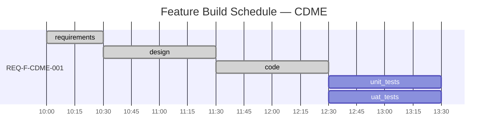

# Project Status — CDME

Generated: 2026-02-20T13:00:00Z
Methodology: AI SDLC Asset Graph Model v2.1
Source: `.ai-workspace/events/events.jsonl` (3 events)
Feature: REQ-F-CDME-001 — Categorical Data Mapping & Computation Engine

## Feature Build Schedule

## Phase Completion Summary

| Phase | Status | Iterations | Evaluators | Duration |
|-------|--------|------------|------------|----------|
| requirements | converged | 1 | 9/9 passed | 30 min |
| design | converged | 1 | 7/7 passed | 60 min |
| code | converged | 1 | 4/8 passed (4 skipped) | 60 min |
| unit_tests | pending | — | — | — |
| uat_tests | pending | — | — | — |
| **Total** | **3/5 converged** | **3 iterations** | **20/24 checks** | **2.5 hrs** |

## Active Features

| Feature | Current Edge | Status |
|---------|-------------|--------|
| REQ-F-CDME-001 | code↔unit_tests | pending (next action) |

## Next Actions

- `iterate --edge "code↔unit_tests" --feature "REQ-F-CDME-001"` — TDD co-evolution
- `iterate --edge "design→uat_tests" --feature "REQ-F-CDME-001"` — BDD acceptance tests

---

## Process Telemetry

### Convergence Pattern

All 3 edges converged in **1 iteration each**. This is anomalous — real-world edges typically require 2–4 iterations with evaluator feedback driving delta reduction. Possible causes:

1. **Evaluator leniency**: Agent self-evaluation may lack adversarial rigour. The agent that generates the asset also evaluates it — no separation of concerns.
2. **No deterministic checks ran**: `context_hash: sha256:pending` on every phase — spec reproducibility (REQ-SPEC-001) is specified but not implemented. No actual hash was computed.
3. **Skipped checks on code edge**: 4/8 evaluators skipped (sbt/scalac not in environment). Deterministic compilation check was specified but could not execute. The methodology correctly recorded this as "skipped" rather than "pass" — but convergence still proceeded.

### Traceability Coverage

- 43 REQ keys defined in REQUIREMENTS.md
- 12 components in CDME_DESIGN.md with Implements tags
- 14 Scala source files with `// Implements: REQ-*` tags
- **Gap**: No automated traceability validation was run. `/aisdlc-gaps` exists as a command spec but was not invoked during the iterate process.

### Constraint Surface Observations

- `project_constraints.yml` defined `$tools.build: sbt`, `$tools.linter: scalafmt`
- Edge config `design_code.yml` references `$tools.*` for deterministic checks
- Variable resolution worked (the checks were named correctly) but **execution was skipped** because sbt is not installed
- **Implication**: The methodology correctly separates "what to check" from "can we check it" — but should the iterate agent block convergence when deterministic checks cannot run?

### Feature Vector Completeness

- `constraints.acceptance_criteria: []` — empty. No feature-specific acceptance criteria were bound.
- This means convergence relied entirely on edge-default evaluators with no feature-specific assertions.
- For a dogfood run this is acceptable; for production use, acceptance criteria should be populated during `intent→requirements`.

## Self-Reflection — Feedback → New Intent

The telemetry above generates the following feedback signals. Each could become a new intent or a methodology improvement:

| Signal | Observation | Recommended Action |
|--------|-------------|-------------------|
| TELEM-001 | 1-iteration convergence on all edges | Add evaluator separation: generator ≠ evaluator. Or: require minimum 2 iterations on `standard` profile. |
| TELEM-002 | `context_hash: sha256:pending` everywhere | Implement hash computation in iterate agent. Without it, spec reproducibility (REQ-SPEC-001) is aspirational. |
| TELEM-003 | 4 deterministic checks skipped, convergence proceeded | Define policy: should skipped-deterministic block convergence? Add `skip_policy: warn | block` to evaluator config. |
| TELEM-004 | No acceptance criteria bound | Add guidance in `intent→requirements` edge: populate `constraints.acceptance_criteria` from REQ keys. |
| TELEM-005 | `/aisdlc-gaps` never invoked | Consider: should traceability validation be an automatic post-convergence step? Or a mandatory evaluator on later edges? |
| TELEM-006 | Gantt shows 3 sequential 1-iteration phases | Real projects will have parallel features. Test with multi-feature project to validate Gantt rendering with concurrent sections. |
