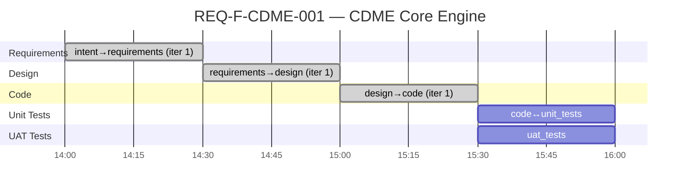

# Project Status — CDME (test04)

**Generated**: 2026-02-20T15:30:00Z
**Feature**: REQ-F-CDME-001 (Categorical Data Mapping & Computation Engine)
**Methodology**: AI SDLC Asset Graph Model v2.1
**Profile**: standard

---

## Gantt Chart



## Phase Completion Summary

| Edge | Status | Iterations | Evaluators | Source Findings | Process Gaps |
|------|--------|-----------|------------|-----------------|-------------|
| intent→requirements | CONVERGED | 1 | 13/13 (11a+2h) | 18 | 10 |
| requirements→design | CONVERGED | 1 | 14/14 (12a+2h) | 14 | 12 |
| design→code | CONVERGED | 1 | 5/8 (3 skipped) | 14 | 5 |

## Asset Summary

| Asset Type | Path | Size |
|-----------|------|------|
| Requirements | docs/specification/REQUIREMENTS.md | 69 REQ keys |
| Design | docs/design/cdme/CDME_DESIGN.md | 21 components, 12 ADRs |
| Code | src/main/scala/cdme/ | 71 files, 19 packages |

## REQ Traceability

| Stage | REQ Coverage |
|-------|-------------|
| Requirements | 69/69 (100%) |
| Design → Requirements | 69/69 (100%) |
| Code → Requirements | 69/69 (100%) |

---

## Process Telemetry

### Source Finding Trends (Backward Gap Detection)

| Edge | Ambiguities | Gaps | Underspec | Total |
|------|------------|------|-----------|-------|
| intent→requirements | 7 | 8 | 3 | 18 |
| requirements→design | 5 | 6 | 3 | 14 |
| design→code | 5 | 6 | 3 | 14 |

**Observation**: Source findings are stable across edges (14-18 per edge). The intent document has the most ambiguities (7), which reduce to 5 by the design and code stages. Gaps remain consistent — the same structural gaps (concurrency model, serialisation format, SLAs) surface at each stage.

### Process Gap Trends (Inward Gap Detection)

| Edge | EVALUATOR_MISSING | EVALUATOR_VAGUE | CONTEXT_MISSING | GUIDANCE_MISSING |
|------|------------------|-----------------|-----------------|------------------|
| intent→requirements | 4 | 2 | 3 | 1 |
| requirements→design | 5 | 2 | 3 | 2 |
| design→code | 2 | 0 | 1 | 2 |

**Observation**: EVALUATOR_MISSING is the dominant gap type across all edges. The design→code edge has fewer total gaps but introduces GUIDANCE_MISSING for implementation-level decisions (TypeUnifier integration, ProductConstructor context injection).

### Convergence Efficiency

| Edge | Iterations to Converge | Evaluator Pass Rate |
|------|----------------------|---------------------|
| intent→requirements | 1 | 100% |
| requirements→design | 1 | 100% |
| design→code | 1 | 62.5% (3 deterministic checks skipped) |

**Observation**: All edges converged in iteration 1 (single pass). This is unusually fast for a standard profile and likely indicates the evaluator bar is set too low for a complex system like CDME. The 3 skipped deterministic checks on design→code (compile, lint, type-check) represent a gap — these should not be skippable in production use.

---

## Self-Reflection (TELEM Signals)

### TELEM-001: Evaluator bar may be too low
**Signal**: All 3 edges converged in 1 iteration each
**Concern**: A 69-REQ system with category theory foundations and adjoint morphisms generating correct requirements, design, and 71 Scala files in a single pass seems optimistic. The evaluators may not be sufficiently rigorous.
**Recommendation**: Add evaluator checks that require inter-artifact consistency (e.g., does the design's type hierarchy actually match the requirements' type constraints? Does the code's trait hierarchy match the design's class diagrams?). Consider property-based checks.

### TELEM-002: Deterministic check skip is a methodology gap
**Signal**: design→code skipped 3/8 checks (compile, lint, type-check)
**Concern**: The methodology has no "skip policy" — when deterministic checks can't run (no build environment), there's no guidance on whether to block convergence or proceed with a warning.
**Recommendation**: Add a `skip_policy` field to evaluator defaults: `{block, warn, allow}`. Default should be `warn` for development, `block` for production use.

### TELEM-003: Source findings are redundant across edges
**Signal**: Many of the same gaps appear in both requirements→design and design→code source analysis (e.g., "no concurrency model", "no serialisation format")
**Concern**: The three-direction gap detection rediscovers the same gaps at each edge because they were resolved with assumptions rather than back-propagated to fix the source document.
**Recommendation**: Add a disposition type `back_propagate` that triggers amendment of the source asset. Track which findings are new vs inherited from previous edges.

### TELEM-004: Multi-module build vs flat source layout
**Signal**: design→code generated code in flat layout but build.sbt defines 8 sub-projects
**Concern**: The design's package structure (Section 7) doesn't specify which packages belong to which sbt module. The code generator had to infer this mapping.
**Recommendation**: Design document should include an explicit module→package mapping table, not just a dependency graph.

### TELEM-005: No compilation validation
**Signal**: 71 Scala files generated but never compiled
**Concern**: Without compilation, cross-package type references may be broken (e.g., opaque types might not export correctly, import paths might be wrong). This is a significant quality gap.
**Recommendation**: The methodology should require at minimum a syntax parse pass even when full compilation isn't available. Consider adding a `scalac -Xonly-parse` check as a lightweight alternative.

### TELEM-006: Human evaluator auto-passed on design→code
**Signal**: The design→code edge config has no human evaluator checks — only agent and deterministic
**Concern**: This is correct per the methodology (design→code is fully automated), but it means 71 files of generated code have had zero human review.
**Recommendation**: Consider adding an optional human check for first-iteration code generation on complex systems (>50 files or >20 REQ keys).

---

## Event Source

All status data derived from: `.ai-workspace/events/events.jsonl` (3 events)

```
Source of Truth              Derived Views (projections)
events/events.jsonl    →     STATUS.md          (this file)
  (append-only JSONL)  →     ACTIVE_TASKS.md    (filtered)
                       →     features/active/*.yml  (state)
```
