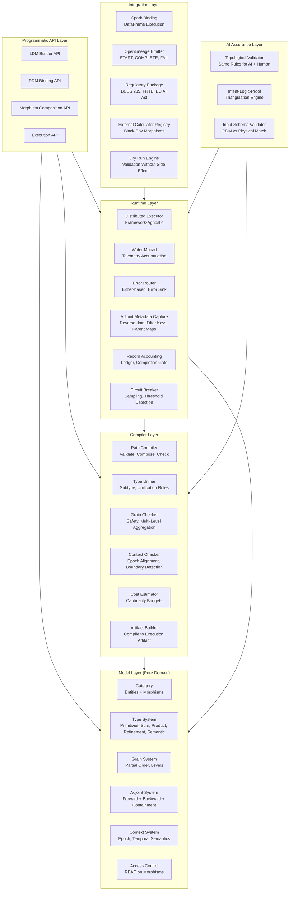
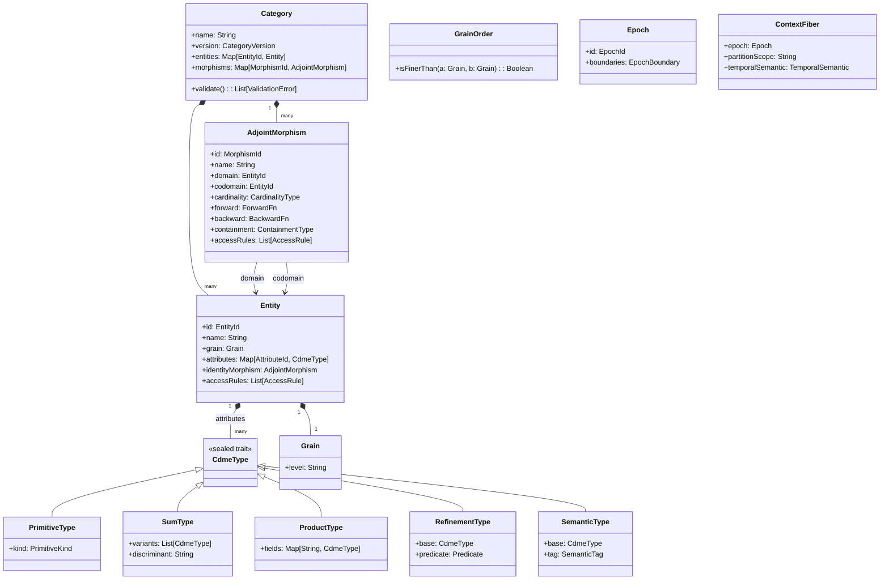
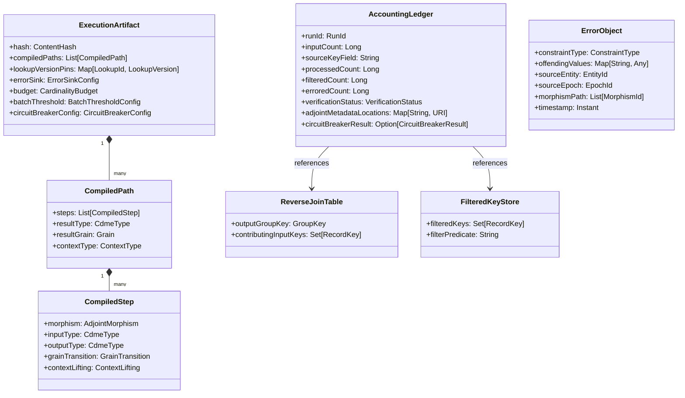
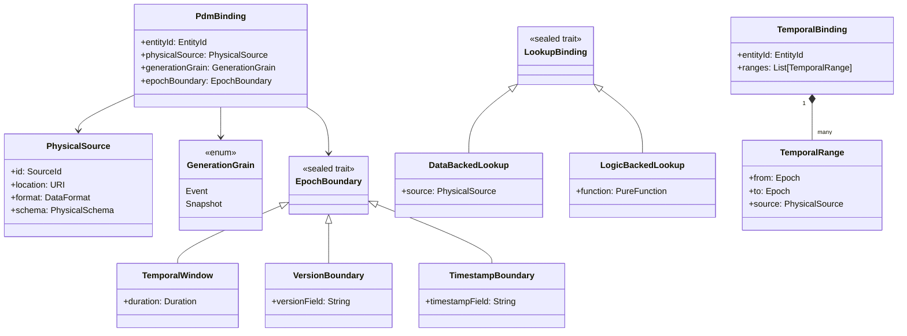

# CDME -- Technical Design Document

**Version**: 1.0.0
**Date**: 2026-02-20
**Status**: Draft -- Generated by v2.1 iterate(requirements->design)
**Feature**: REQ-F-CDME-001
**Source Asset**: docs/specification/REQUIREMENTS.md v1.0.0 (69 REQ keys)
**Methodology**: AI SDLC Asset Graph Model v2.1

---

## Table of Contents

1. [Architecture Overview](#1-architecture-overview)
2. [Component Design](#2-component-design)
3. [Data Model](#3-data-model)
4. [Integration Points](#4-integration-points)
5. [Error Handling Strategy](#5-error-handling-strategy)
6. [Configuration Model](#6-configuration-model)
7. [Package/Module Structure](#7-packagemodule-structure)
8. [Traceability Matrix](#8-traceability-matrix)
9. [ADR Index](#9-adr-index)

---

## 1. Architecture Overview

### 1.1 Design Philosophy

The CDME is a Scala 3.3 library/engine -- not a hosted service -- that provides compile-time and definition-time validation of data transformation pipelines grounded in Category Theory. The architecture enforces a strict layered separation:

1. **Model Layer** (zero external dependencies) -- Pure domain types: categories, morphisms, types, grains, contexts, adjoints
2. **Compiler Layer** (depends on Model) -- Path validation, type unification, grain checking, cost estimation, execution artifact production
3. **Runtime Layer** (depends on Model + Compiler) -- Distributed execution, telemetry capture, error routing, adjoint metadata persistence
4. **Integration Layer** (depends on Runtime) -- Spark binding, OpenLineage emission, regulatory packaging, external calculator registration

This layering satisfies the project constraint that "Model layer has zero external dependencies" and "Compiler depends on model, never the reverse."

### 1.2 High-Level Architecture



### 1.3 Key Architectural Principles

| Principle | Mechanism | REQ Basis |
|-----------|-----------|-----------|
| Schema is topology | LDM as Category (objects + morphisms + laws) | REQ-F-LDM-001 |
| LDM/PDM separation | Functor from LDM category to Physical category | REQ-F-PDM-001 |
| Definition-time validation | Compiler validates before execution | REQ-F-LDM-003, REQ-F-TRV-002 |
| No implicit casting | All type conversions are explicit named morphisms | REQ-F-TYP-003, REQ-BR-TYP-001 |
| Failures as data | Either monad, error objects as first-class data | REQ-F-ERR-001 |
| Every morphism is adjoint | Forward + backward with containment | REQ-F-ADJ-001 |
| Record accounting | Invariant: input = processed + filtered + errored | REQ-F-ACC-001 |
| Immutable business logic | Pure functions, Writer monad for side effects | REQ-NFR-SEC-001 |

---

## 2. Component Design

### 2.1 Component: Category Model

**Implements**: REQ-F-LDM-001, REQ-F-LDM-002, REQ-F-LDM-004, REQ-F-LDM-005, REQ-F-LDM-008

**Responsibilities**:
- Represent the Logical Data Model as a typed, directed multigraph (category)
- Enforce identity morphisms for every entity
- Enforce associativity of morphism composition
- Store grain metadata on every entity
- Store typed attributes on every entity
- Support versioned schema definitions with immutable version identifiers

**Interfaces**:
- `Entity[G <: Grain]` -- Typed entity with grain level, typed attributes, identity morphism
- `Morphism[A, B, C <: CardinalityType]` -- Directed typed morphism between entities with cardinality
- `Category` -- Container of entities and morphisms; validates identity and associativity laws
- `CategoryVersion` -- Immutable versioned snapshot of a category

**Dependencies**:
- Type System (for attribute types)
- Grain System (for grain metadata)

**Design Notes**:
- Entities are parameterised by their grain level type using Scala 3 opaque types or phantom types, enabling compile-time grain checking where possible
- Multiple morphisms between the same entity pair are supported (multigraph)
- Schema versioning uses content-addressed hashing (SHA-256 of canonical form) to produce monotonic, collision-resistant version identifiers
- Identity morphisms are auto-generated for each entity registration

---

### 2.2 Component: Type System

**Implements**: REQ-F-TYP-001, REQ-F-TYP-002, REQ-F-TYP-003, REQ-F-TYP-004, REQ-F-TYP-005, REQ-BR-TYP-001

**Responsibilities**:
- Define the extended type system: primitives, sum types, product types, refinement types, semantic types
- Enforce type unification rules during morphism composition
- Reject implicit casting (all conversions must be explicit named morphisms)
- Support nested composition of type constructors
- Define subtype relationships (declared, not inferred)

**Interfaces**:
- `CdmeType` -- Sealed trait hierarchy for all types
  - `PrimitiveType` -- String, Int, Long, Decimal, Date, Timestamp, Boolean
  - `SumType[A, B]` -- Tagged union with discriminant
  - `ProductType` -- Named record or positional tuple
  - `RefinementType[T, P]` -- Base type with predicate
  - `SemanticType[T, Tag]` -- Domain-meaningful wrapper over primitive
  - `OptionType[T]` -- Optional wrapper
  - `ListType[T]` -- List wrapper
- `TypeUnifier` -- Checks type compatibility for composition; returns `Either[TypeError, UnifiedType]`
- `SubtypeRegistry` -- Manages declared subtype relationships
- `ConversionMorphism[A, B]` -- Explicit named type conversion

**Dependencies**:
- None (pure domain types)

**Design Notes**:
- Scala 3 union types (`A | B`) naturally encode sum types; however, we use a sealed ADT for runtime discriminant tagging since Spark DataFrames require schema-level type information
- Refinement type predicates are represented as `T => Boolean` functions, evaluated at data processing time (runtime), with the predicate expression stored as metadata for lineage
- Semantic types use Scala 3 opaque types for zero-cost abstraction at compile time, with runtime tagging for serialisation

---

### 2.3 Component: Grain System

**Implements**: REQ-F-LDM-004, REQ-F-LDM-006, REQ-F-LDM-007, REQ-F-TRV-002, REQ-F-INT-003, REQ-BR-LDM-001

**Responsibilities**:
- Define grain levels as a partially ordered set (poset)
- Enforce grain safety: reject operations mixing incompatible grains without aggregation
- Validate monoidal aggregation (associativity, identity element)
- Support multi-level aggregation chains (finer to coarser)
- Reject coarser-to-finer aggregation

**Interfaces**:
- `Grain` -- Opaque type representing a grain level
- `GrainOrder` -- Partial order over grains; `isFinerThan(a, b): Boolean`
- `Monoid[T]` -- Typeclass with `combine(a: T, b: T): T` and `empty: T`; must be associative
- `AggregationMorphism[A, B, M <: Monoid]` -- Aggregation with declared monoid
- `GrainChecker` -- Validates grain compatibility in paths and expressions

**Dependencies**:
- Category Model (grain is metadata on entities)
- Type System (monoid operates on typed values)

**Design Notes**:
- Built-in monoids: `SumMonoid`, `CountMonoid`, `MinMonoid`, `MaxMonoid`, `ConcatMonoid`
- Custom monoids must provide a proof of associativity via property-based testing or declaration
- Grain levels are configurable per LDM (not hardcoded) -- e.g., `{Atomic, Daily, Monthly, Quarterly, Yearly}`
- Multi-level aggregation is implemented as composition of single-level aggregation morphisms, each checked independently

---

### 2.4 Component: Context System

**Implements**: REQ-F-TRV-003, REQ-F-TRV-004, REQ-F-PDM-002, REQ-F-PDM-003, REQ-BR-LDM-002

**Responsibilities**:
- Define contextual fibers: epoch, partitioning scope, temporal semantics
- Enforce context consistency for joins (same epoch or declared temporal semantics)
- Detect boundary alignment crossings during path compilation
- Support temporal semantics: As-Of, Latest, Exact
- Ensure lookup immutability within epoch

**Interfaces**:
- `Epoch` -- Value type representing a bounded processing scope
- `TemporalSemantic` -- Enum: `AsOf | Latest | Exact`
- `ContextFiber` -- Composite of epoch, partition scope, temporal semantic
- `ContextChecker` -- Validates join compatibility, detects boundary crossings
- `EpochResolver` -- Given a physical source and epoch identifier, resolves data boundaries

**Dependencies**:
- Category Model (context is metadata on entities)
- PDM Binding (epoch resolution depends on physical source semantics)

**Design Notes**:
- Context fibers are attached to every entity instance in the execution graph
- Boundary crossings detected during compilation emit specific errors with the crossing point identified
- Lookup immutability is enforced by pinning lookup versions at epoch entry and caching results

---

### 2.5 Component: Adjoint System

**Implements**: REQ-F-ADJ-001, REQ-F-ADJ-002, REQ-F-ADJ-003, REQ-F-ADJ-004, REQ-F-ADJ-005, REQ-F-ADJ-006, REQ-F-ADJ-007, REQ-F-ADJ-008, REQ-BR-ADJ-001

**Responsibilities**:
- Define the Adjoint interface: every morphism provides forward and backward
- Implement cardinality-specific adjoint strategies (1:1, N:1, 1:N, aggregation, filter)
- Enforce contravariant composition of adjoints
- Capture backward metadata during forward execution (reverse-join tables, filtered keys, parent maps)
- Ensure adjoint execution respects epoch context

**Interfaces**:
- `AdjointMorphism[A, B]` -- Trait with `forward: A => B`, `backward: B => BackwardResult[A]`, `containment: ContainmentType`
  - `IsomorphicAdjoint[A, B]` -- Exact inverse: `backward(forward(x)) = x`
  - `PreimageAdjoint[A, B]` -- N:1: returns preimage set
  - `KleisliAdjoint[A, B]` -- 1:N: collects parent record
  - `AggregationAdjoint[A, B]` -- Fold: reverse-join table lookup
  - `FilterAdjoint[A]` -- Returns passed + filtered-out with tags
- `BackwardResult[A]` -- Result type containing records + metadata tags
- `ReverseJoinTable` -- Maps output group key to contributing input record keys
- `FilteredKeyStore` -- Stores filtered-out record keys with filter predicate metadata
- `AdjointComposer` -- Composes adjoints contravariantly: `(g . f)- = f- . g-`

**Dependencies**:
- Category Model (morphisms are adjoint)
- Runtime (metadata capture happens during forward execution)

**Design Notes**:
- Every morphism is required to implement the Adjoint interface; morphisms without backward functions are rejected at definition time
- External calculator morphisms may declare backward as "opaque" with manually declared containment bounds
- Adjoint metadata is persisted within the same epoch context and storage location as forward execution results
- Contravariant composition is validated at definition time by checking that the composed backward path type-checks

---

### 2.6 Component: PDM Binding

**Implements**: REQ-F-PDM-001, REQ-F-PDM-002, REQ-F-PDM-003, REQ-F-PDM-004, REQ-F-PDM-005

**Responsibilities**:
- Bind logical entities to physical storage via functorial mapping
- Preserve composition: `F(g . f) = F(g) . F(f)`
- Support generation grain semantics (Event, Snapshot)
- Support epoch boundary definitions
- Support lookup binding (data-backed, logic-backed)
- Support temporal binding (epoch-dependent physical sources)

**Interfaces**:
- `PhysicalSource` -- Describes a physical storage location with generation grain
- `PdmBinding` -- Functor mapping from LDM entity to PhysicalSource
- `GenerationGrain` -- Enum: `Event | Snapshot`
- `EpochBoundary` -- Defines how continuous data is sliced (temporal window, version, timestamp)
- `LookupBinding` -- Enum: `DataBacked(source) | LogicBacked(fn)`
- `TemporalBinding` -- Maps (entity, epoch) to physical source with non-overlapping temporal ranges

**Dependencies**:
- Category Model (binds LDM entities)
- Type System (physical column types must match logical attribute types via functor)

**Design Notes**:
- The PDM is itself modelled as a category (physical tables as objects, physical joins as morphisms) and the binding is a functor between categories
- Changing PDM configuration (re-pointing an entity to a different physical source) requires no changes to LDM or business logic morphisms
- Temporal bindings with overlapping ranges for the same entity are rejected at definition time
- Missing generation grain or epoch boundary is a validation error

---

### 2.7 Component: Path Compiler

**Implements**: REQ-F-LDM-003, REQ-F-TRV-001, REQ-F-TRV-002, REQ-F-TRV-003, REQ-F-TRV-004, REQ-F-TRV-007, REQ-F-ACC-005

**Responsibilities**:
- Validate traversal paths at definition time
- Verify morphism existence, type compatibility, grain safety, context consistency, access control
- Implement Kleisli context lifting for 1:N traversals
- Track context type (Scalar vs List) through traversal paths
- Estimate cardinality cost and reject plans exceeding budget
- Filter topology based on RBAC (denied morphisms invisible)

**Interfaces**:
- `PathExpression` -- Represents `Entity.Relationship.Attribute` chains
- `CompiledPath` -- Validated path with type information, grain annotations, context annotations
- `PathCompiler` -- `compile(path: PathExpression, context: CompilationContext): Either[List[ValidationError], CompiledPath]`
- `ValidationError` -- Sealed trait: `MorphismNotFound | TypeMismatch | GrainViolation | AccessDenied | ContextViolation | BoundaryViolation | BudgetExceeded`
- `CardinalityBudget` -- Max output rows, max join fan-out, max intermediate size
- `CostReport` -- Estimated cardinality at each step; explosion point identified if budget exceeded

**Dependencies**:
- Category Model (morphism lookup)
- Type System (type unification)
- Grain System (grain checking)
- Context System (context consistency)
- Access Control (RBAC filtering)

**Design Notes**:
- The compiler accumulates all validation errors (does not short-circuit on first error)
- Kleisli lifting is tracked as a context monad stack: `Scalar -> List -> List` (flatMap prevents nesting)
- Cardinality estimation uses declared statistics and heuristics; actual statistics are collected at runtime for future improvement
- RBAC filtering is applied before path construction -- denied morphisms do not appear in the available topology

---

### 2.8 Component: Execution Artifact Builder

**Implements**: REQ-F-TRV-006, REQ-F-INT-004, REQ-F-INT-006, REQ-NFR-SEC-001

**Responsibilities**:
- Compile validated paths into a sealed execution artifact
- Pin lookup versions per epoch context
- Seed and configure all sources of randomness
- Generate deterministic surrogate keys
- Ensure business logic is pure (no mutable state, no unseeded randomness)

**Interfaces**:
- `ExecutionArtifact` -- Sealed, validated artifact containing all morphisms, type metadata, grain metadata, execution parameters, lookup versions, error sink, budget
- `LookupVersionPin` -- Snapshot of lookup version used in this artifact
- `SurrogateKeyGenerator` -- Deterministic hash-based key generation with configurable algorithm
- `ArtifactBuilder` -- `build(compiledPaths: List[CompiledPath], config: ExecutionConfig): Either[List[ArtifactError], ExecutionArtifact]`

**Dependencies**:
- Path Compiler (consumes compiled paths)
- PDM Binding (resolves physical sources)
- Context System (pins epoch context)

**Design Notes**:
- The execution artifact is immutable and content-addressed (SHA-256 hash of canonical serialised form)
- Deterministic reproducibility is guaranteed by: fixed lookup versions, seeded randomness, immutable business logic, deterministic key generation
- The artifact carries its own hash for audit trail purposes

---

### 2.9 Component: Distributed Executor

**Implements**: REQ-NFR-PERF-001, REQ-NFR-PERF-002, REQ-NFR-SEC-001

**Responsibilities**:
- Execute morphisms on distributed compute frameworks
- Manage data partitioning via the underlying framework
- Mitigate data skew for 1:N expansions and skewed join keys
- Ensure no single-node bottleneck for standard operations

**Interfaces**:
- `ExecutionEngine` -- Trait: `execute(artifact: ExecutionArtifact): Either[ExecutionError, ExecutionResult]`
- `SkewMitigation` -- Configuration: threshold, salt factor, detection strategy
- `ExecutionResult` -- Output datasets + telemetry + accounting ledger + adjoint metadata

**Dependencies**:
- Execution Artifact Builder (consumes artifacts)
- Integration Layer (Spark binding implements this trait)

**Design Notes**:
- The Executor is an abstract trait; the Spark binding is the reference implementation but the interface is framework-agnostic
- Skew detection uses sampling of join keys to identify whale keys; salted join redistributes skewed keys across executors
- Morphism execution on each node is stateless and pure; all state is in the distributed datasets

---

### 2.10 Component: Telemetry Writer

**Implements**: REQ-F-TRV-005, REQ-NFR-MAINT-001

**Responsibilities**:
- Capture row counts, quality metrics, latency statistics at every morphism application
- Implement as a Writer monad effect that does not alter transformation results
- Expose health and performance metrics for operational monitoring

**Interfaces**:
- `TelemetryEntry` -- Row count, null rate, type violation count, latency_ms, morphism_id
- `WriterEffect[W, A]` -- `run: (A, W)` where W is a monoid of TelemetryEntry
- `MetricsExporter` -- Exports to JMX / Prometheus-compatible interface

**Dependencies**:
- Category Model (morphism identifiers)
- Distributed Executor (wraps execution with telemetry)

**Design Notes**:
- The Writer monad accumulates a `Vector[TelemetryEntry]` alongside each transformation
- Telemetry collection overhead is kept under 5% by batching metric writes and using lock-free accumulators
- The telemetry channel is strictly a side-channel; it cannot influence transformation logic

---

### 2.11 Component: Error Router

**Implements**: REQ-F-ERR-001, REQ-F-ERR-002, REQ-F-ERR-003, REQ-F-ERR-004, REQ-BR-ERR-001

**Responsibilities**:
- Route morphism failures via Either monad semantics
- Construct structured error objects with full metadata
- Route error objects to configurable Error Sink
- Ensure deterministic, idempotent error handling
- Guarantee no silent data loss (every record accounted for)

**Interfaces**:
- `ErrorObject` -- Structured: `constraint_type`, `offending_values`, `source_entity`, `source_epoch`, `morphism_path`, `timestamp`
- `ErrorSink` -- Trait: `write(errors: List[ErrorObject]): Either[SinkError, Unit]`
  - `FileSystemSink` / `DatabaseSink` / `MessageQueueSink` -- Concrete implementations
- `ErrorRouter` -- Routes `Left` values from morphism execution to the declared Error Sink
- `BatchThreshold` -- Configurable: absolute count or percentage; halts on exceed

**Dependencies**:
- Execution Artifact Builder (Error Sink is declared in artifact)
- Distributed Executor (intercepts Either results during execution)

**Design Notes**:
- Error objects are serialisable (JSON + Parquet for bulk storage)
- Idempotent error handling: same input + same config = bitwise identical error output
- Batch threshold is checked continuously; when exceeded, remaining records are not processed but are accounted for (as "halted" in the ledger)
- Error Sink declaration is mandatory in the execution artifact; missing declaration is a validation error

---

### 2.12 Component: Record Accounting

**Implements**: REQ-F-ACC-001, REQ-F-ACC-002, REQ-F-ACC-003, REQ-F-ACC-004

**Responsibilities**:
- Enforce the accounting invariant: `|input| = |processed| + |filtered| + |errored|`
- Produce structured accounting ledger per run
- Gate run completion on accounting verification
- Enable backward traversal proof (output to source traceability)

**Interfaces**:
- `AccountingLedger` -- Record: input count, source key field, partition breakdown (processed, filtered, errored), verification status, adjoint metadata locations, run metadata
- `CompletionGate` -- `verify(ledger: AccountingLedger): Either[VerificationFailure, VerifiedLedger]`
- `BackwardProof` -- Given output key, returns source keys via adjoint metadata without recomputation

**Dependencies**:
- Adjoint System (adjoint metadata for backward traversal)
- Error Router (error key counts)
- Distributed Executor (processed key counts)

**Design Notes**:
- Verification runs automatically before COMPLETE status; no manual override
- Ledger is written atomically (write-then-rename pattern) at run completion
- Backward traversal proof queries adjoint metadata (reverse-join tables, filter key stores, parent maps) without re-executing the pipeline

---

### 2.13 Component: AI Assurance

**Implements**: REQ-F-AI-001, REQ-F-AI-002, REQ-F-AI-003, REQ-BR-AI-001

**Responsibilities**:
- Validate AI-generated mappings using identical rules as human-authored mappings
- Reject hallucinated morphisms (referencing nonexistent LDM entities/relationships)
- Support Intent-Logic-Proof triangulation
- Support dry-run execution mode (full validation, no side effects)

**Interfaces**:
- `TopologicalValidator` -- Validates a mapping definition against the LDM; returns `List[ValidationDiagnostic]`
- `TriangulationReport` -- Links intent keys to morphism definitions to execution trace
- `DryRunEngine` -- `dryRun(artifact: ExecutionArtifact): DryRunResult` (validation results, execution plan, estimated cardinality, no side effects)

**Dependencies**:
- Path Compiler (uses the same validation pipeline)
- Execution Artifact Builder (dry run uses same compile pipeline)
- Distributed Executor (dry run uses same code path minus writes)

**Design Notes**:
- There is explicitly NO special fast-path for AI-generated definitions; the validation code path is identical
- The `TopologicalValidator` is simply a facade over the standard `PathCompiler` -- it does not have separate validation logic
- Dry run executes everything up to the write phase, then discards results
- Triangulation report aggregates intent keys, morphism definitions, and execution trace into a queryable structure

---

### 2.14 Component: Integration -- Spark Binding

**Implements**: REQ-NFR-PERF-001, REQ-NFR-PERF-002, REQ-DATA-QUAL-003

**Responsibilities**:
- Implement `ExecutionEngine` trait for Apache Spark
- Map CDME morphisms to Spark DataFrame operations
- Handle distributed partitioning and shuffle
- Implement skew mitigation (salted joins)
- Validate physical source schemas against PDM declarations

**Interfaces**:
- `SparkExecutionEngine extends ExecutionEngine` -- Spark-specific implementation
- `SparkSchemaValidator` -- Validates physical DataFrame schema against expected LDM entity schema
- `SkewDetector` -- Samples join keys to detect whale keys
- `SaltedJoinStrategy` -- Redistributes skewed keys across executors

**Dependencies**:
- Distributed Executor (implements the trait)
- PDM Binding (physical source metadata)

**Design Notes**:
- Schema validation runs before data processing; missing/extra columns and type mismatches are reported
- Extra columns trigger a warning (schema drift) but do not halt execution
- Spark dependency is confined to this component; all other layers are Spark-agnostic

---

### 2.15 Component: Integration -- OpenLineage Emitter

**Implements**: REQ-NFR-OBS-001

**Responsibilities**:
- Emit OpenLineage-compliant START, COMPLETE, and FAIL events
- Include dataset facets (source, target identifiers)
- Include CDME-specific custom facets (grain, type, adjoint, accounting)
- Emit asynchronously (no pipeline latency impact)

**Interfaces**:
- `OpenLineageEmitter` -- `emitStart(run: RunContext)`, `emitComplete(run: RunContext, ledger: VerifiedLedger)`, `emitFail(run: RunContext, failure: FailureDetails)`
- `CdmeFacet` -- Custom facet containing grain metadata, type metadata, adjoint metadata, accounting ledger reference

**Dependencies**:
- Record Accounting (ledger for COMPLETE events)
- Distributed Executor (run context)

**Design Notes**:
- Events are emitted asynchronously via a non-blocking queue
- Emission failure does not fail the pipeline (fire-and-forget with retry)

---

### 2.16 Component: Integration -- Regulatory Package

**Implements**: REQ-NFR-REG-001

**Responsibilities**:
- Generate self-contained audit package for regulatory compliance
- Include versioned LDM topology, PDM bindings, logic artifacts, lineage graph, execution trace
- Include AI Assurance validation results
- Satisfy BCBS 239, FRTB, GDPR/CCPA, EU AI Act requirements

**Interfaces**:
- `RegulatoryPackageBuilder` -- `build(run: CompletedRun): RegulatoryPackage`
- `RegulatoryPackage` -- Self-contained archive with content-addressed artifacts, queryable lineage graph, AI assurance results

**Dependencies**:
- Category Model (LDM topology)
- PDM Binding (physical bindings)
- Execution Artifact Builder (logic artifacts)
- Record Accounting (execution trace, lineage graph)
- AI Assurance (validation results)

**Design Notes**:
- All artifacts in the package are content-addressed (SHA-256)
- An auditor can trace any output value to source inputs using the package alone
- Package format is a structured directory with manifest.json + individual artifact files

---

### 2.17 Component: Integration -- External Calculator Registry

**Implements**: REQ-F-INT-007

**Responsibilities**:
- Register external black-box calculators as standard morphisms
- Enforce typed domain/codomain declarations
- Capture calculator version in lineage metadata
- Support "opaque" adjoint declarations with manual containment bounds

**Interfaces**:
- `ExternalCalculator[A, B]` -- Registration: name, version, domain type, codomain type, determinism assertion
- `OpaqueAdjoint[A, B]` -- Adjoint with declared (not computed) containment bounds
- `CalculatorRegistry` -- `register(calc: ExternalCalculator): Either[RegistrationError, RegisteredMorphism]`

**Dependencies**:
- Adjoint System (external calcs must implement Adjoint interface)
- Type System (domain/codomain type checking)

**Design Notes**:
- Determinism is asserted by contract (declared, not verified at runtime)
- Type compatibility is checked at definition time
- Opaque adjoints declare containment bounds manually; the system trusts these declarations but logs them for audit

---

### 2.18 Component: Synthesis Engine

**Implements**: REQ-F-INT-001, REQ-F-INT-002, REQ-F-INT-003, REQ-F-INT-005, REQ-F-INT-006

**Responsibilities**:
- Define derived attributes via pure functions over existing entities
- Support conditional expressions, fallback logic, multi-morphism composition, product type construction
- Support multi-grain formulations with explicit aggregation
- Generate deterministic surrogate keys
- Maintain full lineage traceability for derived values

**Interfaces**:
- `SynthesisMorphism[A, B]` -- Pure function deriving new attributes
- `ConditionalMorphism[A, B]` -- if-then-else as morphism
- `CoalesceMorphism[A, B]` -- Fallback chain (first non-null wins)
- `ProductConstructor[A, B, C]` -- Constructs product types from multiple inputs
- `SurrogateKeyMorphism[A, K]` -- Deterministic hash-based key generation
- `LineageTracker` -- Records source entity, epoch, morphism path for every derived value

**Dependencies**:
- Category Model (synthesis morphisms compose with standard morphisms)
- Type System (derived attributes participate in type unification)
- Grain System (multi-grain formulas require explicit aggregation)
- Adjoint System (synthesis morphisms have adjoint implementations)

**Design Notes**:
- Synthesis morphisms are first-class morphisms in the LDM -- they compose, type-check, and have adjoints
- Lineage is stored in a structured, machine-readable format (JSON) alongside output records
- Surrogate key generation is configurable per key definition (SHA-256, MurmurHash3, etc.)

---

### 2.19 Component: Circuit Breaker

**Implements**: REQ-DATA-QUAL-001, REQ-DATA-QUAL-002

**Responsibilities**:
- Enforce batch failure threshold (absolute count or percentage)
- Distinguish structural/configuration errors from data quality errors via early-stage sampling
- Halt execution when thresholds are exceeded
- Record circuit breaker results in the accounting ledger

**Interfaces**:
- `BatchThresholdConfig` -- Absolute count or percentage; commit/rollback strategy
- `CircuitBreakerConfig` -- Sample size (default 10,000), structural error threshold (default 5%)
- `CircuitBreaker` -- `evaluate(sampleResults: SampleResults): Either[StructuralError, Continue]`

**Dependencies**:
- Distributed Executor (sampling phase)
- Error Router (error classification)
- Record Accounting (results in ledger)

**Design Notes**:
- The circuit breaker runs as a pre-phase: sample N records, execute full validation and transformation, check failure rate
- If failure rate exceeds the structural threshold, the entire run is aborted with a configuration error
- This prevents flooding the Error Sink with millions of identical structural errors

---

### 2.20 Component: Programmatic API

**Implements**: REQ-F-API-001, REQ-F-INT-004

**Responsibilities**:
- Expose fluent Scala API for defining LDM entities, morphisms, types
- Enforce compile-time type safety via Scala 3's type system
- Support fluent composition of morphisms
- Return structured validation results (not exceptions)
- Enforce versioned lookup semantics

**Interfaces**:
- `LdmBuilder` -- Fluent API: `entity("Trade").grain(Atomic).attribute("id", IntType).attribute("amount", MoneyType)...`
- `MorphismBuilder` -- Fluent API: `morphism("tradeToCounterparty").from("Trade").to("Counterparty").cardinality(N_1).forward(...).backward(...)`
- `PdmBinder` -- Fluent API: `bind("Trade").to(SparkSource("trades_table")).generationGrain(Event).epochBoundary(Daily)`
- `LookupUsage` -- Requires: `version(Explicit("v1.2"))` or `version(Temporal(AsOf, epoch))` or `version(Alias("latest-prod"))`

**Dependencies**:
- Category Model (API constructs model objects)
- Type System (compile-time type enforcement)
- PDM Binding (API configures bindings)
- Path Compiler (API triggers validation)

**Design Notes**:
- The API is the primary interface for LDM construction; no XML/YAML-first configuration
- Scala 3 given instances and extension methods enable DSL-like syntax
- All API methods return `Either[ValidationError, T]` -- no exceptions for business errors
- The API produces a `Category` object which is then compiled into an `ExecutionArtifact`

---

### 2.21 Component: Access Control

**Implements**: REQ-F-ACC-005

**Responsibilities**:
- Define role-based access control on morphisms
- Filter topology view based on principal's roles (denied morphisms invisible)
- Evaluate access control during path validation (definition time)

**Interfaces**:
- `AccessRule` -- Morphism ID + permitted roles
- `Principal` -- Role set for the requesting user
- `TopologyView` -- Filtered category with only accessible morphisms
- `AccessChecker` -- Produces `TopologyView` from `Category` + `Principal`

**Dependencies**:
- Category Model (morphisms carry access rules)
- Path Compiler (uses TopologyView for path construction)

**Design Notes**:
- RBAC is opt-in per morphism; morphisms without access rules are accessible to all
- Denied morphisms are removed from the topology before path compilation, so they cannot be referenced even by name

---

## 3. Data Model

### 3.1 Core Domain Types



### 3.2 Execution Domain Types



### 3.3 PDM Binding Types



---

## 4. Integration Points

### 4.1 Apache Spark

- **Direction**: CDME calls Spark
- **Protocol**: Spark DataFrame API (Scala)
- **Contract**: `ExecutionEngine` trait implementation
- **Data**: CDME morphisms compiled to Spark transformations; DataFrame schemas validated against PDM declarations
- **REQ Basis**: REQ-NFR-PERF-001, REQ-NFR-PERF-002

### 4.2 OpenLineage API

- **Direction**: CDME emits to OpenLineage consumer
- **Protocol**: OpenLineage API v2.x (HTTP/JSON or SDK)
- **Contract**: START, COMPLETE, FAIL events with dataset facets and CDME custom facets
- **Data**: Run context, dataset identifiers, grain/type/adjoint/accounting facets
- **REQ Basis**: REQ-NFR-OBS-001

### 4.3 External Calculators

- **Direction**: Bidirectional (CDME calls calculator, calculator returns results)
- **Protocol**: JVM function call (Scala/Java interop) or REST API
- **Contract**: Typed domain/codomain declarations, determinism assertion, version identifier, Adjoint interface (may be opaque)
- **Data**: Input record -> calculator -> output record, with lineage metadata
- **REQ Basis**: REQ-F-INT-007

### 4.4 Error Sink Destinations

- **Direction**: CDME writes to sink
- **Protocol**: Pluggable -- file system (Parquet/JSON), JDBC, message queue (Kafka)
- **Contract**: `ErrorSink` trait; error objects serialised to structured format
- **Data**: Structured `ErrorObject` instances
- **REQ Basis**: REQ-F-ERR-004

### 4.5 Monitoring Systems

- **Direction**: Monitoring system reads from CDME
- **Protocol**: JMX or Prometheus-compatible metrics endpoint
- **Contract**: Standard metric names, labels, types
- **Data**: Pipeline latency, morphism throughput, error rates, adjoint metadata size
- **REQ Basis**: REQ-NFR-MAINT-001

---

## 5. Error Handling Strategy

### 5.1 Error Classification

| Level | When | Mechanism | Outcome |
|-------|------|-----------|---------|
| **Definition-time** | Path compilation, type checking, grain checking | `Either[List[ValidationError], T]` | Rejected definition with diagnostics |
| **Pre-execution** | Schema validation, circuit breaker | `Either[PreExecutionError, Continue]` | Halted run with structural error |
| **Runtime (record-level)** | Refinement predicate, type coercion, morphism failure | `Either[ErrorObject, Value]` | Record routed to Error Sink |
| **Runtime (batch-level)** | Batch threshold exceeded | `Either[BatchHalt, Continue]` | Run halted, partial results per config |
| **Infrastructure** | Spark failure, network, disk | Exception (not CDME domain) | Framework-level retry/fail |

### 5.2 Error Flow

```
Record -> Morphism -> Either[ErrorObject, Value]
                        |                    |
                        v                    v
                   Error Router         Next Morphism
                        |
                        v
                   Error Sink (file / DB / queue)
                        |
                        v
                   Accounting Ledger (error count)
```

### 5.3 Principles

1. **No silent data loss** (REQ-BR-ERR-001): Every record is accounted for
2. **Errors are data** (REQ-F-ERR-001): Structured objects, not exceptions
3. **Idempotent** (REQ-F-ERR-003): Same input + config = same error output
4. **Definition-time preferred** (REQ-F-LDM-003): Catch errors before execution when possible
5. **Deterministic ordering** (REQ-F-ERR-003): Same input ordering = same error ordering

---

## 6. Configuration Model

### 6.1 Configuration Hierarchy

| Scope | What is configured | Source |
|-------|-------------------|--------|
| **LDM Definition** | Entities, morphisms, types, grains | Scala API (programmatic) |
| **PDM Configuration** | Physical source bindings, epoch boundaries, generation grains, temporal bindings | Scala API or config file |
| **Execution Configuration** | Error sink, batch threshold, circuit breaker, cardinality budget, skew mitigation, adjoint metadata budget | Per-execution config |
| **Lookup Configuration** | Version semantics (explicit, temporal, alias) | Per-usage in LDM |
| **Monitoring Configuration** | Metrics endpoint, export interval | Application config |
| **OpenLineage Configuration** | Endpoint URL, API key, custom facets | Application config |

### 6.2 Configuration Loading

- LDM and morphism definitions are loaded via the Scala API (code is configuration)
- PDM bindings may be loaded from YAML/HOCON configuration files or the Scala API
- Execution configuration is passed per-run via the `ExecutionConfig` parameter
- Application-level configuration (monitoring, OpenLineage) uses HOCON via Typesafe Config

### 6.3 Defaults

| Parameter | Default | Configurable |
|-----------|---------|-------------|
| Batch failure threshold | 1% of total records | Yes |
| Circuit breaker sample size | 10,000 records | Yes |
| Structural error threshold | 5% of sampled records | Yes |
| Adjoint metadata budget | Unbounded (warning at 1GB) | Yes |
| Budget overflow strategy | Reject | Yes |
| Skew detection threshold | Key count > 100x median | Yes |
| Salt factor | 10 | Yes |
| Surrogate key algorithm | SHA-256 | Yes |
| Metric export interval | 30 seconds | Yes |
| Telemetry overhead target | < 5% of pipeline latency | Yes |

---

## 7. Package/Module Structure

```
cdme/
├── model/                          # Model Layer (zero external deps)
│   ├── category/
│   │   ├── Entity.scala            # Entity type with grain, attributes
│   │   ├── Morphism.scala          # Base morphism traits
│   │   ├── Category.scala          # Category container with laws
│   │   └── CategoryVersion.scala   # Versioned immutable snapshots
│   ├── types/
│   │   ├── CdmeType.scala          # Sealed type hierarchy
│   │   ├── PrimitiveType.scala     # String, Int, Long, etc.
│   │   ├── SumType.scala           # Tagged unions
│   │   ├── ProductType.scala       # Named records, tuples
│   │   ├── RefinementType.scala    # Predicated types
│   │   ├── SemanticType.scala      # Domain-meaningful wrappers
│   │   └── SubtypeRegistry.scala   # Declared subtype relationships
│   ├── grain/
│   │   ├── Grain.scala             # Grain level type
│   │   ├── GrainOrder.scala        # Partial order
│   │   └── Monoid.scala            # Monoid typeclass + builtins
│   ├── context/
│   │   ├── Epoch.scala             # Epoch value type
│   │   ├── TemporalSemantic.scala  # AsOf, Latest, Exact
│   │   └── ContextFiber.scala      # Composite context
│   ├── adjoint/
│   │   ├── AdjointMorphism.scala   # Forward + backward trait
│   │   ├── IsomorphicAdjoint.scala # 1:1 exact inverse
│   │   ├── PreimageAdjoint.scala   # N:1 preimage lookup
│   │   ├── KleisliAdjoint.scala    # 1:N parent collection
│   │   ├── AggregationAdjoint.scala# Fold with reverse-join
│   │   ├── FilterAdjoint.scala     # Passed + filtered
│   │   └── AdjointComposer.scala   # Contravariant composition
│   ├── access/
│   │   ├── AccessRule.scala        # Role-based access on morphisms
│   │   ├── Principal.scala         # User role set
│   │   └── TopologyView.scala      # Filtered category view
│   └── error/
│       ├── ErrorObject.scala       # Structured error type
│       └── ValidationError.scala   # Definition-time error types
│
├── compiler/                       # Compiler Layer (depends on model)
│   ├── PathCompiler.scala          # Path validation and composition
│   ├── TypeUnifier.scala           # Type compatibility checking
│   ├── GrainChecker.scala          # Grain safety validation
│   ├── ContextChecker.scala        # Context consistency + boundary detection
│   ├── CostEstimator.scala         # Cardinality estimation
│   ├── ArtifactBuilder.scala       # Compile to ExecutionArtifact
│   └── AccessChecker.scala         # RBAC topology filtering
│
├── runtime/                        # Runtime Layer (depends on model + compiler)
│   ├── ExecutionEngine.scala       # Abstract execution trait
│   ├── TelemetryWriter.scala       # Writer monad for telemetry
│   ├── ErrorRouter.scala           # Either-based error routing
│   ├── RecordAccounting.scala      # Accounting invariant + ledger
│   ├── CompletionGate.scala        # Run completion verification
│   ├── AdjointCapture.scala        # Metadata capture during forward exec
│   ├── CircuitBreaker.scala        # Sampling + threshold detection
│   └── BackwardProof.scala         # Output-to-source traceability
│
├── integration/                    # Integration Layer (depends on runtime)
│   ├── spark/
│   │   ├── SparkExecutionEngine.scala   # Spark implementation
│   │   ├── SparkSchemaValidator.scala   # Physical schema validation
│   │   ├── SkewDetector.scala           # Whale key detection
│   │   └── SaltedJoinStrategy.scala     # Skew mitigation
│   ├── lineage/
│   │   ├── OpenLineageEmitter.scala     # OL event emission
│   │   └── CdmeFacet.scala             # Custom facets
│   ├── regulatory/
│   │   └── RegulatoryPackageBuilder.scala
│   ├── external/
│   │   ├── ExternalCalculator.scala     # Calculator registration
│   │   └── OpaqueAdjoint.scala          # Opaque backward declarations
│   └── monitoring/
│       └── MetricsExporter.scala        # JMX / Prometheus export
│
├── synthesis/                      # Synthesis Engine
│   ├── SynthesisMorphism.scala     # Derived attributes
│   ├── ConditionalMorphism.scala   # if-then-else
│   ├── CoalesceMorphism.scala      # Fallback chains
│   ├── ProductConstructor.scala    # Product type construction
│   ├── SurrogateKeyMorphism.scala  # Deterministic key generation
│   └── LineageTracker.scala        # Source-to-target traceability
│
├── assurance/                      # AI Assurance Layer
│   ├── TopologicalValidator.scala  # Same rules for AI + human
│   ├── TriangulationReport.scala   # Intent-Logic-Proof
│   └── DryRunEngine.scala          # Validation without side effects
│
├── api/                            # Programmatic API
│   ├── LdmBuilder.scala            # Fluent LDM construction
│   ├── MorphismBuilder.scala       # Fluent morphism definition
│   ├── PdmBinder.scala             # Fluent PDM configuration
│   └── ExecutionApi.scala          # Run / dry-run API
│
├── pdm/                            # PDM Binding
│   ├── PdmBinding.scala            # Functor mapping
│   ├── PhysicalSource.scala        # Physical storage descriptor
│   ├── GenerationGrain.scala       # Event / Snapshot
│   ├── EpochBoundary.scala         # Boundary definitions
│   ├── LookupBinding.scala         # Data-backed / logic-backed
│   └── TemporalBinding.scala       # Epoch-dependent source selection
│
└── config/                         # Configuration
    ├── ExecutionConfig.scala        # Per-run configuration
    └── ApplicationConfig.scala      # Application-level (HOCON)
```

### 7.1 Dependency Graph (Packages)

```
model (zero deps)
  ^
  |
compiler (depends on model)
  ^
  |
runtime (depends on model + compiler)
  ^
  |
integration (depends on runtime)
assurance (depends on compiler + runtime)
synthesis (depends on model + adjoint)
api (depends on model + compiler + runtime + pdm)
pdm (depends on model)
config (depends on model)
```

### 7.2 Build Modules (sbt)

```
cdme-model      # model/ — published as library, zero deps
cdme-compiler   # compiler/ — depends on cdme-model
cdme-runtime    # runtime/ — depends on cdme-model, cdme-compiler
cdme-spark      # integration/spark/ — depends on cdme-runtime, spark
cdme-lineage    # integration/lineage/ — depends on cdme-runtime, openlineage
cdme-regulatory # integration/regulatory/ — depends on cdme-runtime
cdme-external   # integration/external/ — depends on cdme-runtime
cdme-api        # api/ + synthesis/ + assurance/ + pdm/ + config/
```

---

## 8. Traceability Matrix

### 8.1 Functional Requirements -- LDM

| REQ Key | Component(s) | Section |
|---------|-------------|---------|
| REQ-F-LDM-001 | Category Model | 2.1 |
| REQ-F-LDM-002 | Category Model | 2.1 |
| REQ-F-LDM-003 | Path Compiler | 2.7 |
| REQ-F-LDM-004 | Category Model, Grain System | 2.1, 2.3 |
| REQ-F-LDM-005 | Category Model | 2.1 |
| REQ-F-LDM-006 | Grain System | 2.3 |
| REQ-F-LDM-007 | Grain System | 2.3 |
| REQ-F-LDM-008 | Category Model | 2.1 |

### 8.2 Functional Requirements -- PDM

| REQ Key | Component(s) | Section |
|---------|-------------|---------|
| REQ-F-PDM-001 | PDM Binding | 2.6 |
| REQ-F-PDM-002 | PDM Binding, Context System | 2.6, 2.4 |
| REQ-F-PDM-003 | PDM Binding, Context System | 2.6, 2.4 |
| REQ-F-PDM-004 | PDM Binding | 2.6 |
| REQ-F-PDM-005 | PDM Binding | 2.6 |

### 8.3 Functional Requirements -- Traversal

| REQ Key | Component(s) | Section |
|---------|-------------|---------|
| REQ-F-TRV-001 | Path Compiler | 2.7 |
| REQ-F-TRV-002 | Path Compiler, Grain System | 2.7, 2.3 |
| REQ-F-TRV-003 | Path Compiler, Context System | 2.7, 2.4 |
| REQ-F-TRV-004 | Path Compiler, Context System | 2.7, 2.4 |
| REQ-F-TRV-005 | Telemetry Writer | 2.10 |
| REQ-F-TRV-006 | Execution Artifact Builder | 2.8 |
| REQ-F-TRV-007 | Path Compiler | 2.7 |

### 8.4 Functional Requirements -- Type System

| REQ Key | Component(s) | Section |
|---------|-------------|---------|
| REQ-F-TYP-001 | Type System | 2.2 |
| REQ-F-TYP-002 | Type System | 2.2 |
| REQ-F-TYP-003 | Type System | 2.2 |
| REQ-F-TYP-004 | Type System | 2.2 |
| REQ-F-TYP-005 | Type System | 2.2 |

### 8.5 Functional Requirements -- Error Domain

| REQ Key | Component(s) | Section |
|---------|-------------|---------|
| REQ-F-ERR-001 | Error Router | 2.11 |
| REQ-F-ERR-002 | Error Router | 2.11 |
| REQ-F-ERR-003 | Error Router | 2.11 |
| REQ-F-ERR-004 | Error Router | 2.11 |

### 8.6 Functional Requirements -- Adjoint Morphisms

| REQ Key | Component(s) | Section |
|---------|-------------|---------|
| REQ-F-ADJ-001 | Adjoint System | 2.5 |
| REQ-F-ADJ-002 | Adjoint System | 2.5 |
| REQ-F-ADJ-003 | Adjoint System | 2.5 |
| REQ-F-ADJ-004 | Adjoint System | 2.5 |
| REQ-F-ADJ-005 | Adjoint System | 2.5 |
| REQ-F-ADJ-006 | Adjoint System | 2.5 |
| REQ-F-ADJ-007 | Adjoint System | 2.5 |
| REQ-F-ADJ-008 | Adjoint System | 2.5 |

### 8.7 Functional Requirements -- Record Accounting

| REQ Key | Component(s) | Section |
|---------|-------------|---------|
| REQ-F-ACC-001 | Record Accounting | 2.12 |
| REQ-F-ACC-002 | Record Accounting | 2.12 |
| REQ-F-ACC-003 | Record Accounting | 2.12 |
| REQ-F-ACC-004 | Record Accounting | 2.12 |

### 8.8 Functional Requirements -- Access Control

| REQ Key | Component(s) | Section |
|---------|-------------|---------|
| REQ-F-ACC-005 | Access Control, Path Compiler | 2.21, 2.7 |

### 8.9 Functional Requirements -- Integration / Synthesis

| REQ Key | Component(s) | Section |
|---------|-------------|---------|
| REQ-F-INT-001 | Synthesis Engine | 2.18 |
| REQ-F-INT-002 | Synthesis Engine | 2.18 |
| REQ-F-INT-003 | Synthesis Engine, Grain System | 2.18, 2.3 |
| REQ-F-INT-004 | Execution Artifact Builder, Programmatic API | 2.8, 2.20 |
| REQ-F-INT-005 | Synthesis Engine | 2.18 |
| REQ-F-INT-006 | Synthesis Engine | 2.18 |
| REQ-F-INT-007 | External Calculator Registry | 2.17 |

### 8.10 Functional Requirements -- AI Assurance

| REQ Key | Component(s) | Section |
|---------|-------------|---------|
| REQ-F-AI-001 | AI Assurance | 2.13 |
| REQ-F-AI-002 | AI Assurance | 2.13 |
| REQ-F-AI-003 | AI Assurance | 2.13 |

### 8.11 Functional Requirements -- Programmatic API

| REQ Key | Component(s) | Section |
|---------|-------------|---------|
| REQ-F-API-001 | Programmatic API | 2.20 |

### 8.12 Non-Functional Requirements

| REQ Key | Component(s) | Section |
|---------|-------------|---------|
| REQ-NFR-PERF-001 | Distributed Executor, Spark Binding | 2.9, 2.14 |
| REQ-NFR-PERF-002 | Distributed Executor, Spark Binding | 2.9, 2.14 |
| REQ-NFR-PERF-003 | Adjoint System, Record Accounting | 2.5, 2.12 |
| REQ-NFR-SEC-001 | Execution Artifact Builder, Distributed Executor | 2.8, 2.9 |
| REQ-NFR-OBS-001 | OpenLineage Emitter | 2.15 |
| REQ-NFR-REG-001 | Regulatory Package | 2.16 |
| REQ-NFR-MAINT-001 | Telemetry Writer | 2.10 |

### 8.13 Data Quality Requirements

| REQ Key | Component(s) | Section |
|---------|-------------|---------|
| REQ-DATA-QUAL-001 | Circuit Breaker, Error Router | 2.19, 2.11 |
| REQ-DATA-QUAL-002 | Circuit Breaker | 2.19 |
| REQ-DATA-QUAL-003 | Spark Binding | 2.14 |

### 8.14 Business Rules

| REQ Key | Component(s) | Section |
|---------|-------------|---------|
| REQ-BR-LDM-001 | Grain System | 2.3 |
| REQ-BR-LDM-002 | Context System | 2.4 |
| REQ-BR-TYP-001 | Type System | 2.2 |
| REQ-BR-ERR-001 | Error Router, Record Accounting | 2.11, 2.12 |
| REQ-BR-AI-001 | AI Assurance | 2.13 |
| REQ-BR-ADJ-001 | Adjoint System | 2.5 |

### 8.15 Verification Summary

- **Total REQ keys**: 69
- **REQ keys traced to components**: 69
- **Orphan components**: 0 (every component implements at least one REQ)
- **Coverage**: 100%

---

## 9. ADR Index

| ADR | Title | Decision | Key REQ(s) |
|-----|-------|----------|------------|
| [ADR-001](adrs/ADR-001.md) | Scala 3 Opaque Types for Domain Modelling | Use opaque types for Grain, Epoch, SemanticType for zero-cost abstraction | REQ-F-LDM-004, REQ-F-TYP-005 |
| [ADR-002](adrs/ADR-002.md) | Sealed ADT for Type System Encoding | Use sealed trait hierarchy (not Scala 3 union types) for CdmeType | REQ-F-TYP-001, REQ-F-TYP-004 |
| [ADR-003](adrs/ADR-003.md) | Layered Architecture with Model-First Design | Four layers: Model, Compiler, Runtime, Integration | REQ-F-PDM-001, REQ-NFR-PERF-001 |
| [ADR-004](adrs/ADR-004.md) | Either Monad for Error Handling | Use Either[Error, Value] throughout (not exceptions, not Validated) | REQ-F-ERR-001, REQ-BR-ERR-001 |
| [ADR-005](adrs/ADR-005.md) | Adjoint-as-Trait for Morphism Design | Every morphism must implement AdjointMorphism trait | REQ-F-ADJ-001, REQ-F-ADJ-007 |
| [ADR-006](adrs/ADR-006.md) | Content-Addressed Versioning | SHA-256 of canonical form for schema and artifact versioning | REQ-F-LDM-008, REQ-F-TRV-006 |
| [ADR-007](adrs/ADR-007.md) | Writer Monad for Telemetry | Accumulate telemetry via Writer effect (not logging framework) | REQ-F-TRV-005, REQ-NFR-MAINT-001 |
| [ADR-008](adrs/ADR-008.md) | Monoid Typeclass for Aggregation | Use typeclass pattern for Monoid with compile-time evidence | REQ-F-LDM-006, REQ-F-LDM-007 |
| [ADR-009](adrs/ADR-009.md) | Spark as Reference Execution Binding | Framework-agnostic trait with Spark as reference implementation | REQ-NFR-PERF-001, REQ-NFR-PERF-002 |
| [ADR-010](adrs/ADR-010.md) | Programmatic API over Configuration Files | Scala API as primary LDM definition interface (not YAML/XML) | REQ-F-API-001 |
| [ADR-011](adrs/ADR-011.md) | Reverse-Join Table Strategy for Aggregation Adjoints | Capture contributing keys during forward execution | REQ-F-ADJ-005, REQ-F-ADJ-008, REQ-NFR-PERF-003 |
| [ADR-012](adrs/ADR-012.md) | Circuit Breaker with Sampling Pre-Phase | Sample-then-decide pattern for structural vs data quality errors | REQ-DATA-QUAL-001, REQ-DATA-QUAL-002 |

---

## Appendix A: Backward Source Analysis (Gap Detection)

### A.1 SOURCE_AMBIGUITY

| ID | REQ Key(s) | Finding | Disposition |
|----|-----------|---------|-------------|
| SA-01 | REQ-F-TYP-004 | "Subtype relationship" is mentioned but the subtype lattice is not defined. Which types are subtypes of which? Is structural subtyping or nominal subtyping intended? | **Design decision**: ADR-002 chooses nominal subtyping via declared SubtypeRegistry. Requirements should clarify structural vs nominal. |
| SA-02 | REQ-F-TRV-007 | Cardinality cost estimation "runs during compilation" but no statistics source is specified. Where do cardinality estimates come from? | **Design decision**: Estimates use declared statistics + heuristics at compile time; actual statistics collected at runtime for future improvement. |
| SA-03 | REQ-F-ADJ-002 | "Validated for exactness at definition time where possible" -- what constitutes a feasible exactness validation at definition time for arbitrary 1:1 morphisms? | **Design decision**: Exactness validation is limited to structural checks (type bijection); runtime property-based testing recommended for functional exactness. |
| SA-04 | REQ-F-INT-007 | External calculators are "deterministic by contract" -- what happens when the contract is violated at runtime? | **Design decision**: Contract violation is detectable via accounting invariant (non-deterministic results produce different accounting); logged as warning, not blocked. |
| SA-05 | REQ-NFR-PERF-002 | "Salted join strategy (or equivalent)" -- threshold for "skewed" and salt factor are undefined. | **Design decision**: Configurable defaults (threshold = 100x median, salt = 10). See Configuration Model section 6.3. |

### A.2 SOURCE_GAP

| ID | REQ Key(s) | Finding | Disposition |
|----|-----------|---------|-------------|
| SG-01 | (General) | No concurrency model specified. How do concurrent LDM modifications interact? Is LDM construction single-threaded? | **Design decision**: LDM construction is single-threaded; Category objects are immutable once built. Concurrent executions operate on different ExecutionArtifact instances. |
| SG-02 | (General) | No serialisation format specified for LDM, PDM, or execution artifacts. What format is used for persistence? | **Design decision**: JSON for human-readable, Protobuf for binary. Both are derivable from the Scala types. |
| SG-03 | REQ-F-ACC-004 | Backward traversal "within 1 second for non-aggregate records" (from success criteria) but no SLA is specified for aggregate records. | **Design decision**: No hard SLA for aggregate backward traversal; performance depends on reverse-join table size. Documented in operational guidance. |
| SG-04 | REQ-F-ERR-004 | Error Sink "supports at least: file system, database table, message queue" -- no specific formats or protocols named. | **Design decision**: File system = Parquet + JSON. Database = JDBC. Message queue = Kafka. All via pluggable ErrorSink trait. |
| SG-05 | (General) | No requirement for schema migration between LDM versions. How do pipelines handle LDM version changes? | **Design decision**: Schema versions are immutable. Running a pipeline with a new LDM version requires recompilation of execution artifacts. Old artifacts are retained for lineage. |
| SG-06 | REQ-NFR-REG-001 | Regulatory package contents listed but no format or delivery mechanism specified. | **Design decision**: Structured directory with manifest.json. Can be archived as ZIP. See Component 2.16. |

### A.3 SOURCE_UNDERSPEC

| ID | REQ Key(s) | Finding | Disposition |
|----|-----------|---------|-------------|
| SU-01 | REQ-F-ACC-005 | RBAC roles and permissions model is underspecified. What is a "role"? How are roles assigned? Is there a role hierarchy? | **Design decision**: Roles are opaque strings. Assignment is external (not CDME's concern). No hierarchy in v1. CDME only evaluates "does this principal have a role that is in the morphism's permitted set?" |
| SU-02 | REQ-F-LDM-006 | Built-in monoids listed but no extension mechanism for custom monoids. How does a user define a custom aggregation? | **Design decision**: Users provide a Monoid typeclass instance with associativity asserted by declaration. Property-based testing recommended but not enforced by the system. |
| SU-03 | REQ-F-TYP-002 | Refinement type predicates "evaluated at data processing time" -- but predicate language is not specified. Is it Scala lambdas? SQL? | **Design decision**: Predicates are Scala lambdas (`T => Boolean`). The predicate expression is stored as a string description for lineage purposes. See ADR-002. |
