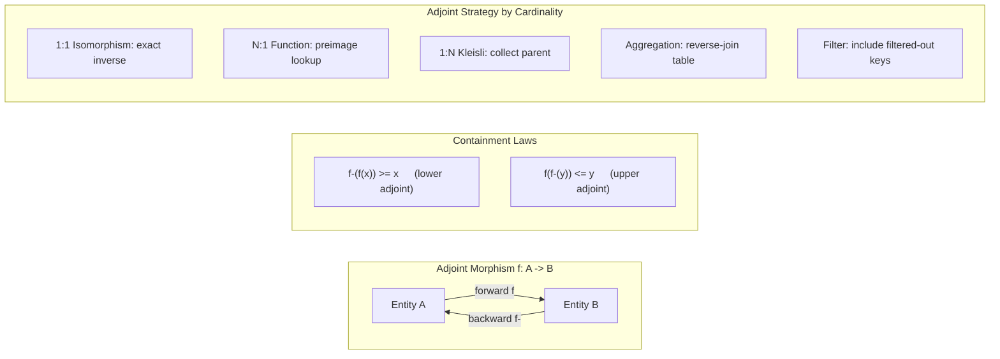

# CDME -- Requirements Specification

**Version**: 1.0.0
**Date**: 2026-02-20
**Status**: Draft -- Generated by v2.1 iterate(intent->requirements)
**Feature**: REQ-F-CDME-001
**Methodology**: AI SDLC Asset Graph Model v2.1

---

## 1. Overview

### 1.1 System Purpose

The Categorical Data Mapping & Computation Engine (CDME) is a data transformation engine grounded in Category Theory. Its purpose is to provide mathematical guarantees that if a mapping definition is structurally valid (topologically correct, type-safe, grain-safe, context-consistent), then the resulting pipeline execution shall be correct by construction.

### 1.2 Scope Boundaries

The CDME encompasses:

- **Logical Data Model (LDM)**: Defining schemas as categories of objects (entities) and morphisms (relationships) with typed attributes, grain metadata, and access control.
- **Physical Data Model (PDM)**: Binding logical entities to physical storage via functors, with temporal and generational semantics.
- **Traversal Engine**: Compiling and executing paths through the LDM with Kleisli lifting, grain enforcement, context consistency, and operational telemetry.
- **Type System**: Extended types (primitives, sum, product, refinement) with strict contracts and explicit casting.
- **Error Domain**: Failures as first-class data objects routed to an Error Sink via Either monad semantics.
- **Adjoint Morphisms**: Reverse transformation capability for every forward morphism, enabling reconciliation, impact analysis, and bidirectional sync.
- **AI Assurance Layer**: Deterministic validation of AI-generated mappings using the same topological rules as human-authored mappings.
- **Record Accounting**: Accounting invariant ensuring every input record is traceable to exactly one output partition.
- **Integration**: OpenLineage observability, regulatory compliance packaging, external computational morphism registration.

### 1.3 Relationship to Intent

This document derives from INTENT.md (v7.2) sections INT-001 through INT-006. Every requirement traces to at least one INT-* key. INT-006 (Frobenius Algebra) is flagged as speculative and deferred to a Discovery vector -- no requirements are generated from it.

### 1.4 Target Implementation

- **Language**: Scala 3.3.3 (per project_constraints.yml)
- **Paradigm**: Functional, immutable, strongly typed
- **Execution**: Distributed compute frameworks (Spark as reference implementation)
- **Validation**: Compile-time (definition-time) wherever possible; runtime for data-dependent checks

---

## 2. Terminology

| Term | Definition |
|------|-----------|
| **Category** | A mathematical structure consisting of Objects and Morphisms with composition and identity laws. In CDME, the LDM is modelled as a category. |
| **Object (Entity)** | A node in the LDM category representing a data entity (e.g., Trade, Counterparty, Cashflow). Each object has typed attributes and grain metadata. |
| **Morphism** | A directed edge in the LDM category representing a relationship or transformation between entities. Every morphism has a domain (source), codomain (target), and cardinality type. |
| **Functor** | A structure-preserving map between categories. In CDME, the PDM binding is a functor from the LDM category to the physical storage category. |
| **Composition** | Chaining morphisms: if `f: A -> B` and `g: B -> C`, then `g . f: A -> C`. Composition must satisfy type compatibility, grain safety, and access control. |
| **Identity Morphism** | The trivial morphism `id: A -> A` for every object A. Required by category laws. |
| **Cardinality Type** | Classification of a morphism's multiplicity: 1:1 (Isomorphism), N:1 (Standard Function), or 1:N (Kleisli Arrow). |
| **Grain** | The granularity level of a data entity (e.g., Atomic/Trade-level, Daily, Monthly). Mixing grains without explicit aggregation is forbidden. |
| **Epoch** | A bounded temporal or logical scope within which data is consistent. Equivalent to a processing batch or snapshot window. |
| **Context (Sheaf Fiber)** | The combination of epoch, partitioning scope, and temporal semantics that constrains a data entity's extent. Joins must occur within compatible contexts. |
| **Kleisli Arrow** | A morphism of type `A -> M[B]` where M is a computational effect (e.g., List for 1:N expansion). Kleisli composition lifts execution context. |
| **Either Monad** | `Either[Error, Value]` -- a sum type used to represent success (Right) or failure (Left) without exceptions. |
| **Writer Monad** | An effect that accumulates a log alongside computation. Used for operational telemetry capture. |
| **Monoid** | An algebraic structure with an associative binary operation and an identity element. Required for valid aggregation operations. |
| **Adjoint Pair** | For a morphism `f: A -> B`, its adjoint is `f-: B -> A` such that `f-(f(x)) >= x` (containment). Enables reverse traversal. |
| **Galois Connection** | A pair of monotone functions between ordered sets satisfying `f(x) <= y iff x <= g(y)`. The adjoint containment laws in CDME are Galois-connection-shaped. |
| **Reverse-Join Table** | Metadata captured during forward aggregation that maps each output group key to the set of contributing input record keys. |
| **Error Domain** | A designated category of error objects. Invalid records are routed here as first-class data, never silently dropped. |
| **Error Sink** | The physical destination for error domain objects (e.g., dead-letter queue, error table). |
| **Refinement Type** | A base type constrained by a predicate (e.g., `PositiveDecimal = Decimal where x > 0`). |
| **Sum Type** | A tagged union: `A | B` -- a value is exactly one of the constituent types. |
| **Product Type** | A tuple or record: `(A, B, C)` -- a value contains all constituent types. |
| **Semantic Type** | A domain-meaningful type distinction layered over a primitive (e.g., Money, Percent, ISIN). |
| **Execution Artifact** | The compiled, validated mapping definition ready for execution. Contains all morphisms, type metadata, grain metadata, and execution parameters. |
| **Accounting Invariant** | The guarantee that `|input_keys| = |processed_keys| + |filtered_keys| + |error_keys|` for every pipeline run. |
| **Ledger** | A structured record proving the accounting invariant holds for a given run. |
| **OpenLineage** | An open standard for lineage and observability metadata, emitting START, COMPLETE, and FAIL events with dataset and facet information. |
| **LDM** | Logical Data Model -- the technology-agnostic schema category. |
| **PDM** | Physical Data Model -- the technology-bound storage bindings. |
| **BCBS 239** | Basel Committee standard for risk data aggregation and risk reporting. |
| **FRTB** | Fundamental Review of the Trading Book -- Basel regulatory framework. |
| **Dry Run** | Execution mode that performs validation and planning without writing results to sinks. |
| **Circuit Breaker** | A pattern that halts processing when early-stage failure rates exceed a threshold, distinguishing structural errors from data quality errors. |

---

## 3. Domain Model

```mermaid
graph TB
    subgraph LDM["Logical Data Model (Category)"]
        E1[Entity A]
        E2[Entity B]
        E3[Entity C]
        E4[Lookup Entity]
        E1 -->|"morphism f (N:1)"| E2
        E2 -->|"morphism g (1:N)"| E3
        E1 -->|"lookup ref"| E4
    end

    subgraph TypeSystem["Type System"]
        Prim[Primitives]
        Sum[Sum Types A|B]
        Prod[Product Types A,B,C]
        Ref[Refinement Types T where P]
        Sem[Semantic Types Money,Date]
    end

    subgraph PDM["Physical Data Model (Functor Target)"]
        PS1[Physical Source 1<br/>Event / Snapshot]
        PS2[Physical Source 2<br/>Event / Snapshot]
        PS3[Physical Sink]
    end

    subgraph Traversal["Traversal Engine"]
        Compiler[Path Compiler<br/>validate, type-check, grain-check]
        Executor[Distributed Executor<br/>Spark / Flink]
        Writer[Writer Monad<br/>Telemetry]
    end

    subgraph ErrorDomain["Error Domain"]
        ErrObj[Error Object<br/>constraint, values, entity, epoch, path]
        ErrSink[Error Sink / DLQ]
    end

    subgraph Adjoint["Adjoint Layer"]
        RJT[Reverse-Join Tables]
        FK[Filtered Keys]
        BT[Backward Traversal]
    end

    subgraph AIAssurance["AI Assurance Layer"]
        Validator[Topological Validator]
        DryRun[Dry Run Engine]
        Triangle[Intent-Logic-Proof<br/>Triangulation]
    end

    subgraph Accounting["Record Accounting"]
        Ledger[Accounting Ledger]
        Gate[Completion Gate]
    end

    subgraph Integration["Integration"]
        OL[OpenLineage Events]
        Reg[Regulatory Package]
        Ext[External Calculators]
    end

    LDM -->|"Functor F"| PDM
    LDM --> TypeSystem
    Traversal --> LDM
    Traversal --> PDM
    Traversal --> ErrorDomain
    Traversal --> Adjoint
    AIAssurance --> Traversal
    Accounting --> Adjoint
    Accounting --> Integration
```



---

## 4. Scope Exclusions

The following are explicitly out of scope for this feature vector:

1. **Frobenius Algebra formalisation** -- INT-006 is speculative; deferred to a Discovery vector.
2. **Domain-specific applications** -- Cashflow generation, regulatory calculation, and risk engine applications (INT-003) are examples of CDME usage, not CDME requirements. The engine shall be domain-agnostic.
3. **User interface** -- No GUI, dashboard, or visual mapping tool is in scope.
4. **Deployment infrastructure** -- Kubernetes, Docker, cloud provider bindings are design/ops concerns.
5. **Data ingestion** -- How data arrives at physical sources is outside CDME scope.
6. **Data cataloguing** -- CDME emits lineage metadata but does not manage a data catalogue.
7. **Machine learning model training** -- AI Assurance validates AI-generated mappings; it does not train models.

---

## 5. Functional Requirements

### 5.1 Logical Data Model (LDM)

#### REQ-F-LDM-001: Schema as Category

**Priority**: Critical
**Type**: Functional

**Description**: The system must represent the Logical Data Model as a category where entities are objects and relationships are morphisms. Every object must have an identity morphism. Morphism composition must satisfy associativity.

**Acceptance Criteria**:
- Entities are modelled as typed objects with identity morphisms
- Relationships are modelled as directed morphisms with domain and codomain
- The graph supports multiple morphisms between the same pair of entities
- Identity: `id . f = f = f . id` for all morphisms f
- Associativity: `h . (g . f) = (h . g) . f` for all composable morphisms

**Traces To**: INT-001, INT-002 (Axiom 1)

---

#### REQ-F-LDM-002: Morphism Cardinality Types

**Priority**: Critical
**Type**: Functional

**Description**: Every morphism in the LDM must declare exactly one cardinality type: 1:1 (Isomorphism), N:1 (Standard Function), or 1:N (Kleisli Arrow).

**Acceptance Criteria**:
- Each morphism declares exactly one cardinality type from {1:1, N:1, 1:N}
- Cardinality type is enforced during composition validation
- A morphism with undeclared cardinality type shall be rejected at definition time

**Traces To**: INT-001, INT-002 (Axiom 1)

---

#### REQ-F-LDM-003: Path Validation via Composition

**Priority**: Critical
**Type**: Functional

**Description**: A traversal path expressed as `Entity.Relationship.Attribute` must be validated at definition time. The system must verify that each morphism exists in the LDM, the codomain of each morphism equals the domain of the next, grain safety holds, and access permissions are satisfied.

**Acceptance Criteria**:
- Paths are validated at definition time (before execution)
- Missing morphisms are rejected with a "morphism not found" error
- Type mismatches (codomain != domain of next) are rejected with a type error
- Grain violations are rejected with a grain safety error
- Access violations are rejected with an access denied error

**Traces To**: INT-001, INT-002 (Axiom 3)

---

#### REQ-F-LDM-004: Grain Metadata

**Priority**: Critical
**Type**: Functional

**Description**: Every entity in the LDM must declare its grain level (e.g., Atomic, Daily, Monthly, Yearly). Missing grain metadata shall be a validation error.

**Acceptance Criteria**:
- Each entity has an explicit grain level declaration
- The set of valid grain levels is configurable per LDM
- An entity without grain metadata shall be rejected at definition time
- Grain levels form a partial order (finer -> coarser)

**Traces To**: INT-001, INT-002 (Axiom 5)

---

#### REQ-F-LDM-005: Attribute Type Declarations

**Priority**: Critical
**Type**: Functional

**Description**: Every attribute on every entity must be typed using the extended type system. An attribute without a type declaration shall be a validation error.

**Acceptance Criteria**:
- Each attribute declares its type from the extended type system (REQ-F-TYP-001)
- Missing type declarations are rejected at definition time
- Type declarations are immutable once assigned to a published LDM version

**Traces To**: INT-001, INT-002 (Axiom 7)

---

#### REQ-F-LDM-006: Monoidal Aggregation

**Priority**: Critical
**Type**: Functional

**Description**: Aggregation operations must satisfy the Monoid Laws: the binary operation must be associative, and an identity element must exist. Non-associative aggregation shall be rejected.

**Acceptance Criteria**:
- Each aggregation function declares its associative binary operation and identity element
- Non-associative operations are rejected at definition time
- Aggregation over an empty input set yields the identity element
- The system provides built-in monoids for sum, count, min, max, and concatenation

**Traces To**: INT-001, INT-002 (Axiom 5)

---

#### REQ-F-LDM-007: Multi-Level Aggregation

**Priority**: High
**Type**: Functional

**Description**: The system must support multi-level aggregation (e.g., Atomic to Daily to Monthly) where each level satisfies the Monoid Laws and the grain hierarchy permits the transition.

**Acceptance Criteria**:
- Multi-level aggregation chains are supported
- Each level in the chain validates Monoid Laws independently
- The grain hierarchy is checked: aggregation must flow from finer to coarser grain
- Aggregation from coarser to finer grain shall be rejected

**Traces To**: INT-001, INT-002 (Axiom 5)

---

#### REQ-F-LDM-008: Schema Versioning

**Priority**: High
**Type**: Functional

**Description**: The LDM must support versioned schema definitions. Changes to the LDM produce new versions; prior versions remain queryable for lineage and audit purposes.

**Acceptance Criteria**:
- Each LDM definition has a version identifier
- Schema changes produce a new version (not in-place mutation)
- Prior versions are retrievable for lineage reconstruction
- Version identifiers are monotonically increasing or content-addressed

**Traces To**: INT-001

---

### 5.2 Physical Data Model (PDM)

#### REQ-F-PDM-001: Functorial Mapping

**Priority**: Critical
**Type**: Functional

**Description**: The PDM binding must be a functor from the LDM category to the physical storage category. Re-pointing a logical entity from one physical storage medium to another must not require changes to business logic morphisms or LDM definitions.

**Acceptance Criteria**:
- LDM definitions are independent of physical storage
- Changing a PDM binding requires only PDM configuration updates
- Business logic morphisms reference LDM entities exclusively (never physical tables or columns)
- The functor preserves composition: `F(g . f) = F(g) . F(f)`

**Traces To**: INT-001, INT-002 (Axiom 2)

---

#### REQ-F-PDM-002: Generation Grain Semantics

**Priority**: High
**Type**: Functional

**Description**: Each physical source must declare its generation grain: Event (continuous stream sliced by temporal windows) or Snapshot (state at a point in time).

**Acceptance Criteria**:
- Valid generation grains are {Event, Snapshot}
- Each physical source declares exactly one generation grain
- Generation grain determines how epoch boundaries are applied
- Omitted generation grain shall be a validation error

**Traces To**: INT-001, INT-002 (Axiom 4)

---

#### REQ-F-PDM-003: Epoch Boundary Definition

**Priority**: High
**Type**: Functional

**Description**: Each physical source must define how continuous data flow is sliced into processing epochs, consistent with its generation grain semantics.

**Acceptance Criteria**:
- Event sources define temporal window boundaries (e.g., hourly, daily)
- Snapshot sources define version or timestamp boundaries
- Boundary definition is required for every physical source
- Boundary resolution is deterministic for a given epoch identifier

**Traces To**: INT-001, INT-002 (Axiom 4)

---

#### REQ-F-PDM-004: Lookup Binding

**Priority**: Medium
**Type**: Functional

**Description**: The PDM must support binding reference data (lookups) as either data-backed (physical table) or logic-backed (computed/static function).

**Acceptance Criteria**:
- Each lookup declares its backing type: {data-backed, logic-backed}
- Both backing types are transparent to LDM morphisms
- Lookup binding is validated at definition time

**Traces To**: INT-001, INT-002 (Axiom 6)

---

#### REQ-F-PDM-005: Temporal Binding

**Priority**: Medium
**Type**: Functional

**Description**: The PDM must support temporal binding where a single logical entity maps to different physical tables as a function of the data epoch.

**Acceptance Criteria**:
- Temporal binding is deterministic for a given epoch
- Multiple physical sources may serve the same logical entity across time ranges
- Epoch resolution selects the correct physical source at compile time
- Overlapping temporal ranges for the same entity shall be rejected

**Traces To**: INT-001

---

### 5.3 Traversal Engine

#### REQ-F-TRV-001: Kleisli Context Lifting

**Priority**: Critical
**Type**: Functional

**Description**: When traversing a 1:N morphism, the engine must lift the execution context from Scalar to List, implementing proper flattening (flatMap) semantics.

**Acceptance Criteria**:
- 1:N traversal produces List context automatically
- Scalar functions are lifted into list-processing functions via map
- Nested 1:N traversals flatten correctly (flatMap, not nested List[List[...]])
- Context type is tracked through the entire traversal path

**Traces To**: INT-001, INT-002 (Axiom 3)

---

#### REQ-F-TRV-002: Grain Safety Enforcement

**Priority**: Critical
**Type**: Functional

**Description**: The engine must reject operations that combine attributes from incompatible grain levels without explicit aggregation.

**Acceptance Criteria**:
- Projecting attributes from incompatible grains into the same record shall be rejected
- Expressions mixing incompatible grains shall be rejected
- Joins between entities at different grains without aggregation shall be rejected
- All grain violations are detected at definition time (before execution)

**Traces To**: INT-001, INT-002 (Axiom 5)

---

#### REQ-F-TRV-003: Context Consistency Enforcement

**Priority**: Critical
**Type**: Functional

**Description**: Joins must respect contextual fibers: entities must share the same epoch or declare explicit temporal semantics (As-Of, Latest, Exact). Incompatible context joins shall be rejected.

**Acceptance Criteria**:
- Joins validate epoch compatibility between source entities
- Cross-epoch joins require declared temporal semantics
- Valid temporal semantics are {As-Of, Latest, Exact}
- Undeclared cross-epoch joins shall be rejected at validation time

**Traces To**: INT-001, INT-002 (Axiom 4)

---

#### REQ-F-TRV-004: Boundary Alignment Detection

**Priority**: High
**Type**: Functional

**Description**: The engine must detect when a traversal path crosses epoch boundaries and require declared temporal semantics for such crossings.

**Acceptance Criteria**:
- Cross-boundary traversals are detected automatically during path compilation
- Each cross-boundary crossing requires a declared temporal semantic
- Undeclared cross-boundary traversals shall be rejected with a specific error
- Boundary alignment is validated at definition time

**Traces To**: INT-001, INT-002 (Axiom 4)

---

#### REQ-F-TRV-005: Operational Telemetry via Writer Monad

**Priority**: High
**Type**: Functional

**Description**: The execution context must implement a Writer effect to capture row counts, quality metrics, and latency statistics at every morphism application. Telemetry must not affect transformation logic.

**Acceptance Criteria**:
- Row counts are captured at each morphism application
- Quality metrics (null rates, type violation counts) are accumulated
- Latency is measured per morphism
- Telemetry is a side-channel (Writer monad); it does not alter transformation results

**Traces To**: INT-001, INT-002 (Axiom 10)

---

#### REQ-F-TRV-006: Deterministic Reproducibility

**Priority**: Critical
**Type**: Functional

**Description**: The system must guarantee that identical inputs with identical configuration produce bitwise identical outputs.

**Acceptance Criteria**:
- Same inputs + same configuration + same lookup versions = same outputs
- All sources of randomness are seeded and configurable
- Lookup versions are pinned per execution context (epoch)
- Non-deterministic operations (e.g., `now()`, `random()`) shall be rejected unless seeded

**Traces To**: INT-001, INT-002 (Axiom 6)

---

#### REQ-F-TRV-007: Cardinality Cost Estimation

**Priority**: High
**Type**: Functional

**Description**: The engine must estimate cardinality explosion before execution and reject execution plans that exceed a declared budget.

**Acceptance Criteria**:
- Cost estimation runs during compilation (before execution)
- Budget is declared in the execution artifact (max output rows, max join fan-out, max intermediate size)
- Plans exceeding budget are rejected with a cardinality report detailing the explosion point
- Budget parameters are configurable per execution

**Traces To**: INT-001

---

### 5.4 Type System

#### REQ-F-TYP-001: Extended Type System

**Priority**: Critical
**Type**: Functional

**Description**: The LDM must support primitives, sum types (tagged unions), product types (tuples/records), and nested composition of all type constructors.

**Acceptance Criteria**:
- Primitive types: String, Int, Long, Decimal, Date, Timestamp, Boolean
- Sum types: `A | B` (tagged union with discriminant)
- Product types: `(A, B, C)` (positional tuple) and `{a: A, b: B}` (named record)
- Nested composition: all type constructors compose arbitrarily (e.g., `Option[List[(A, B)]]`)

**Traces To**: INT-001, INT-002 (Axiom 7)

---

#### REQ-F-TYP-002: Refinement Types

**Priority**: High
**Type**: Functional

**Description**: The system must support refinement types: a base type constrained by a predicate.

**Acceptance Criteria**:
- Refinement types are declarable in the LDM (e.g., `PositiveDecimal = Decimal where x > 0`)
- Predicate violations produce structured errors routed to the Error Domain
- Refinement types compose with sum, product, and other type constructors
- Predicates are evaluated at data processing time (runtime)

**Traces To**: INT-001, INT-002 (Axiom 7)

---

#### REQ-F-TYP-003: No Implicit Casting

**Priority**: Critical
**Type**: Functional

**Description**: All type conversions must be expressed as explicit, named morphisms. Implicit casting is forbidden.

**Acceptance Criteria**:
- No implicit type conversions exist in the system
- Every type conversion is a named morphism with declared domain and codomain
- Undeclared type mismatches between composed morphisms shall be rejected at definition time
- The system shall not silently coerce values between types

**Traces To**: INT-001, INT-002 (Axiom 7)

---

#### REQ-F-TYP-004: Type Unification Rules

**Priority**: Critical
**Type**: Functional

**Description**: When composing morphisms, the codomain of the first must equal (or be a subtype of) the domain of the second. Otherwise, composition shall be rejected.

**Acceptance Criteria**:
- Exact type match allows composition
- Subtype relationship allows composition (covariant on codomain)
- Neither condition met: composition shall be rejected with a type error
- Subtype relationships are declared in the type system, not inferred

**Traces To**: INT-001, INT-002 (Axiom 7)

---

#### REQ-F-TYP-005: Semantic Type Distinctions

**Priority**: Medium
**Type**: Functional

**Description**: The type system must support semantic type distinctions layered over primitives (e.g., Money, Percent, ISIN). Operations between incompatible semantic types shall be rejected.

**Acceptance Criteria**:
- Semantic types are declarable as named wrappers over base types
- Arithmetic between incompatible semantic types shall be rejected (e.g., Money + Date)
- Conversion between semantic types requires an explicit morphism
- Semantic types participate in type unification (REQ-F-TYP-004)

**Traces To**: INT-001, INT-002 (Axiom 7)

---

### 5.5 Error Domain

#### REQ-F-ERR-001: Failures as Data

**Priority**: Critical
**Type**: Functional

**Description**: All morphism failures must be represented via Either monad semantics (`Left[Error] | Right[Value]`). Invalid records shall be routed to the Error Domain as first-class data objects, never silently dropped.

**Acceptance Criteria**:
- Every morphism produces `Either[Error, Value]`
- Left values (failures) are routed to the Error Domain
- No record is silently dropped during processing
- Failures do not short-circuit batch processing unless the batch threshold is exceeded

**Traces To**: INT-001, INT-002 (Axiom 10)

---

#### REQ-F-ERR-002: Error Object Structure

**Priority**: Critical
**Type**: Functional

**Description**: Each error object must contain structured metadata: failed constraint type, offending values, source entity and epoch, and the morphism path where failure occurred.

**Acceptance Criteria**:
- Error objects contain: constraint_type, offending_values, source_entity, source_epoch, morphism_path
- Error objects are structured (not free-text messages)
- Error objects are serialisable to the Error Sink
- Error objects include a timestamp of when the failure occurred

**Traces To**: INT-001, INT-002 (Axiom 10)

---

#### REQ-F-ERR-003: Idempotent Error Handling

**Priority**: High
**Type**: Functional

**Description**: Re-processing the same failing records under the same configuration must produce identical error results.

**Acceptance Criteria**:
- Error handling is deterministic
- Same failing input + same configuration = same error output (bitwise)
- No non-deterministic side effects in error routing
- Error ordering is deterministic for the same input ordering

**Traces To**: INT-001, INT-002 (Axiom 10)

---

#### REQ-F-ERR-004: Error Sink Routing

**Priority**: High
**Type**: Functional

**Description**: The system must route all error objects to a configurable Error Sink. The Error Sink must be declared in the execution artifact.

**Acceptance Criteria**:
- Error Sink is declared in the execution artifact
- All error objects are written to the declared Error Sink
- Error Sink supports at least: file system, database table, message queue
- Missing Error Sink declaration shall be a validation error

**Traces To**: INT-001, INT-002 (Axiom 10)

---

### 5.6 Adjoint Morphisms

#### REQ-F-ADJ-001: Adjoint Interface

**Priority**: Critical
**Type**: Functional

**Description**: Every morphism in the LDM must implement the Adjoint interface, providing both a forward function and a backward function with declared containment semantics.

**Acceptance Criteria**:
- Each morphism declares `forward: A -> B` and `backward: B -> A`
- Containment laws hold: `backward(forward(x)) >= x` and `forward(backward(y)) <= y`
- Morphisms without a backward function shall be rejected at definition time
- The adjoint strategy is determined by cardinality type (see REQ-F-ADJ-002 through REQ-F-ADJ-005)

**Traces To**: INT-005

---

#### REQ-F-ADJ-002: Isomorphic Adjoint (1:1)

**Priority**: Critical
**Type**: Functional

**Description**: For 1:1 (isomorphic) morphisms, the backward function must be an exact inverse: `backward(forward(x)) = x`.

**Acceptance Criteria**:
- 1:1 morphisms have exact round-trip: `backward(forward(x)) = x`
- The backward function is validated for exactness at definition time where possible
- Self-adjoint morphisms (where forward = backward) are supported as a special case

**Traces To**: INT-005

---

#### REQ-F-ADJ-003: Preimage Adjoint (N:1)

**Priority**: Critical
**Type**: Functional

**Description**: For N:1 morphisms, the backward function must return the preimage set: all input values that map to the given output value.

**Acceptance Criteria**:
- `backward(forward(x))` returns all inputs mapping to the same output as x
- Preimage lookup is implemented via reverse-join metadata captured during forward execution
- Containment holds: `backward(forward(x)) >= {x}`

**Traces To**: INT-005

---

#### REQ-F-ADJ-004: Kleisli Adjoint (1:N)

**Priority**: High
**Type**: Functional

**Description**: For 1:N (Kleisli) morphisms, the backward function must collect the parent record that generated the expanded records.

**Acceptance Criteria**:
- Parent-child mapping is captured during forward execution
- `backward(child_records)` returns the parent record
- If parent tracking is maintained, round-trip is exact: `backward(forward(x)) = x`

**Traces To**: INT-005

---

#### REQ-F-ADJ-005: Aggregation Adjoint

**Priority**: Critical
**Type**: Functional

**Description**: For aggregation morphisms (fold/groupBy), the backward function must return all contributing source records via reverse-join table lookup.

**Acceptance Criteria**:
- Reverse-join table maps each output group key to the set of contributing input record keys
- `backward(aggregated_value)` returns all records that contributed to that aggregate
- Reverse-join metadata is captured during forward execution
- Containment holds: `backward(forward(records)) >= records`

**Traces To**: INT-005

---

#### REQ-F-ADJ-006: Filter Adjoint

**Priority**: High
**Type**: Functional

**Description**: For filter morphisms, the backward function must return both the passed records and the filtered-out records, with metadata indicating which were excluded.

**Acceptance Criteria**:
- Filtered-out record keys are captured during forward execution
- `backward(filtered_output)` returns passed records + filtered-out records
- Each record in the backward result is tagged as {passed, filtered}
- Containment holds: `backward(forward(records)) >= records`

**Traces To**: INT-005

---

#### REQ-F-ADJ-007: Contravariant Adjoint Composition

**Priority**: Critical
**Type**: Functional

**Description**: Adjoint composition must be contravariant: for composed morphisms `g . f`, the backward must be `f- . g-` (reverse order).

**Acceptance Criteria**:
- `(g . f)- = f- . g-` for all composable adjoint pairs
- Contravariant composition is validated at definition time
- Identity adjoint: `id- = id`
- Composition of adjoints preserves containment laws

**Traces To**: INT-005

---

#### REQ-F-ADJ-008: Backward Metadata Capture

**Priority**: Critical
**Type**: Functional

**Description**: During forward execution, the system must capture sufficient metadata to enable backward traversal without recomputation.

**Acceptance Criteria**:
- Reverse-join tables are populated during aggregation forward execution
- Filtered-out keys are recorded during filter forward execution
- Parent-child mappings are recorded during 1:N forward execution
- Metadata is persistent (survives process termination)
- Metadata is stored within the same epoch context as the forward execution

**Traces To**: INT-005

---

### 5.7 Record Accounting

#### REQ-F-ACC-001: Accounting Invariant

**Priority**: Critical
**Type**: Functional

**Description**: Every input record must be accounted for in exactly one output partition: processed, filtered, or errored.

**Acceptance Criteria**:
- `|input_keys| = |processed_keys| + |filtered_keys| + |error_keys|`
- No record appears in multiple partitions (mutual exclusivity)
- No record is unaccounted for (completeness)
- Verification runs automatically before a run is marked COMPLETE

**Traces To**: INT-005

---

#### REQ-F-ACC-002: Accounting Ledger

**Priority**: Critical
**Type**: Functional

**Description**: Each pipeline run must produce a structured ledger proving the accounting invariant holds.

**Acceptance Criteria**:
- Ledger contains: input record count, source key field identifier, partition breakdown
- Ledger contains references to adjoint metadata locations (reverse-join tables, filtered keys)
- Ledger contains verification status: {balanced, unbalanced}
- Ledger is written atomically at run completion (success or failure)

**Traces To**: INT-005

---

#### REQ-F-ACC-003: Run Completion Gate

**Priority**: Critical
**Type**: Functional

**Description**: A pipeline run shall not be marked COMPLETE unless the accounting invariant verification passes.

**Acceptance Criteria**:
- Verification runs automatically before COMPLETE status assignment
- Pass: emit OpenLineage COMPLETE event with ledger reference
- Fail: set FAILED status, emit OpenLineage FAIL event with discrepancy details
- Ledger is persisted regardless of pass or fail
- No manual override of the completion gate is permitted

**Traces To**: INT-005

---

#### REQ-F-ACC-004: Backward Traversal Proof

**Priority**: High
**Type**: Functional

**Description**: Any output record must be traceable back to its source records via adjoint metadata without recomputation.

**Acceptance Criteria**:
- Given an aggregate output key, the system returns the set of contributing source keys
- Given a filtered output key, the system confirms intentional exclusion
- Given an error key, the system returns the original record and failure reason
- Backward traversal is deterministic and does not require re-executing the pipeline

**Traces To**: INT-005

---

### 5.8 Access Control

#### REQ-F-ACC-005: Morphism-Level RBAC

**Priority**: High
**Type**: Functional

**Description**: The LDM must support role-based access control on morphisms. A principal lacking permission for a morphism shall not see that morphism in their view of the topology.

**Acceptance Criteria**:
- Each morphism may declare access control rules (permitted roles)
- Denied morphisms are invisible for path construction (not just blocked at runtime)
- Access control is evaluated during path validation (definition time)
- A path referencing a denied morphism shall be rejected with an access denied error

**Traces To**: INT-001

---

### 5.9 Integration

#### REQ-F-INT-001: Isomorphic Synthesis

**Priority**: High
**Type**: Functional

**Description**: Users must be able to define new derived attributes via pure functions over existing entities and attributes. Derived attributes participate in the type system and compose with other morphisms.

**Acceptance Criteria**:
- Pure functions can derive new attributes from existing ones
- Derived attributes have declared types and participate in type unification
- Synthesis morphisms compose with other morphisms
- Synthesis morphisms have adjoint implementations (backward function)

**Traces To**: INT-001, INT-002 (Axiom 9)

---

#### REQ-F-INT-002: Complex Business Logic

**Priority**: High
**Type**: Functional

**Description**: Synthesis maps must support conditional expressions, prioritised fallback logic, multi-morphism composition, and product type construction.

**Acceptance Criteria**:
- Conditional (if-then-else) expressions are supported as morphisms
- Fallback chains (coalesce) are supported
- Multiple morphisms compose into a single synthesis
- Product types can be constructed from multiple input attributes

**Traces To**: INT-001, INT-002 (Axiom 9)

---

#### REQ-F-INT-003: Multi-Grain Formulation

**Priority**: High
**Type**: Functional

**Description**: Formulas may reference attributes at different grain levels, provided finer-grained attributes are wrapped in explicit aggregation morphisms that satisfy the Monoid Laws.

**Acceptance Criteria**:
- Multi-grain formulas require explicit aggregation for finer-grained attributes
- Aggregation scope aligns to the coarser entity's grain
- Direct reference to finer-grained attributes without aggregation shall be rejected
- Aggregation morphisms in multi-grain formulas are subject to REQ-F-LDM-006

**Traces To**: INT-001, INT-002 (Axiom 5)

---

#### REQ-F-INT-004: Versioned Lookups

**Priority**: Critical
**Type**: Functional

**Description**: All reference data usage must specify version semantics: explicit version, temporal constraint, or deterministic alias. Unversioned lookups shall be rejected.

**Acceptance Criteria**:
- Every lookup usage declares version semantics from {explicit_version, temporal_constraint, deterministic_alias}
- Unversioned lookups are rejected at definition time
- Within a single execution context, same lookup + key yields the same value
- Lookup version is captured in lineage metadata

**Traces To**: INT-001, INT-002 (Axiom 6)

---

#### REQ-F-INT-005: Full Lineage Traceability

**Priority**: Critical
**Type**: Functional

**Description**: Every target value must map back to the specific source epoch, entity, and morphism path that generated it.

**Acceptance Criteria**:
- Lineage captures: source entity, source epoch, morphism path, intermediate transformations
- Lineage is queryable per target record
- Lineage survives aggregation (via adjoint metadata from REQ-F-ADJ-005)
- Lineage is stored in a structured, machine-readable format

**Traces To**: INT-001, INT-005

---

#### REQ-F-INT-006: Identity Synthesis (Surrogate Keys)

**Priority**: Medium
**Type**: Functional

**Description**: The system must support deterministic surrogate key generation where the same input values always produce the same key.

**Acceptance Criteria**:
- Key generation is deterministic (hash-based or content-addressed)
- Same inputs produce bitwise identical keys across runs
- Key generation is declared as a standard morphism with typed domain and codomain
- Hash algorithm is configurable per key definition

**Traces To**: INT-001

---

#### REQ-F-INT-007: External Computational Morphisms

**Priority**: High
**Type**: Functional

**Description**: The system must support registration of external black-box calculators (e.g., compiled cashflow engines, Monte Carlo simulators) as standard morphisms with declared domain/codomain types, determinism assertion, and stable identifier.

**Acceptance Criteria**:
- External calculators register with typed domain and codomain declarations
- Determinism is asserted by contract (declared, not verified at runtime)
- Type compatibility is checked at definition time
- Calculator version is captured in lineage metadata
- External morphisms must implement the Adjoint interface (backward may be declared as "opaque" with manual containment bounds)

**Traces To**: INT-001, INT-003, INT-002 (Axiom 9)

---

### 5.10 AI Assurance Layer

#### REQ-F-AI-001: Topological Validity Check

**Priority**: Critical
**Type**: Functional

**Description**: The engine must validate AI-generated mappings using the same structural rules as human-authored mappings. There shall be no special fast-path or relaxed validation for AI-generated definitions.

**Acceptance Criteria**:
- AI-generated mappings pass through identical validation as human mappings
- Hallucinated morphisms (referencing entities or relationships not in the LDM) are rejected
- Type, grain, access, and context violations are rejected
- Validation results include specific diagnostic messages per violation

**Traces To**: INT-004, INT-002 (Axiom 8)

---

#### REQ-F-AI-002: Triangulation of Assurance

**Priority**: High
**Type**: Functional

**Description**: The system must support linking Intent to Logic to Proof for real-time verification of AI-generated or human-authored mappings.

**Acceptance Criteria**:
- Intent-to-Logic mapping is traceable (intent -> morphism definitions)
- Logic-to-Proof mapping is traceable (morphism definitions -> execution trace, type unification report)
- Proof-to-Intent validation can be automated (lineage graph -> intent coverage)
- Triangulation report is producible per execution

**Traces To**: INT-004

---

#### REQ-F-AI-003: Dry Run Mode

**Priority**: High
**Type**: Functional

**Description**: The system must support a dry-run execution mode that performs full validation and execution planning without writing results to sinks.

**Acceptance Criteria**:
- Dry run produces: validation results, execution plan, estimated cardinality
- No side effects occur (no data written to output sinks or error sinks)
- Dry run results indicate pass/fail with specific diagnostics per check
- Dry run uses the same code path as real execution up to the write phase

**Traces To**: INT-004

---

### 5.11 Programmatic API

#### REQ-F-API-001: Programmatic LDM Definition

**Priority**: High
**Type**: Functional

**Description**: The system must expose a programmatic API for defining and composing LDM entities, morphisms, and types. The API must be the primary interface for LDM construction.

**Acceptance Criteria**:
- LDM entities, morphisms, and types can be defined via Scala API
- The API enforces type safety at compile time via Scala's type system
- The API supports fluent composition of morphisms
- The API returns structured validation results (not exceptions)

**Traces To**: INT-001

---

---

## 6. Non-Functional Requirements

#### REQ-NFR-PERF-001: Distributed Execution

**Priority**: Critical
**Type**: Non-Functional

**Description**: The engine must execute morphisms on distributed compute frameworks. The logical model must be independent of the execution framework.

**Acceptance Criteria**:
- Morphisms execute in parallel across cluster nodes
- Data partitioning is managed by the execution framework (not CDME business logic)
- No single-node bottleneck for standard morphism operations
- At least one distributed framework binding is provided (Spark as reference implementation)

**Traces To**: INT-001

---

#### REQ-NFR-PERF-002: Skew Mitigation

**Priority**: High
**Type**: Non-Functional

**Description**: The engine must mitigate data skew for 1:N expansions and highly skewed join keys.

**Acceptance Criteria**:
- Skewed keys (whale keys) are detectable via sampling
- Salted join strategy (or equivalent) distributes skewed keys across executors
- No single executor is overloaded due to data skew
- Skew mitigation is configurable (threshold, salt factor)

**Traces To**: INT-001

---

#### REQ-NFR-SEC-001: Immutability of Business Logic

**Priority**: High
**Type**: Non-Functional

**Description**: Business logic morphisms must be pure functions operating on immutable inputs. Side effects are confined to the Writer monad for telemetry.

**Acceptance Criteria**:
- No mutable state in morphism execution
- Inputs are never modified in place
- Side effects are confined to the Writer monad channel
- Compilation rejects morphisms that reference mutable state

**Traces To**: INT-001, INT-002 (Axiom 6)

---

#### REQ-NFR-OBS-001: OpenLineage Event Emission

**Priority**: High
**Type**: Non-Functional

**Description**: The system must emit OpenLineage-compliant events for observability and lineage integration.

**Acceptance Criteria**:
- START, COMPLETE, and FAIL events are emitted per the OpenLineage specification
- Lineage facets include source and target dataset identifiers
- Custom facets capture CDME-specific metadata (grain, type, adjoint, accounting)
- Events are emitted asynchronously (no impact on pipeline latency)

**Traces To**: INT-001

---

#### REQ-NFR-REG-001: Regulatory Compliance Package

**Priority**: High
**Type**: Non-Functional

**Description**: The system must generate a self-contained audit package for regulatory compliance (BCBS 239, FRTB, GDPR/CCPA, EU AI Act).

**Acceptance Criteria**:
- Package contains: versioned LDM topology, PDM bindings, logic artifacts, lineage graph, execution trace
- All artifacts are versioned and content-addressed
- An auditor can trace any output value to source inputs using the package alone
- Package satisfies BCBS 239 Principles 3 (Timeliness), 4 (Completeness), 6 (Adaptability)
- Package includes AI Assurance validation results (EU AI Act Article 14, 15 compliance)

**Traces To**: INT-001, INT-004

---

#### REQ-NFR-PERF-003: Adjoint Metadata Storage Bounds

**Priority**: High
**Type**: Non-Functional

**Description**: Storage overhead for reverse-join tables and other adjoint metadata must be bounded and configurable.

**Acceptance Criteria**:
- Adjoint metadata storage budget is configurable per execution
- The system reports actual adjoint metadata size in the accounting ledger
- When metadata size approaches the budget, the system emits a warning
- Budget overflow strategy is configurable: {reject, compress, external_storage}

**Traces To**: INT-005

---

#### REQ-NFR-MAINT-001: Operational Monitoring

**Priority**: Medium
**Type**: Non-Functional

**Description**: The system must expose health and performance metrics for operational monitoring.

**Acceptance Criteria**:
- Metrics include: pipeline latency, morphism throughput, error rates, adjoint metadata size
- Metrics are exposed via a standard interface (e.g., JMX, Prometheus-compatible)
- Metric collection does not degrade pipeline performance by more than 5%

**Traces To**: INT-001

---

---

## 7. Data Requirements

#### REQ-DATA-QUAL-001: Batch Failure Threshold

**Priority**: High
**Type**: Data Quality

**Description**: The execution artifact must define a configurable batch failure threshold (absolute count or percentage). Exceeding the threshold shall halt execution.

**Acceptance Criteria**:
- Threshold is configurable per job: absolute count or percentage of total records
- Exceeding the threshold halts processing with a FAILED status
- Commit/rollback of successfully processed records is configurable
- Error Domain contains all failures encountered prior to halt

**Traces To**: INT-001, INT-002 (Axiom 10)

---

#### REQ-DATA-QUAL-002: Probabilistic Circuit Breaker

**Priority**: Medium
**Type**: Data Quality

**Description**: The engine must distinguish structural/configuration errors from genuine data quality errors via early-stage sampling.

**Acceptance Criteria**:
- Early-stage failure rate is sampled (configurable sample size, default 10,000 records)
- If sampled failure rate exceeds a structural error threshold (configurable, default 5%), processing halts with a configuration error
- Structural errors do not flood the Error Sink / dead-letter queue
- Circuit breaker results are recorded in the accounting ledger

**Traces To**: INT-001

---

#### REQ-DATA-QUAL-003: Input Schema Validation

**Priority**: High
**Type**: Data Quality

**Description**: Before execution begins, the system must validate that the physical source schema matches the expected LDM entity schema as declared in the PDM binding.

**Acceptance Criteria**:
- Schema validation runs before any data processing
- Missing columns, extra columns, and type mismatches are reported
- Schema validation failure halts execution with a structured error
- Schema drift detection is logged as a warning when extra columns are found

**Traces To**: INT-001, INT-002 (Axiom 2)

---

---

## 8. Business Rules

#### REQ-BR-LDM-001: Grain Mixing Prohibition

**Priority**: Critical
**Type**: Business Rule

**Description**: Combining data from different grain levels in a single record without explicit aggregation is topologically forbidden.

**Acceptance Criteria**:
- Any attempt to project attributes from incompatible grains into the same output record shall be rejected
- The error message must identify the conflicting grains and the attributes involved
- This rule applies at definition time (compile-time), not runtime

**Traces To**: INT-002 (Axiom 5)

---

#### REQ-BR-LDM-002: Lookup Immutability within Epoch

**Priority**: Critical
**Type**: Business Rule

**Description**: Within a single execution context (epoch), the same lookup key must always return the same value. Lookups are treated as mathematical arguments, not mutable state.

**Acceptance Criteria**:
- Lookup results are cached or pinned per epoch
- A lookup mutation detected within an epoch shall halt execution
- Lookup version is recorded in lineage for reproducibility

**Traces To**: INT-002 (Axiom 6)

---

#### REQ-BR-TYP-001: Explicit Conversion Mandate

**Priority**: Critical
**Type**: Business Rule

**Description**: Every type change must be an explicit named morphism. There are no implicit type conversions in CDME.

**Acceptance Criteria**:
- The system contains zero implicit type conversions
- Every conversion pathway is a declared, named morphism
- Audit of the type system reveals no hidden coercions

**Traces To**: INT-002 (Axiom 7)

---

#### REQ-BR-ERR-001: No Silent Data Loss

**Priority**: Critical
**Type**: Business Rule

**Description**: No record shall be silently dropped during pipeline execution. Every input record must appear in exactly one output partition (processed, filtered, errored).

**Acceptance Criteria**:
- The accounting invariant (REQ-F-ACC-001) is the enforcement mechanism
- Silent drops are structurally impossible when the accounting invariant holds
- Any violation triggers FAILED status on the run

**Traces To**: INT-002 (Axiom 10), INT-005

---

#### REQ-BR-AI-001: No AI Fast-Path

**Priority**: High
**Type**: Business Rule

**Description**: AI-generated mapping definitions shall pass through identical validation as human-authored definitions. No relaxed or expedited validation path exists for AI-generated content.

**Acceptance Criteria**:
- The validation code path is identical regardless of definition origin
- No configuration flag bypasses validation for AI-generated mappings
- Validation results are identical for the same definition regardless of authorship

**Traces To**: INT-004, INT-002 (Axiom 8)

---

#### REQ-BR-ADJ-001: Adjoint Execution Context

**Priority**: High
**Type**: Business Rule

**Description**: Adjoint (backward) execution must respect the same epoch/context as the original forward execution. Cross-epoch adjoint queries shall be rejected unless explicit temporal semantics are declared.

**Acceptance Criteria**:
- Backward traversal uses the same epoch context as the forward run that produced the metadata
- Cross-epoch backward queries require declared temporal semantics
- Adjoint metadata is tagged with its epoch of origin

**Traces To**: INT-005

---

---

## 9. Success Criteria

| Criterion | Measurable Outcome | REQ Keys |
|-----------|-------------------|----------|
| **Topological correctness** | 100% of invalid paths (missing morphisms, type mismatches, grain violations) are rejected at definition time with specific diagnostics. Zero false negatives in validation. | REQ-F-LDM-001, REQ-F-LDM-003, REQ-F-TRV-002, REQ-F-TYP-003, REQ-F-TYP-004 |
| **Lineage completeness** | For any target record, the system produces the complete source-to-target morphism path, source entity, and source epoch within 1 second for non-aggregate records. | REQ-F-INT-005, REQ-F-ACC-004 |
| **Accounting balance** | 100% of pipeline runs produce a balanced accounting ledger. `|input| = |processed| + |filtered| + |errored|` for every run. | REQ-F-ACC-001, REQ-F-ACC-002, REQ-F-ACC-003 |
| **Adjoint round-trip** | For 1:1 morphisms, `backward(forward(x)) = x` holds for all records. For N:1/aggregation morphisms, `backward(forward(x)) >= {x}` holds. Containment is verifiable. | REQ-F-ADJ-001, REQ-F-ADJ-002, REQ-F-ADJ-003, REQ-F-ADJ-005 |
| **Deterministic reproducibility** | Re-running the same pipeline with the same inputs, configuration, and lookup versions produces bitwise identical outputs. | REQ-F-TRV-006 |
| **AI hallucination rejection** | 100% of AI-generated mappings referencing non-existent LDM entities/morphisms are rejected. Zero hallucinated mappings pass validation. | REQ-F-AI-001 |
| **Distributed execution** | Pipelines execute across distributed cluster nodes with no single-node bottleneck. Linear scaling for embarrassingly parallel morphisms up to 100 nodes. | REQ-NFR-PERF-001 |
| **Regulatory audit** | A complete audit package is producible that satisfies BCBS 239 Principle 4 (Completeness) -- an auditor can trace any output value to source inputs using the package alone. | REQ-NFR-REG-001 |
| **Zero silent data loss** | Across all test suites and integration tests, zero records are unaccounted for. The accounting invariant holds in 100% of runs. | REQ-BR-ERR-001, REQ-F-ACC-001 |
| **No implicit casting** | Static analysis of the codebase reveals zero implicit type conversions. Every type change is a named, declared morphism. | REQ-F-TYP-003, REQ-BR-TYP-001 |

---

## 10. Assumptions and Dependencies

### 10.1 Assumptions

| ID | Assumption | Impact if Wrong |
|----|-----------|----------------|
| ASM-001 | Scala 3.3.3 type system is sufficient to encode the extended type system (sum, product, refinement) at compile time. | May require macro-based extensions or runtime type checking. |
| ASM-002 | Apache Spark is available as the reference distributed execution framework. | A different framework binding must be developed first. |
| ASM-003 | The LDM schema is small enough to fit in driver memory for compile-time validation (hundreds of entities, not millions). | Distributed schema validation would be required. |
| ASM-004 | Adjoint metadata storage overhead is bounded by O(n) where n is the number of input records (not exponential). | Storage budgets would be exceeded; alternative strategies needed. |
| ASM-005 | Deployment model is agnostic -- CDME is a library/engine, not a hosted service. | API design would need to change to accommodate service boundaries. |
| ASM-006 | Users are Data Architects and Engineers with understanding of categorical/mathematical concepts (not business end-users). | UI/UX simplification layer would be needed. |
| ASM-007 | OpenLineage API spec is stable (v2.x) and the target integration point for observability. | Custom observability integration would be needed. |

### 10.2 External Dependencies

| Dependency | Version | Purpose |
|-----------|---------|---------|
| Scala | 3.3.3 | Primary implementation language |
| sbt | Latest stable | Build tool, test runner |
| Apache Spark | 3.x | Reference distributed execution framework |
| OpenLineage API | 2.x | Lineage and observability event emission |
| scalafmt | Latest stable | Code formatting |

### 10.3 Downstream Dependencies

The following downstream design and implementation activities depend on this requirements specification:

- Component architecture design (LDM, PDM, Traversal, Type System, Error Domain, Adjoint, Accounting, AI Assurance)
- ADR decisions for Scala type encoding strategy
- Test strategy and BDD scenario definition
- External calculator integration protocol design

---

## 11. Deferred Items

### INT-006: Frobenius Algebra

**Status**: Deferred to Discovery vector.
**Rationale**: INT-006 is explicitly marked "Speculative" in the intent. The recommendation is to keep `Adjoint` as the base interface and consider `Frobenius` as an optional enhancement for aggregate/expand pairs during the design phase. No requirements are generated from INT-006.
**Recommended Action**: Spawn a Discovery vector to investigate Frobenius algebra applicability, comultiplication definitions per aggregation type, and lax vs. strict Frobenius semantics.

---

## 12. Summary

| Category | Count | Priority Distribution |
|----------|-------|----------------------|
| Functional (F) | 53 | 28 Critical, 21 High, 4 Medium |
| Non-Functional (NFR) | 7 | 1 Critical, 5 High, 1 Medium |
| Data Quality (DATA) | 3 | 0 Critical, 2 High, 1 Medium |
| Business Rule (BR) | 6 | 4 Critical, 2 High, 0 Medium |
| **Total** | **69** | **33 Critical, 30 High, 6 Medium** |

### REQ Key Index

| Domain | REQ Keys | Count |
|--------|----------|-------|
| LDM | REQ-F-LDM-001..008 | 8 |
| PDM | REQ-F-PDM-001..005 | 5 |
| TRV | REQ-F-TRV-001..007 | 7 |
| TYP | REQ-F-TYP-001..005 | 5 |
| ERR | REQ-F-ERR-001..004 | 4 |
| ADJ | REQ-F-ADJ-001..008 | 8 |
| ACC | REQ-F-ACC-001..005 | 5 |
| INT | REQ-F-INT-001..007 | 7 |
| AI | REQ-F-AI-001..003 | 3 |
| API | REQ-F-API-001 | 1 |
| PERF | REQ-NFR-PERF-001..003 | 3 |
| SEC | REQ-NFR-SEC-001 | 1 |
| OBS | REQ-NFR-OBS-001 | 1 |
| REG | REQ-NFR-REG-001 | 1 |
| MAINT | REQ-NFR-MAINT-001 | 1 |
| QUAL | REQ-DATA-QUAL-001..003 | 3 |
| BR-LDM | REQ-BR-LDM-001..002 | 2 |
| BR-TYP | REQ-BR-TYP-001 | 1 |
| BR-ERR | REQ-BR-ERR-001 | 1 |
| BR-AI | REQ-BR-AI-001 | 1 |
| BR-ADJ | REQ-BR-ADJ-001 | 1 |

### Intent Coverage Matrix

| Intent | REQ Keys |
|--------|----------|
| INT-001 | REQ-F-LDM-001..008, REQ-F-PDM-001..005, REQ-F-TRV-001..007, REQ-F-TYP-001..005, REQ-F-ERR-001..004, REQ-F-INT-001..007, REQ-F-AI-001, REQ-F-API-001, REQ-NFR-PERF-001..002, REQ-NFR-SEC-001, REQ-NFR-OBS-001, REQ-NFR-REG-001, REQ-NFR-MAINT-001, REQ-DATA-QUAL-001..003 |
| INT-002 | REQ-F-LDM-001..006, REQ-F-PDM-001..003, REQ-F-TRV-001..006, REQ-F-TYP-001..005, REQ-F-ERR-001..003, REQ-F-INT-001..004, REQ-F-AI-001, REQ-BR-LDM-001..002, REQ-BR-TYP-001, REQ-BR-ERR-001, REQ-BR-AI-001, REQ-NFR-SEC-001, REQ-DATA-QUAL-001 |
| INT-003 | REQ-F-INT-007 |
| INT-004 | REQ-F-AI-001..003, REQ-NFR-REG-001, REQ-BR-AI-001 |
| INT-005 | REQ-F-ADJ-001..008, REQ-F-ACC-001..004, REQ-F-INT-005, REQ-BR-ERR-001, REQ-BR-ADJ-001, REQ-NFR-PERF-003 |
| INT-006 | Deferred to Discovery vector (no requirements generated) |
