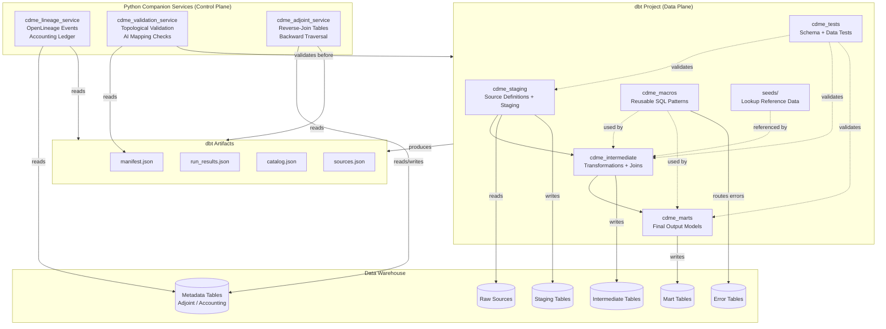
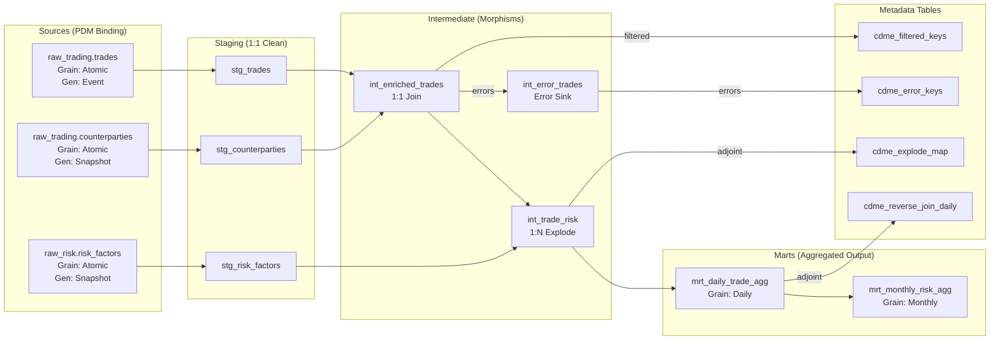

# Design: Categorical Data Mapping & Computation Engine (CDME) — dbt

**Version**: 1.0.0
**Date**: 2026-02-21
**Status**: Draft — Pending Human Validation
**Edge**: requirements -> design (v2.3 methodology)
**Technology Binding**: dbt-core 1.8+ / SQL (Jinja-templated) + Python companion services
**Traces To**: REQUIREMENTS.md v1.0.0

---

## 1. Architecture Overview

### 1.1 Architectural Philosophy

The CDME dbt implementation uses a **hybrid architecture**: dbt handles the SQL-first declarative transformations (the data plane), while Python companion services handle capabilities that dbt cannot natively provide (the control plane). This is an honest acknowledgment that dbt, while excellent for data transformation and lineage, was not designed as a formal category-theoretic engine.

The architecture follows three principles:

1. **dbt owns the data plane**: All data transformations, materializations, and SQL-expressible validations run as dbt models, tests, and macros.
2. **Python services own the control plane**: Topological validation, adjoint metadata management, accounting verification, and AI assurance run as external Python services that read dbt artifacts and write to metadata tables.
3. **The warehouse is the execution engine**: dbt delegates all compute to the underlying data warehouse (Snowflake, Spark, etc.). Performance, distribution, and skew mitigation are warehouse concerns, not dbt concerns.

### 1.2 System Architecture Diagram



### 1.3 Key Architectural Decisions

| Decision | Rationale | ADR |
|----------|-----------|-----|
| dbt as transformation engine | SQL accessibility, native lineage, warehouse-agnostic | ADR-001 |
| Hybrid dbt + Python architecture | dbt alone cannot satisfy adjoint, accounting, or AI assurance requirements | ADR-002 |
| Several requirements partially satisfied or descoped | Formal CT enforcement exceeds dbt's capabilities | ADR-003 |
| dbt-core CLI with orchestrator | Flexibility, cost, CI/CD integration | ADR-004 |
| dbt artifacts for lineage | Native column-level lineage via manifest.json | ADR-005 |

---

## 2. Source Analysis

### 2.1 Requirements Ambiguities (Design Perspective)

| ID | Ambiguity | Resolution |
|----|-----------|------------|
| DA-001 | Requirements assume a programmatic engine (A-001: "library/framework providing a programmatic API") — dbt is a declarative transformation tool, not a programmatic API | Resolved: dbt replaces the programmatic engine; Python services fill gaps. The system is a dbt project + services, not a library. ADR-002 documents this. |
| DA-002 | "Compile-time validation" (REQ-F-LDM-003, REQ-F-TRV-002) — dbt has `dbt compile` but no formal type checker | Resolved: "compile time" maps to `dbt compile` + pre-run validation service. Not equivalent to Scala's compile-time guarantees. ADR-003 documents the gap. |
| DA-003 | "Kleisli lifting" (REQ-F-TRV-001) — dbt has no monadic context; 1:N is just a SQL join | Resolved: 1:N traversals are SQL LEFT JOIN / LATERAL FLATTEN operations. "Lifting" is implicit in SQL semantics. The formal Kleisli structure is not preserved. |
| DA-004 | "Monoid laws" (REQ-F-LDM-004) — dbt cannot formally verify associativity | Resolved: Aggregation functions use SQL built-ins (SUM, COUNT) which are associative by definition. Custom aggregations must be tested via dbt data tests. Formal verification is not achievable. ADR-003 documents this. |
| DA-005 | "Refinement types" (REQ-F-TYP-001) — dbt relies on warehouse types, no refinement types | Resolved: Refinement predicates are implemented as dbt tests and pre-insert checks via CASE/WHERE. Not equivalent to a compile-time refinement type system. |
| DA-006 | Apache Spark assumed as primary runtime (D-001, REQ-NFR-DIST-001) — dbt abstracts the warehouse | Resolved: dbt-spark adapter satisfies this. dbt-snowflake is also viable. The warehouse handles distribution, not dbt. |

### 2.2 Requirements Gaps for Design

| ID | Gap | Disposition |
|----|-----|------------|
| DG-001 | No concurrency model specified — dbt handles parallelism via its DAG scheduler and warehouse concurrency | Assumed: dbt's thread-based model execution + warehouse parallelism is sufficient |
| DG-002 | No API contract specified — requirements assume library API, but dbt exposes CLI + artifacts | Resolved: Python services expose REST APIs for validation, adjoint queries, and lineage; dbt itself is CLI-invoked |
| DG-003 | No schema migration strategy — requirements don't address LDM evolution | Deferred: dbt handles schema changes via `--full-refresh`; formal migration is out of scope |
| DG-004 | Error domain sink format unspecified — requirements say "Error Domain" but not the physical representation | Resolved: Error tables in the warehouse, one per source domain, with structured error columns |
| DG-005 | Adjoint metadata storage strategy unspecified | Resolved: Dedicated metadata tables in the warehouse, managed by cdme_adjoint_service |

### 2.3 Requirements Conflicts

| ID | Conflict | Resolution |
|----|----------|------------|
| DC-001 | Project constraints specify Scala 2.13.12 / sbt / Spark — this design uses dbt + Python instead | Acknowledged: This design intentionally explores a different technology binding for the same requirements. The project constraints apply to the Scala/Spark design, not this one. This dbt design uses its own technology context. |
| DC-002 | REQ-NFR-DIST-001 requires "Apache Spark as the primary distributed runtime" — dbt delegates to warehouse | Resolved: dbt-spark adapter satisfies this when Spark is the warehouse. Alternatively, dbt-snowflake delegates to Snowflake's distributed engine. Either way, dbt is the orchestration layer, not the compute engine. |
| DC-003 | Architecture constraint "cdme-model has zero external dependencies" — dbt models always depend on dbt-core | Resolved: In dbt, "zero external dependencies" means cdme_staging models depend only on source definitions, not on other packages. The spirit of the constraint (core domain isolation) is preserved. |

---

## 3. Requirements Feasibility in dbt

This section is the critical honest assessment of what dbt can and cannot do relative to the CDME requirements.

### 3.1 Feasibility Matrix by Domain

| Domain | Feasibility | Approach | Key Limitations |
|--------|------------|----------|-----------------|
| **LDM (Graph Structure)** | Partial | dbt sources + refs model the directed graph; multigraph via multiple refs between models. No formal category theory enforcement. | No formal directed multigraph data structure. Graph is implicit in dbt's DAG. Cannot enforce composition laws at compile time. |
| **PDM (Storage)** | Good | dbt's native concern. Sources define physical bindings. Materializations (view, table, incremental) control physical representation. | No formal "functorial mapping" — it's just dbt source definitions. Temporal binding requires custom macros. |
| **Traversal** | Good | SQL JOINs with dbt `ref()` implement traversals. 1:N via LEFT JOIN / LATERAL FLATTEN. Aggregation via GROUP BY. | No formal Kleisli lifting. No monadic execution context. Grain safety requires custom tests, not compile-time enforcement. |
| **Type System** | Partial | Warehouse native types (INTEGER, VARCHAR, etc.) + dbt tests for constraint enforcement. | No sum types, no product types, no refinement types natively. dbt tests catch violations at test time, not compile time. Implicit casting depends on warehouse behavior. |
| **Error Domain** | Partial | Conditional SQL routing to error tables via CASE WHEN + UNION ALL pattern. Error tables hold structured error records. | No Either monad. Errors are routed by SQL logic, not by type system. "Silent drop" prevention requires careful macro design. |
| **Context Consistency** | Good | SQL WHERE clauses enforce epoch/fiber boundaries. dbt sources can declare freshness checks. | No formal "fiber" concept. Epoch alignment is convention, not enforced structurally. |
| **Synthesis** | Good | SQL expressions (CASE, COALESCE, function composition) handle synthesis. dbt models compose via ref(). | Multi-grain formulation requires discipline; dbt does not prevent grain mixing at compile time. |
| **AI Assurance** | External | Python validation service reads dbt manifest, validates mapping definitions against LDM topology before dbt run. | Cannot use dbt's own compile step for topological validation. Requires a separate pre-run validation pass. |
| **Accounting** | External | Python service reads dbt run_results + metadata tables to produce ledger.json and verify the accounting invariant. | dbt has no native concept of "every record accounted for." Must be bolted on via metadata tables and post-run verification. |
| **Adjoint** | External | Python service manages reverse-join metadata tables. dbt models write forward results; Python service writes backward metadata. | No native backward traversal. No adjoint interface. Reverse-join tables are a manual pattern, not a framework feature. |
| **Lineage** | Good | dbt artifacts (manifest.json) provide model-level and column-level lineage natively. dbt docs generate lineage graphs. | Column-level lineage requires dbt 1.6+ and may not trace through complex Jinja logic. Not record-level lineage. |
| **Performance** | Delegated | dbt delegates all compute to the warehouse. Throughput is a warehouse tuning concern. | dbt itself adds no parallelism beyond thread-based model execution. Skew mitigation is a warehouse concern. |
| **Observability** | Good | dbt produces structured artifacts. Logging via dbt's native logging + custom on-run-end hooks. | REQ key tagging in telemetry requires custom hooks, not native. OpenLineage integration requires the companion lineage service. |

### 3.2 Requirements Classification Summary

| Classification | Count | Meaning |
|---------------|-------|---------|
| **Fully Satisfiable** | 14 | dbt natively satisfies or satisfies with standard patterns |
| **Satisfiable with Adaptation** | 22 | Requires custom macros, tests, or dbt patterns beyond defaults |
| **Requires External Service** | 18 | Python companion service required |
| **Partially Satisfiable** | 8 | Core intent achievable but formal guarantees are weaker |
| **Not Achievable in dbt** | 4 | Formal CT properties that have no dbt equivalent |

---

## 4. Component Design

### 4.1 Component: cdme_staging

**Implements**: REQ-F-PDM-001, REQ-F-PDM-002, REQ-F-PDM-003, REQ-F-PDM-004, REQ-F-PDM-005, REQ-F-PDM-006, REQ-F-LDM-007

**Responsibilities**:
- Define dbt sources mapping to raw warehouse tables (the PDM binding)
- Create 1:1 staging models that clean, rename, and type-cast raw data
- Declare generation grain (Event / Snapshot) via dbt model meta properties
- Declare epoch boundary definitions via model config
- Bind lookup reference data as dbt seeds or source tables
- Tag every entity with grain metadata via dbt meta config

**Interfaces**:
- Consumed by: cdme_intermediate (via `ref()`)
- Reads from: Raw warehouse tables (via `source()`)
- Validates via: cdme_tests (schema tests on staging models)

**Dependencies**:
- Raw source tables must exist in the warehouse
- dbt source freshness checks for temporal binding
- Seed files for reference data lookups

**Key Design Decisions**:
- Each source system gets its own `_sources.yml` file with grain and epoch metadata
- Staging models use `stg_` prefix and are materialized as views (no data duplication)
- Generation grain is stored in model `meta.generation_grain` (Event | Snapshot)
- Temporal binding is implemented via dbt `var()` for epoch parameters passed at runtime

**Example**:
```yaml
# models/staging/trading/_sources.yml
sources:
  - name: trading_raw
    schema: raw_trading
    meta:
      generation_grain: Event
      epoch_boundary: "partition_date"
    tables:
      - name: trades
        meta:
          grain: Atomic
          entity_type: Transaction
        columns:
          - name: trade_id
            tests:
              - not_null
              - unique
          - name: trade_date
            tests:
              - not_null
```

```sql
-- models/staging/trading/stg_trades.sql
-- Implements: REQ-F-PDM-001, REQ-F-LDM-007

{{ config(
    materialized='view',
    meta={
        'grain': 'Atomic',
        'generation_grain': 'Event',
        'implements': ['REQ-F-PDM-001', 'REQ-F-LDM-007']
    }
) }}

SELECT
    trade_id,
    CAST(trade_date AS DATE) AS trade_date,
    CAST(counterparty_id AS VARCHAR) AS counterparty_id,
    CAST(notional AS DECIMAL(18,2)) AS notional,
    CAST(currency AS VARCHAR(3)) AS currency,
    _loaded_at AS _cdme_loaded_at
FROM {{ source('trading_raw', 'trades') }}
WHERE partition_date = '{{ var("epoch_date") }}'
```

---

### 4.2 Component: cdme_intermediate

**Implements**: REQ-F-TRV-001, REQ-F-TRV-002, REQ-F-TRV-003, REQ-F-TRV-005, REQ-F-SYN-001, REQ-F-SYN-004, REQ-F-SYN-005, REQ-F-SYN-006, REQ-F-SYN-007, REQ-F-LDM-002, REQ-F-LDM-003, REQ-F-CTX-001, REQ-F-ERR-001

**Responsibilities**:
- Implement transformation logic as SQL models (morphism compositions)
- Handle 1:N traversals via SQL JOINs (Kleisli-equivalent operations)
- Route invalid records to error tables via conditional SQL
- Enforce epoch alignment via WHERE clauses on partition keys
- Implement versioned lookup joins with explicit version semantics
- Generate deterministic surrogate keys via hashing macros
- Implement conditional and prioritized business logic

**Interfaces**:
- Consumes: cdme_staging models (via `ref()`)
- Consumed by: cdme_marts (via `ref()`)
- Routes errors to: error models (via `ref()` to error union models)
- References: cdme_macros for reusable patterns

**Dependencies**:
- cdme_staging models must be defined
- cdme_macros must provide error routing, key generation, and join macros
- Lookup seeds/sources must be available with version metadata

**Key Design Decisions**:
- Each "morphism" is a dbt model. Cardinality is declared in model meta.
- Error routing uses a two-pass pattern: the model produces both valid and invalid CTEs, UNIONed into separate targets.
- Versioned lookups join on version columns; the lookup version is passed as a dbt var.
- Surrogate keys use `dbt_utils.generate_surrogate_key()` for determinism.
- Temporal semantics for cross-boundary joins are declared in model meta and enforced by convention + tests.

**Example**:
```sql
-- models/intermediate/int_enriched_trades.sql
-- Implements: REQ-F-TRV-001, REQ-F-SYN-001, REQ-F-ERR-001

{{ config(
    materialized='table',
    meta={
        'grain': 'Atomic',
        'cardinality': '1:1',
        'morphism_type': 'Computational',
        'implements': ['REQ-F-TRV-001', 'REQ-F-SYN-001', 'REQ-F-ERR-001']
    }
) }}

WITH source_trades AS (
    SELECT * FROM {{ ref('stg_trades') }}
),

counterparties AS (
    SELECT * FROM {{ ref('stg_counterparties') }}
    WHERE lookup_version = '{{ var("lookup_version", "LATEST") }}'
    -- Implements: REQ-F-SYN-006 (versioned lookup)
),

joined AS (
    SELECT
        t.trade_id,
        t.trade_date,
        t.notional,
        t.currency,
        c.counterparty_name,
        c.counterparty_rating,
        CASE
            WHEN c.counterparty_id IS NULL THEN 'LEFT_ERROR'
            ELSE 'RIGHT_VALID'
        END AS _cdme_either
        -- Implements: REQ-F-ERR-001 (Either routing)
    FROM source_trades t
    LEFT JOIN counterparties c ON t.counterparty_id = c.counterparty_id
),

valid_records AS (
    SELECT * FROM joined WHERE _cdme_either = 'RIGHT_VALID'
),

error_records AS (
    SELECT
        trade_id AS source_key,
        'REQ-F-TYP-002' AS failure_type,
        trade_date AS source_epoch,
        counterparty_id AS offending_value,
        'int_enriched_trades.counterparty_join' AS morphism_path,
        'Missing counterparty reference' AS error_message
    FROM joined WHERE _cdme_either = 'LEFT_ERROR'
    -- Implements: REQ-F-ERR-004 (error object content)
)

SELECT * FROM valid_records
```

---

### 4.3 Component: cdme_marts

**Implements**: REQ-F-LDM-004, REQ-F-LDM-005, REQ-F-SYN-002, REQ-F-SYN-005, REQ-F-TRV-002

**Responsibilities**:
- Produce final business-ready output models (aggregated, pivoted, denormalized)
- Implement monoidal aggregation via SQL GROUP BY with known-associative functions
- Enforce grain transitions (Atomic -> Daily -> Monthly) via explicit aggregation models
- Provide identity elements for empty aggregations via COALESCE
- Support multi-level aggregation through separate models per grain level

**Interfaces**:
- Consumes: cdme_intermediate models (via `ref()`)
- Consumed by: End users, BI tools, downstream systems
- Validates via: cdme_tests (grain safety tests, aggregation correctness tests)

**Dependencies**:
- cdme_intermediate models must produce clean, typed, error-routed data
- Grain hierarchy must be declared in project-level metadata

**Key Design Decisions**:
- Each grain level transition is a separate dbt model (no skipping levels)
- Aggregation functions are limited to known-associative SQL functions: SUM, COUNT, MIN, MAX, AVG (where applicable), CONCAT (with deterministic ordering)
- Empty aggregation must use COALESCE to return identity elements: `COALESCE(SUM(x), 0)`
- Incremental materialization is used for large aggregation marts to support efficient rebuilds

**Example**:
```sql
-- models/marts/mrt_daily_trade_aggregates.sql
-- Implements: REQ-F-LDM-004, REQ-F-LDM-005, REQ-F-SYN-002

{{ config(
    materialized='incremental',
    unique_key='aggregate_key',
    meta={
        'grain': 'DailyAggregate',
        'aggregation_monoid': {
            'operation': 'SUM',
            'identity': 0,
            'is_associative': true
        },
        'implements': ['REQ-F-LDM-004', 'REQ-F-LDM-005', 'REQ-F-SYN-002']
    }
) }}

WITH enriched_trades AS (
    SELECT * FROM {{ ref('int_enriched_trades') }}
    
    WHERE trade_date > (SELECT MAX(trade_date) FROM {{ this }})
    
)

SELECT
    {{ dbt_utils.generate_surrogate_key(['trade_date', 'currency']) }}
        AS aggregate_key,
    trade_date,
    currency,
    COALESCE(SUM(notional), 0) AS total_notional,
    -- Implements: REQ-F-LDM-005 (identity element for empty aggregation)
    COALESCE(COUNT(*), 0) AS trade_count,
    MIN(trade_id) AS first_trade_id,
    MAX(trade_id) AS last_trade_id
FROM enriched_trades
GROUP BY trade_date, currency
```

---

### 4.4 Component: cdme_tests

**Implements**: REQ-F-TYP-001, REQ-F-TYP-002, REQ-F-TYP-003, REQ-F-TYP-004, REQ-F-TYP-005, REQ-F-TRV-002, REQ-BR-GRN-001, REQ-F-LDM-004, REQ-F-ERR-003

**Responsibilities**:
- Enforce type constraints via dbt schema tests (not_null, accepted_values, relationships)
- Implement custom generic tests for refinement-type predicates
- Implement grain safety tests that reject incompatible grain combinations
- Implement monoid law tests (associativity checks on sample data)
- Verify error handling idempotency by comparing re-run results
- Enforce explicit casting rules (no implicit type coercion in models)

**Interfaces**:
- Validates: All cdme_staging, cdme_intermediate, and cdme_marts models
- Reports to: dbt test results (run_results.json), consumed by cdme_lineage_service

**Dependencies**:
- dbt-utils and dbt-expectations packages for extended test macros
- Custom generic tests defined in cdme_macros

**Key Design Decisions**:
- Refinement types are implemented as custom generic tests: e.g., `test_positive_value`, `test_valid_currency_code`
- Grain safety tests check that no model combines columns from models with incompatible grain metadata
- Type unification tests verify that join conditions use compatible types
- All tests are tagged with REQ keys via test meta config
- Tests run as part of `dbt test` (not a separate step) -- this is the "compile-time equivalent" in dbt

**Limitation**: dbt tests run AFTER models execute, not before. This means invalid data is written to the warehouse before tests catch it. This is fundamentally different from compile-time validation. The `cdme_validation_service` provides pre-run validation for the topological checks that must happen before data flows.

**Example**:
```yaml
# models/intermediate/_intermediate.yml
# Validates: REQ-F-TYP-002, REQ-BR-GRN-001

models:
  - name: int_enriched_trades
    meta:
      validates:
        - REQ-F-TYP-002
        - REQ-BR-GRN-001
    columns:
      - name: notional
        tests:
          - not_null
          - cdme_positive_value:
              # Validates: REQ-F-TYP-002 (refinement type: PositiveDecimal)
              meta:
                validates: REQ-F-TYP-002
      - name: currency
        tests:
          - not_null
          - accepted_values:
              values: ['USD', 'EUR', 'GBP', 'JPY', 'CHF']
              meta:
                validates: REQ-F-TYP-005
      - name: trade_date
        tests:
          - not_null
```

```sql
-- tests/generic/test_cdme_positive_value.sql
-- Validates: REQ-F-TYP-002


-- Custom generic test: refinement type enforcement
-- Rows returned = failures
SELECT
    {{ column_name }} AS failing_value,
    '{{ column_name }}' AS column_tested,
    'PositiveDecimal' AS refinement_type,
    '{{ model }}' AS source_model
FROM {{ model }}
WHERE {{ column_name }} <= 0 OR {{ column_name }} IS NULL

```

```sql
-- tests/data/test_grain_safety_no_mixing.sql
-- Validates: REQ-BR-GRN-001, REQ-F-TRV-002

-- This data test checks that no intermediate model joins
-- Atomic and Aggregate grain models without explicit aggregation.
-- Implemented by querying dbt metadata (manifest-based check
-- is done by cdme_validation_service; this is a runtime data check).

WITH atomic_model AS (
    SELECT COUNT(*) AS atomic_row_count
    FROM {{ ref('stg_trades') }}
),
aggregate_model AS (
    SELECT COUNT(*) AS agg_row_count
    FROM {{ ref('mrt_daily_trade_aggregates') }}
)
-- If any model claims DailyAggregate grain but has row count
-- equal to atomic source, flag it as suspicious
SELECT 'GRAIN_SAFETY_WARNING' AS check_type
FROM atomic_model a, aggregate_model g
WHERE g.agg_row_count >= a.atomic_row_count
  AND g.agg_row_count > 0
```

---

### 4.5 Component: cdme_macros

**Implements**: REQ-F-TRV-001, REQ-F-ERR-001, REQ-F-ERR-002, REQ-F-ERR-004, REQ-F-SYN-007, REQ-F-TYP-003, REQ-F-SYN-008

**Responsibilities**:
- Provide reusable Jinja macros for common CDME patterns
- `cdme_either_route()`: Routes records to valid or error CTEs based on a condition
- `cdme_surrogate_key()`: Wrapper around deterministic key generation with lineage metadata
- `cdme_versioned_lookup()`: Joins with version enforcement and version recording
- `cdme_explode()`: Handles 1:N expansion (Kleisli-equivalent) with parent-child key capture
- `cdme_cast_explicit()`: Enforces explicit type casting (rejects implicit coercion patterns)
- `cdme_error_object()`: Constructs structured error records with all required fields
- `cdme_circuit_breaker()`: Implements batch failure threshold logic
- `cdme_external_morphism()`: Wrapper for external calculator invocations with type checking

**Interfaces**:
- Used by: cdme_intermediate and cdme_marts models
- Generates: SQL fragments that are compiled into model queries

**Dependencies**:
- dbt-utils package (for surrogate key generation)
- dbt Jinja runtime

**Example Macros**:

```sql
-- macros/cdme_either_route.sql
-- Implements: REQ-F-ERR-001, REQ-F-ERR-004


CASE
    WHEN {{ condition }} THEN 'RIGHT_VALID'
    ELSE 'LEFT_ERROR'
END AS _cdme_either,
CASE
    WHEN NOT ({{ condition }}) THEN {{ source_key_col }}
    ELSE NULL
END AS _cdme_error_source_key,
CASE
    WHEN NOT ({{ condition }}) THEN '{{ morphism_path }}'
    ELSE NULL
END AS _cdme_error_morphism_path,
CASE
    WHEN NOT ({{ condition }}) THEN {{ source_epoch_col }}
    ELSE NULL
END AS _cdme_error_epoch,
CASE
    WHEN NOT ({{ condition }}) THEN '{{ error_message }}'
    ELSE NULL
END AS _cdme_error_message

```

```sql
-- macros/cdme_explode.sql
-- Implements: REQ-F-TRV-001


-- Kleisli-equivalent 1:N expansion with parent-child key capture
LEFT JOIN {{ child_relation }} AS _child
    ON {{ join_condition }}
-- The parent-child mapping is captured for adjoint metadata

```

```sql
-- macros/cdme_circuit_breaker.sql
-- Implements: REQ-F-ERR-002, REQ-DATA-QAL-001


-- Pre-check: if error rate in first N rows exceeds threshold, abort

    WITH sample AS (
        SELECT
            COUNT(*) AS total,
            SUM(CASE WHEN _cdme_either = 'LEFT_ERROR' THEN 1 ELSE 0 END) AS errors
        FROM (
            SELECT * FROM {{ model_ref }}
            LIMIT {{ sample_window }}
        )
    )
    SELECT
        CASE WHEN (errors * 100.0 / NULLIF(total, 0)) > {{ error_threshold_pct }}
             THEN TRUE ELSE FALSE END AS should_halt
    FROM sample


```

---

### 4.6 Component: cdme_lineage_service (Python)

**Implements**: REQ-F-SYN-003, REQ-F-ACC-001, REQ-F-ACC-002, REQ-F-ACC-004, REQ-NFR-OBS-001, REQ-NFR-OBS-002, REQ-NFR-VER-001, REQ-F-TRV-004, REQ-DATA-LIN-001

**Responsibilities**:
- Read dbt artifacts (manifest.json, run_results.json, catalog.json) after each dbt run
- Transform dbt lineage into OpenLineage-compatible events (START, COMPLETE, FAIL)
- Read metadata tables (adjoint, error counts, filtered counts) to compute accounting ledger
- Produce `ledger.json` proving the accounting invariant: `|input_keys| = |reverse_join_keys| + |filtered_keys| + |error_keys|`
- Gate run completion: mark run as COMPLETE only if accounting invariant passes
- Tag lineage events with REQ keys extracted from model meta
- Record artifact versions (LDM, PDM, mapping logic versions) from dbt project metadata
- Support lineage mode selection (Full, Key-Derivable, Summary) via job configuration

**Interfaces**:
- Reads: dbt artifacts directory (`target/`), warehouse metadata tables
- Writes: `ledger.json` to artifact store, OpenLineage events to collector endpoint
- Exposes: REST API for lineage queries (`GET /lineage/{run_id}`, `GET /ledger/{run_id}`)

**Dependencies**:
- dbt artifacts (generated by `dbt run` and `dbt docs generate`)
- OpenLineage Python client library
- Access to warehouse metadata tables (cdme_adjoint_*, cdme_error_*, cdme_filter_*)
- Job configuration (lineage mode, artifact versions)

**Technology Stack**:
- Python 3.11+
- FastAPI for REST endpoints
- openlineage-python for event emission
- SQLAlchemy for warehouse metadata access

**Key Design Decisions**:
- Lineage is model-level by default (from dbt manifest) with column-level when available (dbt 1.6+)
- Record-level lineage (Full mode) requires the adjoint service to have captured per-record key mappings
- The accounting ledger is computed post-run, not during run — dbt has no mid-execution hooks
- Writer Effect telemetry (REQ-F-TRV-004) is approximated by reading dbt run_results (row counts, latency) rather than captured during transformation

---

### 4.7 Component: cdme_validation_service (Python)

**Implements**: REQ-F-AIA-001, REQ-F-AIA-002, REQ-F-AIA-003, REQ-F-LDM-003, REQ-F-LDM-006, REQ-F-TRV-002, REQ-F-TRV-006, REQ-F-TYP-004, REQ-DATA-LIN-002

**Responsibilities**:
- Parse dbt manifest.json to extract the model DAG (the effective LDM graph)
- Validate that all model references exist (no hallucinated relationships for AI-generated models)
- Validate grain compatibility across joins by checking model meta grain tags
- Validate type unification at join boundaries by checking column types in catalog.json
- Enforce topological access control by checking model-level permissions
- Estimate computational cost (cardinality explosion) before dbt run
- Implement dry-run mode that runs validation without triggering `dbt run`
- Classify morphisms as lossless/lossy based on model SQL patterns
- Validate AI-generated mapping definitions against the same rules as human-authored mappings

**Interfaces**:
- Reads: dbt manifest.json, catalog.json, model SQL files, project YAML configs
- Exposes: REST API (`POST /validate`, `POST /dry-run`, `GET /cost-estimate/{model}`)
- Integrates with: CI/CD pipeline as a pre-run gate

**Dependencies**:
- dbt project source files (for SQL parsing)
- dbt artifacts (manifest.json for compiled graph, catalog.json for column types)
- LDM metadata (grain hierarchy, type hierarchy) stored in project YAML

**Technology Stack**:
- Python 3.11+
- FastAPI for REST endpoints
- sqlglot for SQL parsing and analysis
- networkx for graph topology analysis

**Key Design Decisions**:
- Validation runs BEFORE `dbt run`, not after — this is the closest analog to "compile-time" checking
- The service parses the dbt manifest to build a directed graph, then runs topological checks on that graph
- AI-generated models are validated by submitting their SQL + YAML to the same validation pipeline
- Dry-run mode calls `dbt compile` (no execution) and then validates the compiled graph
- Cost estimation uses table statistics (from catalog or warehouse stats) to predict cardinality

**Limitation**: This service cannot prevent dbt from running invalid models if bypassed. It is an advisory gate, not a compile-time guarantee. In CI/CD, the validation service must be a mandatory step before `dbt run`.

---

### 4.8 Component: cdme_adjoint_service (Python)

**Implements**: REQ-F-ADJ-001, REQ-F-ADJ-002, REQ-F-ADJ-003, REQ-F-ADJ-004, REQ-F-ADJ-005, REQ-F-ADJ-006, REQ-F-ADJ-007, REQ-F-ACC-003, REQ-F-ACC-005

**Responsibilities**:
- Maintain reverse-join metadata tables in the warehouse for every aggregation and filter morphism
- For aggregation models: capture `aggregate_key -> [source_key1, source_key2, ...]` mappings
- For filter models: capture `filter_id -> [excluded_key1, excluded_key2, ...]` mappings
- For 1:N models: capture `parent_key -> [child_key1, child_key2, ...]` mappings
- For 1:1 models: verify self-adjoint property (backward = exact inverse)
- Support backward traversal queries: given a target key, return all contributing source keys
- Support impact analysis: given a source subset, return all affected target records
- Support data reconciliation: verify `backward(forward(x)) supseteq x`

**Interfaces**:
- Reads: dbt run_results.json (to know which models ran), warehouse data tables
- Writes: Warehouse metadata tables (cdme_reverse_join_*, cdme_filtered_keys_*, cdme_explode_map_*)
- Exposes: REST API (`GET /backward/{model}/{key}`, `GET /impact/{model}/{key}`, `POST /reconcile/{run_id}`)

**Dependencies**:
- Warehouse access (read production tables, write metadata tables)
- dbt artifacts (to know model topology and which models executed)
- cdme_lineage_service (for run context)

**Technology Stack**:
- Python 3.11+
- FastAPI for REST endpoints
- SQLAlchemy for warehouse access
- Scheduled post-run job (triggered after `dbt run` completes)

**Key Design Decisions**:
- Adjoint metadata is captured as a POST-RUN step, not during dbt execution. dbt has no hooks that run "inside" a model's execution.
- The service queries the warehouse after each model runs to compute reverse-join mappings.
- For aggregation models, it compares source and target tables to build `aggregate_key -> [source_keys]` maps.
- For filter models, it computes `source_keys - output_keys - error_keys = filtered_keys`.
- Contravariant composition (REQ-F-ADJ-004) is implemented by chaining backward lookups through the model DAG in reverse order.
- This is the most significant architectural compromise: true adjoint morphisms would capture metadata during execution, not after. The post-run approach is correct but less efficient.

**Limitation**: The post-run approach means that if a dbt run fails partway through, adjoint metadata may be incomplete. The service must handle partial runs gracefully.

---

## 5. Data Model

### 5.1 Conceptual Data Flow



### 5.2 LDM-to-dbt Mapping

| LDM Concept | dbt Equivalent | Notes |
|-------------|---------------|-------|
| Entity (Object) | dbt model (SQL file + YAML schema) | Each entity is a model with meta.grain |
| Morphism (Edge) | `ref()` dependency between models | Cardinality declared in meta |
| Category (Domain) | dbt folder / tag grouping | e.g., `models/intermediate/trading/` |
| Functor (LDM->PDM) | `source()` definitions in YAML | Maps logical name to physical table |
| Grain | Model `meta.grain` property | Enforced by cdme_tests + validation service |
| Type | Column type in warehouse + dbt tests | No formal type system; warehouse types + test constraints |
| Composition | Chain of `ref()` calls | `ref('stg_a')` -> `ref('int_b')` -> `ref('mrt_c')` |
| Identity Morphism | View model that passes through | `SELECT * FROM {{ ref('source_model') }}` |

### 5.3 Metadata Table Schemas

**cdme_reverse_join_{model_name}**:
```sql
CREATE TABLE cdme_reverse_join_{model_name} (
    run_id          VARCHAR NOT NULL,
    aggregate_key   VARCHAR NOT NULL,
    source_key      VARCHAR NOT NULL,
    morphism_path   VARCHAR NOT NULL,
    created_at      TIMESTAMP DEFAULT CURRENT_TIMESTAMP,
    PRIMARY KEY (run_id, aggregate_key, source_key)
);
-- Implements: REQ-F-ACC-003, REQ-F-ADJ-003
```

**cdme_filtered_keys_{model_name}**:
```sql
CREATE TABLE cdme_filtered_keys_{model_name} (
    run_id          VARCHAR NOT NULL,
    filtered_key    VARCHAR NOT NULL,
    filter_condition VARCHAR NOT NULL,
    morphism_path   VARCHAR NOT NULL,
    created_at      TIMESTAMP DEFAULT CURRENT_TIMESTAMP,
    PRIMARY KEY (run_id, filtered_key)
);
-- Implements: REQ-F-ACC-003
```

**cdme_error_log**:
```sql
CREATE TABLE cdme_error_log (
    run_id          VARCHAR NOT NULL,
    source_key      VARCHAR NOT NULL,
    failure_type    VARCHAR NOT NULL,
    offending_value VARCHAR,
    source_entity   VARCHAR NOT NULL,
    source_epoch    VARCHAR NOT NULL,
    morphism_path   VARCHAR NOT NULL,
    error_message   VARCHAR,
    created_at      TIMESTAMP DEFAULT CURRENT_TIMESTAMP,
    PRIMARY KEY (run_id, source_key, morphism_path)
);
-- Implements: REQ-F-ERR-004
```

**cdme_explode_map_{model_name}**:
```sql
CREATE TABLE cdme_explode_map_{model_name} (
    run_id          VARCHAR NOT NULL,
    parent_key      VARCHAR NOT NULL,
    child_key       VARCHAR NOT NULL,
    morphism_path   VARCHAR NOT NULL,
    created_at      TIMESTAMP DEFAULT CURRENT_TIMESTAMP,
    PRIMARY KEY (run_id, parent_key, child_key)
);
-- Implements: REQ-F-ACC-003, REQ-F-TRV-001
```

**cdme_accounting_ledger**:
```sql
CREATE TABLE cdme_accounting_ledger (
    run_id              VARCHAR PRIMARY KEY,
    input_count         BIGINT NOT NULL,
    reverse_join_count  BIGINT NOT NULL,
    filtered_count      BIGINT NOT NULL,
    error_count         BIGINT NOT NULL,
    verification_status VARCHAR NOT NULL,  -- 'BALANCED' | 'UNBALANCED'
    discrepancy_detail  VARCHAR,
    ledger_json_path    VARCHAR NOT NULL,
    created_at          TIMESTAMP DEFAULT CURRENT_TIMESTAMP
);
-- Implements: REQ-F-ACC-001, REQ-F-ACC-002, REQ-F-ACC-004
```

---

## 6. Error Handling Strategy

### 6.1 Error Flow

Errors in dbt cannot be handled via an Either monad. Instead, the CDME dbt implementation uses a **conditional SQL routing pattern**:

1. Every intermediate model that can produce errors includes a `_cdme_either` column (valued `RIGHT_VALID` or `LEFT_ERROR`)
2. The model's final SELECT includes only `RIGHT_VALID` records
3. A companion error model (e.g., `int_error_trades`) SELECTs only `LEFT_ERROR` records with structured error metadata
4. A union error sink model (`cdme_error_log_model`) aggregates errors from all error models
5. The `cdme_lineage_service` reads error counts from the error sink for accounting

### 6.2 Batch Failure Threshold

The `cdme_circuit_breaker` macro (REQ-F-ERR-002, REQ-DATA-QAL-001) implements a probabilistic circuit breaker:
- Configured via dbt vars: `cdme_error_threshold_pct` (default: no threshold) and `cdme_sample_window` (default: 10000)
- Checks error rate in first N rows of a model
- If threshold exceeded, the macro raises a dbt compilation error, halting the run
- This is a best-effort mechanism: dbt does not support mid-execution halts within a single model

### 6.3 Error Idempotency

REQ-F-ERR-003 is satisfied by dbt's deterministic SQL execution: the same input data with the same model SQL and the same dbt vars must produce identical error records. This is enforced by:
- No use of `CURRENT_TIMESTAMP` or `RANDOM()` in model logic (only in metadata columns)
- Versioned lookups ensuring the same reference data
- Epoch-bounded source data ensuring the same input

---

## 7. Configuration Model

### 7.1 dbt Project Configuration

```yaml
# dbt_project.yml
name: 'cdme'
version: '1.0.0'
config-version: 2
profile: 'cdme'

vars:
  # Epoch control
  epoch_date: '{{ env_var("CDME_EPOCH_DATE") }}'
  lookup_version: '{{ env_var("CDME_LOOKUP_VERSION", "LATEST") }}'

  # Error handling
  cdme_error_threshold_pct: null  # null = no threshold (REQ-F-ERR-002)
  cdme_sample_window: 10000

  # Lineage mode
  cdme_lineage_mode: 'summary'  # full | key_derivable | summary

  # Cardinality budget
  cdme_max_output_rows: null  # null = no budget
  cdme_max_join_depth: 10

model-paths: ["models"]
test-paths: ["tests"]
macro-paths: ["macros"]
seed-paths: ["seeds"]
snapshot-paths: ["snapshots"]

models:
  cdme:
    staging:
      +materialized: view
      +schema: cdme_staging
    intermediate:
      +materialized: table
      +schema: cdme_intermediate
    marts:
      +materialized: incremental
      +schema: cdme_marts
```

### 7.2 LDM Configuration (Project-Level Metadata)

```yaml
# cdme_ldm_config.yml (read by validation service)
grain_hierarchy:
  - Atomic
  - HourlyAggregate
  - DailyAggregate
  - MonthlyAggregate
  - YearlyAggregate

type_hierarchy:
  Integer:
    subtypes: [PositiveInteger, NegativeInteger]
  Decimal:
    subtypes: [PositiveDecimal, Money, Percent]
  String:
    subtypes: [CurrencyCode, CountryCode, ISIN]

morphism_types:
  - Structural    # N:1 joins, 1:1 lookups
  - Computational # Pure functions, derivations
  - Algebraic     # Aggregations, folds

access_control:
  roles:
    - data_engineer
    - risk_analyst
    - compliance_officer
  morphism_permissions:
    # Defined per model in YAML meta
```

---

## 8. Integration Points

### 8.1 Orchestration Flow

```
1. cdme_validation_service.validate()        -- Pre-run topological check
2. dbt run --vars '{epoch_date: "2026-02-21"}'  -- Execute transformations
3. dbt test                                   -- Run all tests
4. cdme_adjoint_service.capture_metadata()   -- Build reverse-join tables
5. cdme_lineage_service.compute_ledger()     -- Produce ledger.json
6. cdme_lineage_service.emit_openlineage()   -- Emit OL events
7. cdme_lineage_service.gate_completion()    -- Mark COMPLETE or FAILED
```

### 8.2 External System Interfaces

| System | Protocol | Purpose |
|--------|----------|---------|
| Data Warehouse (Snowflake/Spark) | SQL (via dbt adapter) | All data storage and compute |
| OpenLineage Collector | HTTP REST | Lineage event emission |
| dbt Cloud API (optional) | HTTP REST | Run management, artifact retrieval |
| CI/CD (GitHub Actions, etc.) | CLI | Orchestration of the 7-step flow |
| Validation Service | HTTP REST | Pre-run topological validation |
| Adjoint Service | HTTP REST | Post-run metadata capture + queries |
| Lineage Service | HTTP REST | Ledger, lineage queries |

---

## 9. Deployment Model

### 9.1 dbt-core CLI Deployment (Primary — see ADR-004)

```
┌──────────────────────────────────────────────────┐
│  CI/CD Pipeline (GitHub Actions / Airflow)        │
│                                                    │
│  1. git checkout cdme-dbt                          │
│  2. pip install dbt-core dbt-spark                 │
│  3. python -m cdme_validation_service validate     │
│  4. dbt run --target prod --vars '...'             │
│  5. dbt test --target prod                         │
│  6. python -m cdme_adjoint_service capture         │
│  7. python -m cdme_lineage_service finalize        │
└──────────────────────────────────────────────────┘
         │                    │
         ▼                    ▼
┌─────────────────┐  ┌─────────────────────┐
│  Data Warehouse  │  │  Artifact Store      │
│  (Snowflake /    │  │  (S3 / GCS)          │
│   Spark SQL)     │  │  - manifest.json     │
│                  │  │  - ledger.json       │
│  - staging       │  │  - run_results.json  │
│  - intermediate  │  │  - OL events         │
│  - marts         │  │                      │
│  - metadata      │  │                      │
│  - errors        │  │                      │
└─────────────────┘  └─────────────────────┘
```

### 9.2 Security Model

- **Authentication**: Warehouse credentials via dbt profiles.yml (env vars, not plaintext)
- **Authorization**: RBAC via warehouse grants on schemas (cdme_staging, cdme_intermediate, cdme_marts)
- **Morphism-level RBAC** (REQ-F-LDM-006): Implemented via warehouse column-level grants + dbt model-level permissions in meta. The validation service checks permissions before allowing access.
- **Data Protection**: Encryption in transit (TLS to warehouse), at rest (warehouse-native encryption)

---

## 10. Traceability Matrix

### 10.1 Functional Requirements

| REQ Key | Description | Component(s) | Status |
|---------|-------------|---------------|--------|
| REQ-F-LDM-001 | Directed multigraph structure | cdme_staging, cdme_validation_service | Partial — dbt DAG is not a formal multigraph; multiple refs between models approximate multi-edges |
| REQ-F-LDM-002 | Cardinality classification | cdme_intermediate (model meta) | Satisfiable — declared in model meta, enforced by convention + validation service |
| REQ-F-LDM-003 | Path composition validity | cdme_validation_service | Satisfiable with adaptation — validation service checks path validity pre-run, not at compile time |
| REQ-F-LDM-004 | Monoidal aggregation laws | cdme_marts, cdme_tests | Partial — SQL built-in aggregations are associative; custom aggregations tested but not formally verified |
| REQ-F-LDM-005 | Empty aggregation identity | cdme_marts | Satisfiable — COALESCE(SUM(x), 0) pattern in all aggregation models |
| REQ-F-LDM-006 | Topological access control | cdme_validation_service | Satisfiable with adaptation — warehouse grants + validation service permission checks |
| REQ-F-LDM-007 | Grain and type metadata | cdme_staging, cdme_tests | Satisfiable — grain in model meta, types enforced by warehouse + dbt tests |
| REQ-F-PDM-001 | Functorial storage abstraction | cdme_staging | Satisfiable — dbt source definitions separate logical from physical |
| REQ-F-PDM-002 | Generation grain declaration | cdme_staging | Satisfiable — declared in source meta.generation_grain |
| REQ-F-PDM-003 | Generation grain semantics | cdme_staging, cdme_tests | Satisfiable — enforced by convention + custom tests for boundary semantics |
| REQ-F-PDM-004 | Epoch boundary definition | cdme_staging | Satisfiable — dbt vars for epoch parameters + WHERE clauses |
| REQ-F-PDM-005 | Lookup binding | cdme_staging (seeds + sources) | Satisfiable — dbt seeds for data-backed, dbt models for logic-backed |
| REQ-F-PDM-006 | Temporal binding | cdme_staging, cdme_macros | Satisfiable with adaptation — dbt vars + custom macros for epoch-based table selection |
| REQ-F-TRV-001 | Kleisli context lifting | cdme_intermediate, cdme_macros | Satisfiable with adaptation — SQL JOINs implement 1:N expansion; no formal Kleisli lifting |
| REQ-F-TRV-002 | Grain safety enforcement | cdme_tests, cdme_validation_service | Partial — validation service checks pre-run, dbt tests check post-run; not compile-time |
| REQ-F-TRV-003 | Boundary alignment / temporal semantics | cdme_intermediate (model meta) | Satisfiable with adaptation — declared in meta, enforced by validation service |
| REQ-F-TRV-004 | Operational telemetry via Writer Effect | cdme_lineage_service | Partial — dbt run_results provide row counts + latency but not per-morphism side-channel telemetry |
| REQ-F-TRV-005 | Deterministic reproducibility | cdme_intermediate, cdme_macros | Satisfiable — no non-deterministic functions allowed in model SQL |
| REQ-F-TRV-006 | Computational cost governance | cdme_validation_service | Satisfiable with adaptation — pre-run cost estimation from warehouse stats |
| REQ-F-CTX-001 | Fiber compatibility for joins | cdme_intermediate, cdme_validation_service | Satisfiable with adaptation — epoch alignment via WHERE + validation service checks |
| REQ-F-SYN-001 | Isomorphic synthesis | cdme_intermediate | Satisfiable — SQL expressions over ref() models |
| REQ-F-SYN-002 | Multi-level aggregation | cdme_marts | Satisfiable — separate model per aggregation level with ref() chain |
| REQ-F-SYN-003 | Full lineage traceability | cdme_lineage_service | Satisfiable with adaptation — model-level from dbt artifacts; record-level requires adjoint service |
| REQ-F-SYN-004 | Complex business logic | cdme_intermediate | Satisfiable — CASE WHEN, COALESCE, nested CTEs in SQL |
| REQ-F-SYN-005 | Multi-grain formulation | cdme_intermediate, cdme_tests | Satisfiable with adaptation — requires explicit aggregation subqueries; tested but not compile-time enforced |
| REQ-F-SYN-006 | Versioned lookups | cdme_intermediate, cdme_macros | Satisfiable — versioned lookup macro with version passed as dbt var |
| REQ-F-SYN-007 | Deterministic key generation | cdme_macros | Satisfiable — dbt_utils.generate_surrogate_key() |
| REQ-F-SYN-008 | External computational morphisms | cdme_macros, cdme_validation_service | Partial — dbt can call UDFs/stored procedures; type checking via validation service, not formal compile-time |
| REQ-F-TYP-001 | Extended type system | cdme_tests | Partial — warehouse types + dbt tests for constraints; no sum types, no product types, no refinement types natively |
| REQ-F-TYP-002 | Refinement type enforcement | cdme_tests | Satisfiable with adaptation — custom generic tests act as runtime refinement checks |
| REQ-F-TYP-003 | Explicit casting | cdme_macros, cdme_tests | Satisfiable with adaptation — cdme_cast_explicit macro + tests for implicit coercion detection |
| REQ-F-TYP-004 | Type unification rules | cdme_validation_service | Partial — validation service checks join types; no formal subtype hierarchy enforcement |
| REQ-F-TYP-005 | Semantic type enforcement | cdme_tests | Satisfiable with adaptation — custom tests for semantic type violations |
| REQ-F-ERR-001 | Either monad error routing | cdme_intermediate, cdme_macros | Satisfiable with adaptation — conditional SQL routing pattern (_cdme_either column) |
| REQ-F-ERR-002 | Batch failure threshold | cdme_macros | Satisfiable with adaptation — circuit breaker macro; best-effort in dbt |
| REQ-F-ERR-003 | Error handling idempotency | cdme_intermediate | Satisfiable — deterministic SQL ensures same input -> same errors |
| REQ-F-ERR-004 | Error object content | cdme_macros, cdme_intermediate | Satisfiable — structured error records with all required fields |
| REQ-F-AIA-001 | Topological validity for AI mappings | cdme_validation_service | Satisfiable — validation service applies same checks to AI-generated models |
| REQ-F-AIA-002 | Triangulation of assurance | cdme_lineage_service, cdme_validation_service | Satisfiable with adaptation — proof artifact assembled from dbt artifacts + lineage + validation report |
| REQ-F-AIA-003 | Dry run mode | cdme_validation_service | Satisfiable — dbt compile + validation service without dbt run |
| REQ-F-ACC-001 | Zero-loss accounting invariant | cdme_lineage_service | Satisfiable with adaptation — post-run accounting check using metadata tables |
| REQ-F-ACC-002 | Accounting ledger | cdme_lineage_service | Satisfiable — ledger.json produced post-run |
| REQ-F-ACC-003 | Adjoint key capture | cdme_adjoint_service | Satisfiable with adaptation — post-run key capture from warehouse tables |
| REQ-F-ACC-004 | Run completion gate | cdme_lineage_service | Satisfiable — lineage service gates COMPLETE status on accounting verification |
| REQ-F-ACC-005 | Backward traversal proof | cdme_adjoint_service | Satisfiable with adaptation — queries reverse-join metadata tables |
| REQ-F-ADJ-001 | Adjoint interface | cdme_adjoint_service | Partial — forward is dbt model execution; backward is post-run metadata query. No formal adjoint interface on each morphism. |
| REQ-F-ADJ-002 | Self-adjoint isomorphisms | cdme_adjoint_service, cdme_tests | Partial — 1:1 models tested for round-trip via data tests; not formally declared |
| REQ-F-ADJ-003 | Lossy containment bounds | cdme_adjoint_service | Satisfiable with adaptation — reverse-join tables capture contributing keys for aggregations |
| REQ-F-ADJ-004 | Contravariant composition | cdme_adjoint_service | Satisfiable with adaptation — backward queries chain through the model DAG in reverse; not compile-time validated |
| REQ-F-ADJ-005 | Backward execution path | cdme_adjoint_service | Satisfiable with adaptation — automatically derivable from dbt DAG + metadata |
| REQ-F-ADJ-006 | Data reconciliation | cdme_adjoint_service | Satisfiable with adaptation — reconciliation function queries forward/backward and checks containment |
| REQ-F-ADJ-007 | Impact analysis | cdme_adjoint_service | Satisfiable with adaptation — backward query from target subset to source records |

### 10.2 Non-Functional Requirements

| REQ Key | Description | Component(s) | Status |
|---------|-------------|---------------|--------|
| REQ-NFR-PERF-001 | Throughput target (1M rec/hr) | Data Warehouse | Delegated — dbt delegates compute to warehouse; throughput is warehouse tuning |
| REQ-NFR-PERF-002 | Skew mitigation | Data Warehouse, cdme_validation_service | Partial — cost estimation can flag whale keys; actual mitigation is warehouse-level (e.g., Spark AQE) |
| REQ-NFR-DIST-001 | Distributed framework support | dbt-spark adapter | Satisfiable — dbt-spark runs on Spark; aggregation parallelism is Spark's concern |
| REQ-NFR-OBS-001 | OpenLineage compatibility | cdme_lineage_service | Satisfiable — lineage service emits OL events from dbt artifacts |
| REQ-NFR-OBS-002 | REQ key telemetry tagging | cdme_lineage_service | Satisfiable with adaptation — REQ keys in model meta, propagated to OL events by lineage service |
| REQ-NFR-VER-001 | Configuration artifact versioning | dbt project (git), cdme_lineage_service | Satisfiable — dbt project in git; lineage service records artifact versions |

### 10.3 Data Requirements

| REQ Key | Description | Component(s) | Status |
|---------|-------------|---------------|--------|
| REQ-DATA-LIN-001 | Lineage mode selection | cdme_lineage_service | Satisfiable with adaptation — mode configured via dbt vars; full mode requires adjoint service |
| REQ-DATA-LIN-002 | Morphism lossiness classification | cdme_validation_service | Satisfiable with adaptation — SQL pattern analysis to classify models as lossless/lossy |
| REQ-DATA-LIN-003 | Checkpointing policy | cdme_adjoint_service | Partial — adjoint service captures keys at all graph I/O + after lossy morphisms; lossless intermediate models may omit |
| REQ-DATA-LIN-004 | Reconstructability invariant | cdme_lineage_service, cdme_validation_service | Partial — validation service checks if key-derivable mode is safe; may auto-downgrade to full |
| REQ-DATA-QAL-001 | Probabilistic circuit breaker | cdme_macros | Satisfiable with adaptation — circuit breaker macro samples error rate |
| REQ-DATA-QAL-002 | Approximate aggregation support | cdme_intermediate | Partial — warehouse-dependent (Snowflake has APPROX_COUNT_DISTINCT; Spark has approx_count_distinct); dbt does not add sketch structures |

### 10.4 Business Rules

| REQ Key | Description | Component(s) | Status |
|---------|-------------|---------------|--------|
| REQ-BR-GRN-001 | Grain mixing prohibition | cdme_tests, cdme_validation_service | Satisfiable with adaptation — validation service pre-run + dbt tests post-run |
| REQ-BR-REG-001 | BCBS 239 compliance | All components | Satisfiable — type enforcement (tests), completeness (accounting), adaptability (source abstraction) |
| REQ-BR-REG-002 | FRTB compliance | cdme_lineage_service, cdme_adjoint_service | Satisfiable with adaptation — lineage traceability + grain correctness |
| REQ-BR-REG-003 | GDPR and CCPA compliance | cdme_staging, cdme_adjoint_service | Satisfiable — deterministic keys enable targeted removal; PDM separation enables anonymization |
| REQ-BR-REG-004 | EU AI Act compliance | cdme_validation_service | Satisfiable — validation reports for AI mapping review; deterministic execution |

### 10.5 Items Not Achievable in dbt

| REQ Key | What is Lost | Why |
|---------|-------------|-----|
| REQ-F-LDM-004 (partial) | Formal monoid law verification | dbt cannot verify associativity of a binary operation at compile time. SQL built-ins are assumed correct. Custom aggregations rely on testing, not proof. |
| REQ-F-TYP-001 (partial) | Sum types, product types, refinement types | dbt relies entirely on the warehouse's type system. There are no user-definable sum types (`Card | BankTransfer | Cash`) or refinement types (`Integer where x > 0`) — only tests that check after the fact. |
| REQ-F-TYP-004 (partial) | Formal subtype hierarchy enforcement | dbt has no compile-time type checker. The validation service can approximate this by parsing column types, but it is not equivalent to a Scala or Haskell type unifier. |
| REQ-F-ADJ-001 (partial) | Every morphism implements adjoint interface | In dbt, models do not "implement an interface." The adjoint service retroactively computes backward metadata. There is no structural guarantee that every model has a defined backward function. |

---

## 11. Package/Module Structure

```
cdme-dbt/
├── dbt_project.yml                         # Project config
├── profiles.yml                            # Connection profiles (not committed)
├── packages.yml                            # dbt packages (dbt-utils, dbt-expectations)
├── cdme_ldm_config.yml                     # LDM metadata (grain hierarchy, types)
│
├── models/
│   ├── staging/
│   │   ├── trading/
│   │   │   ├── _sources.yml                # Source definitions + grain meta
│   │   │   ├── stg_trades.sql
│   │   │   ├── stg_counterparties.sql
│   │   │   └── _staging.yml                # Schema tests for staging
│   │   ├── risk/
│   │   │   ├── _sources.yml
│   │   │   ├── stg_risk_factors.sql
│   │   │   └── _staging.yml
│   │   └── reference/
│   │       ├── _sources.yml
│   │       └── stg_currency_rates.sql
│   │
│   ├── intermediate/
│   │   ├── trading/
│   │   │   ├── int_enriched_trades.sql      # 1:1 enrichment morphism
│   │   │   ├── int_trade_risk.sql           # 1:N Kleisli-equivalent
│   │   │   └── _intermediate.yml            # Schema + grain tests
│   │   ├── errors/
│   │   │   ├── int_error_trades.sql         # Error sink for trading
│   │   │   └── int_error_risk.sql           # Error sink for risk
│   │   └── _intermediate.yml
│   │
│   └── marts/
│       ├── trading/
│       │   ├── mrt_daily_trade_aggregates.sql
│       │   ├── mrt_monthly_trade_aggregates.sql
│       │   └── _marts.yml                    # Schema + aggregation tests
│       ├── risk/
│       │   ├── mrt_daily_risk_summary.sql
│       │   └── _marts.yml
│       └── errors/
│           ├── mrt_error_summary.sql         # Aggregated error view
│           └── _marts.yml
│
├── macros/
│   ├── cdme_either_route.sql                # Error routing macro
│   ├── cdme_explode.sql                     # 1:N expansion macro
│   ├── cdme_surrogate_key.sql               # Deterministic key generation
│   ├── cdme_versioned_lookup.sql            # Version-controlled joins
│   ├── cdme_cast_explicit.sql               # Explicit casting enforcement
│   ├── cdme_error_object.sql                # Structured error construction
│   ├── cdme_circuit_breaker.sql             # Batch failure threshold
│   └── cdme_external_morphism.sql           # External calculator wrapper
│
├── tests/
│   ├── generic/
│   │   ├── test_cdme_positive_value.sql     # Refinement: positive values
│   │   ├── test_cdme_grain_compatible.sql   # Grain safety check
│   │   ├── test_cdme_no_implicit_cast.sql   # Explicit casting enforcement
│   │   └── test_cdme_monoid_identity.sql    # Empty aggregation identity
│   └── data/
│       ├── test_grain_safety_no_mixing.sql  # Grain mixing prohibition
│       ├── test_accounting_balanced.sql     # Accounting invariant check
│       └── test_error_idempotency.sql       # Error re-run consistency
│
├── seeds/
│   ├── currency_codes.csv                   # Reference data: valid currencies
│   ├── country_codes.csv                    # Reference data: valid countries
│   └── grain_hierarchy.csv                  # Grain levels and ordering
│
├── snapshots/
│   └── snap_counterparties.sql              # SCD2 for lookup versioning
│
├── analyses/
│   └── cdme_dry_run_report.sql              # Dry-run validation SQL
│
├── services/                                # Python companion services
│   ├── cdme_lineage_service/
│   │   ├── __init__.py
│   │   ├── main.py                          # FastAPI app
│   │   ├── openlineage_emitter.py           # OL event construction
│   │   ├── accounting_ledger.py             # Ledger computation
│   │   ├── run_gate.py                      # Run completion gating
│   │   └── requirements.txt
│   │
│   ├── cdme_validation_service/
│   │   ├── __init__.py
│   │   ├── main.py                          # FastAPI app
│   │   ├── topology_validator.py            # Graph topology checks
│   │   ├── grain_validator.py               # Grain safety checks
│   │   ├── type_validator.py                # Type unification checks
│   │   ├── cost_estimator.py                # Cardinality estimation
│   │   ├── ai_mapping_validator.py          # AI mapping validation
│   │   └── requirements.txt
│   │
│   └── cdme_adjoint_service/
│       ├── __init__.py
│       ├── main.py                          # FastAPI app
│       ├── reverse_join_builder.py          # Aggregation adjoint
│       ├── filter_key_builder.py            # Filter adjoint
│       ├── explode_map_builder.py           # 1:N adjoint
│       ├── backward_traversal.py            # Backward query engine
│       ├── reconciliation.py                # Reconciliation checks
│       ├── impact_analysis.py               # Impact analysis queries
│       └── requirements.txt
│
└── orchestration/
    ├── run_cdme.sh                          # Shell script for full pipeline
    ├── airflow_dag.py                       # Airflow DAG (optional)
    └── github_actions.yml                   # CI/CD workflow
```

---

## 12. ADR Index

| ADR | Title | Decision | Requirements Addressed |
|-----|-------|----------|----------------------|
| [ADR-001](adrs/ADR-001-dbt-ecosystem.md) | dbt as Transformation Ecosystem | Use dbt-core 1.8+ as the SQL-first transformation engine | REQ-F-PDM-001, REQ-F-SYN-001, REQ-NFR-DIST-001 |
| [ADR-002](adrs/ADR-002-hybrid-architecture.md) | Hybrid dbt + Python Architecture | Companion Python services for capabilities beyond dbt | REQ-F-ADJ-001..007, REQ-F-ACC-001..005, REQ-F-AIA-001..003 |
| [ADR-003](adrs/ADR-003-descoped-requirements.md) | Descoped and Partially Satisfied Requirements | Document which requirements cannot be fully satisfied in dbt | REQ-F-TYP-001, REQ-F-LDM-004, REQ-F-ADJ-001 |
| [ADR-004](adrs/ADR-004-deployment-model.md) | dbt-core CLI with Orchestrator | Use dbt-core CLI + Airflow/CI rather than dbt Cloud | REQ-NFR-VER-001, REQ-F-ACC-004 |
| [ADR-005](adrs/ADR-005-lineage-via-artifacts.md) | Lineage via dbt Artifacts | Use manifest.json and run_results.json for lineage and telemetry | REQ-F-SYN-003, REQ-NFR-OBS-001, REQ-F-TRV-004 |

---

## 13. Advisory Dimensions

### 13.1 Data Governance

Addressed. Lineage is captured via dbt artifacts + OpenLineage events. Data classification is managed at the warehouse level via schema/table grants. Retention policies are enforced by warehouse lifecycle rules. RBAC is implemented via warehouse grants and validation service permission checks.

### 13.2 Performance Envelope

Acknowledged. dbt delegates all compute to the warehouse. The 1M records/hour throughput target (REQ-NFR-PERF-001) is a warehouse tuning concern. dbt's contribution to performance is limited to: materialization strategy selection (view vs table vs incremental), model execution order (DAG-based parallelism via threads), and incremental models to avoid full re-processing. Skew mitigation is delegated to the warehouse engine (e.g., Spark AQE, Snowflake automatic clustering).

### 13.3 Observability

Addressed. dbt produces structured run_results.json with per-model timing and row counts. The cdme_lineage_service transforms these into OpenLineage events tagged with REQ keys from model meta. dbt's native logging provides structured JSON output when configured.

### 13.4 Error Handling

Addressed. The conditional SQL routing pattern (`_cdme_either` column) implements structured error routing. The circuit breaker macro provides batch failure thresholds. Error idempotency is guaranteed by deterministic SQL execution. Error objects contain all required fields per REQ-F-ERR-004.

---

## Appendix A: Source Analysis Summary

### Ambiguities Resolved

| ID | Ambiguity | Resolution |
|----|-----------|------------|
| DA-001 | Requirements assume programmatic API | dbt is declarative; Python services fill API gaps |
| DA-002 | "Compile-time" validation | Mapped to pre-run validation service + dbt compile |
| DA-003 | Kleisli lifting | Mapped to SQL JOIN semantics |
| DA-004 | Monoid law verification | Assumed for SQL built-ins; tested for custom aggregations |
| DA-005 | Refinement types | Implemented as dbt custom generic tests |
| DA-006 | Spark as primary runtime | dbt-spark adapter satisfies; warehouse handles distribution |

### Gaps Identified

| ID | Gap | Disposition |
|----|-----|------------|
| DG-001 | No concurrency model | dbt thread-based + warehouse parallelism |
| DG-002 | No API contract | Python services expose REST APIs |
| DG-003 | No schema migration | dbt --full-refresh; formal migration out of scope |
| DG-004 | Error domain sink format | Error tables in warehouse with structured columns |
| DG-005 | Adjoint metadata storage | Dedicated metadata tables managed by adjoint service |

### Conflicts Identified

| ID | Conflict | Resolution |
|----|----------|------------|
| DC-001 | Constraints specify Scala; this design uses dbt + Python | Intentional alternative technology binding |
| DC-002 | Spark required; dbt delegates to warehouse | dbt-spark adapter satisfies |
| DC-003 | "Zero external dependencies" for core model | Reinterpreted as dbt model isolation |

---

**Document Generated By**: AI SDLC v2.3 -- requirements -> design edge
**Source Assets**: REQUIREMENTS.md (v1.0.0)
**Technology Context**: dbt-core 1.8+ / SQL (Jinja-templated) + Python companion services
**Methodology**: Asset Graph Model v2.3, edge config requirements_design.yml
