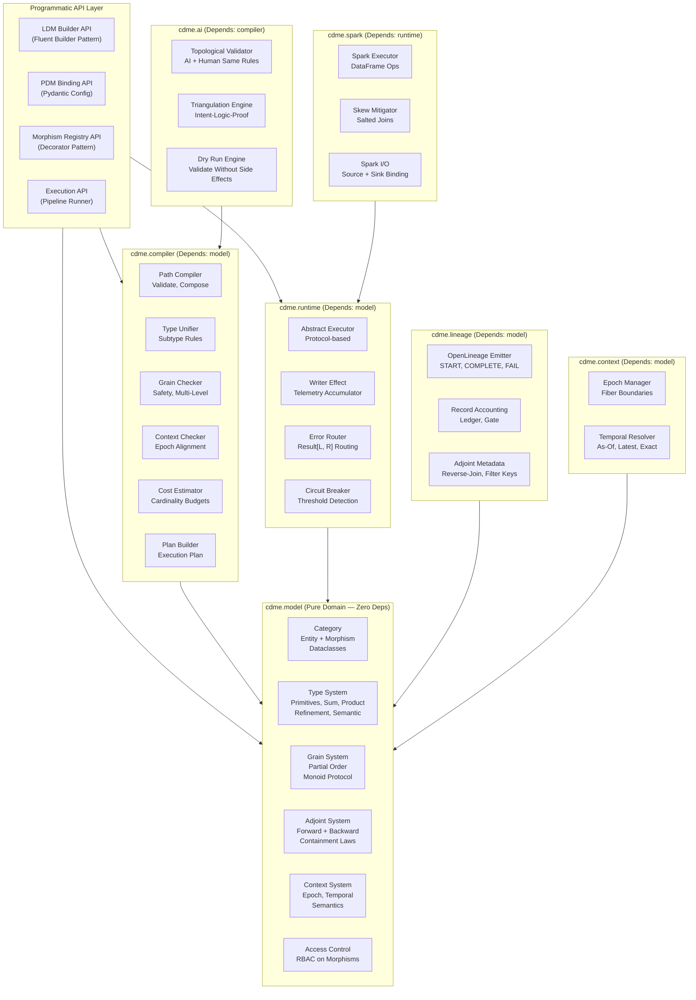
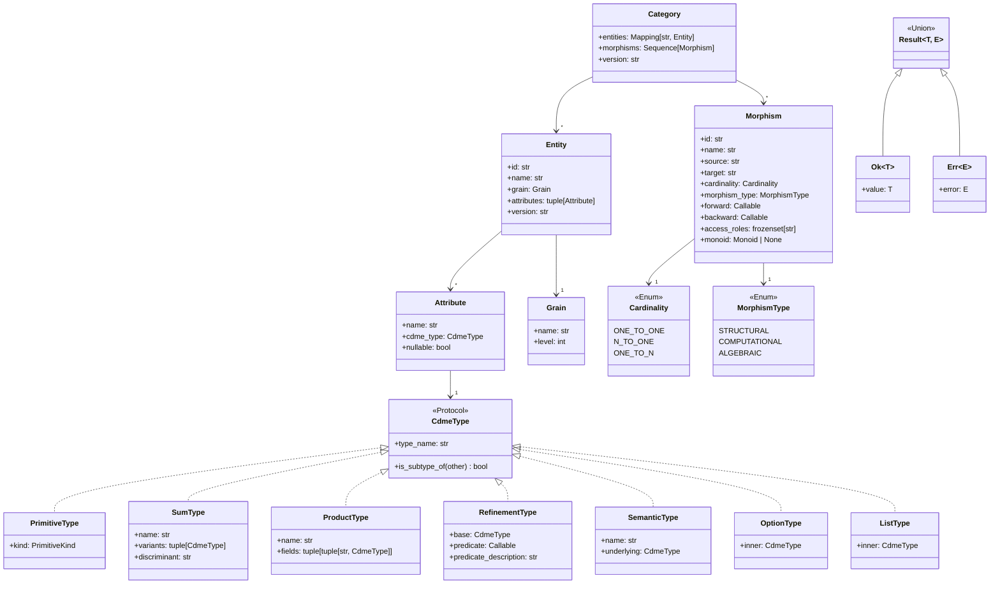

# CDME -- Technical Design Document (Python + PySpark)

**Version**: 1.0.0
**Date**: 2026-02-21
**Status**: Draft -- Generated by v2.3 iterate(requirements->design)
**Source Asset**: docs/specification/REQUIREMENTS.md v1.0.0 (69 REQ keys)
**Technology Binding**: Python 3.12 + PySpark 3.5.0
**Methodology**: AI SDLC Asset Graph Model v2.3

---

## Table of Contents

1. [Architecture Overview](#1-architecture-overview)
2. [Component Design](#2-component-design)
3. [Data Model](#3-data-model)
4. [Integration Points](#4-integration-points)
5. [Error Handling Strategy](#5-error-handling-strategy)
6. [Configuration Model](#6-configuration-model)
7. [Package/Module Structure](#7-packagemodule-structure)
8. [Traceability Matrix](#8-traceability-matrix)
9. [ADR Index](#9-adr-index)
10. [Design Differences from Scala Version](#10-design-differences-from-scala-version)
11. [Source Analysis](#11-source-analysis)

---

## 1. Architecture Overview

### 1.1 Design Philosophy

The CDME is a Python 3.12 library/engine -- not a hosted service -- that provides definition-time and runtime validation of data transformation pipelines grounded in Category Theory. The architecture enforces a strict layered separation via Python namespace packages:

1. **Model Layer** (`cdme.model`) -- Zero external dependencies. Pure Python dataclasses and Protocol classes defining the domain: categories, morphisms, types, grains, contexts, adjoints.
2. **Compiler Layer** (`cdme.compiler`) -- Depends on `cdme.model` only. Path validation, type unification, grain checking, cost estimation, execution plan production.
3. **Runtime Layer** (`cdme.runtime`) -- Depends on `cdme.model`. Abstract execution engine with morphism executor, error routing, telemetry accumulation. Framework-agnostic.
4. **Spark Layer** (`cdme.spark`) -- Depends on `cdme.runtime`. PySpark DataFrame binding, distributed execution, Spark-specific optimisations.
5. **Lineage Layer** (`cdme.lineage`) -- Depends on `cdme.model`. OpenLineage emission, accounting ledger, adjoint metadata persistence.
6. **AI Assurance Layer** (`cdme.ai`) -- Depends on `cdme.compiler`. Topological validation for AI-generated mappings, triangulation, dry run.
7. **Context Layer** (`cdme.context`) -- Depends on `cdme.model`. Epoch management, temporal semantics, fiber compatibility checking.
8. **Test Kit** (`cdme.testkit`) -- Depends on `cdme.model`. Test utilities, fixtures, property-based test generators.

Because Python lacks compile-time type enforcement, the design compensates via:
- **Pydantic models** for runtime validation of all configuration and data structures (ADR-003)
- **Protocol classes** for structural subtyping (ADR-002)
- **mypy strict mode** for static analysis during development
- **Runtime assertion decorators** for invariant enforcement at entry points

### 1.2 High-Level Architecture



### 1.3 Key Architectural Principles

| Principle | Mechanism | REQ Basis |
|-----------|-----------|-----------|
| Schema is topology | LDM as Category (objects + morphisms + laws) | REQ-F-LDM-001 |
| LDM/PDM separation | Functor from LDM category to Physical category | REQ-F-PDM-001 |
| Definition-time validation | Compiler validates before execution | REQ-F-LDM-003, REQ-F-TRV-002 |
| No implicit casting | All type conversions are explicit named morphisms | REQ-F-TYP-003 |
| Failures as data | Result dataclass (`Ok[T]` / `Err[E]`), error routing | REQ-F-ERR-001 |
| Every morphism is adjoint | Forward + backward with containment | REQ-F-ADJ-001 |
| Record accounting | Invariant: input = processed + filtered + errored | REQ-F-ACC-001 |
| Protocol-based contracts | Structural typing via Protocol classes, not inheritance | ADR-002 |
| Runtime type safety | Pydantic validation at all boundaries | ADR-003 |

### 1.4 Python-Specific Compensation Mechanisms

Python's dynamic typing means certain guarantees that Scala provides at compile time must be enforced differently:

| Scala Guarantee | Python Compensation | Enforcement Point |
|----------------|--------------------|--------------------|
| Sealed trait exhaustiveness | `@exhaustive_match` decorator + mypy plugin | Static analysis + runtime |
| Typeclass evidence (Monoid) | `Monoid` Protocol + runtime `validate_monoid()` | Registration time |
| Phantom type grain tracking | `Grain` dataclass + compiler validation pass | Definition time |
| Compile-time path validation | Eager validation in builder `.build()` methods | Build time (eager) |
| Parametric polymorphism | `Generic[T]` + `TypeVar` + Pydantic validators | Static + runtime |

---

## 2. Component Design

### 2.1 Component: Category Model (`cdme.model.category`)

**Implements**: REQ-F-LDM-001, REQ-F-LDM-002, REQ-F-LDM-007

**Responsibilities**:
- Represent the Logical Data Model as a typed, directed multigraph (category)
- Enforce identity morphisms for every entity
- Enforce associativity of morphism composition
- Store grain metadata on every entity
- Store typed attributes on every entity
- Support versioned schema definitions with immutable version identifiers
- Serialize and deserialize to/from YAML/JSON

**Interfaces**:
```python
@dataclass(frozen=True)
class Entity:
    id: str
    name: str
    grain: Grain
    attributes: tuple[Attribute, ...]
    version: str  # content-addressed SHA-256

@dataclass(frozen=True)
class Morphism:
    id: str
    name: str
    source: str  # entity id
    target: str  # entity id
    cardinality: Cardinality  # ONE_TO_ONE | N_TO_ONE | ONE_TO_N
    morphism_type: MorphismType  # STRUCTURAL | COMPUTATIONAL | ALGEBRAIC
    forward: Callable  # registered at runtime
    backward: Callable  # adjoint backward
    access_roles: frozenset[str]  # RBAC
    monoid: Monoid | None  # required for ALGEBRAIC type

class Category(Protocol):
    def entities(self) -> Mapping[str, Entity]: ...
    def morphisms(self) -> Sequence[Morphism]: ...
    def identity(self, entity_id: str) -> Morphism: ...
    def compose(self, f: Morphism, g: Morphism) -> Morphism: ...
```

**Dependencies**:
- Type System (`cdme.model.types`)
- Grain System (`cdme.model.grain`)

**Design Notes**:
- All model classes are frozen dataclasses for immutability
- `Entity` and `Morphism` are `Hashable` via frozen dataclass
- Multiple morphisms between the same entity pair are supported (multigraph) -- stored as a sequence, not a dict keyed by source-target
- Schema versioning uses SHA-256 of canonical JSON serialization
- Identity morphisms are auto-generated during `CategoryBuilder.build()`

---

### 2.2 Component: Type System (`cdme.model.types`)

**Implements**: REQ-F-TYP-001, REQ-F-TYP-002, REQ-F-TYP-003, REQ-F-TYP-004, REQ-F-TYP-005

**Responsibilities**:
- Define the extended type system: primitives, sum types, product types, refinement types, semantic types
- Enforce type unification rules during morphism composition
- Reject implicit casting (all conversions must be explicit named morphisms)
- Support nested composition of type constructors
- Define subtype relationships (declared, not inferred)

**Interfaces**:
```python
class CdmeType(Protocol):
    """Base protocol for all CDME types."""
    @property
    def type_name(self) -> str: ...
    def is_subtype_of(self, other: "CdmeType") -> bool: ...

@dataclass(frozen=True)
class PrimitiveType:
    """Primitive: Integer, String, Boolean, Float, Date, Timestamp."""
    kind: PrimitiveKind  # Enum

@dataclass(frozen=True)
class SumType:
    """Tagged union: PaymentMethod = Card | BankTransfer | Cash."""
    name: str
    variants: tuple[CdmeType, ...]
    discriminant: str

@dataclass(frozen=True)
class ProductType:
    """Record/tuple: Address = (Street, City, PostCode)."""
    name: str
    fields: tuple[tuple[str, CdmeType], ...]

@dataclass(frozen=True)
class RefinementType:
    """Base type + predicate: PositiveInteger = Integer where x > 0."""
    base: CdmeType
    predicate: Callable[[Any], bool]
    predicate_description: str  # human-readable, stored in lineage

@dataclass(frozen=True)
class SemanticType:
    """Domain-meaningful wrapper: Money(Float), Percent(Float)."""
    name: str
    underlying: CdmeType

class TypeUnifier:
    """Checks type compatibility for morphism composition."""
    def unify(self, codomain: CdmeType, domain: CdmeType) -> Result[UnifiedType, TypeError]: ...
```

**Dependencies**:
- None (pure domain types)

**Design Notes**:
- Python 3.12 `match` statements are used for type dispatch; however, exhaustiveness is not enforced by the language, so a `@exhaustive_match` decorator plus mypy plugin provides coverage warnings
- Refinement type predicates are `Callable[[Any], bool]` -- evaluated at data processing time with a human-readable `predicate_description` stored alongside for lineage
- Semantic types are newtypes implemented as frozen dataclasses wrapping the underlying type; operations between incompatible semantic types (e.g., `Money + Date`) are rejected by the `TypeUnifier`
- Unlike Scala's sealed trait pattern matching, Python's type union (`int | str`) does not enforce exhaustive case handling; the design mitigates this with runtime checks

---

### 2.3 Component: Grain System (`cdme.model.grain`)

**Implements**: REQ-F-LDM-004, REQ-F-LDM-005, REQ-F-LDM-007, REQ-F-TRV-002, REQ-F-SYN-002, REQ-F-SYN-005, REQ-BR-GRN-001

**Responsibilities**:
- Define grain levels as a partially ordered set (poset)
- Enforce grain safety: reject operations mixing incompatible grains without aggregation
- Validate monoidal aggregation (associativity, identity element)
- Support multi-level aggregation chains (finer to coarser)
- Reject coarser-to-finer aggregation

**Interfaces**:
```python
@dataclass(frozen=True)
class Grain:
    name: str
    level: int  # lower = finer (0 = Atomic)

class GrainOrder:
    """Partial order over grains."""
    def is_finer_than(self, a: Grain, b: Grain) -> bool: ...
    def is_compatible(self, a: Grain, b: Grain) -> bool: ...
    def hierarchy(self) -> Sequence[Grain]: ...  # ordered finer to coarser

class Monoid(Protocol[T]):
    """Monoid typeclass — associative binary op + identity."""
    def combine(self, a: T, b: T) -> T: ...
    @property
    def empty(self) -> T: ...

def validate_monoid(m: Monoid[T], samples: Sequence[T]) -> Result[None, str]:
    """Property-based check: associativity and identity laws."""
    ...
```

**Dependencies**:
- None (pure domain types)

**Design Notes**:
- Grain levels form a total order in the standard configuration (Atomic < DailyAgg < MonthlyAgg < YearlyAgg) but the design supports partial orders for domain-specific grain hierarchies
- Monoid enforcement uses a `Protocol` class; at registration time, `validate_monoid()` runs property-based tests (via Hypothesis) to verify associativity and identity. This compensates for the absence of Scala's typeclass evidence parameters
- Empty aggregation identity is a required field on every `Monoid` instance (REQ-F-LDM-005); `validate_monoid()` verifies `combine(empty, x) == x` and `combine(x, empty) == x`

---

### 2.4 Component: Adjoint System (`cdme.model.adjoint`)

**Implements**: REQ-F-ADJ-001, REQ-F-ADJ-002, REQ-F-ADJ-003, REQ-F-ADJ-004, REQ-F-ADJ-005, REQ-F-ADJ-006, REQ-F-ADJ-007

**Responsibilities**:
- Enforce that every morphism provides both forward and backward functions
- Validate containment laws: `backward(forward(x)) >= x` and `forward(backward(y)) <= y`
- Support self-adjoint isomorphisms where backward is exact inverse
- Implement contravariant composition of adjoints
- Support backward execution path derivation from forward paths
- Enable data reconciliation and impact analysis via backward traversal

**Interfaces**:
```python
class AdjointMorphism(Protocol):
    """Every morphism must satisfy this interface."""
    def forward(self, data: Any) -> Any: ...
    def backward(self, data: Any) -> Any: ...

    @property
    def is_self_adjoint(self) -> bool: ...
    """True for 1:1 isomorphisms where backward is exact inverse."""

    @property
    def lossiness(self) -> Lossiness: ...
    """LOSSLESS or LOSSY classification."""

def compose_adjoint(f: AdjointMorphism, g: AdjointMorphism) -> AdjointMorphism:
    """Compose adjoints: (g . f).backward = f.backward . g.backward"""
    ...

class BackwardTraverser:
    """Compute backward path from forward path."""
    def backward_path(self, forward_path: Sequence[Morphism]) -> Sequence[Morphism]: ...
    def impact_analysis(self, target_subset: DataFrame, path: Sequence[Morphism]) -> DataFrame: ...
    def reconcile(self, original: DataFrame, forward_result: DataFrame, path: Sequence[Morphism]) -> ReconciliationReport: ...
```

**Dependencies**:
- Category Model (for Morphism type)

**Design Notes**:
- Containment laws cannot be proven at registration time in general; the design provides `test_containment_laws()` for property-based testing at test time, plus runtime assertions that can be enabled per-job
- Contravariant composition is implemented as a function, not a method, to keep morphism dataclasses simple
- Impact analysis uses adjoint metadata (reverse-join tables, filter key sets) rather than recomputation -- metadata is persisted by `cdme.lineage`

---

### 2.5 Component: Access Control (`cdme.model.access`)

**Implements**: REQ-F-LDM-006

**Responsibilities**:
- Support Role-Based Access Control (RBAC) on individual morphisms
- Filter graph topology based on principal's roles (denied morphism = nonexistent)
- Enforce access at validation time (compile time), not only at runtime

**Interfaces**:
```python
@dataclass(frozen=True)
class Principal:
    id: str
    roles: frozenset[str]

class AccessFilter:
    """Produces a view of the category filtered by principal's roles."""
    def filter_category(self, category: Category, principal: Principal) -> Category: ...
```

**Dependencies**:
- Category Model

**Design Notes**:
- Access control is enforced by filtering the category before passing it to the compiler. This means the compiler never sees morphisms the principal cannot traverse -- the same behaviour as if those morphisms do not exist (REQ-F-LDM-006).
- Role definitions are stored as `frozenset[str]` on each morphism; an empty set means unrestricted access.

---

### 2.6 Component: Path Compiler (`cdme.compiler.path`)

**Implements**: REQ-F-LDM-003, REQ-F-TRV-002, REQ-F-TRV-003, REQ-F-CTX-001

**Responsibilities**:
- Validate path expressions in symbolic dot notation (e.g., `Entity.Relationship.Attribute`)
- Check that each referenced morphism exists, codomains match domains, grains are safe, and access is permitted
- Detect cross-boundary traversals and require temporal semantics declarations
- Reject invalid paths at definition time with specific error messages

**Interfaces**:
```python
@dataclass(frozen=True)
class PathExpression:
    segments: tuple[str, ...]
    temporal_semantics: TemporalSemantics | None  # AS_OF | LATEST | EXACT

class PathCompiler:
    def compile(self, path: PathExpression, category: Category, principal: Principal) -> Result[CompiledPath, PathError]: ...

@dataclass(frozen=True)
class PathError:
    kind: PathErrorKind  # MISSING_MORPHISM | TYPE_MISMATCH | GRAIN_VIOLATION | ACCESS_DENIED | MISSING_TEMPORAL_SEMANTICS
    message: str
    location: str  # segment where error occurred
```

**Dependencies**:
- Category Model
- Type Unifier (`cdme.compiler.type_unifier`)
- Grain Checker (`cdme.compiler.grain_checker`)
- Access Control (`cdme.model.access`)
- Context Checker (`cdme.compiler.context_checker`)

---

### 2.7 Component: Type Unifier (`cdme.compiler.type_unifier`)

**Implements**: REQ-F-TYP-004

**Responsibilities**:
- Check type compatibility when composing morphisms `f: A -> B` and `g: B -> C`
- Accept exact type match at composition boundaries
- Accept subtype match per declared type hierarchy
- Reject mismatches without explicit casting morphism

**Interfaces**:
```python
class TypeUnifier:
    def unify(self, codomain: CdmeType, domain: CdmeType) -> Result[CdmeType, TypeError]: ...
    def register_subtype(self, sub: CdmeType, sup: CdmeType) -> None: ...
```

**Dependencies**:
- Type System (`cdme.model.types`)

---

### 2.8 Component: Grain Checker (`cdme.compiler.grain_checker`)

**Implements**: REQ-F-TRV-002, REQ-F-SYN-005, REQ-BR-GRN-001

**Responsibilities**:
- Reject operations combining incompatible grains without aggregation
- Validate that aggregation wrappers satisfy monoid laws
- Validate multi-level aggregation chains against declared grain hierarchy

**Interfaces**:
```python
class GrainChecker:
    def check_composition(self, source_grain: Grain, target_grain: Grain, has_aggregation: bool) -> Result[None, GrainError]: ...
    def check_multi_level(self, chain: Sequence[tuple[Grain, Grain]]) -> Result[None, GrainError]: ...
```

**Dependencies**:
- Grain System (`cdme.model.grain`)

---

### 2.9 Component: Context Checker (`cdme.compiler.context_checker`)

**Implements**: REQ-F-TRV-003, REQ-F-CTX-001

**Responsibilities**:
- Detect cross-boundary traversals (e.g., live data joined to prior-day reference)
- Require temporal semantics declarations for cross-boundary joins
- Validate fiber compatibility for joins (same epoch or explicit temporal semantics)

**Interfaces**:
```python
class ContextChecker:
    def check_join(self, left_fiber: Fiber, right_fiber: Fiber, declared_semantics: TemporalSemantics | None) -> Result[None, ContextError]: ...
```

**Dependencies**:
- Context System (`cdme.context`)

---

### 2.10 Component: Cost Estimator (`cdme.compiler.cost_estimator`)

**Implements**: REQ-F-TRV-006

**Responsibilities**:
- Estimate output cardinality before execution
- Reject execution plans exceeding declared budget (max output rows, max join depth, max intermediate size)
- Provide cost estimation as part of dry run

**Interfaces**:
```python
@dataclass(frozen=True)
class CardinalityBudget:
    max_output_rows: int | None
    max_join_depth: int | None
    max_intermediate_size: int | None

class CostEstimator:
    def estimate(self, plan: ExecutionPlan, budget: CardinalityBudget) -> Result[CostEstimate, BudgetExceeded]: ...
```

**Dependencies**:
- Category Model (for cardinality metadata)

---

### 2.11 Component: Plan Builder (`cdme.compiler.plan_builder`)

**Implements**: REQ-F-LDM-003, REQ-DATA-LIN-002, REQ-DATA-LIN-003, REQ-DATA-LIN-004

**Responsibilities**:
- Produce a validated, immutable execution plan from compiled paths
- Classify each morphism in the plan as lossless or lossy
- Insert checkpoints at graph inputs, outputs, and after every lossy morphism
- Verify reconstructability for key-derivable lineage mode

**Interfaces**:
```python
@dataclass(frozen=True)
class ExecutionPlan:
    steps: tuple[ExecutionStep, ...]
    checkpoints: tuple[Checkpoint, ...]
    lineage_mode: LineageMode  # FULL | KEY_DERIVABLE | SUMMARY

class PlanBuilder:
    def build(self, paths: Sequence[CompiledPath], lineage_mode: LineageMode) -> Result[ExecutionPlan, PlanError]: ...
```

**Dependencies**:
- Path Compiler
- Cost Estimator

---

### 2.12 Component: Abstract Executor (`cdme.runtime.executor`)

**Implements**: REQ-F-TRV-001, REQ-F-TRV-004, REQ-F-TRV-005, REQ-F-ERR-001, REQ-F-ERR-002, REQ-F-ERR-003

**Responsibilities**:
- Execute morphisms from a validated plan, producing `Result[T, CdmeError]` per record
- Implement Kleisli context lifting for 1:N traversals
- Accumulate telemetry via writer effect (input count, output count, error count, latency)
- Route errors to the Error Domain
- Support batch failure threshold (halt when exceeded)
- Guarantee deterministic reproducibility (same inputs + config = same output)

**Interfaces**:
```python
class MorphismExecutor(Protocol):
    """Framework-agnostic executor interface."""
    def execute_step(self, step: ExecutionStep, data: Any) -> ExecutionResult: ...
    def execute_plan(self, plan: ExecutionPlan, sources: Mapping[str, Any]) -> PipelineResult: ...

@dataclass
class ExecutionResult:
    success: Any  # Right values
    errors: Sequence[CdmeError]  # Left values
    telemetry: TelemetryRecord

@dataclass
class PipelineResult:
    outputs: Mapping[str, Any]
    errors: Sequence[CdmeError]
    telemetry: Sequence[TelemetryRecord]
    ledger: AccountingLedger
```

**Dependencies**:
- Execution Plan (`cdme.compiler.plan_builder`)
- Error Router (`cdme.runtime.error_router`)
- Telemetry Writer (`cdme.runtime.telemetry`)

**Design Notes**:
- The executor is defined as a `Protocol`, not an ABC. The Spark implementation (`cdme.spark.SparkExecutor`) satisfies this protocol without inheriting from it (structural subtyping, ADR-002).
- Deterministic reproducibility is guaranteed because all morphisms are pure functions and all lookups are versioned. The executor itself introduces no non-determinism (no random, no current-time).

---

### 2.13 Component: Error Router (`cdme.runtime.error_router`)

**Implements**: REQ-F-ERR-001, REQ-F-ERR-002, REQ-F-ERR-003, REQ-F-ERR-004

**Responsibilities**:
- Route `Err` results to the Error Domain sink
- Continue processing remaining records after an error (unless threshold exceeded)
- Ensure zero silent drops: every input record appears in either success or error output
- Produce structured error objects with failure_type, offending_values, source_entity, source_epoch, morphism_path
- Guarantee idempotent error handling

**Interfaces**:
```python
@dataclass(frozen=True)
class CdmeError:
    failure_type: FailureType  # TYPE_MISMATCH | REFINEMENT_VIOLATION | GRAIN_VIOLATION | ...
    offending_values: dict[str, Any]
    source_entity: str
    source_epoch: str
    morphism_path: str
    source_key: str

class ErrorRouter:
    def route(self, result: Result[T, CdmeError]) -> None: ...
    def check_threshold(self) -> bool: ...
    def drain(self) -> Sequence[CdmeError]: ...
```

**Dependencies**:
- None (pure routing logic)

---

### 2.14 Component: Circuit Breaker (`cdme.runtime.circuit_breaker`)

**Implements**: REQ-DATA-QAL-001

**Responsibilities**:
- Monitor failure rate during early processing
- Halt execution if failure rate exceeds configured threshold within the sample window
- Distinguish structural errors (configuration/schema) from data quality errors

**Interfaces**:
```python
@dataclass
class CircuitBreakerConfig:
    threshold_percent: float  # e.g., 5.0
    sample_window: int  # e.g., 10000
    enabled: bool

class CircuitBreaker:
    def record(self, is_error: bool) -> None: ...
    def is_tripped(self) -> bool: ...
    def trip_reason(self) -> str | None: ...
```

**Dependencies**:
- None

---

### 2.15 Component: Spark Executor (`cdme.spark.executor`)

**Implements**: REQ-NFR-DIST-001, REQ-NFR-PERF-001, REQ-NFR-PERF-002, REQ-F-TRV-001

**Responsibilities**:
- Implement `MorphismExecutor` protocol using PySpark DataFrame API
- Execute Kleisli lifts as `explode()` operations
- Execute monoidal aggregations as distributed `groupBy().agg()` with monoid-safe combiners
- Detect and mitigate data skew via salted joins for whale keys
- Sustain 1M records/hour throughput target on standard pipeline configurations

**Interfaces**:
```python
class SparkExecutor:
    """Implements MorphismExecutor protocol for PySpark."""
    def __init__(self, spark: SparkSession, config: SparkConfig): ...
    def execute_step(self, step: ExecutionStep, data: DataFrame) -> ExecutionResult: ...
    def execute_plan(self, plan: ExecutionPlan, sources: Mapping[str, DataFrame]) -> PipelineResult: ...
```

**Dependencies**:
- PySpark 3.5.0
- Abstract Executor Protocol (`cdme.runtime.executor`)
- Skew Mitigator (`cdme.spark.skew`)

**Design Notes**:
- PySpark has Python-to-JVM serialization overhead that Scala avoids. For pure column operations, the design uses PySpark's native Column expressions (which are JVM-native) rather than Python UDFs. UDFs are used only for complex custom morphisms where Column expressions are insufficient.
- Salted joins for skew mitigation add a random salt column to the larger side and replicate the smaller side, preserving join semantics while distributing load across partitions.

---

### 2.16 Component: Spark I/O (`cdme.spark.io`)

**Implements**: REQ-F-PDM-001, REQ-F-PDM-002, REQ-F-PDM-003, REQ-F-PDM-004, REQ-F-PDM-005, REQ-F-PDM-006

**Responsibilities**:
- Bind LDM entities to physical storage via functorial mapping (PDM)
- Support generation grain declaration (Event / Snapshot) with validation
- Implement epoch boundary slicing consistent with generation grain semantics
- Support lookup bindings (data-backed and logic-backed)
- Support temporal bindings (epoch-parameterized physical locations)

**Interfaces**:
```python
class PDMBinding(Protocol):
    """Functorial mapping from LDM entity to physical storage."""
    @property
    def entity_id(self) -> str: ...
    @property
    def generation_grain(self) -> GenerationGrain: ...  # EVENT | SNAPSHOT
    def resolve(self, epoch: Epoch) -> PhysicalLocation: ...
    def read(self, spark: SparkSession, epoch: Epoch) -> DataFrame: ...
    def write(self, spark: SparkSession, df: DataFrame, epoch: Epoch) -> None: ...

class LookupBinding(Protocol):
    """Reference data binding."""
    @property
    def backing_type(self) -> LookupBackingType: ...  # DATA | LOGIC
    def resolve(self, key: Any, version: LookupVersion) -> Any: ...
```

**Dependencies**:
- PySpark 3.5.0
- Category Model (for entity references)
- Context System (for epoch resolution)

---

### 2.17 Component: OpenLineage Emitter (`cdme.lineage.openlineage`)

**Implements**: REQ-F-SYN-003, REQ-NFR-OBS-001, REQ-NFR-OBS-002

**Responsibilities**:
- Emit OpenLineage-compatible START, COMPLETE, and FAIL events
- Include lineage facets referencing source entities, morphism paths, and target attributes
- Tag events and metrics with REQ keys for feature-level observability
- Reference the accounting ledger in COMPLETE/FAIL events

**Interfaces**:
```python
class OpenLineageEmitter:
    def emit_start(self, plan: ExecutionPlan, run_id: str) -> None: ...
    def emit_complete(self, result: PipelineResult, run_id: str) -> None: ...
    def emit_fail(self, error: Exception, run_id: str) -> None: ...
```

**Dependencies**:
- OpenLineage Python client
- Execution Plan

---

### 2.18 Component: Record Accounting (`cdme.lineage.accounting`)

**Implements**: REQ-F-ACC-001, REQ-F-ACC-002, REQ-F-ACC-003, REQ-F-ACC-004, REQ-F-ACC-005

**Responsibilities**:
- Enforce the zero-loss accounting invariant: `|input_keys| = |reverse_join_keys| + |filtered_keys| + |error_keys|`
- Produce `ledger.json` per run with input count, partition breakdown, verification status
- Capture adjoint keys: aggregation contributing keys, filter excluded keys, error source keys, explode parent-child mappings
- Gate run completion on accounting verification
- Support backward traversal proof via persisted adjoint metadata

**Interfaces**:
```python
@dataclass
class AccountingLedger:
    run_id: str
    input_count: int
    source_key_field: str
    partitions: dict[str, PartitionBreakdown]  # processed, filtered, errored
    verification_status: VerificationStatus  # PASS | FAIL
    discrepancies: list[str] | None

    def to_json(self) -> str: ...
    def verify(self) -> bool: ...

class AdjointKeyCapture:
    """Captures and persists adjoint metadata during execution."""
    def record_aggregation(self, aggregate_key: str, contributing_keys: Sequence[str]) -> None: ...
    def record_filter(self, excluded_key: str, filter_condition: str) -> None: ...
    def record_error(self, source_key: str, error: CdmeError) -> None: ...
    def record_explode(self, parent_key: str, child_keys: Sequence[str]) -> None: ...
```

**Dependencies**:
- Category Model (for key types)

---

### 2.19 Component: AI Assurance (`cdme.ai`)

**Implements**: REQ-F-AIA-001, REQ-F-AIA-002, REQ-F-AIA-003, REQ-BR-REG-004

**Responsibilities**:
- Validate AI-generated mappings using the exact same topological compiler as human-authored mappings (no bypass, no relaxation)
- Support triangulation of assurance: link intent, logic, and proof
- Provide dry-run mode: full validation and cost estimation without writing to output sinks
- Produce human-reviewable validation reports for EU AI Act compliance

**Interfaces**:
```python
class AIAssurance:
    def validate_mapping(self, mapping: MappingDefinition, category: Category) -> ValidationReport: ...
    def triangulate(self, intent: str, logic: ExecutionPlan, proof: PipelineResult) -> TriangulationReport: ...
    def dry_run(self, plan: ExecutionPlan, sources: Mapping[str, DataFrame]) -> DryRunReport: ...

@dataclass
class ValidationReport:
    is_valid: bool
    path_errors: Sequence[PathError]
    type_errors: Sequence[TypeError]
    grain_errors: Sequence[GrainError]
    access_errors: Sequence[AccessError]
```

**Dependencies**:
- Path Compiler (`cdme.compiler.path`)
- Cost Estimator (`cdme.compiler.cost_estimator`)

---

### 2.20 Component: Context Manager (`cdme.context`)

**Implements**: REQ-F-CTX-001, REQ-F-PDM-004, REQ-F-TRV-003

**Responsibilities**:
- Manage epoch boundaries and contextual fibers
- Resolve temporal semantics (As-Of, Latest, Exact) for cross-boundary joins
- Ensure fiber compatibility for all join operations

**Interfaces**:
```python
@dataclass(frozen=True)
class Epoch:
    id: str
    start: datetime
    end: datetime
    generation_grain: GenerationGrain

@dataclass(frozen=True)
class Fiber:
    epoch: Epoch
    partition_scope: str

class EpochManager:
    def current_epoch(self) -> Epoch: ...
    def resolve_temporal(self, semantics: TemporalSemantics, reference_epoch: Epoch) -> Epoch: ...
```

**Dependencies**:
- Model types (`cdme.model`)

---

### 2.21 Component: Synthesis Engine (`cdme.compiler.synthesis`)

**Implements**: REQ-F-SYN-001, REQ-F-SYN-004, REQ-F-SYN-006, REQ-F-SYN-007, REQ-F-SYN-008

**Responsibilities**:
- Support defining new attributes via pure functions over existing entities
- Support conditional expressions with type-safe branching
- Support prioritised fallback logic and product type construction
- Enforce versioned lookup semantics (reject unversioned lookups at compile time)
- Support deterministic key generation with declared, versioned algorithms
- Support registration of external computational morphisms with declared type signatures

**Interfaces**:
```python
class SynthesisBuilder:
    def derive(self, name: str, expr: Expression) -> "SynthesisBuilder": ...
    def conditional(self, condition: Expression, then: Expression, else_: Expression) -> Expression: ...
    def fallback(self, *exprs: Expression) -> Expression: ...
    def product(self, **fields: Expression) -> Expression: ...

class ExternalMorphismRegistry:
    def register(self, morphism_id: str, domain: CdmeType, codomain: CdmeType,
                 function: Callable, version: str, determinism_asserted: bool) -> None: ...
```

**Dependencies**:
- Type System (for type checking expressions)
- Category Model (for path resolution)

---

### 2.22 Component: Versioning (`cdme.lineage.versioning`)

**Implements**: REQ-NFR-VER-001, REQ-F-SYN-006

**Responsibilities**:
- Version all configuration artifacts (LDM, PDM, mapping logic, job configuration)
- Record artifact versions used in each pipeline execution
- Enforce immutability within a version
- Resolve lookup versions (explicit ID, as-of epoch, deterministic alias)

**Interfaces**:
```python
@dataclass(frozen=True)
class ArtifactVersion:
    artifact_id: str
    version: str  # SHA-256 of canonical content
    created_at: datetime

class VersionRegistry:
    def register(self, artifact: Any) -> ArtifactVersion: ...
    def resolve_lookup_version(self, lookup_id: str, semantics: LookupVersionSemantics) -> str: ...
    def execution_manifest(self) -> dict[str, str]: ...  # artifact_id -> version
```

**Dependencies**:
- None

---

### 2.23 Component: Regulatory Package (`cdme.lineage.regulatory`)

**Implements**: REQ-BR-REG-001, REQ-BR-REG-002, REQ-BR-REG-003, REQ-BR-REG-004

**Responsibilities**:
- Produce audit packages demonstrating BCBS 239 compliance (accuracy, completeness, adaptability)
- Support FRTB granular risk factor attribution via lineage
- Support GDPR/CCPA Right to be Forgotten via deterministic identity + PDM-level removal
- Produce EU AI Act compliance reports for AI-generated mappings

**Interfaces**:
```python
class RegulatoryPackage:
    def bcbs239_report(self, result: PipelineResult) -> AuditReport: ...
    def frtb_attribution(self, target_key: str, result: PipelineResult) -> AttributionReport: ...
    def gdpr_identify(self, subject_key: str) -> set[str]: ...  # all records for subject
    def eu_ai_act_report(self, validation: ValidationReport) -> ComplianceReport: ...
```

**Dependencies**:
- Record Accounting (`cdme.lineage.accounting`)
- AI Assurance (`cdme.ai`)

---

### 2.24 Component: Approximate Aggregation (`cdme.runtime.approximate`)

**Implements**: REQ-DATA-QAL-002

**Responsibilities**:
- Support approximate aggregation via mergeable sketch data structures (t-Digest, HyperLogLog)
- Distinguish ExactAgg from ApproxAgg in the LDM
- Provide error bounds for approximate results
- Allow governance to control where approximations are permissible

**Interfaces**:
```python
class ApproximateAggregation(Protocol):
    """Sketch-based approximate aggregation."""
    def add(self, value: Any) -> None: ...
    def merge(self, other: "ApproximateAggregation") -> "ApproximateAggregation": ...
    def result(self) -> tuple[Any, ErrorBound]: ...
```

**Dependencies**:
- Grain System (for aggregation classification)

---

### 2.25 Component: Test Kit (`cdme.testkit`)

**Implements**: (supports validation of all REQ keys)

**Responsibilities**:
- Provide test fixtures for entities, morphisms, categories, and execution plans
- Provide Hypothesis strategies for property-based testing of monoid laws, containment laws, and type unification
- Provide assertion helpers for accounting invariant, lineage completeness, and grain safety

**Interfaces**:
```python
# Hypothesis strategies
def entity_strategy() -> st.SearchStrategy[Entity]: ...
def morphism_strategy() -> st.SearchStrategy[Morphism]: ...
def category_strategy() -> st.SearchStrategy[Category]: ...

# Assertion helpers
def assert_accounting_invariant(ledger: AccountingLedger) -> None: ...
def assert_containment_laws(morphism: AdjointMorphism, data: Any) -> None: ...
def assert_monoid_laws(monoid: Monoid, samples: Sequence) -> None: ...
```

**Dependencies**:
- `cdme.model`
- pytest, Hypothesis

---

## 3. Data Model

### 3.1 Core Type Hierarchy



### 3.2 Result Type (Either Monad)

Python does not have a native `Either` type. The design uses a `Result` dataclass:

```python
from __future__ import annotations
from dataclasses import dataclass
from typing import TypeVar, Generic, Callable

T = TypeVar("T")
E = TypeVar("E")

@dataclass(frozen=True)
class Ok(Generic[T]):
    value: T

@dataclass(frozen=True)
class Err(Generic[E]):
    error: E

Result = Ok[T] | Err[E]

def map_result(r: Result[T, E], f: Callable[[T], T2]) -> Result[T2, E]:
    match r:
        case Ok(v): return Ok(f(v))
        case Err(e): return Err(e)

def flat_map_result(r: Result[T, E], f: Callable[[T], Result[T2, E]]) -> Result[T2, E]:
    match r:
        case Ok(v): return f(v)
        case Err(e): return Err(e)
```

### 3.3 Execution Artifacts

```python
@dataclass(frozen=True)
class ExecutionStep:
    morphism: Morphism
    input_entity: str
    output_entity: str
    lossiness: Lossiness  # LOSSLESS | LOSSY
    checkpoint_after: bool

@dataclass(frozen=True)
class ExecutionPlan:
    steps: tuple[ExecutionStep, ...]
    checkpoints: tuple[Checkpoint, ...]
    lineage_mode: LineageMode
    budget: CardinalityBudget
    artifact_versions: dict[str, str]

@dataclass(frozen=True)
class Checkpoint:
    step_index: int
    segment_id: str
    key_generation_function_id: str
    metadata: dict[str, Any]
```

### 3.4 Telemetry and Accounting Artifacts

```python
@dataclass(frozen=True)
class TelemetryRecord:
    morphism_id: str
    input_count: int
    output_count: int
    error_count: int
    latency_ms: float
    req_keys: tuple[str, ...]  # REQ-* tags for observability

@dataclass
class AccountingLedger:
    run_id: str
    input_count: int
    source_key_field: str
    processed_count: int
    processed_metadata_location: str
    filtered_count: int
    filtered_metadata_location: str
    error_count: int
    error_metadata_location: str
    verification_status: VerificationStatus
    discrepancies: list[str] | None
    timestamp: datetime
```

---

## 4. Integration Points

### 4.1 PySpark Integration

The `cdme.spark` package binds the abstract runtime to PySpark DataFrames:

| Integration Point | Mechanism | Notes |
|-------------------|-----------|-------|
| Source reading | `spark.read.format(...)` via PDM binding | Supports Parquet, Delta, JDBC, CSV |
| Morphism execution | Column expressions for pure transforms; UDFs for complex morphisms | Column expressions avoid Python-JVM serde |
| Kleisli lifting | `F.explode()` or `F.explode_outer()` | Parent key preserved in output |
| Monoidal aggregation | `groupBy().agg()` with registered UDAFs | Monoid combine/empty used as UDAF |
| Error routing | Column-level `when/otherwise` producing `Left`/`Right` struct columns | Separated after processing |
| Skew mitigation | Salted join via synthetic salt column | Configurable salt factor |
| Sink writing | `df.write.format(...)` via PDM binding | Atomic write via Spark staging |

### 4.2 OpenLineage Integration

- **Client**: `openlineage-python` SDK
- **Transport**: HTTP to OpenLineage-compatible collector (e.g., Marquez)
- **Events**: START (plan metadata), COMPLETE (lineage + ledger ref), FAIL (error details)
- **Facets**: InputDatasetFacet, OutputDatasetFacet, custom CdmeLineageFacet

### 4.3 Configuration Loading

- **Format**: YAML files validated by Pydantic models
- **Loading**: `cdme.config` module using `pydantic-settings` with environment variable override
- **Artifacts**: LDM YAML, PDM YAML, Mapping YAML, Job Configuration YAML

---

## 5. Error Handling Strategy

### 5.1 Error Categories

| Category | Source | Handling |
|----------|--------|----------|
| **Schema Error** | LDM/PDM parse failure | Fail fast, no execution |
| **Compilation Error** | Path/type/grain/access validation | Fail fast, report all errors |
| **Data Error** | Refinement violation, type mismatch at runtime | Route to Error Domain, continue processing |
| **Threshold Error** | Batch failure threshold exceeded | Halt execution, commit/rollback per config |
| **Circuit Breaker Error** | Systemic failure rate in sample window | Halt execution, emit structural error |
| **Infrastructure Error** | Spark failure, OOM, network | Fail run, emit FAIL event |

### 5.2 Error Flow

1. **Morphism execution** produces `Result[T, CdmeError]` per record
2. **Error Router** separates `Ok` and `Err` results
3. `Err` results are accumulated in the **Error Domain** sink (a DataFrame partition)
4. **Circuit Breaker** monitors early failure rate; trips if threshold exceeded
5. **Batch Failure Threshold** is checked after each step; halts if exceeded
6. **Accounting Ledger** verifies zero-loss invariant at run completion
7. **Run Completion Gate** blocks `COMPLETE` status unless accounting passes

### 5.3 Error Object Structure

Every error object conforms to `CdmeError`:

```python
@dataclass(frozen=True)
class CdmeError:
    failure_type: FailureType
    offending_values: dict[str, Any]
    source_entity: str
    source_epoch: str
    morphism_path: str
    source_key: str
    timestamp: datetime
    req_keys: tuple[str, ...]  # REQ keys being exercised
```

All fields are queryable, structured (not free-text), and serializable to JSON.

---

## 6. Configuration Model

### 6.1 Configuration Hierarchy

```
job_config.yml                    # Per-job: lineage mode, budget, thresholds
  ├── ldm/
  │   └── trading_domain.yml      # LDM definition (entities, morphisms, types)
  ├── pdm/
  │   └── spark_bindings.yml      # PDM definition (physical bindings)
  ├── mappings/
  │   └── trade_enrichment.yml    # Mapping definitions (synthesis, paths)
  └── lookups/
      └── counterparty_v3.yml     # Lookup version definitions
```

### 6.2 Configuration Validation

All configuration is validated by Pydantic models at load time:

```python
from pydantic import BaseModel, field_validator

class JobConfig(BaseModel):
    run_id: str
    lineage_mode: LineageMode
    budget: CardinalityBudget
    failure_threshold: FailureThreshold | None = None  # None = no threshold
    circuit_breaker: CircuitBreakerConfig | None = None
    ldm_path: Path
    pdm_path: Path
    mapping_paths: list[Path]
    lookup_paths: list[Path]

class LDMConfig(BaseModel):
    version: str
    entities: list[EntityConfig]
    morphisms: list[MorphismConfig]
    grain_hierarchy: list[str]  # ordered finer to coarser

    @field_validator("morphisms")
    @classmethod
    def all_morphisms_have_cardinality(cls, v):
        for m in v:
            if m.cardinality is None:
                raise ValueError(f"Morphism {m.id} must declare cardinality")
        return v
```

### 6.3 Defaults

| Parameter | Default | REQ Reference |
|-----------|---------|---------------|
| `lineage_mode` | `FULL` | REQ-DATA-LIN-001 |
| `failure_threshold` | `None` (no threshold) | REQ-F-ERR-002 |
| `circuit_breaker.enabled` | `True` | REQ-DATA-QAL-001 |
| `circuit_breaker.threshold_percent` | `5.0` | REQ-DATA-QAL-001 |
| `circuit_breaker.sample_window` | `10000` | REQ-DATA-QAL-001 |
| `budget.max_output_rows` | `None` (unlimited) | REQ-F-TRV-006 |

---

## 7. Package/Module Structure

```
cdme/
├── __init__.py                          # Package root, version metadata
├── py.typed                             # PEP 561 marker for mypy
│
├── model/                               # Layer 0: Pure domain (ZERO external deps)
│   ├── __init__.py
│   ├── category.py                      # Entity, Morphism, Category
│   ├── types.py                         # CdmeType hierarchy, PrimitiveKind
│   ├── grain.py                         # Grain, GrainOrder, Monoid Protocol
│   ├── adjoint.py                       # AdjointMorphism, containment laws
│   ├── access.py                        # Principal, AccessFilter
│   ├── result.py                        # Ok, Err, Result, map/flatmap
│   ├── cardinality.py                   # Cardinality enum, CardinalityBudget
│   └── enums.py                         # MorphismType, Lossiness, etc.
│
├── compiler/                            # Layer 1: Validation (depends: model)
│   ├── __init__.py
│   ├── path.py                          # PathCompiler, PathExpression, PathError
│   ├── type_unifier.py                  # TypeUnifier, SubtypeRegistry
│   ├── grain_checker.py                 # GrainChecker, GrainError
│   ├── context_checker.py              # ContextChecker, ContextError
│   ├── cost_estimator.py               # CostEstimator, CostEstimate
│   ├── plan_builder.py                 # PlanBuilder, ExecutionPlan, ExecutionStep
│   └── synthesis.py                     # SynthesisBuilder, ExternalMorphismRegistry
│
├── runtime/                             # Layer 2: Execution (depends: model)
│   ├── __init__.py
│   ├── executor.py                      # MorphismExecutor Protocol, ExecutionResult
│   ├── error_router.py                  # ErrorRouter, CdmeError, FailureType
│   ├── telemetry.py                     # TelemetryWriter, TelemetryRecord
│   ├── circuit_breaker.py              # CircuitBreaker, CircuitBreakerConfig
│   └── approximate.py                   # ApproximateAggregation Protocol, sketches
│
├── spark/                               # Layer 3: PySpark binding (depends: runtime)
│   ├── __init__.py
│   ├── executor.py                      # SparkExecutor
│   ├── io.py                            # PDMBinding, LookupBinding, SparkIO
│   ├── skew.py                          # SkewMitigator, salted join logic
│   └── udfs.py                          # UDF registration for complex morphisms
│
├── lineage/                             # Lineage and accounting (depends: model)
│   ├── __init__.py
│   ├── openlineage.py                   # OpenLineageEmitter
│   ├── accounting.py                    # AccountingLedger, AdjointKeyCapture
│   ├── versioning.py                    # ArtifactVersion, VersionRegistry
│   └── regulatory.py                    # RegulatoryPackage, audit reports
│
├── ai/                                  # AI assurance (depends: compiler)
│   ├── __init__.py
│   ├── validator.py                     # AIAssurance, ValidationReport
│   └── triangulation.py                # Triangulation, TriangulationReport
│
├── context/                             # Context/epoch management (depends: model)
│   ├── __init__.py
│   ├── epoch.py                         # Epoch, EpochManager
│   └── fiber.py                         # Fiber, TemporalResolver
│
├── config/                              # Configuration loading (depends: model)
│   ├── __init__.py
│   ├── models.py                        # Pydantic config models
│   └── loader.py                        # YAML loading + validation
│
└── testkit/                             # Test utilities (depends: model)
    ├── __init__.py
    ├── strategies.py                    # Hypothesis strategies
    ├── fixtures.py                      # pytest fixtures
    └── assertions.py                    # Custom assertion helpers
```

### 7.1 Dependency Rules

The dependency graph is strictly acyclic:

```
model (layer 0) <── compiler (layer 1)
                <── runtime (layer 2)
                <── lineage
                <── context
                <── testkit

compiler        <── ai

runtime         <── spark (layer 3)
```

**Forbidden dependencies**:
- `model` must NOT import from any other `cdme.*` package
- `compiler` must NOT import from `runtime`, `spark`, `lineage`, `ai`, or `context`
- `spark` must NOT import from `compiler` directly (only via `runtime`)
- No circular imports between any packages

### 7.2 Build Configuration (Poetry)

```toml
[tool.poetry]
name = "cdme"
version = "0.1.0"
description = "Categorical Data Mapping & Computation Engine"
packages = [{include = "cdme"}]

[tool.poetry.dependencies]
python = "^3.12"
pydantic = "^2.6"
pyyaml = "^6.0"

[tool.poetry.group.spark.dependencies]
pyspark = "3.5.0"

[tool.poetry.group.lineage.dependencies]
openlineage-python = "^1.9"

[tool.poetry.group.dev.dependencies]
pytest = "^8.0"
hypothesis = "^6.100"
mypy = "^1.8"
ruff = "^0.3"
pytest-spark = "^0.6"

[tool.mypy]
strict = true
plugins = []

[tool.ruff]
target-version = "py312"
select = ["E", "W", "F", "I", "N", "UP", "B", "SIM", "TCH"]

[tool.pytest.ini_options]
testpaths = ["tests"]
addopts = "--strict-markers -v"
```

---

## 8. Traceability Matrix

### 8.1 Functional Requirements

| REQ Key | Component(s) | Module(s) |
|---------|-------------|-----------|
| REQ-F-LDM-001 | Category Model | `cdme.model.category` |
| REQ-F-LDM-002 | Category Model | `cdme.model.category`, `cdme.model.cardinality` |
| REQ-F-LDM-003 | Path Compiler | `cdme.compiler.path` |
| REQ-F-LDM-004 | Grain System | `cdme.model.grain` |
| REQ-F-LDM-005 | Grain System | `cdme.model.grain` |
| REQ-F-LDM-006 | Access Control | `cdme.model.access` |
| REQ-F-LDM-007 | Category Model, Grain System | `cdme.model.category`, `cdme.model.grain` |
| REQ-F-PDM-001 | Spark I/O | `cdme.spark.io` |
| REQ-F-PDM-002 | Spark I/O | `cdme.spark.io` |
| REQ-F-PDM-003 | Spark I/O | `cdme.spark.io` |
| REQ-F-PDM-004 | Spark I/O, Context Manager | `cdme.spark.io`, `cdme.context.epoch` |
| REQ-F-PDM-005 | Spark I/O | `cdme.spark.io` |
| REQ-F-PDM-006 | Spark I/O | `cdme.spark.io` |
| REQ-F-TRV-001 | Abstract Executor, Spark Executor | `cdme.runtime.executor`, `cdme.spark.executor` |
| REQ-F-TRV-002 | Grain Checker | `cdme.compiler.grain_checker` |
| REQ-F-TRV-003 | Context Checker, Context Manager | `cdme.compiler.context_checker`, `cdme.context` |
| REQ-F-TRV-004 | Telemetry Writer | `cdme.runtime.telemetry` |
| REQ-F-TRV-005 | Abstract Executor | `cdme.runtime.executor` |
| REQ-F-TRV-006 | Cost Estimator | `cdme.compiler.cost_estimator` |
| REQ-F-CTX-001 | Context Checker, Context Manager | `cdme.compiler.context_checker`, `cdme.context.fiber` |
| REQ-F-SYN-001 | Synthesis Engine | `cdme.compiler.synthesis` |
| REQ-F-SYN-002 | Grain Checker, Grain System | `cdme.compiler.grain_checker`, `cdme.model.grain` |
| REQ-F-SYN-003 | OpenLineage Emitter | `cdme.lineage.openlineage` |
| REQ-F-SYN-004 | Synthesis Engine | `cdme.compiler.synthesis` |
| REQ-F-SYN-005 | Grain Checker | `cdme.compiler.grain_checker` |
| REQ-F-SYN-006 | Synthesis Engine, Versioning | `cdme.compiler.synthesis`, `cdme.lineage.versioning` |
| REQ-F-SYN-007 | Synthesis Engine | `cdme.compiler.synthesis` |
| REQ-F-SYN-008 | Synthesis Engine | `cdme.compiler.synthesis` |
| REQ-F-TYP-001 | Type System | `cdme.model.types` |
| REQ-F-TYP-002 | Type System, Error Router | `cdme.model.types`, `cdme.runtime.error_router` |
| REQ-F-TYP-003 | Type Unifier | `cdme.compiler.type_unifier` |
| REQ-F-TYP-004 | Type Unifier | `cdme.compiler.type_unifier` |
| REQ-F-TYP-005 | Type System | `cdme.model.types` |
| REQ-F-ERR-001 | Error Router, Abstract Executor | `cdme.runtime.error_router`, `cdme.runtime.executor` |
| REQ-F-ERR-002 | Error Router | `cdme.runtime.error_router` |
| REQ-F-ERR-003 | Error Router, Abstract Executor | `cdme.runtime.error_router`, `cdme.runtime.executor` |
| REQ-F-ERR-004 | Error Router | `cdme.runtime.error_router` |
| REQ-F-AIA-001 | AI Assurance | `cdme.ai.validator` |
| REQ-F-AIA-002 | AI Assurance | `cdme.ai.triangulation` |
| REQ-F-AIA-003 | AI Assurance | `cdme.ai.validator` |
| REQ-F-ACC-001 | Record Accounting | `cdme.lineage.accounting` |
| REQ-F-ACC-002 | Record Accounting | `cdme.lineage.accounting` |
| REQ-F-ACC-003 | Record Accounting | `cdme.lineage.accounting` |
| REQ-F-ACC-004 | Record Accounting | `cdme.lineage.accounting` |
| REQ-F-ACC-005 | Record Accounting | `cdme.lineage.accounting` |
| REQ-F-ADJ-001 | Adjoint System | `cdme.model.adjoint` |
| REQ-F-ADJ-002 | Adjoint System | `cdme.model.adjoint` |
| REQ-F-ADJ-003 | Adjoint System | `cdme.model.adjoint` |
| REQ-F-ADJ-004 | Adjoint System | `cdme.model.adjoint` |
| REQ-F-ADJ-005 | Adjoint System, Record Accounting | `cdme.model.adjoint`, `cdme.lineage.accounting` |
| REQ-F-ADJ-006 | Adjoint System | `cdme.model.adjoint` |
| REQ-F-ADJ-007 | Adjoint System, Record Accounting | `cdme.model.adjoint`, `cdme.lineage.accounting` |

### 8.2 Non-Functional Requirements

| REQ Key | Component(s) | Module(s) |
|---------|-------------|-----------|
| REQ-NFR-PERF-001 | Spark Executor | `cdme.spark.executor` |
| REQ-NFR-PERF-002 | Skew Mitigator | `cdme.spark.skew` |
| REQ-NFR-DIST-001 | Spark Executor | `cdme.spark.executor` |
| REQ-NFR-OBS-001 | OpenLineage Emitter | `cdme.lineage.openlineage` |
| REQ-NFR-OBS-002 | Telemetry Writer, OpenLineage Emitter | `cdme.runtime.telemetry`, `cdme.lineage.openlineage` |
| REQ-NFR-VER-001 | Versioning | `cdme.lineage.versioning` |

### 8.3 Data Requirements

| REQ Key | Component(s) | Module(s) |
|---------|-------------|-----------|
| REQ-DATA-LIN-001 | Plan Builder, Record Accounting | `cdme.compiler.plan_builder`, `cdme.lineage.accounting` |
| REQ-DATA-LIN-002 | Plan Builder | `cdme.compiler.plan_builder` |
| REQ-DATA-LIN-003 | Plan Builder | `cdme.compiler.plan_builder` |
| REQ-DATA-LIN-004 | Plan Builder | `cdme.compiler.plan_builder` |
| REQ-DATA-QAL-001 | Circuit Breaker | `cdme.runtime.circuit_breaker` |
| REQ-DATA-QAL-002 | Approximate Aggregation | `cdme.runtime.approximate` |

### 8.4 Business Rule Requirements

| REQ Key | Component(s) | Module(s) |
|---------|-------------|-----------|
| REQ-BR-GRN-001 | Grain Checker | `cdme.compiler.grain_checker` |
| REQ-BR-REG-001 | Regulatory Package | `cdme.lineage.regulatory` |
| REQ-BR-REG-002 | Regulatory Package | `cdme.lineage.regulatory` |
| REQ-BR-REG-003 | Regulatory Package | `cdme.lineage.regulatory` |
| REQ-BR-REG-004 | AI Assurance, Regulatory Package | `cdme.ai.validator`, `cdme.lineage.regulatory` |

---

## 9. ADR Index

| ADR | Title | Decision Summary | Requirements Addressed |
|-----|-------|-----------------|----------------------|
| [ADR-001](adrs/ADR-001-python-pyspark-ecosystem.md) | Python 3.12 + PySpark Ecosystem | Python 3.12 for accessibility and team breadth; PySpark 3.5.0 for distributed execution | REQ-NFR-DIST-001, REQ-NFR-PERF-001 |
| [ADR-002](adrs/ADR-002-protocol-based-architecture.md) | Protocol-Based Architecture | Structural typing via Protocol classes instead of ABC inheritance | REQ-F-LDM-001, REQ-F-ADJ-001, REQ-NFR-DIST-001 |
| [ADR-003](adrs/ADR-003-runtime-type-validation.md) | Runtime Type Validation via Pydantic | Pydantic for runtime type enforcement compensating for dynamic typing | REQ-F-TYP-001, REQ-F-TYP-004, REQ-F-LDM-007 |
| [ADR-004](adrs/ADR-004-deployment-model.md) | Docker Compose + PySpark Standalone Deployment | Container-based deployment with PySpark standalone cluster | REQ-NFR-DIST-001, REQ-NFR-PERF-001 |
| [ADR-005](adrs/ADR-005-security-rbac.md) | RBAC on Morphisms | Role-based access control enforced at graph-filter time | REQ-F-LDM-006, REQ-BR-REG-003 |

---

## 10. Design Differences from Scala Version

This section documents where the Python/PySpark design departs from an equivalent Scala/Spark design and the compensating mechanisms employed.

### 10.1 Type Safety

| Concern | Scala Approach | Python Approach | Trade-off |
|---------|---------------|-----------------|-----------|
| **Compile-time type checking** | Scala compiler enforces types before execution | mypy in strict mode provides static analysis; Pydantic validates at runtime | Python catches type errors later in the lifecycle (mypy during CI, Pydantic at runtime). Some errors that Scala catches at compile time will only surface at test time or runtime in Python. |
| **Sealed trait exhaustiveness** | Compiler warns on non-exhaustive match | Custom `@exhaustive_match` decorator + mypy plugin | Not as reliable as compiler enforcement. Requires discipline to use the decorator consistently. |
| **Phantom types for grain** | `Entity[G <: Grain]` checked at compile time | `Grain` dataclass; compiler validation pass at build time | Grain safety is enforced but at build time (eager validation) rather than compile time. A mis-typed grain will not be caught by mypy. |
| **Typeclass evidence** | `def fold[T: Monoid](...)` enforced by compiler | `Monoid` Protocol + `validate_monoid()` at registration | Monoid laws are checked by property-based testing, not compiler evidence. An unregistered monoid will fail at runtime, not at compile time. |

### 10.2 Pattern Matching

| Concern | Scala Approach | Python Approach |
|---------|---------------|-----------------|
| Sealed hierarchies | `sealed trait CdmeType` with exhaustive match | Python 3.12 `match` statement on union types; no exhaustiveness guarantee from the language |
| Type dispatch | Compiler-checked pattern matching | `match` + `case` with type guards; `@exhaustive_match` decorator for runtime safety |
| Nested patterns | Native support | Supported in Python 3.12 `match` but less ergonomic for deeply nested structures |

### 10.3 Performance

| Concern | Scala/Spark | Python/PySpark | Impact |
|---------|-------------|----------------|--------|
| **JVM overhead** | Native Spark (runs on JVM) | Python-to-JVM serialization via Py4J | Column expressions are JVM-native and have no overhead. UDFs incur serde cost per row. |
| **UDF performance** | Scala UDFs run in-JVM | Python UDFs serialize data between Python and JVM | The design minimizes UDF usage by expressing morphisms as Column expressions where possible. Complex morphisms use `pandas_udf` (Arrow-based) to amortize serde cost. |
| **Memory** | JVM garbage collection, off-heap | Python GC + JVM GC (two runtimes) | Slightly higher memory baseline. Mitigated by keeping Python driver lightweight and pushing computation to Spark. |

### 10.4 Monoid Enforcement

| Concern | Scala Approach | Python Approach |
|---------|---------------|-----------------|
| Declaration | Typeclass instance `given Monoid[Sum]` | `Monoid` Protocol implementation + registration |
| Verification | Typeclass evidence required by compiler | `validate_monoid()` runs Hypothesis property tests at registration time |
| Distribution | Monoid combine used directly in Spark aggregator | Monoid combine registered as UDAF; PySpark `Aggregator` API |

### 10.5 Error Handling

| Concern | Scala Approach | Python Approach |
|---------|---------------|-----------------|
| Either type | `scala.util.Either[E, T]` native | `Result = Ok[T] \| Err[E]` as frozen dataclasses |
| For-comprehension | `for { a <- r1; b <- r2 } yield ...` | `flat_map_result` chains; less ergonomic but functionally equivalent |
| Type narrowing | Pattern matching narrows types | `match` + `case Ok(v)` / `case Err(e)` with type narrowing in mypy |

### 10.6 Summary of Compensation Mechanisms

The Python design compensates for dynamic typing through a defense-in-depth strategy:

1. **Static analysis** (mypy strict mode) -- catches ~60% of type errors during development
2. **Pydantic validation** (runtime boundaries) -- catches configuration and API contract violations at load/call time
3. **Property-based testing** (Hypothesis) -- verifies algebraic laws (monoid, adjoint containment) at test time
4. **Runtime assertions** (decorator-based) -- catches invariant violations during execution
5. **Eager validation** (builder `.build()` methods) -- validates LDM/PDM/mapping correctness before execution

This is honest: some errors that Scala catches at compile time will only be caught at test time or runtime in Python. The trade-off is accessibility, broader team skillset, and faster iteration (see ADR-001).

---

## 11. Source Analysis

### 11.1 Ambiguities Identified (from requirements)

| ID | Ambiguity | Resolution |
|----|-----------|-----------|
| SA-001 | Requirements reference Scala (D-003: "Scala 2.13.12 compiler", D-004: "sbt build system") but this design targets Python | Resolved: this is a technology-rebound design. Dependencies D-003 and D-004 are replaced by Python 3.12 + Poetry. ADR-001 documents the decision. |
| SA-002 | "Compile time" validation -- Python has no compile step | Resolved: "compile time" is interpreted as "definition time / build time" -- validation occurs eagerly when `.build()` is called on builders, before any data processing begins. This is documented throughout the design. |
| SA-003 | Monoid laws "required" but enforcement mechanism unspecified for Python | Resolved: `Monoid` Protocol + `validate_monoid()` using Hypothesis property-based testing. Documented in Grain System component. |
| SA-004 | "Typeclass evidence" (REQ-F-LDM-004) implies Scala-style typeclass system | Resolved: Python uses Protocol + runtime registration + property-based testing. Less safe but workable. Documented in Section 10. |

### 11.2 Gaps Identified (from requirements)

| ID | Gap | Disposition |
|----|-----|-----------|
| SG-001 | Requirements assume Scala -- no Python-specific performance targets | Addressed: throughput target (1M records/hour) is retained. PySpark Column expressions are used to minimize Python-JVM serde overhead. Performance validation must include UDF vs Column expression benchmarks. |
| SG-002 | No specification of Python package structure or namespace convention | Resolved: namespace packages under `cdme.*` as documented in Section 7. |
| SG-003 | Requirements do not address Python-JVM serialization overhead | Addressed: ADR-001 documents the trade-off. Design minimizes UDFs. |
| SG-004 | No specification of how monoid laws are verified without typeclass evidence | Resolved: Hypothesis property-based testing at registration time. |

### 11.3 Conflicts Identified

| ID | Conflict | Resolution |
|----|----------|-----------|
| SC-001 | D-003 (Scala 2.13.12) conflicts with Python 3.12 technology choice | Resolved: D-003 and D-004 are replaced. ADR-001 documents this as a deliberate technology rebinding. |
| SC-002 | D-005 (ScalaTest + ScalaCheck) conflicts with pytest + hypothesis | Resolved: equivalent testing stack (pytest for unit tests, Hypothesis for property-based). |

---

**Document Generated By**: AI SDLC v2.3 -- requirements->design edge
**Source Asset**: REQUIREMENTS.md v1.0.0 (69 REQ keys)
**Technology Context**: Python 3.12 + PySpark 3.5.0
**Methodology**: Asset Graph Model v2.3, edge config requirements_design.yml
