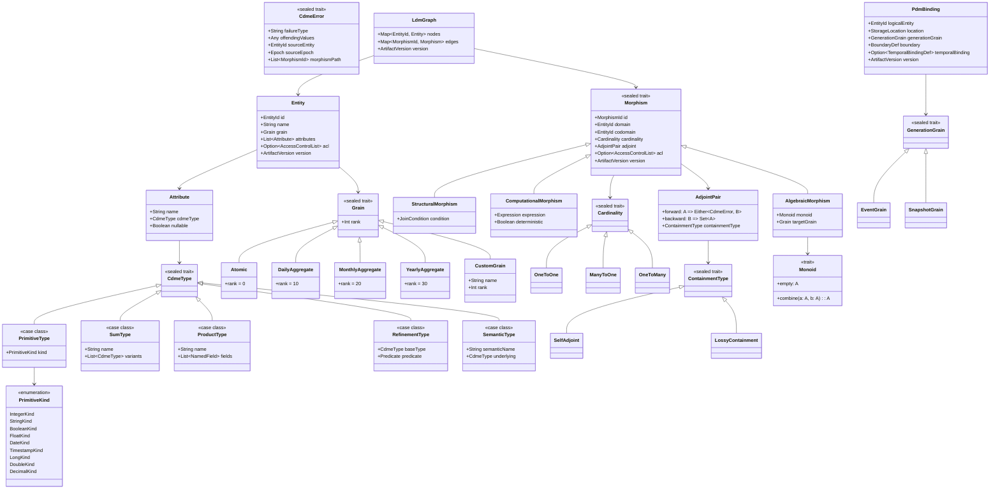
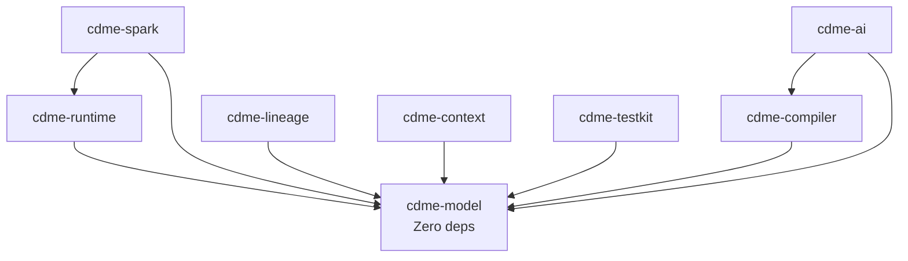

# Technical Design: Categorical Data Mapping & Computation Engine (CDME)

**Version**: 1.0.0
**Date**: 2026-02-21
**Status**: Draft — Pending Human Validation
**Edge**: requirements -> design (v2.3 methodology)
**Traces To**: REQUIREMENTS.md v1.0.0
**Technology Binding**: Scala 2.13.12 + Apache Spark 3.5.0

---

## 1. Architecture Overview

The CDME is a compile-then-execute engine for validated data transformations built on Category Theory primitives. The architecture follows a hexagonal (ports-and-adapters) pattern with four strict layers: a pure domain model, a topological compiler, an abstract runtime, and concrete bindings.

### 1.1 Design Principles

1. **Separation of concerns**: The domain model (what) is completely independent of the execution engine (how). No Spark imports exist in `cdme-model` or `cdme-compiler`.
2. **Compile-time safety**: Every path, grain, type, and access constraint is validated before any data is touched. The compiler rejects invalid pipelines; the runtime trusts the compiled plan.
3. **Adjoint completeness**: Every morphism carries both forward and backward functions. Backward traversal uses persisted metadata, never recomputation.
4. **Zero-loss accounting**: Every input record must appear in exactly one output partition (success, filtered, error, aggregated). The accounting ledger proves this.
5. **Deterministic reproducibility**: Same inputs + same config + same lookup versions = bit-identical output.

### 1.2 System Architecture Diagram

```mermaid
graph TB
    subgraph Client ["Client Layer"]
        JC[Job Configuration<br/>YAML/JSON]
        LDM_DEF[LDM Definition<br/>YAML/JSON]
        PDM_DEF[PDM Definition<br/>YAML/JSON]
        MAP_DEF[Mapping Definitions<br/>YAML/JSON]
    end

    subgraph Model ["cdme-model (Pure Domain)"]
        ENT[Entity / Object]
        MOR[Morphism<br/>Structural | Computational | Algebraic]
        ADJ[Adjoint Pair<br/>forward + backward]
        TYP[Type System<br/>Primitive | Sum | Product | Refinement]
        GRN[Grain<br/>Atomic | DailyAgg | MonthlyAgg | ...]
        ERR[Error Domain<br/>CdmeError ADT]
        MON[Monoid<br/>op + identity]
    end

    subgraph Compiler ["cdme-compiler (Validation)"]
        PP[Path Parser]
        GV[Grain Validator]
        TU[Type Unifier]
        AC[Access Control Checker]
        CE[Cost Estimator]
        PL[Plan Builder]
    end

    subgraph Runtime ["cdme-runtime (Abstract Execution)"]
        EX[Morphism Executor]
        KL[Kleisli Lifter]
        MF[Monoid Folder]
        ER[Error Router]
        WR[Writer Effect<br/>Telemetry Accumulator]
        AK[Adjoint Key Capturer]
    end

    subgraph SparkBinding ["cdme-spark (Concrete Binding)"]
        SR[Spark Reader<br/>DataFrame Source]
        SW[Spark Writer<br/>DataFrame Sink]
        SE[Spark Executor<br/>DataFrame Ops]
        SJ[Spark Join<br/>Skew Mitigation]
    end

    subgraph Lineage ["cdme-lineage"]
        OL[OpenLineage Emitter]
        LG[Ledger Generator]
        CP[Checkpoint Manager]
    end

    subgraph Context ["cdme-context"]
        EM[Epoch Manager]
        FB[Fiber Compatibility Checker]
        TB[Temporal Binder]
    end

    subgraph AI ["cdme-ai"]
        MV[Mapping Validator]
        DR[Dry Run Engine]
        PG[Proof Generator]
    end

    JC --> Compiler
    LDM_DEF --> PP
    PDM_DEF --> PL
    MAP_DEF --> PP

    PP --> GV
    PP --> TU
    PP --> AC
    GV --> CE
    TU --> CE
    AC --> CE
    CE --> PL

    PL -->|Compiled Plan| Runtime
    Runtime --> SparkBinding
    Runtime --> Lineage
    Runtime --> Context

    ER -->|Left errors| ERR
    EX --> WR
    EX --> AK
    AK --> LG

    AI --> Compiler
```

### 1.3 Layer Dependency Rules

| Layer | May Depend On | Must Not Depend On |
|-------|--------------|-------------------|
| `cdme-model` | Nothing (zero external deps) | Spark, Cats, any framework |
| `cdme-compiler` | `cdme-model` | Spark, runtime, lineage |
| `cdme-runtime` | `cdme-model` | Spark, compiler internals |
| `cdme-spark` | `cdme-runtime`, `cdme-model` | compiler internals |
| `cdme-lineage` | `cdme-model` | Spark, compiler, runtime |
| `cdme-ai` | `cdme-compiler`, `cdme-model` | Spark, runtime |
| `cdme-context` | `cdme-model` | Spark, compiler, runtime |
| `cdme-testkit` | `cdme-model` | Spark (optional test-scope) |

See [ADR-002](adrs/ADR-002-hexagonal-architecture.md) for rationale.

---

## 2. Component Design

### 2.1 Component: cdme-model

**Implements**: REQ-F-LDM-001, REQ-F-LDM-002, REQ-F-LDM-004, REQ-F-LDM-005, REQ-F-LDM-006, REQ-F-LDM-007, REQ-F-PDM-001, REQ-F-PDM-002, REQ-F-PDM-003, REQ-F-PDM-004, REQ-F-PDM-005, REQ-F-PDM-006, REQ-F-TYP-001, REQ-F-TYP-002, REQ-F-TYP-003, REQ-F-TYP-004, REQ-F-TYP-005, REQ-F-ERR-004, REQ-F-ADJ-001, REQ-F-ADJ-002, REQ-F-ADJ-003, REQ-F-SYN-007, REQ-F-SYN-008, REQ-NFR-VER-001

**Responsibilities**:
- Define the complete domain ADT: Entity, Morphism, Adjoint, Grain, Type system, Error types, Monoid declarations
- Provide the directed multigraph structure (nodes = Entity, edges = Morphism) with serialization support
- Define cardinality classification (`OneToOne`, `ManyToOne`, `OneToMany`) on every morphism
- Define the Adjoint interface with forward/backward functions and containment law types
- Define the PDM abstraction: storage bindings, generation grain, epoch boundary, temporal binding, lookup binding
- Define the Error Domain ADT (`CdmeError`) with structured fields: `failure_type`, `offending_values`, `source_entity`, `source_epoch`, `morphism_path`
- Define Monoid trait with `combine`, `empty`, and associativity marker
- Define refinement types as base type + predicate
- Provide version metadata on all configuration artifacts

**Interfaces**:
- `Entity` — case class with identity, attribute schema, grain, optional RBAC
- `Morphism[A, B]` — sealed trait with subtypes: `StructuralMorphism`, `ComputationalMorphism`, `AlgebraicMorphism`
- `AdjointPair[A, B]` — wraps forward `A => Either[CdmeError, B]` and backward `B => Set[A]`
- `CdmeType` — sealed trait hierarchy: `PrimitiveType`, `SumType`, `ProductType`, `RefinementType`
- `Grain` — sealed trait: `Atomic`, `DailyAggregate`, `MonthlyAggregate`, `YearlyAggregate`, `Custom(name, rank)`
- `CdmeError` — sealed trait with structured subtypes per failure category
- `Monoid[A]` — trait with `combine(a: A, b: A): A`, `empty: A`
- `LdmGraph` — directed multigraph with typed nodes and edges
- `PdmBinding` — case class mapping logical entity to physical storage
- `ArtifactVersion` — case class with artifact ID, version string, hash

**Dependencies**:
- None. Zero external library dependencies. Pure Scala 2.13 standard library only.

---

### 2.2 Component: cdme-compiler

**Implements**: REQ-F-LDM-003, REQ-F-TRV-002, REQ-F-TRV-003, REQ-F-TRV-006, REQ-F-TYP-004, REQ-F-CTX-001, REQ-F-SYN-001, REQ-F-SYN-002, REQ-F-SYN-004, REQ-F-SYN-005, REQ-F-SYN-006, REQ-BR-GRN-001, REQ-DATA-LIN-002, REQ-DATA-LIN-004

**Responsibilities**:
- Parse symbolic dot-notation paths and validate them against the LDM graph
- Enforce path composition validity: existence, type unification, grain safety, access control
- Enforce grain safety as a topological invariant (no override mechanism)
- Perform type unification at every composition boundary (exact match or subtype per declared hierarchy)
- Validate fiber compatibility for cross-boundary joins
- Require temporal semantics declarations for cross-epoch joins
- Validate monoidal aggregation laws (associativity, identity element presence)
- Validate multi-level aggregation against declared grain hierarchies
- Validate synthesis expressions reference only reachable attributes
- Validate versioned lookup semantics on every lookup reference
- Classify morphisms as lossless or lossy for checkpointing policy
- Verify reconstructability invariant for key-derivable lineage plans
- Estimate computational cost (cardinality explosion) and reject plans exceeding budget
- Produce a compiled `ExecutionPlan` that the runtime trusts without re-validation

**Interfaces**:
- `TopologicalCompiler.compile(graph: LdmGraph, mappings: List[MappingDef], constraints: CompilerConstraints): Either[List[CompilationError], ExecutionPlan]`
- `PathValidator.validate(path: DotPath, graph: LdmGraph, principal: Principal): Either[PathError, ValidatedPath]`
- `GrainChecker.check(path: ValidatedPath): Either[GrainError, GrainSafePath]`
- `TypeUnifier.unify(codomain: CdmeType, domain: CdmeType, hierarchy: TypeHierarchy): Either[TypeError, UnifiedType]`
- `CostEstimator.estimate(plan: ExecutionPlan, budget: CardinalityBudget): Either[BudgetExceeded, CostEstimate]`
- `LossinessClassifier.classify(morphism: Morphism[_, _]): LossinessTag` (Lossless | Lossy)
- `CompilationError` — sealed trait with subtypes: `PathError`, `GrainError`, `TypeError`, `AccessError`, `BudgetExceeded`, `FiberError`

**Dependencies**:
- `cdme-model` only.

---

### 2.3 Component: cdme-runtime

**Implements**: REQ-F-TRV-001, REQ-F-TRV-004, REQ-F-TRV-005, REQ-F-LDM-004, REQ-F-LDM-005, REQ-F-ERR-001, REQ-F-ERR-002, REQ-F-ERR-003, REQ-F-ADJ-004, REQ-F-ACC-001, REQ-F-ACC-003, REQ-F-ACC-004, REQ-NFR-PERF-001, REQ-DATA-QAL-001

**Responsibilities**:
- Execute compiled plans by dispatching morphisms to a pluggable execution backend
- Implement Kleisli context lifting: scalar-to-list promotion on 1:N edges with correct flattening
- Implement monoidal folding with declared `combine` and `empty`
- Route errors via strict `Either[CdmeError, T]` semantics; `Left` values go to Error Domain sink
- Enforce batch failure threshold (absolute count or percentage); halt if exceeded
- Guarantee error handling idempotency (same failing input = same error output)
- Accumulate operational telemetry via Writer effect (input count, output count, error count, latency per morphism)
- Capture adjoint metadata at every morphism: reverse-join keys, filtered keys, explode parent-child mappings
- Verify zero-loss accounting invariant before marking run complete
- Gate run completion on accounting verification pass/fail
- Implement probabilistic circuit breaker for cascading failure prevention
- Guarantee deterministic reproducibility when all inputs are identical

**Interfaces**:
- `trait ExecutionBackend[F[_]]` — abstract over the execution context (Spark, local, etc.)
  - `def readSource(binding: PdmBinding, epoch: Epoch): F[DataFrame]`
  - `def writeSink(binding: PdmBinding, data: F[DataFrame]): Unit`
  - `def executeMap(morphism: Morphism[A, B], input: F[A]): F[Either[CdmeError, B]]`
  - `def executeKleisli(morphism: Morphism[A, List[B]], input: F[A]): F[Either[CdmeError, B]]`
  - `def executeFold(monoid: Monoid[A], input: F[A]): F[A]`
- `PipelineRunner.run(plan: ExecutionPlan, backend: ExecutionBackend[F], config: JobConfig): RunResult`
- `RunResult` — contains: success data, error data, telemetry, accounting ledger, adjoint metadata
- `WriterTelemetry` — accumulator for per-morphism metrics
- `CircuitBreaker` — monitors error rate against configured threshold

**Dependencies**:
- `cdme-model` only. The runtime defines abstract interfaces; concrete implementations live in binding modules.

---

### 2.4 Component: cdme-spark

**Implements**: REQ-NFR-DIST-001, REQ-NFR-PERF-001, REQ-NFR-PERF-002, REQ-F-PDM-001

**Responsibilities**:
- Implement `ExecutionBackend[SparkDataFrame]` for Apache Spark 3.5
- Map `cdme-model` types to Spark SQL types (StructType, StructField)
- Implement DataFrame-level morphism execution: column transforms, joins, aggregations
- Implement Kleisli lifting as DataFrame `explode` operations
- Implement monoidal folding as Spark `groupBy` + `agg` with user-defined aggregation functions
- Implement skew mitigation via salted joins when predicted cardinality exceeds threshold
- Read from and write to physical sources via PDM bindings (Parquet, Delta, CSV, JDBC)
- Ensure all aggregation operations are safe for distributed execution via monoid associativity

**Interfaces**:
- `SparkBackend extends ExecutionBackend[DataFrame]` — concrete Spark implementation
- `SparkTypeMapper.toSparkType(cdmeType: CdmeType): DataType`
- `SparkTypeMapper.fromSparkType(sparkType: DataType): CdmeType`
- `SparkSourceReader.read(binding: PdmBinding, epoch: Epoch)(implicit spark: SparkSession): DataFrame`
- `SparkSinkWriter.write(binding: PdmBinding, df: DataFrame): Unit`
- `SkewMitigator.saltedJoin(left: DataFrame, right: DataFrame, key: Column, saltFactor: Int): DataFrame`

**Dependencies**:
- `cdme-runtime` (implements `ExecutionBackend`)
- `cdme-model` (type mapping)
- Apache Spark 3.5.0 (provided scope)

---

### 2.5 Component: cdme-lineage

**Implements**: REQ-F-SYN-003, REQ-F-ACC-002, REQ-F-ACC-005, REQ-F-ADJ-005, REQ-F-ADJ-006, REQ-F-ADJ-007, REQ-NFR-OBS-001, REQ-DATA-LIN-001, REQ-DATA-LIN-003

**Responsibilities**:
- Emit OpenLineage-compatible events (START, COMPLETE, FAIL) with lineage facets
- Generate the accounting ledger (`ledger.json`) proving zero-loss invariant
- Manage checkpoints: persist key envelopes at graph inputs, graph outputs, and after lossy morphisms
- Support three lineage modes: Full, Key-Derivable, Summary/Sampled
- Enable backward traversal from aggregate keys to contributing source keys using adjoint metadata
- Support data reconciliation: verify `backward(forward(x)) supseteq x`
- Support impact analysis: compute source records contributing to a target subset

**Interfaces**:
- `OpenLineageEmitter.emitStart(runId: RunId, plan: ExecutionPlan): Unit`
- `OpenLineageEmitter.emitComplete(runId: RunId, ledger: AccountingLedger, lineage: LineageGraph): Unit`
- `OpenLineageEmitter.emitFail(runId: RunId, error: CdmeError, ledger: AccountingLedger): Unit`
- `LedgerGenerator.generate(telemetry: WriterTelemetry, adjointMeta: AdjointMetadata): AccountingLedger`
- `CheckpointManager.checkpoint(segmentId: SegmentId, keys: KeyEnvelope, mode: LineageMode): Unit`
- `BackwardTraverser.traceBack(targetKey: Any, adjointMeta: AdjointMetadata): Set[SourceRecord]`
- `ImpactAnalyzer.analyze(targetSubset: Set[Any], adjointMeta: AdjointMetadata): ImpactReport`

**Dependencies**:
- `cdme-model` (error types, adjoint types, version types)

---

### 2.6 Component: cdme-ai

**Implements**: REQ-F-AIA-001, REQ-F-AIA-002, REQ-F-AIA-003, REQ-BR-REG-004

**Responsibilities**:
- Validate AI-generated mappings through the same topological compiler as human-authored mappings (no bypass)
- Reject hallucinated relationships (references to non-existent morphisms) with named error
- Produce proof artifacts: lineage graph, execution trace, type unification report
- Support dry-run mode: full validation + cost estimation without writing to sinks
- Generate human-reviewable validation reports for EU AI Act Article 14 compliance

**Interfaces**:
- `AiMappingValidator.validate(mapping: MappingDef, graph: LdmGraph, constraints: CompilerConstraints): ValidationReport`
- `DryRunEngine.dryRun(plan: ExecutionPlan, config: JobConfig): DryRunResult` — includes all validation results + cost estimate, no sink writes
- `ProofGenerator.generate(runResult: RunResult): ProofArtifact` — contains lineage graph, execution trace, type unification report
- `ValidationReport` — structured: passed checks, failed checks with REQ keys, human-readable summary

**Dependencies**:
- `cdme-compiler` (reuses TopologicalCompiler for validation)
- `cdme-model` (types, error types)

---

### 2.7 Component: cdme-context

**Implements**: REQ-F-CTX-001, REQ-F-TRV-003, REQ-F-PDM-004, REQ-F-PDM-006, REQ-F-SYN-006

**Responsibilities**:
- Manage epoch lifecycle: define, resolve, and scope processing epochs
- Enforce fiber compatibility: verify join partners share the same epoch or declare temporal semantics
- Implement temporal binding: resolve logical entity to physical location as a function of epoch
- Manage versioned lookup resolution: pin lookup versions within a single execution context
- Guarantee within-execution lookup consistency (same key + same lookup = same value)

**Interfaces**:
- `EpochManager.resolve(boundary: BoundaryDef, params: Map[String, Any]): Epoch`
- `FiberChecker.checkCompatibility(left: Epoch, right: Epoch): Either[FiberError, TemporalSemantics]`
- `TemporalBinder.resolve(entity: Entity, epoch: Epoch, binding: TemporalPdmBinding): PdmBinding`
- `LookupResolver.resolve(lookup: LookupRef, key: Any, epoch: Epoch): Either[CdmeError, Any]`
- `LookupResolver.pin(lookup: LookupRef, epoch: Epoch): PinnedLookup` — pins version for execution scope

**Dependencies**:
- `cdme-model` (epoch types, lookup types, fiber types)

---

### 2.8 Component: cdme-testkit

**Implements**: (Test infrastructure — supports validation of all REQ-* keys)

**Responsibilities**:
- Provide ScalaCheck generators for all core ADT types (Entity, Morphism, CdmeType, Grain, etc.)
- Provide assertion helpers for adjoint containment laws
- Provide test fixtures: sample LDM graphs, PDM bindings, mapping definitions
- Provide property-based test templates for monoid laws, type unification, grain safety

**Interfaces**:
- `CdmeGenerators` — object with `Arbitrary` instances for all model types
- `AdjointAssertions` — matchers for `backward(forward(x)) supseteq x`
- `MonoidLawAssertions` — matchers for associativity and identity
- `TestFixtures` — pre-built LDM/PDM/Mapping definitions for common test scenarios

**Dependencies**:
- `cdme-model` (generates model types)
- ScalaTest 3.2.17 (test scope)
- ScalaCheck 1.17.0 (test scope)

---

## 3. Data Model

### 3.1 Core Type Hierarchy



### 3.2 Execution Plan Model

The compiler produces an `ExecutionPlan` that the runtime consumes:

```scala
case class ExecutionPlan(
  planId: PlanId,
  stages: List[ExecutionStage],
  costEstimate: CostEstimate,
  lineageMode: LineageMode,
  checkpointPolicy: CheckpointPolicy,
  artifactVersions: Map[String, ArtifactVersion]
)

sealed trait ExecutionStage
case class ReadStage(binding: PdmBinding, epoch: Epoch) extends ExecutionStage
case class TransformStage(morphism: ValidatedMorphism, input: StageRef, lossiness: LossinessTag) extends ExecutionStage
case class JoinStage(left: StageRef, right: StageRef, condition: JoinCondition, temporalSemantics: Option[TemporalSemantics]) extends ExecutionStage
case class AggregateStage(monoid: Monoid[_], groupKeys: List[String], input: StageRef) extends ExecutionStage
case class WriteStage(binding: PdmBinding, input: StageRef) extends ExecutionStage
case class CheckpointStage(segmentId: SegmentId, input: StageRef) extends ExecutionStage

sealed trait LineageMode
case object FullLineage extends LineageMode
case object KeyDerivableLineage extends LineageMode
case class SampledLineage(rate: Double) extends LineageMode
```

### 3.3 Error Domain Model

```scala
sealed trait CdmeError {
  def failureType: String
  def offendingValues: Any
  def sourceEntity: EntityId
  def sourceEpoch: Epoch
  def morphismPath: List[MorphismId]
}

case class RefinementViolation(
  predicate: Predicate,
  offendingValues: Any,
  sourceEntity: EntityId,
  sourceEpoch: Epoch,
  morphismPath: List[MorphismId]
) extends CdmeError { val failureType = "refinement_violation" }

case class TypeMismatchError(
  expected: CdmeType,
  actual: CdmeType,
  offendingValues: Any,
  sourceEntity: EntityId,
  sourceEpoch: Epoch,
  morphismPath: List[MorphismId]
) extends CdmeError { val failureType = "type_mismatch" }

case class GrainViolation(
  expectedGrain: Grain,
  actualGrain: Grain,
  offendingValues: Any,
  sourceEntity: EntityId,
  sourceEpoch: Epoch,
  morphismPath: List[MorphismId]
) extends CdmeError { val failureType = "grain_violation" }

case class AccessDenied(
  morphismId: MorphismId,
  principal: Principal,
  offendingValues: Any,
  sourceEntity: EntityId,
  sourceEpoch: Epoch,
  morphismPath: List[MorphismId]
) extends CdmeError { val failureType = "access_denied" }

case class ExternalMorphismFailure(
  calculatorId: String,
  calculatorVersion: String,
  offendingValues: Any,
  sourceEntity: EntityId,
  sourceEpoch: Epoch,
  morphismPath: List[MorphismId]
) extends CdmeError { val failureType = "external_morphism_failure" }
```

### 3.4 Accounting Ledger Schema

```json
{
  "run_id": "uuid",
  "plan_id": "uuid",
  "timestamp": "ISO-8601",
  "input_record_count": 1000000,
  "source_key_field": "trade_id",
  "partitions": {
    "processed": {
      "count": 985000,
      "adjoint_metadata_location": "s3://bucket/run-123/processed_adjoint/"
    },
    "filtered": {
      "count": 10000,
      "adjoint_metadata_location": "s3://bucket/run-123/filtered_keys/"
    },
    "errored": {
      "count": 5000,
      "adjoint_metadata_location": "s3://bucket/run-123/error_domain/"
    }
  },
  "verification": {
    "status": "PASS",
    "equation": "985000 + 10000 + 5000 = 1000000",
    "balanced": true
  },
  "artifact_versions": {
    "ldm": "v1.2.0",
    "pdm": "v1.0.3",
    "mapping": "v2.1.0"
  }
}
```

---

## 4. Traceability Matrix

### 4.1 Functional Requirements — LDM

| REQ Key | Description | Implementing Component(s) |
|---------|-------------|--------------------------|
| REQ-F-LDM-001 | Directed Multigraph Structure | cdme-model (LdmGraph) |
| REQ-F-LDM-002 | Cardinality Classification | cdme-model (Cardinality ADT) |
| REQ-F-LDM-003 | Path Composition Validity | cdme-compiler (PathValidator, TypeUnifier, GrainChecker, AccessControlChecker) |
| REQ-F-LDM-004 | Monoidal Aggregation Laws | cdme-model (Monoid trait), cdme-runtime (MonoidFolder) |
| REQ-F-LDM-005 | Empty Aggregation Identity | cdme-model (Monoid.empty), cdme-runtime (MonoidFolder) |
| REQ-F-LDM-006 | Topological Access Control | cdme-model (AccessControlList), cdme-compiler (AccessControlChecker) |
| REQ-F-LDM-007 | Grain and Type Metadata | cdme-model (Entity.grain, Attribute.cdmeType) |

### 4.2 Functional Requirements — PDM

| REQ Key | Description | Implementing Component(s) |
|---------|-------------|--------------------------|
| REQ-F-PDM-001 | Functorial Storage Abstraction | cdme-model (PdmBinding), cdme-spark (SparkSourceReader, SparkSinkWriter) |
| REQ-F-PDM-002 | Generation Grain Declaration | cdme-model (GenerationGrain ADT) |
| REQ-F-PDM-003 | Generation Grain Semantics | cdme-model (GenerationGrain), cdme-context (EpochManager) |
| REQ-F-PDM-004 | Epoch Boundary Definition | cdme-model (BoundaryDef), cdme-context (EpochManager) |
| REQ-F-PDM-005 | Lookup Binding | cdme-model (LookupBinding), cdme-context (LookupResolver) |
| REQ-F-PDM-006 | Temporal Binding | cdme-model (TemporalBindingDef), cdme-context (TemporalBinder) |

### 4.3 Functional Requirements — Traversal Engine

| REQ Key | Description | Implementing Component(s) |
|---------|-------------|--------------------------|
| REQ-F-TRV-001 | Kleisli Context Lifting | cdme-runtime (KleisliLifter), cdme-spark (SparkExecutor.explode) |
| REQ-F-TRV-002 | Grain Safety Enforcement | cdme-compiler (GrainChecker) |
| REQ-F-TRV-003 | Boundary Alignment and Temporal Semantics | cdme-compiler (FiberCheck), cdme-context (FiberChecker) |
| REQ-F-TRV-004 | Operational Telemetry via Writer Effect | cdme-runtime (WriterTelemetry) |
| REQ-F-TRV-005 | Deterministic Reproducibility | cdme-runtime (deterministic execution), cdme-context (pinned lookups) |
| REQ-F-TRV-006 | Computational Cost Governance | cdme-compiler (CostEstimator) |

### 4.4 Functional Requirements — Context Consistency

| REQ Key | Description | Implementing Component(s) |
|---------|-------------|--------------------------|
| REQ-F-CTX-001 | Fiber Compatibility for Joins | cdme-compiler (FiberCheck), cdme-context (FiberChecker) |

### 4.5 Functional Requirements — Synthesis and Integration

| REQ Key | Description | Implementing Component(s) |
|---------|-------------|--------------------------|
| REQ-F-SYN-001 | Isomorphic Synthesis | cdme-compiler (SynthesisValidator) |
| REQ-F-SYN-002 | Multi-Level Aggregation | cdme-compiler (GrainHierarchyValidator) |
| REQ-F-SYN-003 | Full Lineage Traceability | cdme-lineage (OpenLineageEmitter, BackwardTraverser) |
| REQ-F-SYN-004 | Complex Business Logic | cdme-compiler (ExpressionValidator) |
| REQ-F-SYN-005 | Multi-Grain Formulation | cdme-compiler (GrainChecker) |
| REQ-F-SYN-006 | Versioned Lookups | cdme-compiler (LookupVersionValidator), cdme-context (LookupResolver) |
| REQ-F-SYN-007 | Deterministic Key Generation | cdme-model (KeyGenerator trait) |
| REQ-F-SYN-008 | External Computational Morphisms | cdme-model (ExternalMorphism registration) |

### 4.6 Functional Requirements — Type System

| REQ Key | Description | Implementing Component(s) |
|---------|-------------|--------------------------|
| REQ-F-TYP-001 | Extended Type System | cdme-model (CdmeType hierarchy) |
| REQ-F-TYP-002 | Refinement Type Enforcement | cdme-model (RefinementType), cdme-runtime (ErrorRouter) |
| REQ-F-TYP-003 | Explicit Casting | cdme-model (CastingMorphism), cdme-compiler (TypeUnifier) |
| REQ-F-TYP-004 | Type Unification Rules | cdme-compiler (TypeUnifier) |
| REQ-F-TYP-005 | Semantic Type Enforcement | cdme-model (SemanticType), cdme-compiler (TypeUnifier) |

### 4.7 Functional Requirements — Error Domain

| REQ Key | Description | Implementing Component(s) |
|---------|-------------|--------------------------|
| REQ-F-ERR-001 | Either Monad Error Routing | cdme-runtime (ErrorRouter) |
| REQ-F-ERR-002 | Batch Failure Threshold | cdme-runtime (CircuitBreaker, ErrorRouter) |
| REQ-F-ERR-003 | Error Handling Idempotency | cdme-runtime (deterministic error routing) |
| REQ-F-ERR-004 | Error Object Content | cdme-model (CdmeError ADT) |

### 4.8 Functional Requirements — AI Assurance

| REQ Key | Description | Implementing Component(s) |
|---------|-------------|--------------------------|
| REQ-F-AIA-001 | Topological Validity for AI Mappings | cdme-ai (AiMappingValidator), cdme-compiler (TopologicalCompiler) |
| REQ-F-AIA-002 | Triangulation of Assurance | cdme-ai (ProofGenerator) |
| REQ-F-AIA-003 | Dry Run Mode | cdme-ai (DryRunEngine) |

### 4.9 Functional Requirements — Record Accounting

| REQ Key | Description | Implementing Component(s) |
|---------|-------------|--------------------------|
| REQ-F-ACC-001 | Zero-Loss Accounting Invariant | cdme-runtime (AccountingVerifier) |
| REQ-F-ACC-002 | Accounting Ledger | cdme-lineage (LedgerGenerator) |
| REQ-F-ACC-003 | Adjoint Key Capture | cdme-runtime (AdjointKeyCapturer) |
| REQ-F-ACC-004 | Run Completion Gate | cdme-runtime (RunCompletionGate) |
| REQ-F-ACC-005 | Backward Traversal Proof | cdme-lineage (BackwardTraverser) |

### 4.10 Functional Requirements — Adjoint Morphisms

| REQ Key | Description | Implementing Component(s) |
|---------|-------------|--------------------------|
| REQ-F-ADJ-001 | Adjoint Interface | cdme-model (AdjointPair) |
| REQ-F-ADJ-002 | Self-Adjoint Isomorphisms | cdme-model (SelfAdjoint ContainmentType) |
| REQ-F-ADJ-003 | Lossy Containment Bounds | cdme-model (LossyContainment), cdme-runtime (AdjointKeyCapturer) |
| REQ-F-ADJ-004 | Contravariant Composition | cdme-runtime (AdjointComposer) |
| REQ-F-ADJ-005 | Backward Execution Path | cdme-lineage (BackwardTraverser) |
| REQ-F-ADJ-006 | Data Reconciliation | cdme-lineage (ReconciliationChecker) |
| REQ-F-ADJ-007 | Impact Analysis | cdme-lineage (ImpactAnalyzer) |

### 4.11 Non-Functional Requirements

| REQ Key | Description | Implementing Component(s) |
|---------|-------------|--------------------------|
| REQ-NFR-PERF-001 | Throughput Target | cdme-spark (distributed execution), cdme-runtime (pipeline orchestration) |
| REQ-NFR-PERF-002 | Skew Mitigation | cdme-spark (SkewMitigator) |
| REQ-NFR-DIST-001 | Distributed Framework Support | cdme-spark (SparkBackend) |
| REQ-NFR-OBS-001 | OpenLineage Compatibility | cdme-lineage (OpenLineageEmitter) |
| REQ-NFR-OBS-002 | REQ Key Telemetry Tagging | cdme-runtime (WriterTelemetry), cdme-lineage (OpenLineageEmitter) |
| REQ-NFR-VER-001 | Configuration Artifact Versioning | cdme-model (ArtifactVersion) |

### 4.12 Data Requirements

| REQ Key | Description | Implementing Component(s) |
|---------|-------------|--------------------------|
| REQ-DATA-LIN-001 | Lineage Mode Selection | cdme-lineage (CheckpointManager), cdme-compiler (plan metadata) |
| REQ-DATA-LIN-002 | Morphism Lossiness Classification | cdme-compiler (LossinessClassifier) |
| REQ-DATA-LIN-003 | Checkpointing Policy | cdme-lineage (CheckpointManager) |
| REQ-DATA-LIN-004 | Reconstructability Invariant | cdme-compiler (ReconstructabilityVerifier) |
| REQ-DATA-QAL-001 | Probabilistic Circuit Breaker | cdme-runtime (CircuitBreaker) |
| REQ-DATA-QAL-002 | Approximate Aggregation Support | cdme-model (ApproxAgg marker), cdme-runtime (SketchFolder) |

### 4.13 Business Rules

| REQ Key | Description | Implementing Component(s) |
|---------|-------------|--------------------------|
| REQ-BR-GRN-001 | Grain Mixing Prohibition | cdme-compiler (GrainChecker — no override) |
| REQ-BR-REG-001 | BCBS 239 Compliance | cdme-compiler (type enforcement), cdme-runtime (reproducibility), cdme-lineage (completeness) |
| REQ-BR-REG-002 | FRTB Compliance | cdme-lineage (full traceability), cdme-compiler (grain correctness) |
| REQ-BR-REG-003 | GDPR and CCPA Compliance | cdme-model (deterministic keys), cdme-spark (physical-level operations) |
| REQ-BR-REG-004 | EU AI Act Compliance | cdme-ai (validation reports, determinism guarantees) |

---

## 5. ADR Index

| ADR | Title | Decision Summary | Link |
|-----|-------|-----------------|------|
| ADR-001 | Scala 2.13 + Spark 3.5 Ecosystem | Scala 2.13.12 with Spark 3.5.0 as distributed runtime; not Scala 3, not Flink | [ADR-001](adrs/ADR-001-scala-spark-ecosystem.md) |
| ADR-002 | Hexagonal Architecture | Ports-and-adapters pattern with strict layer dependencies; not layered, not microservices | [ADR-002](adrs/ADR-002-hexagonal-architecture.md) |
| ADR-003 | Compiler Pattern | Validate-then-execute with compiled plan; not runtime-validated, not dynamic interpretation | [ADR-003](adrs/ADR-003-compiler-pattern.md) |
| ADR-004 | Deployment Model | Docker Compose + Spark standalone for dev/test; not Kubernetes, not managed cloud | [ADR-004](adrs/ADR-004-deployment-model.md) |
| ADR-005 | Security — RBAC on Morphisms | Role-based access control at morphism level; not ABAC, not row-level security | [ADR-005](adrs/ADR-005-security-rbac.md) |

---

## 6. Package/Module Structure

### 6.1 sbt Multi-Module Layout

```
cdme/
├── build.sbt                          # Root build definition
├── project/
│   ├── build.properties               # sbt version
│   ├── Dependencies.scala             # Centralized version management
│   └── plugins.sbt                    # sbt plugins (coverage, fmt)
├── cdme-model/
│   └── src/
│       ├── main/scala/com/cdme/model/
│       │   ├── entity/                # Entity, Attribute, EntityId
│       │   ├── morphism/              # Morphism sealed hierarchy
│       │   ├── adjoint/               # AdjointPair, ContainmentType
│       │   ├── types/                 # CdmeType hierarchy, Predicate
│       │   ├── grain/                 # Grain hierarchy
│       │   ├── monoid/               # Monoid trait, built-in monoids
│       │   ├── graph/                 # LdmGraph, directed multigraph ops
│       │   ├── pdm/                   # PdmBinding, GenerationGrain, StorageLocation
│       │   ├── error/                 # CdmeError sealed hierarchy
│       │   ├── config/                # JobConfig, CardinalityBudget
│       │   ├── version/               # ArtifactVersion
│       │   └── external/              # ExternalMorphism, KeyGenerator
│       └── test/scala/com/cdme/model/
│           └── ...                    # Unit tests for model types
├── cdme-compiler/
│   └── src/
│       ├── main/scala/com/cdme/compiler/
│       │   ├── path/                  # PathParser, PathValidator, DotPath
│       │   ├── grain/                 # GrainChecker, GrainHierarchyValidator
│       │   ├── types/                 # TypeUnifier, TypeHierarchy
│       │   ├── access/                # AccessControlChecker
│       │   ├── cost/                  # CostEstimator, CardinalityModel
│       │   ├── fiber/                 # FiberCheck
│       │   ├── synthesis/             # SynthesisValidator, ExpressionValidator
│       │   ├── lookup/                # LookupVersionValidator
│       │   ├── lineage/               # LossinessClassifier, ReconstructabilityVerifier
│       │   ├── plan/                  # PlanBuilder, ExecutionPlan, ExecutionStage
│       │   └── TopologicalCompiler.scala  # Facade
│       └── test/scala/com/cdme/compiler/
│           └── ...
├── cdme-runtime/
│   └── src/
│       ├── main/scala/com/cdme/runtime/
│       │   ├── backend/               # ExecutionBackend trait
│       │   ├── executor/              # MorphismExecutor, KleisliLifter, MonoidFolder
│       │   ├── error/                 # ErrorRouter, CircuitBreaker
│       │   ├── telemetry/             # WriterTelemetry
│       │   ├── adjoint/               # AdjointKeyCapturer, AdjointComposer
│       │   ├── accounting/            # AccountingVerifier, RunCompletionGate
│       │   ├── sketch/                # SketchFolder (approximate aggregation)
│       │   └── PipelineRunner.scala   # Orchestrator
│       └── test/scala/com/cdme/runtime/
│           └── ...
├── cdme-spark/
│   └── src/
│       ├── main/scala/com/cdme/spark/
│       │   ├── backend/               # SparkBackend extends ExecutionBackend
│       │   ├── io/                    # SparkSourceReader, SparkSinkWriter
│       │   ├── transform/             # SparkExecutor (column transforms, joins)
│       │   ├── types/                 # SparkTypeMapper
│       │   ├── skew/                  # SkewMitigator (salted joins)
│       │   └── session/               # SparkSessionFactory
│       └── test/scala/com/cdme/spark/
│           └── ...
├── cdme-lineage/
│   └── src/
│       ├── main/scala/com/cdme/lineage/
│       │   ├── openlineage/           # OpenLineageEmitter, event builders
│       │   ├── ledger/                # LedgerGenerator, AccountingLedger
│       │   ├── checkpoint/            # CheckpointManager, KeyEnvelope
│       │   ├── backward/              # BackwardTraverser
│       │   ├── reconciliation/        # ReconciliationChecker
│       │   └── impact/                # ImpactAnalyzer
│       └── test/scala/com/cdme/lineage/
│           └── ...
├── cdme-ai/
│   └── src/
│       ├── main/scala/com/cdme/ai/
│       │   ├── validation/            # AiMappingValidator
│       │   ├── dryrun/                # DryRunEngine
│       │   └── proof/                 # ProofGenerator, ProofArtifact
│       └── test/scala/com/cdme/ai/
│           └── ...
├── cdme-context/
│   └── src/
│       ├── main/scala/com/cdme/context/
│       │   ├── epoch/                 # EpochManager, Epoch, BoundaryDef
│       │   ├── fiber/                 # FiberChecker, TemporalSemantics
│       │   ├── temporal/              # TemporalBinder
│       │   └── lookup/                # LookupResolver, PinnedLookup
│       └── test/scala/com/cdme/context/
│           └── ...
└── cdme-testkit/
    └── src/
        ├── main/scala/com/cdme/testkit/
        │   ├── generators/            # ScalaCheck Arbitrary instances
        │   ├── assertions/            # AdjointAssertions, MonoidLawAssertions
        │   └── fixtures/              # TestFixtures (sample graphs, bindings)
        └── test/scala/com/cdme/testkit/
            └── ...
```

### 6.2 Module Dependency DAG



### 6.3 build.sbt Structure

```scala
// Root build
lazy val root = (project in file("."))
  .aggregate(model, compiler, runtime, spark, lineage, ai, context, testkit)
  .settings(
    name := "cdme",
    scalaVersion := "2.13.12"
  )

lazy val model = (project in file("cdme-model"))
  .settings(
    name := "cdme-model",
    libraryDependencies := Seq.empty // Zero external deps
  )

lazy val compiler = (project in file("cdme-compiler"))
  .dependsOn(model)

lazy val runtime = (project in file("cdme-runtime"))
  .dependsOn(model)

lazy val spark = (project in file("cdme-spark"))
  .dependsOn(runtime, model)
  .settings(
    libraryDependencies += "org.apache.spark" %% "spark-sql" % "3.5.0" % "provided"
  )

lazy val lineage = (project in file("cdme-lineage"))
  .dependsOn(model)

lazy val ai = (project in file("cdme-ai"))
  .dependsOn(compiler, model)

lazy val context = (project in file("cdme-context"))
  .dependsOn(model)

lazy val testkit = (project in file("cdme-testkit"))
  .dependsOn(model)
  .settings(
    libraryDependencies ++= Seq(
      "org.scalatest" %% "scalatest" % "3.2.17",
      "org.scalatestplus" %% "scalacheck-1-17" % "3.2.17.0",
      "org.scalacheck" %% "scalacheck" % "1.17.0"
    )
  )
```

---

## 7. Error Handling Strategy

### 7.1 Error Categories

Errors are classified into two phases:

**Compile-time errors** (rejected before execution):
- `PathError` — non-existent morphism, unreachable attribute
- `GrainError` — incompatible grains without aggregation
- `TypeError` — type mismatch at composition boundary, refinement violation in expressions
- `AccessError` — principal lacks permission for a morphism
- `BudgetExceeded` — estimated cardinality exceeds budget
- `FiberError` — cross-epoch join without temporal semantics
- `LookupVersionError` — unversioned lookup reference

**Runtime errors** (routed to Error Domain during execution):
- `RefinementViolation` — data value fails refinement predicate
- `TypeMismatchError` — unexpected data type at runtime (defensive)
- `ExternalMorphismFailure` — registered calculator returns error
- `CircuitBreakerTripped` — error rate exceeds threshold

### 7.2 Error Flow

1. Each morphism execution produces `Either[CdmeError, T]`
2. `Left` values are routed to the Error Domain sink via `ErrorRouter`
3. `ErrorRouter` accumulates errors and checks against the batch failure threshold
4. If threshold is exceeded, `CircuitBreaker` halts execution immediately
5. If threshold is not exceeded (or unconfigured), processing continues for remaining records
6. At run completion, `AccountingVerifier` confirms zero-loss: every input appears in exactly one partition
7. Error objects carry full context: `failure_type`, `offending_values`, `source_entity`, `source_epoch`, `morphism_path`

### 7.3 Error Handling Invariants

- **No silent drops**: Every input record must appear in success output, filtered output, or error output
- **Idempotency**: Re-processing the same failing input with the same config must produce the same error
- **Structured errors**: All errors are typed ADT instances (not free-text strings)
- **Deterministic classification**: The same failure always produces the same error type

---

## 8. Configuration Model

### 8.1 Configuration Artifacts

All configuration is declarative (YAML/JSON), versioned, and immutable within a version.

| Artifact | Format | Contains | Versioned |
|----------|--------|----------|-----------|
| LDM Definition | YAML | Entities, morphisms, grain hierarchy, type definitions | Yes |
| PDM Definition | YAML | Storage bindings, generation grains, boundaries, temporal bindings | Yes |
| Mapping Definition | YAML | Source-to-target paths, synthesis expressions, lookup references | Yes |
| Job Configuration | YAML | Execution parameters: lineage mode, failure threshold, cardinality budget, checkpoint policy | Yes |
| Access Control | YAML | Roles, morphism permissions | Yes |
| Lookup Registry | YAML | Lookup definitions with version semantics | Yes |

### 8.2 Job Configuration Schema

```yaml
job:
  id: "daily-risk-aggregation"
  version: "1.0.0"

execution:
  lineage_mode: "key_derivable"   # full | key_derivable | sampled
  sample_rate: 0.01               # only for sampled mode
  failure_threshold:
    type: "percentage"            # absolute | percentage
    value: 5.0                    # halt if >5% errors
    sample_window: 10000          # sample first 10k rows
  cardinality_budget:
    max_output_rows: 100000000
    max_join_depth: 5
    max_intermediate_size: 50000000

artifacts:
  ldm: { path: "ldm/trading_v1.2.0.yml", version: "1.2.0" }
  pdm: { path: "pdm/spark_prod_v1.0.3.yml", version: "1.0.3" }
  mapping: { path: "mappings/risk_agg_v2.1.0.yml", version: "2.1.0" }
  access_control: { path: "acl/roles_v1.0.0.yml", version: "1.0.0" }

epoch:
  boundary: "daily"
  parameters:
    date: "${BUSINESS_DATE}"

output:
  success_sink: { path: "output/daily_risk/", format: "parquet" }
  error_sink: { path: "output/errors/daily_risk/", format: "parquet" }
  ledger_sink: { path: "output/ledger/daily_risk/", format: "json" }
```

### 8.3 Configuration Loading

Configuration is loaded at pipeline initialization and frozen for the duration of execution:

1. Parse and validate all YAML artifacts
2. Resolve artifact versions — reject if any artifact lacks a version
3. Pin lookup versions per epoch
4. Build `CompilerConstraints` from job config + access control + cardinality budget
5. Pass to `TopologicalCompiler.compile()` — compile-time checks use frozen config
6. Record all artifact versions in the `ExecutionPlan` metadata

Configuration is never modified during execution. Any configuration change requires a new version and a new run.

---

## 9. Source Analysis

### 9.1 Ambiguities Resolved

| ID | Ambiguity | Resolution |
|----|-----------|-----------|
| SA-001 | Requirements do not specify a configuration format | Resolved: YAML as primary format, consistent with Spark ecosystem conventions. JSON accepted for ledger output. |
| SA-002 | "Sheaf-like consistency" — degree of formalization unclear | Resolved: Implemented as `FiberChecker` enforcing epoch-match or explicit temporal semantics on joins. Not full sheaf axioms. |
| SA-003 | REQ-F-SYN-008 says "determinism assertion by registrant" but no verification | Resolved: Design logs the assertion; no runtime verification beyond type checks (as specified). |
| SA-004 | REQ-F-TYP-005 (Semantic Types) marked "Optional" / "Medium" — unclear if implemented | Resolved: `SemanticType` is in the type hierarchy; enforcement is gated by whether semantic types are declared in the LDM. |
| SA-005 | Error threshold "absolute count or percentage" — which takes precedence when both configured? | Resolved: Design supports one mode per job. Job config specifies `type: absolute | percentage`. |

### 9.2 Gaps Identified

| ID | Gap | Disposition |
|----|-----|-----------|
| SG-001 | Requirements do not specify a DSL grammar for mapping expressions | Assumed: Mapping expressions are YAML-declared with a simple expression language. Grammar to be defined in code edge. |
| SG-002 | Requirements do not specify how LDM/PDM definitions are serialized/deserialized | Assumed: YAML-based, with schema validation at parse time. Parsers live in a future `cdme-io` module or within each component. |
| SG-003 | No concurrency model specified | Deferred to Spark: Spark's distributed execution model handles parallelism. CDME code is functionally pure; thread safety is a non-issue in the model and compiler layers. |
| SG-004 | No API for job submission or status polling | Assumed: CDME is a library (per A-001). A CLI or service wrapper is out of scope. |
| SG-005 | Approximate aggregation (REQ-DATA-QAL-002) mentions specific sketch types but requirements leave choice open | Resolved: `cdme-runtime` provides a `SketchFolder` abstraction. Specific implementations (t-Digest, HLL) are pluggable. |

### 9.3 Conflicts Identified

| ID | Conflict | Resolution |
|----|----------|-----------|
| SC-001 | REQ-F-TRV-005 (deterministic reproducibility) vs external morphisms (REQ-F-SYN-008) whose determinism is asserted but unverified | Accepted risk per requirements: registrant asserts determinism, engine logs assertion, no runtime verification. Documented in A-003. |

---

## 10. Advisory Dimensions

### 10.1 Data Governance

Addressed via:
- Full lineage traceability (REQ-F-SYN-003)
- Accounting ledger with zero-loss proof (REQ-F-ACC-001, REQ-F-ACC-002)
- Artifact versioning (REQ-NFR-VER-001)
- RBAC on morphisms (REQ-F-LDM-006)
- BCBS 239, FRTB, GDPR, EU AI Act compliance (REQ-BR-REG-001 through REQ-BR-REG-004)

Data classification is set to "confidential" per project constraints. Encryption-in-transit is the declared protection level. Data retention is 7 years — lineage and ledger artifacts must be retained accordingly.

### 10.2 Performance Envelope

Addressed via:
- Spark-based distributed execution (REQ-NFR-DIST-001)
- Throughput target of 1M records/hour (REQ-NFR-PERF-001)
- Skew mitigation via salted joins (REQ-NFR-PERF-002)
- Cost estimation with cardinality budget (REQ-F-TRV-006)
- Horizontal scaling strategy per project constraints

Cluster sizing is TBD and will be determined during performance testing.

### 10.3 Observability

Addressed via:
- OpenLineage events (REQ-NFR-OBS-001)
- REQ key tagging in telemetry (REQ-NFR-OBS-002)
- Writer effect telemetry accumulator (REQ-F-TRV-004)
- Structured JSON logging per project constraints
- OpenTelemetry tracing per project constraints

### 10.4 Error Handling

Addressed via:
- Fail-fast strategy per project constraints
- Either monad error routing (REQ-F-ERR-001)
- Batch failure threshold (REQ-F-ERR-002)
- Probabilistic circuit breaker (REQ-DATA-QAL-001)
- Structured error objects (REQ-F-ERR-004)
- Error Domain as a first-class category (errors are objects, not exceptions)

---

**Document Generated By**: AI SDLC v2.3 — requirements->design edge
**Source Assets**: REQUIREMENTS.md v1.0.0, project_constraints.yml
**Methodology**: Asset Graph Model v2.3, edge config requirements_design.yml
