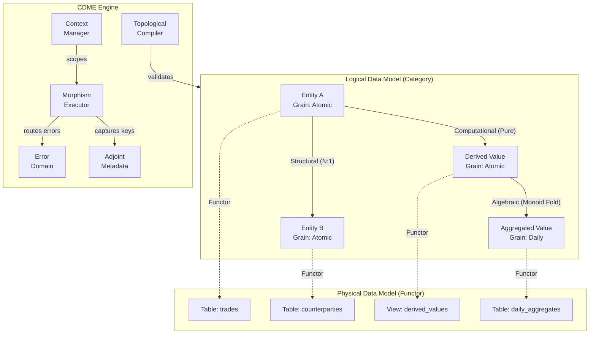
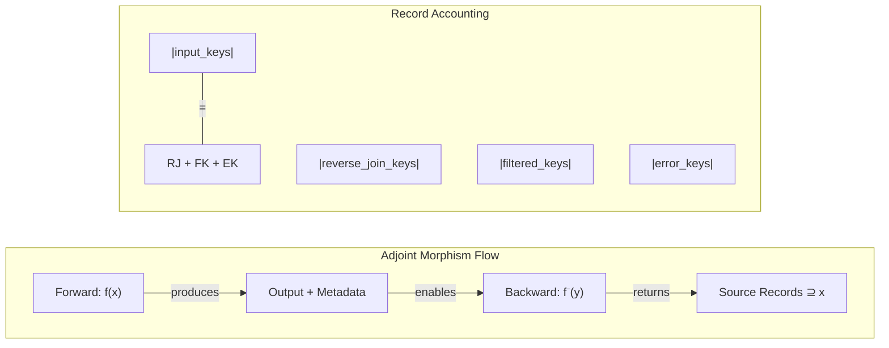

# Requirements: Categorical Data Mapping & Computation Engine (CDME)

**Version**: 1.0.0
**Date**: 2026-02-20
**Status**: Draft — Pending Human Validation
**Edge**: intent → requirements (v2.3 methodology)
**Traces To**: INT-001 through INT-006

---

## 1. Overview

The CDME is a data mapping and computation engine built on Category Theory principles. It treats schemas as categories (objects + morphisms), transformations as functors, and provides compile-time guarantees of pipeline correctness: valid paths, grain safety, type unification, and full lineage traceability.

**Scope**: The engine encompasses:
- A Logical Data Model (LDM) representing schemas as directed multigraphs with typed morphisms
- A Physical Data Model (PDM) abstracting storage bindings via functorial mappings
- A Topological Compiler that validates mapping definitions before execution
- A Traversal Engine that executes validated pipelines with Kleisli lifting and monoidal aggregation
- An Error Domain implementing structured failure routing
- An AI Assurance Layer that validates AI-generated mappings against the same topological constraints
- Adjoint morphisms enabling reverse transformations for reconciliation and impact analysis
- Record accounting with zero-loss guarantees via adjoint metadata

**Relationship to Intent**: This document formalizes the 6 intent sections (INT-001 through INT-006) into structured, testable requirements. INT-006 (Frobenius Algebra) is flagged as speculative and excluded from requirements — recommended as a Discovery vector.

---

## 2. Terminology

| Term | Definition |
|------|-----------|
| **Category** | A mathematical structure comprising Objects and Morphisms with composition and identity laws. In CDME: the scope of a domain (e.g., Trading, Risk). |
| **Object / Entity** | A node in the LDM graph. A finite typed product of attributes existing at a specific Grain. |
| **Morphism** | A directed edge in the LDM graph representing a relationship, computation, or aggregation. Classified as Structural, Computational, or Algebraic. |
| **Functor** | A structure-preserving mapping between categories. In CDME: the binding of LDM entities to PDM storage. |
| **LDM (Logical Data Model)** | The invariant topology — defines WHAT entities and relationships exist, independent of physical storage. |
| **PDM (Physical Data Model)** | The implementation detail — defines WHERE entities are stored (tables, files, streams). |
| **Grain** | The level of detail at which an entity exists (e.g., Atomic, Daily Aggregate, Monthly Aggregate). A formal property used for composition validation. |
| **Kleisli Arrow** | A morphism that expands cardinality (1:N). Requires lifting the execution context from Scalar to List. |
| **Monoid** | An algebraic structure (M, op, identity) where op is associative and identity is neutral. Required for all aggregation operations. |
| **Adjoint Pair** | A pair of morphisms (forward, backward) satisfying round-trip containment laws. Every CDME morphism is modeled as an adjoint pair. |
| **Epoch / Contextual Fiber** | A logical scope boundary (e.g., "Trades for Date T"). Data exists only within its contextual fiber; joins must respect fiber boundaries. |
| **Refinement Type** | A base type constrained by a predicate (e.g., `PositiveInteger` = `Integer where x > 0`). |
| **Error Domain** | A dedicated category for failure objects. Errors are routed here via Either semantics, never silently dropped. |
| **Reverse-Join Table** | Metadata mapping aggregate keys back to contributing source keys, enabling backward traversal. |
| **Topological Compiler** | The validation component that checks path validity, grain safety, and type unification before any data processing occurs. |
| **Writer Effect** | A side-channel accumulator capturing operational telemetry (row counts, latency, quality metrics) during traversal. |
| **Accounting Ledger** | A per-run JSON artifact proving that every input record is accounted for in exactly one output partition. |
| **Containment Laws** | The adjoint round-trip properties: `backward(forward(x)) supseteq x` and `forward(backward(y)) subseteq y`. |
| **Cardinality Budget** | A declarative limit on output expansion (max rows, max join depth) defined in job configuration. |
| **Sheaf-like Consistency** | Data is always interpreted in a local context (fiber), and any composition or join must respect that context or explicitly define how to move between contexts. Does NOT imply full categorical sheaf axioms. |

---

## 3. Functional Requirements

### 3.1 Logical Data Model (LDM)

#### REQ-F-LDM-001: Directed Multigraph Structure

**Priority**: Critical
**Type**: Functional

**Description**: The LDM must be defined as a directed multigraph where nodes are typed entities and edges are typed morphisms with declared cardinality.

**Acceptance Criteria**:
- Given an LDM definition, the system must parse it into a directed multigraph with distinct node and edge types
- Multiple edges between the same pair of nodes must be supported (multigraph)
- Each node must carry identity, attribute schema, and grain metadata
- The graph must be serializable and versionable

**Traces To**: INT-001, INT-002 (Axiom 1)

---

#### REQ-F-LDM-002: Cardinality Classification

**Priority**: Critical
**Type**: Functional

**Description**: Every morphism must declare its categorical cardinality type as exactly one of: `1:1` (Isomorphism/Bijection), `N:1` (Standard Function), or `1:N` (Kleisli Arrow).

**Acceptance Criteria**:
- Each edge in the LDM must have a `cardinality` field with value in {`1:1`, `N:1`, `1:N`}
- An edge without a declared cardinality must be rejected at parse time
- The cardinality type must be used by the traversal engine to determine lifting/folding behaviour

**Traces To**: INT-002 (Axiom 1)

---

#### REQ-F-LDM-003: Path Composition Validity

**Priority**: Critical
**Type**: Functional

**Description**: A path expressed in symbolic dot notation (e.g., `Entity.Relationship.Attribute`) must be validated at compile time. A path is valid if and only if: each referenced morphism exists in the LDM, the codomain of each morphism equals the domain of the next (subject to type unification), grains do not violate grain safety, and the traversing principal has traversal permission on each morphism.

**Acceptance Criteria**:
- A path referencing a non-existent morphism must be rejected with an error naming the missing morphism
- A path with type mismatch at any composition boundary must be rejected with the specific mismatch identified
- A path violating grain safety must be rejected citing the incompatible grains
- A path violating access control must be rejected citing the forbidden morphism
- All rejections must occur at definition/compile time, never at runtime

**Traces To**: INT-001, INT-002 (Axioms 3, 8)

---

#### REQ-F-LDM-004: Monoidal Aggregation Laws

**Priority**: Critical
**Type**: Functional

**Description**: Every aggregation/fold operation must satisfy the monoid laws: the binary operation must be associative, and an identity element must exist such that `e op a = a op e = a`.

**Acceptance Criteria**:
- The system must require every aggregation morphism to declare its binary operation and identity element
- A non-associative aggregation (e.g., "First Value" without deterministic ordering) must be rejected
- Aggregation over an empty input set must yield the declared identity element

**Traces To**: INT-002 (Axiom 9)

---

#### REQ-F-LDM-005: Empty Aggregation Identity

**Priority**: High
**Type**: Functional

**Description**: Aggregation over an empty input set must yield the identity element defined for that monoid, not null or an error.

**Acceptance Criteria**:
- Given an empty input partition, `sum` must return `0`, `count` must return `0`, `concat` must return empty string/list
- The identity element must be declared as part of the monoid definition
- The result type of empty aggregation must match the result type of non-empty aggregation

**Traces To**: INT-002 (Axiom 9)

---

#### REQ-F-LDM-006: Topological Access Control

**Priority**: High
**Type**: Functional

**Description**: The LDM must support Role-Based Access Control (RBAC) on individual morphisms. A denied morphism effectively does not exist for the requesting principal — preventing both data access and path construction through it.

**Acceptance Criteria**:
- Each morphism must support an optional access control list of permitted roles
- A principal lacking permission for morphism `E` must see path validation behave as if `E` does not exist
- Access control must be enforced at compile time (path validation), not only at runtime

**Traces To**: INT-001

---

#### REQ-F-LDM-007: Grain and Type Metadata

**Priority**: Critical
**Type**: Functional

**Description**: Every Entity in the LDM must be explicitly tagged with its Grain (e.g., Atomic, DailyAggregate) and every attribute must be typed using the extended type system.

**Acceptance Criteria**:
- An entity without a declared grain must be rejected at parse time
- An attribute without a declared type must be rejected at parse time
- Grain metadata must be available to the traversal engine for grain safety checks

**Traces To**: INT-002 (Axioms 1, 5, 7)

---

### 3.2 Physical Data Model (PDM)

#### REQ-F-PDM-001: Functorial Storage Abstraction

**Priority**: Critical
**Type**: Functional

**Description**: The system must abstract physical storage via a functorial mapping from LDM to PDM. Re-pointing a Logical Entity from one storage medium to another must not require changing any business logic or LDM definitions.

**Acceptance Criteria**:
- Changing a PDM binding (e.g., File to Table) must require modification only in the PDM artifact, not the LDM or mapping logic
- The same LDM topology must be bindable to multiple PDM configurations
- PDM changes must be validated for type compatibility with the LDM

**Traces To**: INT-001, INT-002 (Axiom 2)

---

#### REQ-F-PDM-002: Generation Grain Declaration

**Priority**: High
**Type**: Functional

**Description**: The PDM must declare the generation grain of each physical source as exactly one of `Event` or `Snapshot`. This set may be extended via future NFRs but must be strictly validated against the allowed list.

**Acceptance Criteria**:
- Each physical source binding must declare a `generation_grain` field with value in {`Event`, `Snapshot`}
- An undeclared or invalid generation grain must be rejected at parse time
- The generation grain must inform boundary slicing behaviour

**Traces To**: INT-002 (Axiom 4)

---

#### REQ-F-PDM-003: Generation Grain Semantics

**Priority**: High
**Type**: Functional

**Description**: Event-grain sources represent continuous streams of immutable occurrences, sliced by temporal windows. Snapshot-grain sources represent entity state at a point in time, sliced by version or timestamp where each snapshot supersedes prior states.

**Acceptance Criteria**:
- Event-grain boundaries must be defined as temporal windows (e.g., "all events in hour H")
- Snapshot-grain boundaries must be defined as version or timestamp references (e.g., "state as-of T")
- Mixing boundary semantics (e.g., applying snapshot slicing to event data) must be rejected

**Traces To**: INT-002 (Axiom 4)

---

#### REQ-F-PDM-004: Epoch Boundary Definition

**Priority**: High
**Type**: Functional

**Description**: The PDM must define how continuous data flow is sliced into processing epochs, consistent with the generation grain semantics of the underlying source.

**Acceptance Criteria**:
- Each PDM source must declare its boundary definition
- The boundary must be consistent with the declared generation grain
- The boundary definition must be deterministic — the same parameters must produce the same data slice

**Traces To**: INT-002 (Axiom 4)

---

#### REQ-F-PDM-005: Lookup Binding

**Priority**: Medium
**Type**: Functional

**Description**: The PDM must support binding reference data (lookups) as either data-backed (table/file) or logic-backed (code/rules).

**Acceptance Criteria**:
- Each lookup binding must declare its backing type
- Data-backed lookups must reference a specific storage location
- Logic-backed lookups must reference a registered computation morphism

**Traces To**: INT-002 (Axiom 6)

---

#### REQ-F-PDM-006: Temporal Binding

**Priority**: Medium
**Type**: Functional

**Description**: The PDM must support temporal binding, allowing a single Logical Entity to map to different physical tables/schemas as a deterministic function of the data epoch.

**Acceptance Criteria**:
- A temporal binding must accept an epoch parameter and return the concrete physical location
- For a given epoch, the binding must be deterministic (same epoch = same location)
- Temporal bindings must be declarative (configuration, not code)

**Traces To**: INT-002 (Axiom 4)

---

### 3.3 Traversal Engine

#### REQ-F-TRV-001: Kleisli Context Lifting

**Priority**: Critical
**Type**: Functional

**Description**: When traversing a `1:N` edge, the engine must automatically lift the execution context from Scalar to List, implementing proper flattening or explosion operations.

**Acceptance Criteria**:
- A scalar value traversing a 1:N edge must produce a list of values
- Nested 1:N traversals must flatten correctly (no unexpected nesting)
- The lift must preserve the parent-child key relationship for lineage

**Traces To**: INT-001, INT-002 (Axiom 3)

---

#### REQ-F-TRV-002: Grain Safety Enforcement

**Priority**: Critical
**Type**: Functional

**Description**: The engine must reject operations that combine attributes from incompatible grains without explicit aggregation. This includes: projecting attributes from incompatible grains into the same output entity, using attributes from incompatible grains within the same expression, and joining entities at different grains implying direct comparability without an aggregation morphism.

**Acceptance Criteria**:
- Combining atomic-grain and aggregate-grain attributes in the same output without aggregation must be rejected
- Using a fine-grain attribute in a coarse-grain expression without aggregation must be rejected
- Joining entities at different grains without an explicit aggregation morphism must be rejected
- All grain violations must be detected at compile time

**Traces To**: INT-002 (Axiom 5)

---

#### REQ-F-TRV-003: Boundary Alignment and Temporal Semantics

**Priority**: High
**Type**: Functional

**Description**: The engine must detect cross-boundary traversals (e.g., joining live data to prior-day reference data) and require the mapping to declare temporal semantics (As-Of, Latest, Exact). Cross-boundary traversals without declared temporal semantics must be rejected.

**Acceptance Criteria**:
- A traversal crossing a system boundary must require a `temporal_semantics` declaration
- Valid temporal semantics values must include at minimum: `as_of`, `latest`, `exact`
- A cross-boundary traversal without temporal semantics must be rejected at compile time
- The declared semantics must be applied during execution planning

**Traces To**: INT-002 (Axiom 4)

---

#### REQ-F-TRV-004: Operational Telemetry via Writer Effect

**Priority**: High
**Type**: Functional

**Description**: The execution context must implement a Writer Effect (accumulator) to capture row counts, quality metrics, and latency statistics at every node traversal.

**Acceptance Criteria**:
- Each morphism execution must emit telemetry: input count, output count, error count, latency
- Telemetry must be accumulated without affecting the data flow (side-channel)
- Telemetry must be accessible after execution for audit and monitoring

**Traces To**: INT-001

---

#### REQ-F-TRV-005: Deterministic Reproducibility

**Priority**: Critical
**Type**: Functional

**Description**: Because all transformations and lookups are immutable and versioned, the system must guarantee that any target value is deterministically derivable from the source inputs. The same inputs, lookups, and configuration must always produce the same output.

**Acceptance Criteria**:
- Re-running a pipeline with identical inputs, lookup versions, and configuration must produce bit-identical output
- The system must not depend on non-deterministic operations (random, current time) unless explicitly declared as external morphisms
- Reproducibility must be verifiable by comparing output hashes across runs

**Traces To**: INT-001, INT-002 (Axiom 6)

---

#### REQ-F-TRV-006: Computational Cost Governance

**Priority**: High
**Type**: Functional

**Description**: The engine must implement a cost estimation functor. Before executing a plan, the system must estimate the cardinality explosion and reject execution if it exceeds the declared budget (max output rows, max join depth, max intermediate size).

**Acceptance Criteria**:
- The budget must be declarable in the execution artifact (job configuration)
- The engine must estimate output cardinality before execution begins
- Execution must be rejected if the estimated cardinality exceeds the budget
- The rejection message must include the estimated vs budgeted cardinality

**Traces To**: INT-001

---

### 3.4 Context Consistency

#### REQ-F-CTX-001: Fiber Compatibility for Joins

**Priority**: Critical
**Type**: Functional

**Description**: When joining two data streams, their contextual fibers must share the same epoch, or use explicit temporal semantics per REQ-F-TRV-003, and have compatible partitioning scopes or explicitly reconcile them. Joins violating these conditions must be rejected at validation time.

**Acceptance Criteria**:
- A join between two streams in the same epoch must be permitted
- A join between two streams in different epochs must require declared temporal semantics
- A join between incompatibly partitioned streams must either require explicit reconciliation or be rejected
- All fiber compatibility checks must occur at compile time

**Traces To**: INT-002 (Axiom 4)

---

### 3.5 Synthesis and Integration

#### REQ-F-SYN-001: Isomorphic Synthesis

**Priority**: High
**Type**: Functional

**Description**: Users must be able to define new attributes via pure functions over existing entities and attributes.

**Acceptance Criteria**:
- A synthesis expression must reference only attributes reachable via valid paths in the LDM
- The output type must be derivable from the input types and the function signature
- Synthesis must be validated at compile time (no runtime type errors from synthesis expressions)

**Traces To**: INT-001, INT-002 (Axiom 9)

---

#### REQ-F-SYN-002: Multi-Level Aggregation

**Priority**: High
**Type**: Functional

**Description**: The system must support aggregating over data that is already aggregated, if and only if: the aggregation function at each level satisfies the monoid laws, the grain hierarchy permits the composition, and the morphism path explicitly encodes the multi-level aggregation steps.

**Acceptance Criteria**:
- A valid grain hierarchy (e.g., Atomic → Daily → Monthly → Yearly) must be declarable in the LDM
- Multi-level aggregation must require a separate morphism per aggregation level
- Skipping grain levels (e.g., Atomic → Yearly without intermediate) must be validated against the declared hierarchy

**Traces To**: INT-001, INT-002 (Axiom 5)

---

#### REQ-F-SYN-003: Full Lineage Traceability

**Priority**: Critical
**Type**: Functional

**Description**: The system must provide full lineage, mapping every target value back to the specific source epoch, entity, and path of morphisms that generated it.

**Acceptance Criteria**:
- Every target attribute must be traceable to its source entity, epoch, and morphism path
- Lineage must be queryable after execution without recomputation
- Lineage must be emitted as an OpenLineage-compatible event

**Traces To**: INT-001

---

#### REQ-F-SYN-004: Complex Business Logic

**Priority**: High
**Type**: Functional

**Description**: The system must support advanced formulations within the synthesis map, including conditional expressions (if-then-else), prioritised fallback logic, composition of multiple morphisms into a single synthesis, and construction of product/tuple types from multiple inputs.

**Acceptance Criteria**:
- Conditional expressions must be supported with type-safe branching (both branches must produce compatible types)
- Prioritised fallback logic (e.g., "if A present, else B, else C") must be expressible
- Multiple morphisms must be composable into a single synthesis step
- Product types must be constructable from multiple input attributes

**Traces To**: INT-001, INT-002 (Axiom 9)

---

#### REQ-F-SYN-005: Multi-Grain Formulation

**Priority**: High
**Type**: Functional

**Description**: The system must allow formulas that reference attributes at different grains provided: any finer-grained attribute is wrapped in an explicit aggregation morphism satisfying monoid laws, the aggregation scope is aligned to the coarser entity's grain, and direct unaggregated reference to a finer-grained attribute in a coarser expression is rejected.

**Acceptance Criteria**:
- A formula referencing a finer-grain attribute with an aggregation wrapper must be accepted
- A formula referencing a finer-grain attribute without aggregation must be rejected at compile time
- The aggregation scope must match the grain of the enclosing expression

**Traces To**: INT-002 (Axioms 5, 9)

---

#### REQ-F-SYN-006: Versioned Lookups

**Priority**: Critical
**Type**: Functional

**Description**: All reference data usage in transformations must be explicitly versioned. A mapping that uses a lookup must specify version semantics (explicit version ID, temporal constraint, or deterministic alias). Unversioned lookup usage must be rejected. Within a single execution context, repeated resolutions of the same lookup and key must yield the same value.

**Acceptance Criteria**:
- A mapping using a lookup without version semantics must be rejected at compile time
- Valid version semantics include: explicit version ID, "as-of epoch", or deterministic alias ("Production", "Latest")
- Within a single execution, resolving the same (lookup, key) pair twice must return the same value
- The resolved version must be recorded in lineage metadata

**Traces To**: INT-002 (Axiom 6)

---

#### REQ-F-SYN-007: Deterministic Key Generation

**Priority**: Medium
**Type**: Functional

**Description**: The system must support deterministic key generation (hashing/surrogate keys) such that the same input(s) always produce the same key.

**Acceptance Criteria**:
- A key generation function must be deterministic (same inputs → same key)
- The key generation algorithm must be declared and versioned
- Generated keys must be traceable to their input values via lineage

**Traces To**: INT-001

---

#### REQ-F-SYN-008: External Computational Morphisms

**Priority**: High
**Type**: Functional

**Description**: The system must support the registration of black-box calculators (e.g., compiled cashflow engines) as standard morphisms, subject to: declared domain and codomain types conforming to the LDM type system, a determinism assertion by the registrant, and a stable identifier/version for traceability.

**Acceptance Criteria**:
- An external morphism must declare its input types (domain) and output types (codomain)
- Type signature compatibility must be enforced at compile time
- The registrant must assert determinism; the engine must log this assertion
- The calculator version and identity must appear in lineage records
- The engine must NOT attempt runtime verification of determinism beyond type checks

**Traces To**: INT-003

---

### 3.6 Type System

#### REQ-F-TYP-001: Extended Type System

**Priority**: Critical
**Type**: Functional

**Description**: The LDM must support a rich type system comprising: primitive types, sum types (tagged unions), product types (tuples/records), and refinement types (type + predicate).

**Acceptance Criteria**:
- Primitive types (Integer, String, Boolean, Float, Date, Timestamp) must be supported
- Sum types must be definable (e.g., `PaymentMethod = Card | BankTransfer | Cash`)
- Product types must be definable (e.g., `Address = (Street, City, PostCode)`)
- Refinement types must be definable (e.g., `PositiveInteger = Integer where x > 0`)

**Traces To**: INT-002 (Axiom 7)

---

#### REQ-F-TYP-002: Refinement Type Enforcement

**Priority**: High
**Type**: Functional

**Description**: Data that violates a refinement type predicate must be classified as an error and routed to the Error Domain. It must not propagate through the pipeline.

**Acceptance Criteria**:
- A value failing a refinement predicate must produce a `Left(Error)` result
- The error must contain the failing value, the predicate, and the source location
- No refinement-violating value may appear in successful output

**Traces To**: INT-002 (Axiom 7)

---

#### REQ-F-TYP-003: Explicit Casting

**Priority**: High
**Type**: Functional

**Description**: Implicit type casting is forbidden. All type changes must be expressed as explicit morphisms in the LDM.

**Acceptance Criteria**:
- The engine must never perform implicit type coercion
- A type mismatch at a composition boundary must be rejected unless an explicit casting morphism is provided
- Casting morphisms must be first-class morphisms subject to the same validation rules as any other morphism

**Traces To**: INT-002 (Axiom 7)

---

#### REQ-F-TYP-004: Type Unification Rules

**Priority**: Critical
**Type**: Functional

**Description**: When composing morphisms `f: A → B` and `g: B → C`: composition is valid if the codomain of `f` equals the domain of `g`; composition may be valid if the codomain of `f` is a subtype of the domain of `g` per the LDM type hierarchy; otherwise composition must be rejected. No implicit coercion is allowed.

**Acceptance Criteria**:
- Exact type match at composition boundaries must be accepted
- Subtype match (codomain is subtype of domain) must be accepted per the declared type hierarchy
- Type mismatch without explicit casting morphism must be rejected at compile time
- The rejection message must identify the specific types that failed to unify

**Traces To**: INT-002 (Axioms 7, 8)

---

#### REQ-F-TYP-005: Semantic Type Enforcement (Optional)

**Priority**: Medium
**Type**: Functional

**Description**: The type system may support semantic type distinctions (e.g., `Money`, `Date`, `Percent`) beyond primitive types. If semantic types are defined: operations between incompatible semantic types must be rejected unless explicit conversion morphisms are provided.

**Acceptance Criteria**:
- If semantic types are declared, `Money + Date` (or similar category errors) must be rejected
- Conversions between semantic types must be modeled as explicit morphisms
- If only primitive types are used, detection of semantic category errors is out of scope

**Traces To**: INT-002 (Axiom 7)

---

### 3.7 Error Domain

#### REQ-F-ERR-001: Either Monad Error Routing

**Priority**: Critical
**Type**: Functional

**Description**: The system must handle failures via a strict Either strategy (`Left(Error) | Right(Value)`). Failures must not short-circuit the entire execution unless a batch threshold is exceeded. All invalid records must be routed to the Error Domain; they must not be silently dropped.

**Acceptance Criteria**:
- Every morphism execution must produce either `Right(value)` or `Left(error)`
- `Left` results must be routed to the Error Domain sink
- Processing must continue for remaining records after a `Left` result (unless threshold exceeded)
- Zero records may be silently dropped — every input must appear in either the success or error output

**Traces To**: INT-002 (Axiom 10)

---

#### REQ-F-ERR-002: Batch Failure Threshold

**Priority**: High
**Type**: Functional

**Description**: The execution artifact (job configuration) may define a batch failure threshold as an absolute error count or a percentage of total records. If exceeded: execution must halt, commit/rollback of successful records must be controlled by job configuration, and the Error Domain must contain all failures encountered prior to halt. Default when unconfigured: no threshold (process all records).

**Acceptance Criteria**:
- Threshold must be configurable as absolute count or percentage
- Exceeding the threshold must halt execution immediately
- Job configuration must control whether successful records are committed or rolled back
- The Error Domain must contain all errors encountered before halt
- When no threshold is configured, all records must be processed regardless of error rate

**Traces To**: INT-002 (Axiom 10)

---

#### REQ-F-ERR-003: Error Handling Idempotency

**Priority**: High
**Type**: Functional

**Description**: Error handling logic must be idempotent: re-processing the same failing records under the same conditions must produce the same error results.

**Acceptance Criteria**:
- Re-running a pipeline with the same failing input must produce identical error records
- Error classification must be deterministic (same failure = same error type)
- Error metadata must be reproducible

**Traces To**: INT-002 (Axiom 10)

---

#### REQ-F-ERR-004: Error Object Content

**Priority**: Critical
**Type**: Functional

**Description**: Each error object routed to the Error Domain must contain at minimum: the type of constraint or refinement that failed, the offending value(s), the source entity and epoch, and the morphism path at which the failure occurred.

**Acceptance Criteria**:
- Every error record must include: `failure_type`, `offending_values`, `source_entity`, `source_epoch`, `morphism_path`
- Error objects must be structured (not free-text messages)
- Error objects must be queryable by any of the above fields

**Traces To**: INT-002 (Axiom 10)

---

### 3.8 AI Assurance

#### REQ-F-AIA-001: Topological Validity for AI Mappings

**Priority**: Critical
**Type**: Functional

**Description**: The engine must validate AI-generated mappings using the same structural rules as human-authored mappings. It must reject any mapping that: references non-existent morphisms (hallucinated relationships), violates type unification rules, violates grain safety, or violates morphism-level access control. The engine is not required to validate domain-semantic correctness beyond what is encoded in the type system.

**Acceptance Criteria**:
- AI-generated mappings must pass through the same topological compiler as human-authored mappings
- A hallucinated relationship (referencing non-existent morphism) must be rejected with an error naming the missing morphism
- Type, grain, and access control violations must be detected identically for AI-generated and human-authored mappings
- No special bypass or relaxed validation must exist for AI-generated mappings

**Traces To**: INT-004

---

#### REQ-F-AIA-002: Triangulation of Assurance

**Priority**: High
**Type**: Functional

**Description**: The system must support the linkage of Intent, Logic, and Proof for real-time verification. Proof constitutes: the generated lineage graph, the execution trace logs, and the type unification report demonstrating that output data structurally matches the intent.

**Acceptance Criteria**:
- Each pipeline execution must produce a proof artifact containing: lineage graph, execution trace, type unification report
- The proof must be linkable to the original intent and the mapping logic
- The proof must be sufficient for an independent auditor to verify structural correctness

**Traces To**: INT-004

---

#### REQ-F-AIA-003: Dry Run Mode

**Priority**: High
**Type**: Functional

**Description**: The system must support a dry-run mode that executes validation and planning without committing results to sinks, providing immediate assurance signals.

**Acceptance Criteria**:
- Dry-run mode must execute the full topological compiler (path, grain, type checks)
- Dry-run mode must produce a cost estimate (cardinality explosion)
- Dry-run mode must NOT write to output sinks
- Dry-run mode must report all validation results (pass/fail with details)

**Traces To**: INT-004

---

### 3.9 Record Accounting

#### REQ-F-ACC-001: Zero-Loss Accounting Invariant

**Priority**: Critical
**Type**: Functional

**Description**: Every input record must be accounted for in exactly one output partition: processed, filtered, errored, or aggregated. The equation `|input_keys| = |reverse_join_keys| + |filtered_keys| + |error_keys|` must hold for every run.

**Acceptance Criteria**:
- The accounting equation must hold for every completed run
- No record may appear in multiple partitions (mutual exclusivity)
- No record may be unaccounted (completeness)
- Accounting verification must execute before marking a run as complete

**Traces To**: INT-005

---

#### REQ-F-ACC-002: Accounting Ledger

**Priority**: Critical
**Type**: Functional

**Description**: Each run must produce a `ledger.json` file proving the accounting invariant holds, containing: input record count, source key field, partition breakdown with adjoint metadata locations, verification status, and discrepancy details if unbalanced.

**Acceptance Criteria**:
- Ledger must contain input count, partition breakdown, and verification status
- Each partition must reference its adjoint metadata location
- Ledger must be written atomically at run completion
- Ledger format must be machine-readable (JSON) and human-auditable

**Traces To**: INT-005

---

#### REQ-F-ACC-003: Adjoint Key Capture

**Priority**: Critical
**Type**: Functional

**Description**: All morphisms must capture source keys in appropriate adjoint metadata to enable backward traversal. Aggregations must capture contributing keys in ReverseJoinMetadata, filters must capture excluded keys in FilteredKeysMetadata, errors must capture source_key, and explodes must capture parent-child mappings.

**Acceptance Criteria**:
- Aggregation morphisms must persist contributing source keys mapped to aggregate keys
- Filter morphisms must persist excluded keys with filter condition identifier
- Error records must include source_key from input
- 1:N expansions must persist parent_key → [child_keys] mapping
- All adjoint metadata must be persistent (not ephemeral)

**Traces To**: INT-005

---

#### REQ-F-ACC-004: Run Completion Gate

**Priority**: Critical
**Type**: Functional

**Description**: A run must not be marked COMPLETE unless the accounting invariant verification passes. If verification fails, the run must be marked FAILED with discrepancy details.

**Acceptance Criteria**:
- Verification must run automatically before setting run status to COMPLETE
- Passing verification must emit an OpenLineage COMPLETE event with ledger reference
- Failing verification must set status to FAILED and emit an OpenLineage FAIL event
- The accounting ledger must be persisted regardless of pass/fail status

**Traces To**: INT-005

---

#### REQ-F-ACC-005: Backward Traversal Proof

**Priority**: High
**Type**: Functional

**Description**: Any output record must be traceable back to its source records via adjoint metadata, without recomputation.

**Acceptance Criteria**:
- Given an aggregate key, the system must retrieve all contributing source keys from ReverseJoinMetadata
- Given a filtered key, the system must confirm exclusion via FilteredKeysMetadata with the applied filter condition
- Given an error key, the system must retrieve the original record and failure reason
- Backward traversal must be deterministic (same query = same lineage)

**Traces To**: INT-005

---

### 3.10 Adjoint Morphisms

#### REQ-F-ADJ-001: Adjoint Interface

**Priority**: Critical
**Type**: Functional

**Description**: Every morphism in the LDM must implement the Adjoint interface comprising a forward function and a backward function satisfying round-trip containment laws: `backward(forward(x)) supseteq x` (lower adjoint) and `forward(backward(y)) subseteq y` (upper adjoint).

**Acceptance Criteria**:
- Every morphism must declare both a `forward` and a `backward` function
- The containment laws must be expressible as compile-time or test-time assertions
- Morphisms without a declared backward must be rejected at registration time

**Traces To**: INT-005

---

#### REQ-F-ADJ-002: Self-Adjoint Isomorphisms

**Priority**: High
**Type**: Functional

**Description**: Isomorphic (1:1) morphisms must be self-adjoint, meaning the backward is the exact inverse of the forward: `backward(forward(x)) = x`.

**Acceptance Criteria**:
- A 1:1 morphism must declare an exact inverse as its backward
- Round-trip must produce exactly the original value (not just a superset)
- The system must verify self-adjoint status for declared isomorphisms

**Traces To**: INT-005

---

#### REQ-F-ADJ-003: Lossy Containment Bounds

**Priority**: High
**Type**: Functional

**Description**: Lossy morphisms (N:1, aggregation, filter) must have well-defined containment bounds. The backward must return a superset of the original input that maps to the given output.

**Acceptance Criteria**:
- N:1 morphisms must return all inputs mapping to the same output via backward
- Aggregation morphisms must return all contributing records via backward
- Filter morphisms must return both passed and filtered records via backward
- The containment bound must be documented for each morphism type

**Traces To**: INT-005

---

#### REQ-F-ADJ-004: Contravariant Composition

**Priority**: High
**Type**: Functional

**Description**: Adjoint composition must follow the contravariant law: `(g compose f).backward = f.backward compose g.backward`. This must be validated at compile time.

**Acceptance Criteria**:
- Composing two adjoint morphisms must produce an adjoint morphism
- The composed backward must apply individual backwards in reverse order
- The compile-time validator must check composability of adjoints

**Traces To**: INT-005

---

#### REQ-F-ADJ-005: Backward Execution Path

**Priority**: High
**Type**: Functional

**Description**: The reverse execution path must be computable for any valid forward path. Given a target subset, the system must compute the corresponding source records.

**Acceptance Criteria**:
- Given a forward path `A → B → C`, the backward path `C → B → A` must be automatically derivable
- Backward execution must use adjoint metadata (not recomputation)
- The backward path must respect the same epoch/context as the forward path

**Traces To**: INT-005

---

#### REQ-F-ADJ-006: Data Reconciliation

**Priority**: High
**Type**: Functional

**Description**: The system must support data reconciliation via `backward(forward(x)) supseteq x` validation — confirming that reversing the transformation produces a superset containing the original input.

**Acceptance Criteria**:
- A reconciliation function must accept a forward result and verify the containment law
- The reconciliation must report: exact match (isomorphism), superset match (lossy but complete), or violation (missing records)
- Reconciliation must be executable as a post-processing step without modifying pipeline output

**Traces To**: INT-005

---

#### REQ-F-ADJ-007: Impact Analysis

**Priority**: High
**Type**: Functional

**Description**: The system must support impact analysis via `backward(target_subset)` — computing which source records contributed to a given subset of the target.

**Acceptance Criteria**:
- Given a subset of target records, the system must return the set of source records that contributed
- The computation must use adjoint metadata (not re-execute the pipeline)
- The result must include the morphism path used for each source-to-target connection

**Traces To**: INT-005

---

## 4. Non-Functional Requirements

### 4.1 Performance

#### REQ-NFR-PERF-001: Throughput Target

**Priority**: High
**Type**: Non-Functional

**Description**: The engine must sustain a minimum throughput of 1 million records per hour for standard pipeline configurations on the target deployment hardware.

**Acceptance Criteria**:
- A benchmark pipeline processing 1M records must complete within 60 minutes on the target hardware
- Throughput must be measured end-to-end including validation, execution, lineage capture, and accounting
- Throughput must scale linearly with horizontal compute additions

**Traces To**: INT-001

---

#### REQ-NFR-PERF-002: Skew Mitigation

**Priority**: High
**Type**: Non-Functional

**Description**: The engine must detect and mitigate data skew during Kleisli (1:N) expansions. When predicted cardinality for a key or partition exceeds the budget, the engine must apply skew-mitigation strategies (e.g., salted joins) or reject the execution plan.

**Acceptance Criteria**:
- The engine must sample or estimate data distribution before Kleisli lifts
- Whale keys (keys with extreme cardinality) must trigger salted join strategies
- Skew mitigation must preserve join semantics (no lost or duplicated records)
- The mitigation strategy must be logged in the execution plan

**Traces To**: INT-001

---

### 4.2 Distributed Execution

#### REQ-NFR-DIST-001: Distributed Framework Support

**Priority**: Critical
**Type**: Non-Functional

**Description**: The engine must be capable of executing on distributed compute frameworks. All aggregation operations must be safe for distributed execution (parallelizable via monoid associativity).

**Acceptance Criteria**:
- Aggregation must be decomposable into per-partition computation and merge
- The merge operation must use the declared monoid's binary operation
- Partial aggregations from different executors must combine correctly
- The engine must support Apache Spark as the primary distributed runtime

**Traces To**: INT-001

---

### 4.3 Observability

#### REQ-NFR-OBS-001: OpenLineage Compatibility

**Priority**: High
**Type**: Non-Functional

**Description**: The engine must emit OpenLineage-compatible events for pipeline start, completion, and failure, including lineage metadata for all target attributes.

**Acceptance Criteria**:
- Each pipeline run must emit at minimum: START, COMPLETE or FAIL events
- Events must conform to the OpenLineage specification
- Lineage facets must reference source entities, morphism paths, and target attributes
- Events must include the accounting ledger reference

**Traces To**: INT-001

---

#### REQ-NFR-OBS-002: REQ Key Telemetry Tagging

**Priority**: Medium
**Type**: Non-Functional

**Description**: Runtime telemetry (logs, metrics, traces) must be tagged with the REQ keys of the requirements being exercised, enabling feature-level observability.

**Acceptance Criteria**:
- Log entries from morphism execution must include the REQ key(s) the morphism implements
- Metrics must be segmentable by REQ key
- Tracing spans must carry REQ key attributes

**Traces To**: INT-001

---

### 4.4 Artifact Versioning

#### REQ-NFR-VER-001: Configuration Artifact Versioning

**Priority**: High
**Type**: Non-Functional

**Description**: All configuration artifacts (LDM, PDM, mapping logic, job configuration) must be versioned. The system must record which artifact versions were used for each pipeline execution.

**Acceptance Criteria**:
- Each artifact must carry a version identifier
- Pipeline execution metadata must record all artifact versions used
- Changing an artifact must require a new version (immutability within version)

**Traces To**: INT-001, INT-002 (Axiom 6)

---

## 5. Data Requirements

### 5.1 Lineage

#### REQ-DATA-LIN-001: Lineage Mode Selection

**Priority**: High
**Type**: Data Quality

**Description**: The engine must support at least three lineage modes per job, selectable via job configuration: Full Lineage (persist all intermediate keys), Key-Derivable Lineage (persist compressed key envelopes for deterministic reconstruction), and Summary/Sampled Lineage (persist lineage for a configurable sample).

**Acceptance Criteria**:
- Full lineage mode must enable record-precise backward traversal with no recomputation
- Key-derivable mode must enable reconstruction using only immutable inputs, checkpoint envelopes, and compiled plan logic
- Summary mode must persist lineage for a configurable sample rate
- Lineage mode must be selectable per job in the execution artifact

**Traces To**: INT-001, INT-005

---

#### REQ-DATA-LIN-002: Morphism Lossiness Classification

**Priority**: High
**Type**: Data Quality

**Description**: Every morphism in the compiled execution plan must be classified as Lossless (deterministic, injective, no record drops) or Lossy (drops records, merges records, uses non-versioned state). This classification drives checkpointing policy.

**Acceptance Criteria**:
- The compiler must classify each morphism as lossless or lossy
- Pure field derivations and deterministic enrichments must be classified as lossless
- Aggregations, filters, and non-versioned lookups must be classified as lossy
- The classification must be available in the execution plan metadata

**Traces To**: INT-001, INT-005

---

#### REQ-DATA-LIN-003: Checkpointing Policy

**Priority**: High
**Type**: Data Quality

**Description**: The implementation must persist key envelopes at: all graph inputs, all graph outputs, and immediately after every lossy morphism. Intermediate nodes within connected subgraphs of lossless morphisms may omit key capture.

**Acceptance Criteria**:
- Checkpoints must exist at every graph input and output
- Checkpoints must exist immediately after every lossy morphism
- Each checkpoint must record: segment ID, start/end keys, key generation function ID, offset/count metadata
- Lossless intermediate nodes may omit checkpoints if keys are derivable

**Traces To**: INT-005

---

#### REQ-DATA-LIN-004: Reconstructability Invariant

**Priority**: High
**Type**: Data Quality

**Description**: For jobs in Key-Derivable Lineage mode, it must be algorithmically possible to reconstruct the set of source keys for any target record using only the immutable input data, recorded checkpoint envelopes, and compiled plan logic. If a plan cannot guarantee this, the engine must insert additional checkpoints or downgrade to Full Lineage mode.

**Acceptance Criteria**:
- The compiler must verify reconstructability for key-derivable plans
- Unsorted keys in a nominally lossless segment must trigger additional checkpoints
- Non-deterministic morphisms must trigger downgrade to Full Lineage mode
- The verification must occur at compile time, before execution begins

**Traces To**: INT-005

---

### 5.2 Data Quality

#### REQ-DATA-QAL-001: Probabilistic Circuit Breaker

**Priority**: Medium
**Type**: Data Quality

**Description**: To prevent cascading failure from systemic errors, the engine must implement a probabilistic circuit breaker. If the failure rate exceeds a configured threshold (e.g., 5% of the first 10k rows), the engine must halt processing, emit a structural/configuration error, and avoid writing mass error records to the DLQ.

**Acceptance Criteria**:
- The circuit breaker must be configurable (threshold percentage, sample window size)
- Tripping the breaker must halt execution immediately
- The breaker must distinguish structural errors from data quality errors
- The halt reason must be logged with the failure rate and sample size

**Traces To**: INT-002 (Axiom 10)

---

#### REQ-DATA-QAL-002: Approximate Aggregation Support

**Priority**: Medium
**Type**: Data Quality

**Description**: For non-monoidal metrics (median, percentile, distinct count), the engine must support approximate mergeable data structures (sketches) such as t-Digest, Q-Digest, or HyperLogLog. The LDM must distinguish between ExactAgg and ApproxAgg.

**Acceptance Criteria**:
- Approximate aggregation must use mergeable sketch structures (monoid-compatible)
- The LDM must classify each aggregation as ExactAgg or ApproxAgg
- Approximate results must include error bounds
- Governance must be able to control where approximations are permissible

**Traces To**: INT-002 (Axiom 9)

---

## 6. Business Rules

### 6.1 Grain Safety

#### REQ-BR-GRN-001: Grain Mixing Prohibition

**Priority**: Critical
**Type**: Business Rule

**Description**: Combining attributes from incompatible grains without explicit aggregation is forbidden. This is a topological invariant of the system — not a configurable option.

**Acceptance Criteria**:
- The rule must be enforced at compile time with no override mechanism
- The error message must identify the specific grains that are incompatible
- The error must suggest adding an aggregation morphism as the resolution

**Traces To**: INT-002 (Axiom 5)

---

### 6.2 Regulatory Compliance

#### REQ-BR-REG-001: BCBS 239 Compliance

**Priority**: Critical
**Type**: Business Rule

**Description**: The system must satisfy BCBS 239 principles: Accuracy and Integrity (via type system and deterministic reproducibility), Completeness (via path validation, grain correctness, lineage, and explicit error capture), and Adaptability (via LDM/PDM separation).

**Acceptance Criteria**:
- Principle 3 (Accuracy): Type enforcement and reproducibility must be demonstrable
- Principle 4 (Completeness): Every input record must be accounted for in lineage
- Principle 6 (Adaptability): PDM changes must not require LDM changes
- An audit package must be producible demonstrating compliance

**Traces To**: INT-001

---

#### REQ-BR-REG-002: FRTB Compliance

**Priority**: High
**Type**: Business Rule

**Description**: The system must support granular attribution of risk factors as required by FRTB, via full lineage traceability, grain correctness, and deterministic reproducibility.

**Acceptance Criteria**:
- Risk factor attribution must be traceable from target to source
- Grain correctness must be enforced for risk aggregation hierarchies
- All computations must be deterministically reproducible

**Traces To**: INT-001

---

#### REQ-BR-REG-003: GDPR and CCPA Compliance

**Priority**: High
**Type**: Business Rule

**Description**: The system must support Right to be Forgotten via deterministic identity (enabling targeted removal) combined with LDM/PDM separation (enabling anonymisation at the physical level without changing business logic).

**Acceptance Criteria**:
- Deterministic key generation must enable identification of all records belonging to a subject
- Physical-level removal or anonymisation must be possible without modifying the LDM
- The operation must be auditable

**Traces To**: INT-001

---

#### REQ-BR-REG-004: EU AI Act Compliance

**Priority**: High
**Type**: Business Rule

**Description**: The system must satisfy EU AI Act Article 14 (Human Oversight) via AI mapping validation and Article 15 (Robustness) via topological strictness preventing invalid mappings.

**Acceptance Criteria**:
- AI-generated mappings must pass human-reviewable validation reports
- The system must guarantee deterministic behaviour (no non-deterministic AI-generated code executes without validation)
- Robustness must be demonstrable via the topological compiler's rejection of invalid mappings

**Traces To**: INT-004

---

## 7. Success Criteria

Each criterion is tied to specific REQ keys and must be falsifiable.

| # | Criterion | REQ Keys | Verification Method |
|---|-----------|----------|-------------------|
| SC-01 | Source LDM with atomic event grain and target LDM with daily aggregate grain are defined and validated | REQ-F-LDM-001, REQ-F-LDM-007 | Define both LDMs; compiler must accept without error |
| SC-02 | A 1:N path (Kleisli arrow) is mapped and executes with correct lifting | REQ-F-TRV-001, REQ-F-LDM-002 | Execute pipeline with 1:N traversal; verify output cardinality matches expected expansion |
| SC-03 | Cross-system-boundary join with temporal semantics executes correctly | REQ-F-TRV-003, REQ-F-CTX-001 | Join live data to prior-day reference with declared as-of semantics; verify correct temporal resolution |
| SC-04 | Engine generates correct execution plan for join + expand + aggregate + output pipeline | REQ-F-LDM-004, REQ-F-TRV-001, REQ-F-SYN-002 | End-to-end pipeline without manual query intervention |
| SC-05 | Conditional priority selection formula executes correctly | REQ-F-SYN-004 | Mapping with if-then-else logic produces correct output for all branches |
| SC-06 | Lookup version semantics are enforced for the duration of execution | REQ-F-SYN-006 | Same lookup key resolved twice in one execution returns identical value |
| SC-07 | Refinement type violation routes record to Error Domain with required metadata | REQ-F-TYP-002, REQ-F-ERR-004 | Submit record violating refinement predicate; verify error object contains all required fields |
| SC-08 | Full lineage emitted as OpenLineage event on completion | REQ-F-SYN-003, REQ-NFR-OBS-001 | Verify OpenLineage COMPLETE event contains lineage for all target attributes |
| SC-09 | Audit package is producible (LDM, PDM, logic, lineage, trace, type report) | REQ-F-AIA-002, REQ-BR-REG-001 | Generate package; verify an independent auditor can reconstruct the transformation path |
| SC-10 | AI-generated mapping with hallucinated relationship is rejected | REQ-F-AIA-001 | Submit mapping referencing non-existent morphism; verify rejection with named missing morphism |
| SC-11 | External calculator registered as morphism with traced type signature and version | REQ-F-SYN-008 | Register cashflow engine; verify type checking, lineage recording, and version tracking |
| SC-12 | Re-running job with partial errors produces identical valid and error outputs | REQ-F-ERR-003, REQ-F-TRV-005 | Run twice with same inputs; compare output hashes for both success and error partitions |
| SC-13 | Accounting invariant holds: all input records accounted for across output partitions | REQ-F-ACC-001, REQ-F-ACC-002 | Verify ledger.json equation balances for a production-scale run |
| SC-14 | Backward traversal from aggregate key returns all contributing source records | REQ-F-ACC-005, REQ-F-ADJ-005 | Query backward for an aggregate key; verify all contributing source keys are returned |

---

## 8. Assumptions and Dependencies

### Assumptions

| ID | Assumption | Impact if Wrong |
|---|-----------|----------------|
| A-001 | The CDME is a library/framework providing a programmatic API, not a standalone service with a REST API | API design and deployment model would need requirements |
| A-002 | Schema definitions (LDM, PDM) are provided as structured data (YAML/JSON/DSL), not graphical | Would need UI requirements for visual schema editor |
| A-003 | External computational morphisms (REQ-F-SYN-008) are genuinely deterministic as asserted | Reproducibility guarantees (REQ-F-TRV-005) would be violated |
| A-004 | Apache Spark is the primary distributed runtime target | Runtime abstraction layer would need redesign for other frameworks |
| A-005 | The system operates within a single organization's data governance boundary | Multi-tenancy and data sovereignty would need additional requirements |
| A-006 | Default batch failure threshold is "no threshold" (process all records) when unconfigured | If a different default is needed, REQ-F-ERR-002 must be updated |

### Dependencies

| ID | Dependency | Required For |
|---|-----------|-------------|
| D-001 | Apache Spark 3.5.x runtime | REQ-NFR-DIST-001, REQ-NFR-PERF-001 |
| D-002 | OpenLineage specification and compatible collector | REQ-NFR-OBS-001 |
| D-003 | Scala 2.13.12 compiler | All code implementation |
| D-004 | sbt build system | Build and dependency management |
| D-005 | ScalaTest + ScalaCheck | Test execution and property-based testing |

---

## 9. Domain Model

---

## 10. Scope Exclusions

The following are explicitly NOT in scope for this specification:

| Exclusion | Rationale |
|-----------|----------|
| **Frobenius Algebra formalization** | INT-006 is speculative. Recommend a Discovery vector to evaluate whether Frobenius provides value beyond Adjoint pairs. |
| **Visual schema editor / GUI** | The CDME is a library/framework. UI tooling is a separate concern. |
| **Schema migration / evolution** | How existing pipelines evolve when the LDM changes is a future concern requiring its own intent. |
| **Multi-tenancy** | The system operates within a single governance boundary. |
| **String diagram tooling** | Mentioned in Appendix A as a potential benefit of Frobenius; deferred. |
| **Runtime machine learning** | The engine validates and executes deterministic pipelines; ML model training is out of scope. |

---

## Appendix: Requirement Key Mapping

This table maps the original product specification keys (mapper_requirements.md v7.2) to the formal REQ-{TYPE}-{DOMAIN}-{SEQ} keys used in this document.

| Original Key | New Key | Domain |
|-------------|---------|--------|
| REQ-LDM-01 | REQ-F-LDM-001 | Logical Data Model |
| REQ-LDM-02 | REQ-F-LDM-002 | Logical Data Model |
| REQ-LDM-03 | REQ-F-LDM-003 | Logical Data Model |
| REQ-LDM-04 | REQ-F-LDM-004 | Logical Data Model |
| REQ-LDM-04-A | REQ-F-LDM-005 | Logical Data Model |
| REQ-LDM-05 | REQ-F-LDM-006 | Logical Data Model |
| REQ-LDM-06 | REQ-F-LDM-007 | Logical Data Model |
| REQ-PDM-01 | REQ-F-PDM-001 | Physical Data Model |
| REQ-PDM-02 | REQ-F-PDM-002 | Physical Data Model |
| REQ-PDM-02-A | REQ-F-PDM-003 | Physical Data Model |
| REQ-PDM-03 | REQ-F-PDM-004 | Physical Data Model |
| REQ-PDM-04 | REQ-F-PDM-005 | Physical Data Model |
| REQ-PDM-05 | REQ-F-PDM-006 | Physical Data Model |
| REQ-TRV-01 | REQ-F-TRV-001 | Traversal Engine |
| REQ-TRV-02 | REQ-F-TRV-002 | Traversal Engine |
| REQ-TRV-03 | REQ-F-TRV-003 | Traversal Engine |
| REQ-TRV-04 | REQ-F-TRV-004 | Traversal Engine |
| REQ-TRV-05 | REQ-F-TRV-005 | Traversal Engine |
| REQ-TRV-06 | REQ-F-TRV-006 | Traversal Engine |
| REQ-SHF-01 | REQ-F-CTX-001 | Context Consistency |
| REQ-INT-01 | REQ-F-SYN-001 | Synthesis |
| REQ-INT-02 | REQ-F-SYN-002 | Synthesis |
| REQ-INT-03 | REQ-F-SYN-003 | Synthesis |
| REQ-INT-04 | REQ-F-SYN-004 | Synthesis |
| REQ-INT-05 | REQ-F-SYN-005 | Synthesis |
| REQ-INT-06 | REQ-F-SYN-006 | Synthesis |
| REQ-INT-07 | REQ-F-SYN-007 | Synthesis |
| REQ-INT-08 | REQ-F-SYN-008 | Synthesis |
| REQ-TYP-01 | REQ-F-TYP-001 | Type System |
| REQ-TYP-02 | REQ-F-TYP-002 | Type System |
| REQ-TYP-03 | REQ-F-ERR-001 | Error Domain |
| REQ-TYP-03-A | REQ-F-ERR-002 | Error Domain |
| REQ-TYP-04 | REQ-F-ERR-003 | Error Domain |
| REQ-TYP-05 | REQ-F-TYP-003 | Type System |
| REQ-TYP-06 | REQ-F-TYP-004 | Type System |
| REQ-TYP-07 | REQ-F-TYP-005 | Type System |
| REQ-ERROR-01 | REQ-F-ERR-004 | Error Domain |
| REQ-AI-01 | REQ-F-AIA-001 | AI Assurance |
| REQ-AI-02 | REQ-F-AIA-002 | AI Assurance |
| REQ-AI-03 | REQ-F-AIA-003 | AI Assurance |
| REQ-ACC-01 | REQ-F-ACC-001 | Record Accounting |
| REQ-ACC-02 | REQ-F-ACC-002 | Record Accounting |
| REQ-ACC-03 | REQ-F-ACC-003 | Record Accounting |
| REQ-ACC-04 | REQ-F-ACC-004 | Record Accounting |
| REQ-ACC-05 | REQ-F-ACC-005 | Record Accounting |
| (new) | REQ-F-ADJ-001..007 | Adjoint Morphisms |
| RIC-LIN-01 | REQ-DATA-LIN-001 | Lineage |
| RIC-LIN-06 | REQ-DATA-LIN-002 | Lineage |
| RIC-LIN-07 | REQ-DATA-LIN-003 | Lineage |
| RIC-LIN-04 | REQ-DATA-LIN-004 | Lineage |
| (new) | REQ-DATA-QAL-001..002 | Data Quality |
| (new) | REQ-BR-GRN-001 | Grain Safety |
| (new) | REQ-BR-REG-001..004 | Regulatory |
| (new) | REQ-NFR-PERF-001..002 | Performance |
| (new) | REQ-NFR-DIST-001 | Distributed Execution |
| (new) | REQ-NFR-OBS-001..002 | Observability |
| (new) | REQ-NFR-VER-001 | Artifact Versioning |

---

## Appendix: Source Analysis Summary

### Ambiguities Resolved

| ID | Ambiguity | Resolution |
|---|-----------|-----------|
| SA-001 | "Sheaf-like constraint" — not full sheaf axioms | Defined as "contextual consistency" in Terminology |
| SA-002 | "Topologically correct" — conflates mathematical topology | Defined as "structurally valid per LDM graph" |
| SA-003 | "Continuous Maps (Functors)" — two distinct concepts | Standardized on "Functors" throughout |
| SA-004 | Determinism assertion trusted but unverified | Documented in Assumptions (A-003) |
| SA-005 | No default batch failure threshold | Resolved: default = no threshold (REQ-F-ERR-002) |
| SA-006 | "Galois Connection" vs "Adjoint" interchangeable | Canonical term: "Adjoint pair with containment laws" |

### Gaps Identified

| ID | Gap | Disposition |
|---|-----|-----------|
| SG-001 | No user interaction model | Assumption A-001: library/framework API |
| SG-002 | No schema definition format | Implicit in REQ-F-LDM-001 (structured data) |
| SG-003 | No artifact versioning strategy | Added REQ-NFR-VER-001 |
| SG-004 | No concurrency model | Scope Exclusion (addressed by Spark's execution model) |
| SG-005 | No migration/upgrade path | Scope Exclusion |
| SG-006 | Performance benchmarks only in constraints | Added REQ-NFR-PERF-001 |

### Speculative Content Flagged

| ID | Content | Disposition |
|---|---------|-----------|
| SU-001 | INT-006 (Frobenius Algebra) | Scope Exclusion; recommend Discovery vector |
| SU-002 | REQ-TYP-07 (Semantic Types) optional | Included as REQ-F-TYP-005 (optional, Medium priority) |
| SU-003 | String diagram tooling | Scope Exclusion |

---

**Document Generated By**: AI SDLC v2.3 — intent→requirements edge
**Source Assets**: INTENT.md (v7.2), mapper_requirements.md (v7.2), APPENDIX_A_FROBENIUS_ALGEBRAS.md
**Methodology**: Asset Graph Model v2.3, edge config intent_requirements.yml
