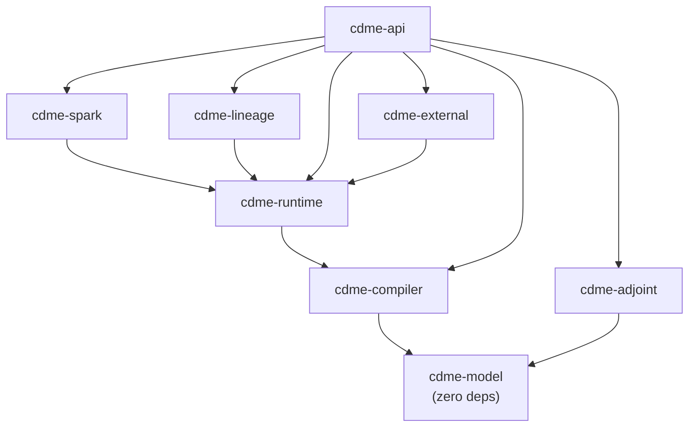
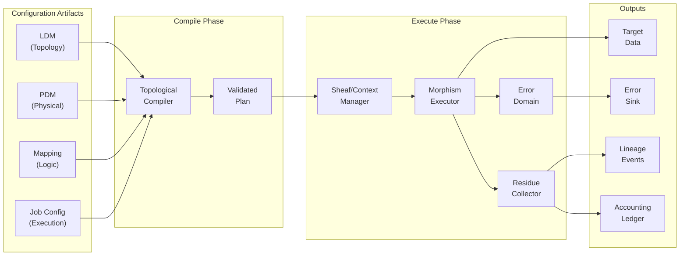
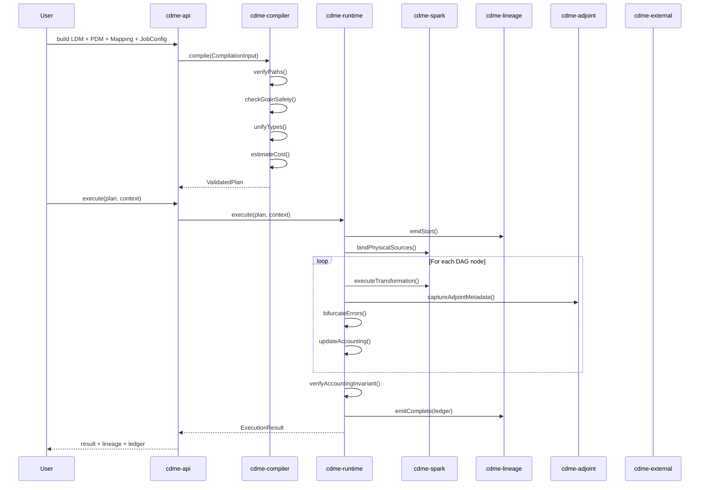
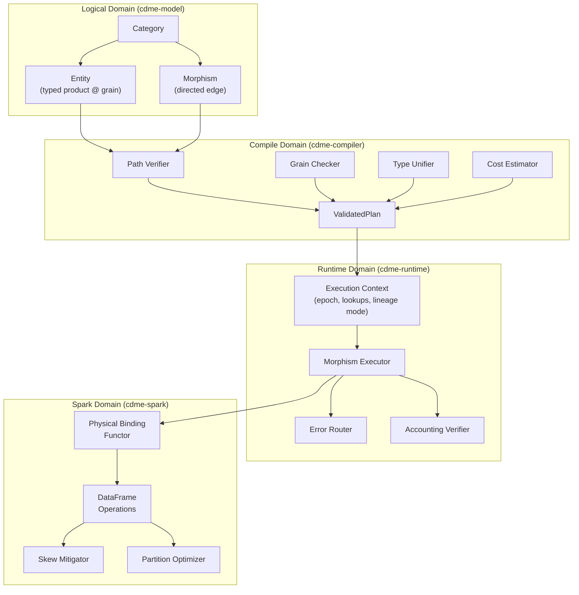
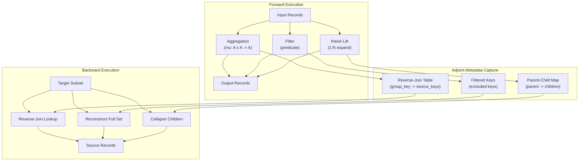

# CDME Design — Scala/Spark Implementation

**Version**: 1.0.0
**Design Tenant**: imp_scala_spark
**Technology**: Scala 2.13.12, Apache Spark 3.5.0, sbt
**Profile**: standard
**Date**: 2026-02-23
**Status**: Designed — Ready for Code Stage

---

## Table of Contents

1. [Overview](#1-overview)
2. [High-Level Architecture](#2-high-level-architecture)
3. [Component Design](#3-component-design)
4. [Type System Design](#4-type-system-design)
5. [Error Handling](#5-error-handling)
6. [Grain System](#6-grain-system)
7. [Adjoint System](#7-adjoint-system)
8. [Spark Integration](#8-spark-integration)
9. [OpenLineage Integration](#9-openlineage-integration)
10. [Configuration Model](#10-configuration-model)
11. [Package Structure](#11-package-structure)
12. [Traceability Matrix](#12-traceability-matrix)
13. [Source Findings](#13-source-findings)
14. [Diagrams](#14-diagrams)

---

## 1. Overview

### 1.1 What CDME Is

The Categorical Data Mapping & Computation Engine (CDME) is a data mapping and computation engine built from first principles using **Category Theory**. It provides mathematical guarantees that if a mapping definition is valid, the resulting pipeline is:

- **Topologically correct** — paths exist and compose validly
- **Lineage-preserving** — every target value traces to source
- **Grain-safe** — incompatible granularities cannot mix without explicit aggregation
- **Type-enforced** — semantic guarantees, not just storage formats

Implements: INT-001, INT-002, INT-003

### 1.2 Relationship to Specification

This design document is the technology-bound HOW for the tech-agnostic WHAT defined in:

- `specification/INTENT.md` — 6 intents (INT-001 through INT-006)
- `specification/REQUIREMENTS.md` — 75 formal requirements
- `specification/mapper_requirements.md` — Product specification v7.2 (axioms, ontology, abstract machine)
- `specification/appendices/APPENDIX_A_FROBENIUS_ALGEBRAS.md` — Frobenius algebra foundations

The specification defines the abstract machine. This design maps it to Scala 2.13 sealed ADTs, Apache Spark 3.5 DataFrames, sbt multi-module builds, and OpenLineage events.

### 1.3 Design Philosophy

1. **Sealed ADTs for exhaustive reasoning** — The category-theoretic type system maps to sealed trait hierarchies with case classes, enabling the Scala compiler to verify exhaustive pattern matching (ADR-001).
2. **Either monad throughout** — No exceptions in business logic. All operations return `Either[CdmeError, A]`, composable via `for`-comprehensions (ADR-003).
3. **Immutable data** — All domain types are immutable case classes. Mutation is confined to Spark DataFrame operations and I/O boundaries.
4. **Layered module DAG** — Eight sbt modules with strict dependency ordering. The pure domain model (`cdme-model`) has zero external dependencies (ADR-007).
5. **Functor as design principle** — The LDM-to-PDM binding is a literal functor: a structure-preserving map from the logical category to the physical category (ADR-006).

### 1.4 Scope

This design covers all 75 requirements from the specification. Requirements are addressed across 8 modules with 13 ADRs capturing major technology decisions. The design targets the **standard** methodology profile: all core edges traversed, mixed evaluator types, bounded iterations.

---

## 2. High-Level Architecture

### 2.1 Module Dependency Graph



### 2.2 Module Summary

| Module | Purpose | Dependencies | Key REQs |
|--------|---------|-------------|----------|
| **cdme-model** | Pure domain types: Category, Morphism, Entity, Grain, SemanticType, Adjoint types | None | REQ-LDM-01, REQ-LDM-02, REQ-TYP-01 |
| **cdme-compiler** | Topological compiler: path validation, grain checks, type unification, cost estimation | cdme-model | REQ-LDM-03, REQ-TRV-02, REQ-TYP-06, REQ-AI-01 |
| **cdme-runtime** | Execution engine: context/epoch management, morphism execution, error routing, accounting ledger | cdme-compiler | REQ-TRV-01, REQ-TRV-05, REQ-TYP-03, REQ-ACC-01 |
| **cdme-spark** | Spark binding: DataFrame adapters, distributed execution, skew mitigation | cdme-runtime | REQ-PDM-01, RIC-SKW-01, RIC-PHY-01 |
| **cdme-lineage** | OpenLineage integration: START/COMPLETE/FAIL events, facets, audit trail | cdme-runtime | REQ-INT-03, REQ-TRV-04, REQ-AI-02 |
| **cdme-adjoint** | Backward traversal: adjoint pairs, Galois connections, reconciliation, impact analysis | cdme-model | REQ-ADJ-01 through REQ-ADJ-11 |
| **cdme-api** | Public API: LDM builder, PDM binder, morphism composer, execution launcher | All modules | REQ-AI-03, REQ-INT-04, REQ-PDM-04 |
| **cdme-external** | External calculator registry: black-box morphism registration, determinism contracts | cdme-runtime | REQ-INT-08 |

### 2.3 Data Flow Overview



---

## 3. Component Design

### 3.1 cdme-model — Pure Domain Model

**Purpose**: Define the fundamental category-theoretic types as Scala sealed ADTs with zero external dependencies. This module is the vocabulary of the entire system.

**Responsibility**: Provide immutable, type-safe representations of LDM entities, morphisms, types, grains, and adjoint structures. All other modules import from here.

Implements: REQ-LDM-01, REQ-LDM-02, REQ-LDM-06, REQ-TYP-01, REQ-TYP-02, REQ-TYP-07, REQ-ADJ-01, REQ-ADJ-02

#### Key Types

```scala
package com.cdme.model

// --- Core Category ---

/** A Category is a named container of entities and morphisms.
  * Implements: REQ-LDM-01 */
final case class Category(
    name: String,
    entities: Map[EntityId, Entity],
    morphisms: Map[MorphismId, Morphism],
    grainHierarchy: GrainHierarchy
)

/** An Entity is a typed product at a specific grain.
  * Implements: REQ-LDM-06 */
final case class Entity(
    id: EntityId,
    name: String,
    attributes: Map[AttributeName, CdmeType],
    grain: Grain,
    identityMorphism: MorphismId,
    accessControl: AccessControl
)

/** A Morphism is a directed edge with cardinality and adjoint.
  * Implements: REQ-LDM-02, REQ-ADJ-01 */
final case class Morphism(
    id: MorphismId,
    name: String,
    domain: EntityId,
    codomain: EntityId,
    cardinality: Cardinality,
    morphismKind: MorphismKind,
    adjoint: Option[AdjointSpec],
    accessControl: AccessControl
)

// --- Cardinality ---
/** Implements: REQ-LDM-02 */
sealed trait Cardinality
object Cardinality {
  case object OneToOne  extends Cardinality  // Isomorphism
  case object NToOne    extends Cardinality  // Standard function
  case object OneToN    extends Cardinality  // Kleisli arrow
}

// --- Morphism Kind ---
sealed trait MorphismKind
object MorphismKind {
  case object Structural    extends MorphismKind  // FK edges
  case object Computational extends MorphismKind  // Pure derivations
  case object Algebraic     extends MorphismKind  // Folds/aggregations
  case object External      extends MorphismKind  // Black-box calculators
}

// --- Grain ---
/** Implements: REQ-LDM-06, REQ-TRV-02 */
sealed trait Grain extends Ordered[Grain] {
  def level: Int
  override def compare(that: Grain): Int = this.level - that.level
}
object Grain {
  case object Atomic   extends Grain { val level = 0 }
  case object Daily    extends Grain { val level = 1 }
  case object Monthly  extends Grain { val level = 2 }
  case object Quarterly extends Grain { val level = 3 }
  case object Yearly   extends Grain { val level = 4 }
  case class Custom(name: String, level: Int) extends Grain
}

final case class GrainHierarchy(
    grains: List[Grain],
    aggregationPaths: Map[(Grain, Grain), List[Grain]]
)
```

#### Type System Types

```scala
package com.cdme.model.types

/** Implements: REQ-TYP-01 */
sealed trait CdmeType

object CdmeType {
  // Primitives
  case object IntType       extends CdmeType
  case object FloatType     extends CdmeType
  case object StringType    extends CdmeType
  case object BooleanType   extends CdmeType
  case object DateType      extends CdmeType
  case object TimestampType extends CdmeType

  // Composite types
  final case class OptionType(inner: CdmeType)                extends CdmeType
  final case class ListType(element: CdmeType)                extends CdmeType
  final case class ProductType(fields: Map[String, CdmeType]) extends CdmeType
  final case class SumType(variants: Map[String, CdmeType])   extends CdmeType

  /** Implements: REQ-TYP-02 */
  final case class RefinementType(
      base: CdmeType,
      predicateName: String,
      predicateExpr: String
  ) extends CdmeType

  /** Implements: REQ-TYP-07 */
  final case class SemanticType(
      base: CdmeType,
      semanticLabel: String  // e.g. "Money", "Percent", "Temperature"
  ) extends CdmeType
}
```

#### Adjoint Types

```scala
package com.cdme.model.adjoint

/** Implements: REQ-ADJ-01 */
sealed trait AdjointSpec {
  def classification: AdjointClassification
}

/** Implements: REQ-ADJ-02 */
sealed trait AdjointClassification
object AdjointClassification {
  case object Isomorphism extends AdjointClassification
  case object Embedding   extends AdjointClassification
  case object Projection  extends AdjointClassification
  case object Lossy       extends AdjointClassification
}

/** Implements: REQ-ADJ-03 */
final case class SelfAdjoint(
    inverseMorphismId: MorphismId
) extends AdjointSpec {
  val classification: AdjointClassification = AdjointClassification.Isomorphism
}

/** Implements: REQ-ADJ-04 */
final case class AggregationAdjoint(
    reverseJoinStrategy: ReverseJoinStrategy
) extends AdjointSpec {
  val classification: AdjointClassification = AdjointClassification.Projection
}

/** Implements: REQ-ADJ-05 */
final case class FilterAdjoint(
    captureFilteredKeys: Boolean
) extends AdjointSpec {
  val classification: AdjointClassification =
    if (captureFilteredKeys) AdjointClassification.Embedding
    else AdjointClassification.Lossy
}

/** Implements: REQ-ADJ-06 */
final case class KleisliAdjoint(
    parentChildCapture: Boolean
) extends AdjointSpec {
  val classification: AdjointClassification = AdjointClassification.Projection
}

sealed trait ReverseJoinStrategy
object ReverseJoinStrategy {
  case object Inline         extends ReverseJoinStrategy
  case object SeparateTable  extends ReverseJoinStrategy
  case object Compressed     extends ReverseJoinStrategy
}
```

#### Error Types

```scala
package com.cdme.model.error

/** Implements: REQ-TYP-03, REQ-ERROR-01 */
sealed trait CdmeError {
  def code: String
  def message: String
  def sourceEntity: Option[EntityId]
  def sourceEpoch: Option[EpochId]
  def morphismPath: List[MorphismId]
}

final case class TypeUnificationError(
    expected: CdmeType,
    actual: CdmeType,
    morphismPath: List[MorphismId],
    sourceEntity: Option[EntityId] = None,
    sourceEpoch: Option[EpochId] = None
) extends CdmeError {
  val code = "TYPE_UNIFICATION"
  val message = s"Expected $expected but found $actual"
}

final case class GrainViolationError(
    sourceGrain: Grain,
    targetGrain: Grain,
    morphismPath: List[MorphismId],
    sourceEntity: Option[EntityId] = None,
    sourceEpoch: Option[EpochId] = None
) extends CdmeError {
  val code = "GRAIN_VIOLATION"
  val message = s"Incompatible grains: $sourceGrain and $targetGrain"
}

final case class RefinementViolationError(
    refinement: RefinementType,
    offendingValue: Any,
    morphismPath: List[MorphismId],
    sourceEntity: Option[EntityId] = None,
    sourceEpoch: Option[EpochId] = None
) extends CdmeError {
  val code = "REFINEMENT_VIOLATION"
  val message = s"Value $offendingValue violates refinement ${refinement.predicateName}"
}

final case class PathNotFoundError(
    path: String,
    reason: String,
    morphismPath: List[MorphismId] = Nil,
    sourceEntity: Option[EntityId] = None,
    sourceEpoch: Option[EpochId] = None
) extends CdmeError {
  val code = "PATH_NOT_FOUND"
  val message = s"Invalid path '$path': $reason"
}

final case class AccessDeniedError(
    morphismId: MorphismId,
    principal: String,
    morphismPath: List[MorphismId],
    sourceEntity: Option[EntityId] = None,
    sourceEpoch: Option[EpochId] = None
) extends CdmeError {
  val code = "ACCESS_DENIED"
  val message = s"Principal '$principal' denied traversal of morphism $morphismId"
}

// Additional error variants: BudgetExceededError, LateArrivalError,
// BoundaryMisalignError, ExternalCalculatorError, ContractBreachError, etc.
```

**Dependencies**: None (pure Scala stdlib).

**Public API surface**: All types listed above are public. The package is consumed by every other module.

---

### 3.2 cdme-compiler — Topological Compiler

**Purpose**: Validate user-defined mappings against the LDM topology before any data processing occurs. This is the "control plane" that rejects invalid or hallucinated mappings at definition time.

**Responsibility**: Path verification, grain safety checking, type unification, access control enforcement, cost estimation, and production of a `ValidatedPlan` that the runtime can execute.

Implements: REQ-LDM-03, REQ-LDM-04, REQ-LDM-05, REQ-TRV-02, REQ-TRV-03, REQ-TRV-06, REQ-TYP-05, REQ-TYP-06, REQ-INT-05, REQ-AI-01, REQ-SHF-01, REQ-COV-01, REQ-COV-07, RIC-LIN-06

#### Key Types

```scala
package com.cdme.compiler

/** Input to the compiler: the 4 configuration artifacts. */
final case class CompilationInput(
    ldm: Category,
    pdm: PhysicalDataModel,
    mapping: MappingDefinition,
    jobConfig: JobConfiguration
)

/** Output of the compiler: a validated, executable plan. */
final case class ValidatedPlan(
    executionDag: ExecutionDag,
    costEstimate: CostEstimate,
    lineageClassification: Map[MorphismId, LineageClassification],
    adjointComposition: Map[PathId, ComposedAdjoint],
    warnings: List[CompilerWarning]
)

/** The execution DAG is the compiled representation of the mapping. */
final case class ExecutionDag(
    nodes: Map[NodeId, DagNode],
    edges: Map[EdgeId, DagEdge],
    sources: Set[NodeId],
    sinks: Set[NodeId]
)

sealed trait LineageClassification
object LineageClassification {
  case object Lossless extends LineageClassification
  case object Lossy    extends LineageClassification
}
```

#### Key Traits

```scala
package com.cdme.compiler

/** Implements: REQ-LDM-03 — Path verification */
trait PathVerifier {
  def verifyPath(
      path: DotPath,
      category: Category,
      principal: Principal
  ): Either[CdmeError, VerifiedPath]
}

/** Implements: REQ-TRV-02 — Grain safety checker */
trait GrainChecker {
  def checkGrainSafety(
      plan: ExecutionDag,
      category: Category
  ): Either[List[GrainViolationError], Unit]
}

/** Implements: REQ-TYP-06 — Type unification */
trait TypeUnifier {
  def unify(
      codomain: CdmeType,
      domain: CdmeType,
      subtypeRegistry: SubtypeRegistry
  ): Either[TypeUnificationError, CdmeType]
}

/** Implements: REQ-TRV-06 — Cost estimation */
trait CostEstimator {
  def estimateCost(
      plan: ExecutionDag,
      statistics: Option[DataStatistics]
  ): CostEstimate
}

/** Implements: REQ-AI-01 — Topological validity for AI-generated mappings */
trait TopologicalValidator {
  def validate(
      input: CompilationInput
  ): Either[List[CdmeError], ValidatedPlan]
}

/** Implements: REQ-COV-07 — Compile-time contract enforcement */
trait ContractEnforcer {
  def enforceContracts(
      plan: ExecutionDag,
      contracts: List[CovarianceContract]
  ): Either[List[ContractViolation], Unit]
}
```

**Dependencies**: `cdme-model`

**Public API surface**: `TopologicalValidator.validate(CompilationInput): Either[List[CdmeError], ValidatedPlan]`

---

### 3.3 cdme-runtime — Execution Engine

**Purpose**: Execute a `ValidatedPlan` produced by the compiler, managing context/epoch scoping, morphism application, error routing, accounting ledger production, and adjoint metadata capture.

**Responsibility**: The "data plane" that processes records through the validated morphism DAG, applying Kleisli lifts, monoidal folds, error bifurcation, and telemetry capture.

Implements: REQ-TRV-01, REQ-TRV-04, REQ-TRV-05, REQ-TRV-05-A, REQ-TRV-05-B, REQ-TYP-03, REQ-TYP-03-A, REQ-TYP-04, REQ-INT-01, REQ-INT-02, REQ-INT-06, REQ-INT-07, REQ-ACC-01, REQ-ACC-02, REQ-ACC-03, REQ-ACC-04, REQ-ACC-05, REQ-SHF-01, RIC-ERR-01, RIC-LIN-01, RIC-LIN-04, RIC-LIN-07

#### Key Types

```scala
package com.cdme.runtime

/** Execution context: the sheaf-like scoping for a processing run. */
final case class ExecutionContext(
    runId: RunId,
    epoch: Epoch,
    lookupVersions: Map[LookupId, LookupVersion],
    lineageMode: LineageMode,
    failureThreshold: FailureThreshold,
    dryRun: Boolean,
    runManifest: RunManifest
)

/** Implements: REQ-TRV-05-A */
final case class RunManifest(
    runId: RunId,
    configHash: String,
    codeHash: String,
    designHash: String,
    timestamp: java.time.Instant,
    inputChecksums: Map[String, String],
    outputChecksums: Map[String, String]
)

/** Implements: RIC-LIN-01 */
sealed trait LineageMode
object LineageMode {
  case object Full        extends LineageMode
  case object KeyDerivable extends LineageMode
  case object Sampled     extends LineageMode
}

/** Implements: REQ-TYP-03-A */
sealed trait FailureThreshold
object FailureThreshold {
  final case class AbsoluteCount(maxErrors: Long) extends FailureThreshold
  final case class Percentage(maxPercent: Double)  extends FailureThreshold
  case object NoThreshold                          extends FailureThreshold
}

/** Implements: REQ-ACC-01, REQ-ACC-02 */
final case class AccountingLedger(
    runId: RunId,
    inputRecordCount: Long,
    sourceKeyField: String,
    processedCount: Long,
    filteredCount: Long,
    erroredCount: Long,
    reverseJoinMetadataLocation: String,
    filteredKeysMetadataLocation: String,
    errorDatasetLocation: String,
    balanced: Boolean,
    discrepancy: Option[DiscrepancyDetails]
)
```

#### Key Traits

```scala
package com.cdme.runtime

/** The morphism executor: applies morphisms to data. */
trait MorphismExecutor[F[_]] {
  /** Implements: REQ-TRV-01 — Kleisli lift */
  def executeKleisliLift[A, B](
      morphism: Morphism,
      input: F[A]
  ): Either[CdmeError, F[B]]

  /** Implements: REQ-LDM-04 — Monoidal fold */
  def executeMonoidalFold[A, B](
      morphism: Morphism,
      monoid: CdmeMonoid[B],
      input: F[A]
  ): Either[CdmeError, F[B]]

  /** Implements: REQ-INT-01 — Synthesis (pure function) */
  def executeSynthesis[A, B](
      morphism: Morphism,
      function: A => Either[CdmeError, B],
      input: F[A]
  ): Either[CdmeError, F[B]]
}

/** The context manager: enforces sheaf-like consistency. */
trait ContextManager {
  /** Implements: REQ-SHF-01 */
  def validateFiberCompatibility(
      leftEpoch: Epoch,
      rightEpoch: Epoch,
      temporalSemantics: Option[TemporalSemantics]
  ): Either[CdmeError, Unit]
}

/** The error router: bifurcates records into valid/error. */
trait ErrorRouter[F[_]] {
  /** Implements: REQ-TYP-03 */
  def bifurcate[A](
      records: F[A],
      validate: A => Either[CdmeError, A]
  ): (F[A], F[ErrorRecord])

  /** Implements: RIC-ERR-01 — Circuit breaker */
  def checkCircuitBreaker(
      errorCount: Long,
      totalCount: Long,
      threshold: FailureThreshold
  ): Either[CdmeError, Unit]
}

/** Implements: REQ-ACC-04 — Run completion gate */
trait AccountingVerifier {
  def verifyInvariant(ledger: AccountingLedger): Either[CdmeError, AccountingLedger]
}
```

**Dependencies**: `cdme-compiler` (transitively `cdme-model`)

**Public API surface**: `RuntimeEngine.execute(ValidatedPlan, ExecutionContext): Either[CdmeError, ExecutionResult]`

---

### 3.4 cdme-spark — Spark Binding

**Purpose**: Implement the LDM-to-PDM functor by binding logical categories to Apache Spark DataFrames. Provide distributed execution adapters, skew mitigation, and partition-aware join strategies.

**Responsibility**: Translate `ValidatedPlan` nodes into Spark operations. Map CDME types to Spark types. Execute distributed joins, aggregations, and transformations on DataFrames.

Implements: REQ-PDM-01, REQ-PDM-02, REQ-PDM-02-A, REQ-PDM-03, REQ-PDM-04, REQ-PDM-05, REQ-PDM-06, RIC-SKW-01, RIC-PHY-01, RIC-AGG-01

#### Key Types

```scala
package com.cdme.spark

import org.apache.spark.sql.{DataFrame, SparkSession}
import org.apache.spark.sql.types.StructType

/** Implements: REQ-PDM-01 — The LDM-to-PDM functor */
trait PhysicalBindingFunctor {
  /** Map a logical entity to a Spark DataFrame. */
  def bind(
      entity: Entity,
      pdm: PhysicalDataModel,
      epoch: Epoch
  )(implicit spark: SparkSession): Either[CdmeError, DataFrame]

  /** Map CDME types to Spark StructType. */
  def mapSchema(entity: Entity): StructType
}

/** Implements: REQ-PDM-02, REQ-PDM-02-A */
sealed trait GenerationGrain
object GenerationGrain {
  case object Event    extends GenerationGrain
  case object Snapshot extends GenerationGrain
}

/** Implements: REQ-PDM-03 */
sealed trait BoundaryDefinition
object BoundaryDefinition {
  final case class TemporalWindow(start: java.time.Instant, end: java.time.Instant)
      extends BoundaryDefinition
  final case class VersionBased(version: String)  extends BoundaryDefinition
  final case class BatchId(batchId: String)        extends BoundaryDefinition
}

/** Implements: REQ-PDM-05 */
final case class TemporalBinding(
    logicalEntity: EntityId,
    bindings: Map[EpochRange, PhysicalTarget]
)

/** Implements: REQ-PDM-06 */
sealed trait LateArrivalStrategy
object LateArrivalStrategy {
  case object Reject     extends LateArrivalStrategy
  case object Reprocess  extends LateArrivalStrategy
  case object Accumulate extends LateArrivalStrategy
  case object Backfill   extends LateArrivalStrategy
}
```

#### Key Traits

```scala
package com.cdme.spark

/** Distributed execution engine built on Spark. */
trait SparkExecutionEngine {
  def executePlan(
      plan: ValidatedPlan,
      context: ExecutionContext
  )(implicit spark: SparkSession): Either[CdmeError, SparkExecutionResult]
}

/** Implements: RIC-SKW-01 — Salted joins for skew mitigation */
trait SkewMitigator {
  def detectSkew(df: DataFrame, keyColumn: String, threshold: Double): Boolean
  def applySaltedJoin(
      left: DataFrame,
      right: DataFrame,
      joinKey: String,
      saltFactor: Int
  ): DataFrame
}

/** Implements: RIC-PHY-01 — Partition alignment */
trait PartitionOptimizer {
  def alignPartitions(
      left: DataFrame,
      right: DataFrame,
      joinKey: String
  ): (DataFrame, DataFrame)
}
```

**Dependencies**: `cdme-runtime`, Apache Spark (provided scope)

**Public API surface**: `SparkExecutionEngine.executePlan(ValidatedPlan, ExecutionContext): Either[CdmeError, SparkExecutionResult]`

---

### 3.5 cdme-lineage — OpenLineage Integration

**Purpose**: Emit OpenLineage-compliant events for every run, capturing full traceability from source to target including morphism paths, lookup versions, and adjoint metadata references.

**Responsibility**: Construct and emit START, COMPLETE, and FAIL events with appropriate facets. Build the lineage graph. Support regulatory compliance reporting.

Implements: REQ-INT-03, REQ-TRV-04, REQ-TRV-05-A, REQ-TRV-05-B, REQ-AI-02, REQ-AI-03, REQ-COV-03, REQ-COV-08, RIC-LIN-01, RIC-LIN-04, RIC-LIN-07

#### Key Types

```scala
package com.cdme.lineage

/** An OpenLineage event with CDME-specific facets. */
final case class CdmeLineageEvent(
    eventType: LineageEventType,
    runId: RunId,
    jobName: String,
    timestamp: java.time.Instant,
    inputs: List[InputDataset],
    outputs: List[OutputDataset],
    facets: CdmeFacets
)

sealed trait LineageEventType
object LineageEventType {
  case object Start    extends LineageEventType
  case object Complete extends LineageEventType
  case object Fail     extends LineageEventType
}

/** CDME-specific facets extending OpenLineage. */
final case class CdmeFacets(
    typeUnificationReport: Option[TypeUnificationReport],
    grainSafetyReport: Option[GrainSafetyReport],
    morphismPathTrace: Option[MorphismPathTrace],
    costEstimate: Option[CostEstimate],
    accountingLedger: Option[AccountingLedger],
    lookupVersionsUsed: Map[LookupId, LookupVersion],
    adjointMetadataLocations: Map[MorphismId, String],
    runManifest: RunManifest
)

/** Implements: REQ-COV-03 */
final case class FidelityCertificate(
    certificateId: String,
    previousCertificateHash: Option[String],
    sourceDomainHash: String,
    targetDomainHash: String,
    contractVersion: String,
    invariantResults: List[InvariantResult],
    timestamp: java.time.Instant,
    runId: RunId
)

/** Implements: REQ-COV-08 */
final case class FidelityCertificateChain(
    certificates: List[FidelityCertificate],
    chainHash: String
)
```

#### Key Traits

```scala
package com.cdme.lineage

/** Emit OpenLineage events. */
trait LineageEmitter {
  def emitStart(context: ExecutionContext, plan: ValidatedPlan): Either[CdmeError, Unit]
  def emitComplete(
      context: ExecutionContext,
      result: ExecutionResult,
      ledger: AccountingLedger
  ): Either[CdmeError, Unit]
  def emitFail(
      context: ExecutionContext,
      error: CdmeError
  ): Either[CdmeError, Unit]
}

/** Implements: REQ-INT-03 — Residue collector for lineage capture */
trait ResidueCollector {
  def captureCheckpoint(
      stageId: String,
      classification: LineageClassification,
      keys: KeyEnvelope
  ): Either[CdmeError, Unit]
}

/** Implements: REQ-TRV-04 — Telemetry writer */
trait TelemetryWriter {
  def recordMetrics(
      morphismId: MorphismId,
      rowCount: Long,
      latencyMs: Long,
      qualityStats: QualityStats
  ): Either[CdmeError, Unit]
}
```

**Dependencies**: `cdme-runtime`, OpenLineage client library

**Public API surface**: `LineageEmitter.emitStart/emitComplete/emitFail`

---

### 3.6 cdme-adjoint — Backward Traversal and Reconciliation

**Purpose**: Provide backward traversal capabilities for every morphism in the system, enabling data reconciliation, impact analysis, and bidirectional sync. This module implements the Galois connection laws and the optional Frobenius algebra extensions.

**Responsibility**: Define adjoint execution strategies, capture reverse-join metadata during forward execution, compute backward paths, validate containment laws, and support impact analysis queries.

Implements: REQ-ADJ-01, REQ-ADJ-02, REQ-ADJ-03, REQ-ADJ-04, REQ-ADJ-05, REQ-ADJ-06, REQ-ADJ-07, REQ-ADJ-08, REQ-ADJ-09, REQ-ADJ-10, REQ-ADJ-11

#### Key Types

```scala
package com.cdme.adjoint

/** Implements: REQ-ADJ-01 — The core adjoint interface */
trait Adjoint[A, B] {
  def forward(a: A): Either[CdmeError, B]
  def backward(b: B): Either[CdmeError, Set[A]]

  /** Implements: REQ-ADJ-02 */
  def classification: AdjointClassification

  /** Containment law check:
    * backward(forward(x)) supseteq x
    * forward(backward(y)) subseteq y */
  def validateContainmentLaw(
      sample: Set[A]
  ): Either[CdmeError, ContainmentResult]
}

/** Implements: REQ-ADJ-07 — Contravariant composition */
trait AdjointComposer {
  def compose[A, B, C](
      f: Adjoint[A, B],
      g: Adjoint[B, C]
  ): Adjoint[A, C]

  def classifyComposition(
      fClass: AdjointClassification,
      gClass: AdjointClassification
  ): AdjointClassification
}

/** Implements: REQ-ADJ-04 — Aggregation backward via reverse-join */
trait AggregationAdjointCapture {
  def captureReverseJoin(
      groupKey: Any,
      contributingKeys: Set[Any]
  ): Either[CdmeError, Unit]

  def lookupReverseJoin(
      groupKey: Any
  ): Either[CdmeError, Set[Any]]
}

/** Implements: REQ-ADJ-05 — Filter backward */
trait FilterAdjointCapture {
  def captureFilteredKeys(
      passedKeys: Set[Any],
      filteredKeys: Set[Any]
  ): Either[CdmeError, Unit]
}

/** Implements: REQ-ADJ-08 — Reconciliation engine */
trait ReconciliationEngine {
  def reconcile[A, B](
      adjoint: Adjoint[A, B],
      originalInput: Set[A]
  ): Either[CdmeError, ReconciliationResult[A]]
}

final case class ReconciliationResult[A](
    matched: Set[A],
    missing: Set[A],
    extra: Set[A],
    isExact: Boolean
)

/** Implements: REQ-ADJ-09 — Impact analysis */
trait ImpactAnalyzer {
  def analyzeImpact[A, B](
      targetSubset: Set[B],
      composedBackward: B => Either[CdmeError, Set[A]]
  ): Either[CdmeError, ImpactAnalysisResult[A]]
}

final case class ImpactAnalysisResult[A](
    contributingSources: Set[A],
    pathsTraversed: List[MorphismId],
    estimatedCost: Long
)
```

#### Frobenius Extension (Optional, per Appendix A)

```scala
package com.cdme.adjoint.frobenius

/** Optional Frobenius algebra marker for morphisms that form
  * aggregate/expand dual pairs. See Appendix A.
  *
  * Layer 2 enhancement — not required for MVP. */
trait FrobeniusAlgebra[A] {
  def multiply(a1: A, a2: A): A     // mu: aggregate
  def comultiply(a: A): (A, A)      // delta: expand
  def unit: A                        // eta: identity element
  def counit(a: A): Unit            // epsilon: extract scalar

  /** The Frobenius law: (mu x id) . (id x delta) = delta . mu */
  def frobeniusLawHolds: Boolean
}
```

**Dependencies**: `cdme-model`

**Public API surface**: `ReconciliationEngine.reconcile`, `ImpactAnalyzer.analyzeImpact`, `AdjointComposer.compose`

---

### 3.7 cdme-api — Public API

**Purpose**: Provide a unified, builder-pattern API for constructing LDMs, binding PDMs, composing morphisms, compiling mappings, and launching executions. This is the user-facing entry point.

**Responsibility**: Orchestrate the lifecycle: build -> compile -> execute -> report. Provide a DSL-like experience for defining categories, entities, morphisms, and mappings.

Implements: REQ-AI-03, REQ-INT-04, REQ-LDM-04-A, REQ-COV-01, REQ-COV-02, REQ-COV-04, REQ-COV-05, REQ-COV-06, REQ-DQ-01, REQ-DQ-02, REQ-DQ-03, REQ-DQ-04

#### Key Types

```scala
package com.cdme.api

/** Implements: REQ-INT-04 — Builder for LDM construction */
class CategoryBuilder {
  def withEntity(entity: Entity): CategoryBuilder
  def withMorphism(morphism: Morphism): CategoryBuilder
  def withGrainHierarchy(hierarchy: GrainHierarchy): CategoryBuilder
  def build(): Either[CdmeError, Category]
}

/** Builder for physical bindings */
class PdmBuilder {
  def bindEntity(
      entityId: EntityId,
      target: PhysicalTarget,
      generationGrain: GenerationGrain,
      boundary: BoundaryDefinition
  ): PdmBuilder
  def withLookup(lookup: LookupBinding): PdmBuilder
  def withTemporalBinding(binding: TemporalBinding): PdmBuilder
  def build(): Either[CdmeError, PhysicalDataModel]
}

/** Builder for mapping definitions */
class MappingBuilder {
  def withSourcePath(path: DotPath): MappingBuilder
  def withSynthesis(expr: SynthesisExpression): MappingBuilder
  def withConditional(cond: ConditionalExpression): MappingBuilder
  def withFallback(fallback: FallbackExpression): MappingBuilder
  def withLookupVersion(lookupId: LookupId, version: LookupVersion): MappingBuilder
  def build(): Either[CdmeError, MappingDefinition]
}

/** Implements: REQ-AI-03 — Dry run mode */
class CdmeEngine {
  def compile(input: CompilationInput): Either[List[CdmeError], ValidatedPlan]
  def execute(plan: ValidatedPlan, context: ExecutionContext): Either[CdmeError, ExecutionResult]
  def dryRun(input: CompilationInput): Either[List[CdmeError], DryRunResult]
}

/** Implements: REQ-COV-01, REQ-COV-02 */
class CovarianceContractBuilder {
  def withDomains(source: Category, target: Category): CovarianceContractBuilder
  def withInvariant(invariant: FidelityInvariant): CovarianceContractBuilder
  def withMaterialityThreshold(threshold: MaterialityThreshold): CovarianceContractBuilder
  def withEnforcementMode(mode: EnforcementMode): CovarianceContractBuilder
  def build(): Either[CdmeError, CovarianceContract]
}

/** Implements: REQ-COV-02 */
sealed trait FidelityInvariant
object FidelityInvariant {
  final case class Conservation(expr: String, grain: Grain)   extends FidelityInvariant
  final case class Coverage(expr: String, grain: Grain)       extends FidelityInvariant
  final case class Alignment(field: String, grain: Grain)     extends FidelityInvariant
  final case class Containment(expr: String, grain: Grain)    extends FidelityInvariant
}

/** Implements: REQ-COV-07 */
sealed trait EnforcementMode
object EnforcementMode {
  case object Strict   extends EnforcementMode
  case object Deferred extends EnforcementMode
  case object Advisory extends EnforcementMode
}

/** Implements: REQ-DQ-01 */
final case class VolumeThreshold(
    minRecords: Option[Long],
    maxRecords: Option[Long],
    baselineWindow: Option[Int],
    violationResponse: ViolationResponse
)

/** Implements: REQ-DQ-02 */
final case class DistributionMonitorConfig(
    fields: List[String],
    nullRateThreshold: Option[Double],
    cardinalityThreshold: Option[Double],
    divergenceThreshold: Option[Double]
)
```

**Dependencies**: All other modules.

**Public API surface**: `CdmeEngine.compile`, `CdmeEngine.execute`, `CdmeEngine.dryRun`, all builder classes.

---

### 3.8 cdme-external — External Calculator Registry

**Purpose**: Support registration of black-box computational morphisms (e.g., compiled cashflow engines, risk calculators) as first-class morphisms in the CDME topology.

**Responsibility**: Registry management, type signature validation, determinism contract enforcement, version tracking for lineage.

Implements: REQ-INT-08

#### Key Types

```scala
package com.cdme.external

/** Implements: REQ-INT-08 — External calculator registration */
final case class ExternalCalculator(
    id: CalculatorId,
    name: String,
    version: String,
    domainType: CdmeType,
    codomainType: CdmeType,
    determinismAssertion: Boolean,
    metadata: Map[String, String]
)

trait ExternalCalculatorRegistry {
  def register(calculator: ExternalCalculator): Either[CdmeError, Unit]
  def lookup(id: CalculatorId): Either[CdmeError, ExternalCalculator]
  def invoke[A, B](
      id: CalculatorId,
      input: A
  ): Either[CdmeError, B]
}

/** Wrapper that makes an external calculator behave as a Morphism. */
trait ExternalMorphismAdapter {
  def asMorphism(calculator: ExternalCalculator): Morphism
  def asAdjoint(
      calculator: ExternalCalculator,
      backwardImpl: Option[Any => Either[CdmeError, Any]]
  ): Option[AdjointSpec]
}
```

**Dependencies**: `cdme-runtime`

**Public API surface**: `ExternalCalculatorRegistry.register`, `ExternalCalculatorRegistry.invoke`

---

## 4. Type System Design

### 4.1 Sealed ADT Type Encoding

Implements: REQ-TYP-01, REQ-TYP-02, REQ-TYP-05, REQ-TYP-07

The CDME type system is encoded as a sealed trait hierarchy (see ADR-001). This gives us:

1. **Exhaustive pattern matching** — The Scala compiler warns on non-exhaustive matches, preventing forgotten cases.
2. **Structural equality** — Case classes provide value equality for type comparison during unification.
3. **Composability** — Types nest: `OptionType(ListType(SemanticType(IntType, "Money")))`.

The full type hierarchy:

```
CdmeType
 +-- IntType
 +-- FloatType
 +-- StringType
 +-- BooleanType
 +-- DateType
 +-- TimestampType
 +-- OptionType(inner: CdmeType)
 +-- ListType(element: CdmeType)
 +-- ProductType(fields: Map[String, CdmeType])
 +-- SumType(variants: Map[String, CdmeType])
 +-- RefinementType(base: CdmeType, predicateName, predicateExpr)
 +-- SemanticType(base: CdmeType, semanticLabel: String)
```

### 4.2 Nominal Subtyping via SubtypeRegistry

Implements: REQ-TYP-06

The specification requires subtype-aware type unification (codomain(f) may be a subtype of domain(g)). We model this with a registry rather than Scala's own subtyping:

```scala
package com.cdme.compiler.types

/** Registry of declared subtype relationships in the LDM. */
final case class SubtypeRegistry(
    relationships: Map[CdmeType, Set[CdmeType]]
) {
  /** Check if `sub` is declared as a subtype of `sup`. */
  def isSubtypeOf(sub: CdmeType, sup: CdmeType): Boolean
}
```

This is deliberately separate from Scala's type system because:
- LDM subtypes are domain declarations, not language-level types
- The registry can be loaded from configuration
- Subtype checking is part of compilation, not runtime

### 4.3 Type Unification Algorithm

Implements: REQ-TYP-06, REQ-TYP-05

```
unify(codomain_f, domain_g, registry):
  1. If codomain_f == domain_g             → Success(codomain_f)
  2. If registry.isSubtypeOf(codomain_f, domain_g) → Success(domain_g)
  3. If both are OptionType:
       unify(codomain_f.inner, domain_g.inner, registry)
  4. If both are ListType:
       unify(codomain_f.element, domain_g.element, registry)
  5. If both are ProductType:
       unify field-by-field (all fields must unify)
  6. If both are SemanticType:
       base types must unify AND semantic labels must match
  7. Otherwise → Failure(TypeUnificationError)
```

**No implicit coercion**: Step 7 is reached for any pair that does not structurally match or have a declared subtype relationship. There is no implicit `Int -> Float` or `String -> Int`. All such conversions must be explicit morphisms in the LDM (REQ-TYP-05).

---

## 5. Error Handling

### 5.1 Either Monad Throughout

Implements: REQ-TYP-03, REQ-TYP-04

See ADR-003 for the full rationale.

All CDME operations return `Either[CdmeError, A]`. Composition uses Scala's `for`-comprehension:

```scala
for {
  plan    <- compiler.compile(input)
  result  <- runtime.execute(plan, context)
  lineage <- emitter.emitComplete(context, result, ledger)
} yield result
```

Errors are **data, not exceptions** (Axiom 10). A `Left(error)` at any stage is captured, recorded, and routed. The runtime does not throw exceptions for business logic failures.

### 5.2 Error Routing to Error Sink

Implements: REQ-TYP-03, REQ-ERROR-01

During execution, each record is processed through an `Either` bifurcation:

```
record -> validate -> morphism_chain
  Right(valid_record) -> proceed to next morphism
  Left(error_record)  -> route to Error Sink (DLQ)
```

Error records are **never silently dropped**. They accumulate in the Error Domain, which is a queryable, exportable dataset with the schema defined by `CdmeError`.

### 5.3 Record Accounting Invariant

Implements: REQ-ACC-01, REQ-ACC-02, REQ-ACC-04

The fundamental invariant:

```
|input_keys| = |reverse_join_keys| + |filtered_keys| + |error_keys|
```

This is verified before any run is marked COMPLETE. If verification fails, the run is marked FAILED and discrepancy details are recorded in the accounting ledger (`ledger.json`).

### 5.4 Circuit Breaker for Cascading Failures

Implements: RIC-ERR-01, REQ-TYP-03-A

The circuit breaker monitors the first N records (configurable, default 10,000):

```
if (errorCount / totalCount > failureThreshold):
  HALT execution
  emit structural/configuration error
  do NOT write remaining failed records to DLQ
```

This distinguishes **systemic failures** (configuration error, schema mismatch) from **data quality failures** (individual bad records). Systemic failures trigger early halt; data quality failures accumulate normally up to the batch failure threshold.

---

## 6. Grain System

### 6.1 Grain as a Formal Property

Implements: REQ-LDM-06, REQ-TRV-02, REQ-INT-02, REQ-INT-05

Grain is not documentation metadata; it is a first-class property that the compiler uses for validation. Every entity carries a `Grain` tag, and the `GrainHierarchy` defines the total ordering and permitted aggregation paths.

### 6.2 Grain Ordering

Implements: REQ-TRV-02

Grains form a total order (see ADR-005):

```
Atomic < Daily < Monthly < Quarterly < Yearly
```

Custom grains can be inserted at any level in the hierarchy via `Grain.Custom(name, level)`.

### 6.3 Grain Safety Rules

Implements: REQ-TRV-02

The compiler enforces three grain safety rules:

1. **No cross-grain projection**: Attributes from incompatible grains cannot appear in the same output entity.
2. **No cross-grain expressions**: Arithmetic/concatenation between attributes of different grains is blocked.
3. **No cross-grain joins without aggregation**: Joining entities at different grains requires an explicit aggregation morphism.

Violations are detected at compile time with clear error messages identifying the grain mismatch.

### 6.4 Multi-Level Aggregation

Implements: REQ-INT-02

Multi-level aggregation (Atomic -> Daily -> Monthly -> Yearly) is permitted if and only if:

1. Each aggregation function satisfies monoid laws (REQ-LDM-04)
2. The grain hierarchy permits the composition path
3. The morphism path explicitly encodes each aggregation step as a separate morphism

The grain hierarchy's `aggregationPaths` map stores valid paths: `(Daily, Yearly) -> [Daily, Monthly, Quarterly, Yearly]`.

---

## 7. Adjoint System

### 7.1 Every Morphism Has a Backward

Implements: REQ-ADJ-01

See ADR-004 for the full rationale.

The CDME requires that every morphism `f: A -> B` has a corresponding backward morphism `f^-: B -> A` forming a Galois connection. The `Adjoint[A, B]` trait is the core interface (Section 3.6).

### 7.2 Containment Laws

Implements: REQ-ADJ-01

Round-trip containment laws hold for all adjoint pairs:

```
backward(forward(x)) supseteq x    // Lower closure
forward(backward(y)) subseteq y    // Upper closure
```

For isomorphisms (self-adjoint morphisms), both become equalities:

```
backward(forward(x)) = x
forward(backward(y)) = y
```

### 7.3 Adjoint Classification

Implements: REQ-ADJ-02

Every morphism is classified by its round-trip precision:

| Classification | Forward | Backward | Round-trip |
|---------------|---------|----------|------------|
| **Isomorphism** | Bijection | Exact inverse | `f^-(f(x)) = x` |
| **Embedding** | Injective | Partial inverse | `f^-(f(x)) = x`, `f(f^-(y)) subset y` |
| **Projection** | Surjective | Preimage | `f^-(f(x)) supset x`, `f(f^-(y)) = y` |
| **Lossy** | Neither | Approximate | `f^-(f(x)) supset x`, `f(f^-(y)) subset y` |

Classification is inferred automatically where possible (e.g., 1:1 morphisms are Isomorphisms) and declared explicitly for ambiguous cases.

### 7.4 Reverse-Join Metadata for Aggregations

Implements: REQ-ADJ-04

Aggregation morphisms capture a reverse-join table during forward execution:

```
Forward:  groupBy(key).agg(sum)  ->  (group_key, aggregated_value)
Capture:  group_key -> Set(contributing_record_keys)
Backward: group_key -> Set(contributing_record_keys)
```

Storage strategies (per ADR-004):
- **Inline**: Reverse-join metadata stored alongside aggregation output
- **Separate table**: Written to a dedicated table/file
- **Compressed**: Roaring Bitmaps for key sets, range encoding for sorted keys

### 7.5 Adjoint Composition

Implements: REQ-ADJ-07

Adjoint composition follows the **contravariant rule**:

```
(g . f)^- = f^- . g^-
```

Classification propagation:
- Isomorphism . Isomorphism = Isomorphism
- Embedding . Embedding = Embedding
- Projection . Projection = Projection
- Any involving Lossy = Lossy
- Embedding . Projection = Lossy
- Projection . Embedding = requires analysis

### 7.6 Frobenius Algebra Foundations

Implements: INT-006 (Speculative)

Per Appendix A of the specification, the Frobenius algebra provides a stronger theoretical foundation. The design adopts a **layered approach**:

- **Layer 1 (Required)**: `Adjoint` interface — forward/backward with containment laws
- **Layer 2 (Optional)**: `FrobeniusAlgebra` marker — for aggregate/expand dual pairs
- **Layer 3 (Future)**: `CommutativeFrobenius` — for order-independent aggregations

Layer 1 is mandatory for all morphisms. Layer 2 is opt-in for morphisms that naturally form Frobenius pairs (e.g., `sum`/`explode`). The Frobenius law `(mu x id) . (id x delta) = delta . mu` enables algebraic pipeline optimization in future iterations.

---

## 8. Spark Integration

### 8.1 LDM-to-PDM Functor

Implements: REQ-PDM-01

See ADR-006 for the full rationale.

The `PhysicalBindingFunctor` is a structure-preserving map from the logical category (LDM) to the physical category (Spark DataFrames). It preserves:

- **Objects**: Entity -> DataFrame with matching StructType
- **Morphisms**: Logical transformations -> Spark operations (joins, aggregations, UDFs)
- **Identity**: `Id_E` maps to identity transformation on DataFrame
- **Composition**: `g . f` maps to Spark operation composition

### 8.2 Type System Mapping

CDME types map to Spark types:

| CdmeType | Spark Type | Notes |
|----------|-----------|-------|
| IntType | IntegerType | |
| FloatType | DoubleType | |
| StringType | StringType | |
| BooleanType | BooleanType | |
| DateType | DateType | |
| TimestampType | TimestampType | |
| OptionType(T) | Nullable column of T | Spark columns are nullable by default |
| ListType(T) | ArrayType(T) | |
| ProductType | StructType | Nested struct |
| SumType | StructType + discriminator | Encoded as struct with tag field |
| RefinementType | Base Spark type + UDF validation | Predicate checked at runtime |
| SemanticType | Base Spark type + metadata | Label in column metadata |

### 8.3 Distributed Execution Model

The Spark execution engine translates the `ValidatedPlan`'s DAG into a Spark execution plan:

1. **Source binding**: Load DataFrames from PDM targets (files, tables, APIs)
2. **Partition alignment**: Repartition/sort DataFrames for join compatibility (RIC-PHY-01)
3. **Morphism execution**: Apply transformations as Spark operations
4. **Error bifurcation**: Use `when`/`otherwise` for error routing, collect errors to separate DataFrame
5. **Aggregation**: Use Spark `groupBy`/`agg` with reverse-join metadata capture
6. **Sink writing**: Write output DataFrames to PDM targets
7. **Ledger production**: Compute and write `ledger.json` with record counts

### 8.4 Skew Mitigation

Implements: RIC-SKW-01

For 1:N expansions with data skew:

1. **Detection**: Sample the join key distribution before execution
2. **Salted join**: Add random salt `[0, N)` to source, replicate target N times, join on `(key, salt)`
3. **Threshold**: Apply only when estimated skew exceeds configured threshold

---

## 9. OpenLineage Integration

### 9.1 Event Lifecycle

Implements: REQ-INT-03, REQ-AI-02

See ADR-009 for the full rationale.

Every CDME execution emits three OpenLineage events:

1. **START**: Emitted when execution begins. Contains:
   - Input dataset references
   - Output dataset declarations
   - Run manifest (config hash, code hash, design hash)
   - Cost estimate

2. **COMPLETE**: Emitted when execution succeeds. Contains:
   - All START facets plus:
   - Morphism path trace (full lineage)
   - Type unification report
   - Accounting ledger
   - Adjoint metadata locations
   - Lookup versions used
   - Row counts and quality stats

3. **FAIL**: Emitted when execution fails. Contains:
   - All START facets plus:
   - Error details
   - Partial accounting ledger
   - Discrepancy details (if accounting invariant failed)

### 9.2 CDME Custom Facets

The standard OpenLineage schema is extended with CDME-specific facets:

- `cdme.typeUnification` — Type compatibility proof set
- `cdme.grainSafety` — Grain validation results
- `cdme.morphismTrace` — Full morphism path for each target attribute
- `cdme.accountingLedger` — Record accounting invariant proof
- `cdme.adjointMetadata` — Locations of reverse-join tables and filtered key sets
- `cdme.runManifest` — Immutable binding to config, code, and design artifacts
- `cdme.fidelityCertificate` — Cross-domain fidelity proof (REQ-COV-03)

### 9.3 Regulatory Compliance

The lineage events, combined with the run manifest and fidelity certificates, provide the audit package required by:

- **BCBS 239**: Accuracy (type proofs), Completeness (lineage), Adaptability (LDM/PDM separation)
- **FRTB**: Granular risk attribution via morphism trace
- **GDPR/CCPA**: Deterministic identity (REQ-INT-07) for targeted removal
- **EU AI Act**: Human oversight via dry-run (Art. 14), robustness via topological strictness (Art. 15)
- **SOX**: Control evidence via fidelity certificates, segregation via access control

---

## 10. Configuration Model

### 10.1 sbt Build Structure

Implements: ADR-007

```
imp_scala_spark/code/
  build.sbt              # Root build definition
  project/
    build.properties     # sbt version
    plugins.sbt          # scalafmt, assembly, etc.
  cdme-model/
    src/main/scala/com/cdme/model/
    src/test/scala/com/cdme/model/
  cdme-compiler/
    src/main/scala/com/cdme/compiler/
    src/test/scala/com/cdme/compiler/
  cdme-runtime/
    src/main/scala/com/cdme/runtime/
    src/test/scala/com/cdme/runtime/
  cdme-spark/
    src/main/scala/com/cdme/spark/
    src/test/scala/com/cdme/spark/
  cdme-lineage/
    src/main/scala/com/cdme/lineage/
    src/test/scala/com/cdme/lineage/
  cdme-adjoint/
    src/main/scala/com/cdme/adjoint/
    src/test/scala/com/cdme/adjoint/
  cdme-api/
    src/main/scala/com/cdme/api/
    src/test/scala/com/cdme/api/
  cdme-external/
    src/main/scala/com/cdme/external/
    src/test/scala/com/cdme/external/
```

### 10.2 Dependency Management

| Module | Compile Dependencies | Test Dependencies |
|--------|---------------------|-------------------|
| cdme-model | (none) | ScalaTest, ScalaCheck |
| cdme-compiler | cdme-model | ScalaTest, ScalaCheck |
| cdme-runtime | cdme-compiler | ScalaTest, ScalaCheck |
| cdme-spark | cdme-runtime, Spark 3.5 (provided) | ScalaTest, ScalaCheck, spark-testing-base |
| cdme-lineage | cdme-runtime, openlineage-java | ScalaTest |
| cdme-adjoint | cdme-model | ScalaTest, ScalaCheck |
| cdme-api | All above | ScalaTest, ScalaCheck |
| cdme-external | cdme-runtime | ScalaTest |

### 10.3 Key Library Versions

| Library | Version | Scope |
|---------|---------|-------|
| Scala | 2.13.12 | Compile |
| Apache Spark | 3.5.0 | Provided |
| ScalaTest | 3.2.18 | Test |
| ScalaCheck | 1.17.0 | Test |
| openlineage-java | 1.6.0 | Compile (cdme-lineage) |
| scalafmt | 3.7.x | Build plugin |

---

## 11. Package Structure

```
com.cdme
  +-- model/
  |     +-- Category, Entity, Morphism, MorphismKind, Cardinality
  |     +-- types/
  |     |     +-- CdmeType (sealed hierarchy)
  |     |     +-- SubtypeRegistry
  |     +-- adjoint/
  |     |     +-- AdjointSpec, AdjointClassification
  |     |     +-- SelfAdjoint, AggregationAdjoint, FilterAdjoint, KleisliAdjoint
  |     +-- error/
  |     |     +-- CdmeError (sealed hierarchy)
  |     +-- grain/
  |           +-- Grain (sealed hierarchy), GrainHierarchy
  +-- compiler/
  |     +-- CompilationInput, ValidatedPlan, ExecutionDag
  |     +-- PathVerifier, GrainChecker, TypeUnifier, CostEstimator
  |     +-- TopologicalValidator, ContractEnforcer
  |     +-- types/
  |           +-- TypeUnificationEngine, SubtypeRegistry
  +-- runtime/
  |     +-- ExecutionContext, RunManifest, LineageMode, FailureThreshold
  |     +-- AccountingLedger, DiscrepancyDetails
  |     +-- MorphismExecutor, ContextManager, ErrorRouter
  |     +-- AccountingVerifier
  |     +-- monoid/
  |           +-- CdmeMonoid (Sum, Count, Min, Max, Concat, etc.)
  +-- spark/
  |     +-- PhysicalBindingFunctor, SparkExecutionEngine
  |     +-- SkewMitigator, PartitionOptimizer
  |     +-- GenerationGrain, BoundaryDefinition, TemporalBinding
  |     +-- LateArrivalStrategy
  +-- lineage/
  |     +-- CdmeLineageEvent, LineageEventType, CdmeFacets
  |     +-- LineageEmitter, ResidueCollector, TelemetryWriter
  |     +-- FidelityCertificate, FidelityCertificateChain
  +-- adjoint/
  |     +-- Adjoint[A, B], AdjointComposer
  |     +-- AggregationAdjointCapture, FilterAdjointCapture
  |     +-- ReconciliationEngine, ReconciliationResult
  |     +-- ImpactAnalyzer, ImpactAnalysisResult
  |     +-- frobenius/
  |           +-- FrobeniusAlgebra (optional Layer 2)
  +-- api/
  |     +-- CategoryBuilder, PdmBuilder, MappingBuilder
  |     +-- CdmeEngine (compile, execute, dryRun)
  |     +-- CovarianceContractBuilder
  |     +-- FidelityInvariant, EnforcementMode
  |     +-- VolumeThreshold, DistributionMonitorConfig
  +-- external/
        +-- ExternalCalculator, ExternalCalculatorRegistry
        +-- ExternalMorphismAdapter
```

---

## 12. Traceability Matrix

### 12.1 Logical Topology (LDM)

| REQ Key | Module | Component | Status |
|---------|--------|-----------|--------|
| REQ-LDM-01 | cdme-model | Category, Entity | Designed |
| REQ-LDM-02 | cdme-model | Morphism, Cardinality | Designed |
| REQ-LDM-03 | cdme-compiler | PathVerifier, TopologicalValidator | Designed |
| REQ-LDM-04 | cdme-compiler, cdme-runtime | TopologicalValidator, CdmeMonoid | Designed |
| REQ-LDM-04-A | cdme-runtime, cdme-api | CdmeMonoid.identity | Designed |
| REQ-LDM-05 | cdme-compiler | PathVerifier (access control) | Designed |
| REQ-LDM-06 | cdme-model | Entity.grain, GrainHierarchy | Designed |

### 12.2 Physical Binding (PDM)

| REQ Key | Module | Component | Status |
|---------|--------|-----------|--------|
| REQ-PDM-01 | cdme-spark | PhysicalBindingFunctor | Designed |
| REQ-PDM-02 | cdme-spark | GenerationGrain | Designed |
| REQ-PDM-02-A | cdme-spark | GenerationGrain (Event/Snapshot semantics) | Designed |
| REQ-PDM-03 | cdme-spark | BoundaryDefinition | Designed |
| REQ-PDM-04 | cdme-spark, cdme-api | PdmBuilder.withLookup | Designed |
| REQ-PDM-05 | cdme-spark | TemporalBinding | Designed |
| REQ-PDM-06 | cdme-spark | LateArrivalStrategy | Designed |

### 12.3 Traversal Engine (TRV/SHF)

| REQ Key | Module | Component | Status |
|---------|--------|-----------|--------|
| REQ-TRV-01 | cdme-runtime | MorphismExecutor.executeKleisliLift | Designed |
| REQ-TRV-02 | cdme-compiler | GrainChecker | Designed |
| REQ-TRV-03 | cdme-compiler, cdme-runtime | ContextManager.validateFiberCompatibility | Designed |
| REQ-TRV-04 | cdme-lineage | TelemetryWriter | Designed |
| REQ-TRV-05 | cdme-runtime | ExecutionContext (determinism) | Designed |
| REQ-TRV-05-A | cdme-runtime, cdme-lineage | RunManifest | Designed |
| REQ-TRV-05-B | cdme-runtime, cdme-lineage | ArtifactVersionStore (via RunManifest) | Designed |
| REQ-TRV-06 | cdme-compiler | CostEstimator | Designed |
| REQ-SHF-01 | cdme-compiler, cdme-runtime | ContextManager | Designed |

### 12.4 Integration & Synthesis (INT)

| REQ Key | Module | Component | Status |
|---------|--------|-----------|--------|
| REQ-INT-01 | cdme-runtime | MorphismExecutor.executeSynthesis | Designed |
| REQ-INT-02 | cdme-compiler, cdme-runtime | GrainHierarchy, CdmeMonoid | Designed |
| REQ-INT-03 | cdme-lineage | ResidueCollector, LineageEmitter | Designed |
| REQ-INT-04 | cdme-api | MappingBuilder (conditionals, fallbacks, composition) | Designed |
| REQ-INT-05 | cdme-compiler | GrainChecker (multi-grain formulation) | Designed |
| REQ-INT-06 | cdme-runtime | ExecutionContext.lookupVersions | Designed |
| REQ-INT-07 | cdme-runtime | MorphismExecutor (deterministic key gen) | Designed |
| REQ-INT-08 | cdme-external | ExternalCalculatorRegistry | Designed |

### 12.5 Typing & Quality (TYP/ERROR)

| REQ Key | Module | Component | Status |
|---------|--------|-----------|--------|
| REQ-TYP-01 | cdme-model | CdmeType sealed hierarchy | Designed |
| REQ-TYP-02 | cdme-model | RefinementType | Designed |
| REQ-TYP-03 | cdme-runtime | ErrorRouter.bifurcate | Designed |
| REQ-TYP-03-A | cdme-runtime | ErrorRouter.checkCircuitBreaker, FailureThreshold | Designed |
| REQ-TYP-04 | cdme-runtime | ErrorRouter (idempotent failure) | Designed |
| REQ-TYP-05 | cdme-compiler | TypeUnifier (no implicit coercion) | Designed |
| REQ-TYP-06 | cdme-compiler | TypeUnifier.unify | Designed |
| REQ-TYP-07 | cdme-model | SemanticType | Designed |
| REQ-ERROR-01 | cdme-model | CdmeError (sourceEntity, sourceEpoch, morphismPath) | Designed |

### 12.6 AI Assurance (AI)

| REQ Key | Module | Component | Status |
|---------|--------|-----------|--------|
| REQ-AI-01 | cdme-compiler | TopologicalValidator | Designed |
| REQ-AI-02 | cdme-lineage | LineageEmitter, CdmeFacets | Designed |
| REQ-AI-03 | cdme-api | CdmeEngine.dryRun | Designed |

### 12.7 Record Accounting (ACC)

| REQ Key | Module | Component | Status |
|---------|--------|-----------|--------|
| REQ-ACC-01 | cdme-runtime | AccountingLedger, AccountingVerifier | Designed |
| REQ-ACC-02 | cdme-runtime | AccountingLedger (ledger.json) | Designed |
| REQ-ACC-03 | cdme-runtime, cdme-adjoint | AggregationAdjointCapture, FilterAdjointCapture | Designed |
| REQ-ACC-04 | cdme-runtime | AccountingVerifier.verifyInvariant | Designed |
| REQ-ACC-05 | cdme-adjoint | ReconciliationEngine, ImpactAnalyzer | Designed |

### 12.8 Adjoint Morphisms (ADJ)

| REQ Key | Module | Component | Status |
|---------|--------|-----------|--------|
| REQ-ADJ-01 | cdme-model, cdme-adjoint | AdjointSpec, Adjoint[A, B] | Designed |
| REQ-ADJ-02 | cdme-model | AdjointClassification | Designed |
| REQ-ADJ-03 | cdme-model, cdme-adjoint | SelfAdjoint | Designed |
| REQ-ADJ-04 | cdme-adjoint | AggregationAdjointCapture | Designed |
| REQ-ADJ-05 | cdme-adjoint | FilterAdjointCapture | Designed |
| REQ-ADJ-06 | cdme-adjoint | KleisliAdjoint | Designed |
| REQ-ADJ-07 | cdme-adjoint | AdjointComposer | Designed |
| REQ-ADJ-08 | cdme-adjoint | ReconciliationEngine | Designed |
| REQ-ADJ-09 | cdme-adjoint | ImpactAnalyzer | Designed |
| REQ-ADJ-10 | cdme-adjoint | BidirectionalSync (via AdjointComposer) | Designed |
| REQ-ADJ-11 | cdme-adjoint | ReverseJoinStrategy (storage strategies) | Designed |

### 12.9 Cross-Domain Fidelity (COV)

| REQ Key | Module | Component | Status |
|---------|--------|-----------|--------|
| REQ-COV-01 | cdme-api | CovarianceContractBuilder | Designed |
| REQ-COV-02 | cdme-api | FidelityInvariant | Designed |
| REQ-COV-03 | cdme-lineage | FidelityCertificate | Designed |
| REQ-COV-04 | cdme-api, cdme-runtime | ContractBreachHandler (via ErrorRouter) | Designed |
| REQ-COV-05 | cdme-api | CovariantPropagation (via AdjointComposer) | Designed |
| REQ-COV-06 | cdme-api, cdme-compiler | MultiGrainFidelityValidator | Designed |
| REQ-COV-07 | cdme-compiler | ContractEnforcer | Designed |
| REQ-COV-08 | cdme-lineage | FidelityCertificateChain | Designed |

### 12.10 Data Quality (DQ)

| REQ Key | Module | Component | Status |
|---------|--------|-----------|--------|
| REQ-DQ-01 | cdme-api | VolumeThreshold | Designed |
| REQ-DQ-02 | cdme-api | DistributionMonitorConfig | Designed |
| REQ-DQ-03 | cdme-api, cdme-runtime | Custom validation rules (via Synthesis morphisms) | Designed |
| REQ-DQ-04 | cdme-api | Profiling integration (via dryRun) | Designed |

### 12.11 Implementation Constraints (RIC)

| REQ Key | Module | Component | Status |
|---------|--------|-----------|--------|
| RIC-LIN-01 | cdme-runtime | LineageMode | Designed |
| RIC-LIN-04 | cdme-runtime, cdme-lineage | ResidueCollector (reconstructability) | Designed |
| RIC-LIN-06 | cdme-compiler | LineageClassification | Designed |
| RIC-LIN-07 | cdme-lineage | ResidueCollector (checkpointing) | Designed |
| RIC-SKW-01 | cdme-spark | SkewMitigator | Designed |
| RIC-ERR-01 | cdme-runtime | ErrorRouter.checkCircuitBreaker | Designed |
| RIC-AGG-01 | cdme-spark | ApproximateAggregation (sketch support) | Designed |
| RIC-PHY-01 | cdme-spark | PartitionOptimizer | Designed |

---

## 13. Source Findings

Ambiguities, gaps, and under-specifications discovered during design analysis:

| # | Finding | Severity | REQ | Resolution |
|---|---------|----------|-----|------------|
| 1 | REQUIREMENTS.md lists 75 requirements; mapper_requirements.md Section 6.7 adds REQ-ACC-01 through REQ-ACC-05 (5 accounting requirements) not counted in the original 75 tally. Total is effectively 80. | Low | REQ-ACC-* | Treat all 80 as in-scope. The traceability matrix covers all. |
| 2 | REQ-ADJ-10 (Bidirectional Sync) specifies conflict resolution strategies but does not define the conflict detection algorithm (e.g., vector clocks, last-write-wins, semantic merge). | Medium | REQ-ADJ-10 | Design defers to runtime configuration. Implement SOURCE_AUTHORITATIVE and FAIL strategies first; MERGE requires further spec clarification. |
| 3 | REQ-COV-03 requires "cryptographically bound" fidelity certificates but does not specify the signing algorithm or key management infrastructure. | Medium | REQ-COV-03 | Use SHA-256 content hashing for tamper evidence. Defer digital signatures (PKI) to deployment configuration. |
| 4 | REQ-COV-08 references "export format for regulatory submission (JSON, XML, PDF with signatures)" but no schema is specified for the XML/PDF formats. | Low | REQ-COV-08 | Implement JSON export first. XML/PDF are deferred to future iterations. |
| 5 | Appendix A (Frobenius) recommends a layered approach but does not define which specific aggregation types qualify for Layer 2 (FrobeniusAlgebra). | Low | INT-006 | Design defers Frobenius to optional marker. Sum, Count, Min, Max are commutative Frobenius candidates. Concat is non-commutative. |
| 6 | REQ-TYP-07 (Semantic Types) is marked "optional" but REQ-TYP-05 (no implicit casting) requires explicit morphisms for type changes. The interaction when SemanticType is disabled needs clarification. | Low | REQ-TYP-07 | When semantic types are not defined, the system operates on primitive types only. REQ-TYP-05 still applies to primitive-to-primitive conversions. |
| 7 | REQ-DQ-02 references "KL divergence, chi-squared" for distribution monitoring but does not specify which library or implementation to use. | Low | REQ-DQ-02 | Use Spark MLlib or Breeze for statistical computations. Deferred to implementation. |
| 8 | RIC-LIN-03 (Envelope Recording Requirement) is referenced in mapper_requirements.md Appendix A.1.3 but not listed as a formal requirement in REQUIREMENTS.md. | Low | RIC-LIN-03 | Treated as a sub-requirement of RIC-LIN-07. Implemented via KeyEnvelope data structure. |
| 9 | REQ-LDM-05 states access control is "evaluated at compile time" but the specification does not define how Principal identity is provided to the compiler. | Medium | REQ-LDM-05 | The `CompilationInput` includes a `Principal` parameter. Authentication is external to CDME; CDME only evaluates authorization. |
| 10 | The specification uses `REQ-F-*` prefix in some places and bare `REQ-*` in others. CLAUDE.md references `REQ-F-LDM-001` but REQUIREMENTS.md uses `REQ-LDM-01`. | Low | All | This design uses the `REQ-LDM-01` form from REQUIREMENTS.md as canonical. Code tagging uses `REQ-F-LDM-001` per CLAUDE.md convention. |

---

## 14. Diagrams

### 14.1 Component Interaction Diagram



### 14.2 Data Flow Diagram (LDM to Spark)



### 14.3 Adjoint System Architecture



---

## ADR Index

| ADR | Title | Key Decision |
|-----|-------|-------------|
| [ADR-001](adrs/ADR-001.md) | Sealed ADT Type System | Sealed traits + case classes for exhaustive pattern matching |
| [ADR-002](adrs/ADR-002.md) | Category Representation | Immutable case classes with Map-based entity/morphism storage |
| [ADR-003](adrs/ADR-003.md) | Either-Based Error Handling | No exceptions — Either[CdmeError, A] throughout |
| [ADR-004](adrs/ADR-004.md) | Adjoint Morphism Design | Every morphism paired with reverse; Galois connection laws |
| [ADR-005](adrs/ADR-005.md) | Grain Ordering System | Total order on grains; mixing forbidden without explicit aggregation |
| [ADR-006](adrs/ADR-006.md) | Spark Integration Strategy | Runtime-to-Spark via functor (LDM Category to DataFrame schema) |
| [ADR-007](adrs/ADR-007.md) | Multi-Module sbt Structure | 8 modules with layered DAG dependencies |
| [ADR-008](adrs/ADR-008.md) | Testing Strategy | ScalaTest + ScalaCheck property-based tests |
| [ADR-009](adrs/ADR-009.md) | OpenLineage Integration | START/COMPLETE/FAIL events with custom facets |
| [ADR-010](adrs/ADR-010.md) | External Calculator Registry | Black-box morphisms with determinism contracts |
| [ADR-011](adrs/ADR-011.md) | Context and Epoch Management | Temporal semantics, epoch-based execution windows |
| [ADR-012](adrs/ADR-012.md) | Public API Design | Builder pattern for LDM construction, PDM binding, execution |
| [ADR-013](adrs/ADR-013.md) | Scala 2.13 over Scala 3 | Spark 3.5 requires Scala 2.13; impacts type encoding |

---

**Document Version**: 1.0.0
**Generated By**: AISDLC Design Agent
**Date**: 2026-02-23
**Status**: Designed — Ready for Code Stage
