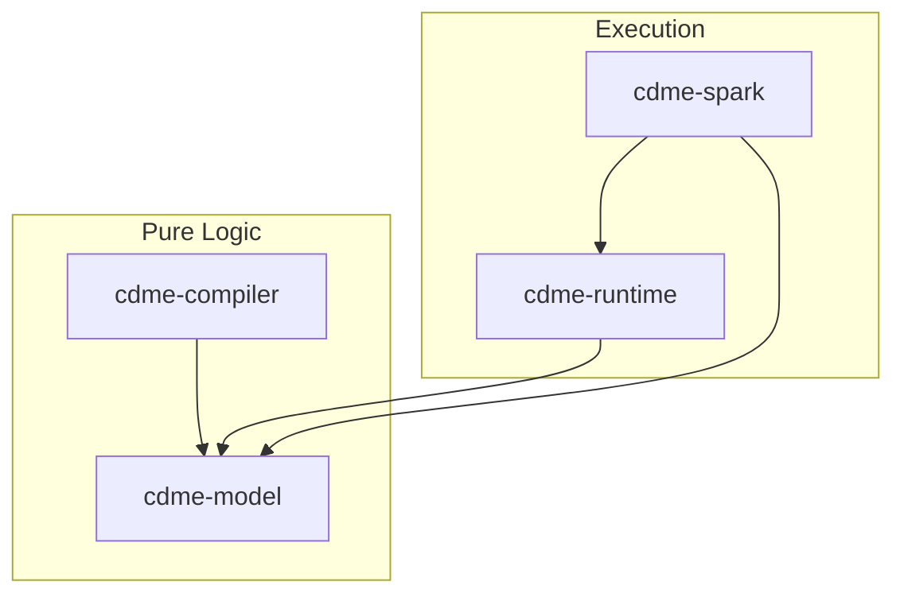

# Technical Design: Gemini Categorical Mapping Engine (G-CDME)

**Version**: 1.0.0
**Date**: 2026-02-26
**Status**: Draft
**Edge**: requirements -> design
**Traces To**: REQUIREMENTS.md v7.2
**Technology Binding**: Scala 2.13.12 + Apache Spark 3.5.0

---

## 1. Architecture Overview

The G-CDME is a Gemini-native implementation of the Categorical Data Mapping specification. It provides a compile-then-execute engine for validated data transformations.

### 1.1 Design Principles
1. **Pure Domain First**: The `cdme-model` contains zero Spark/IO dependencies.
2. **Topological Validation**: The compiler validates paths and grains before plan generation.
3. **Adjoint Completeness**: Every transformation implements the Adjoint interface for bidirectional audit.

### 1.2 System Architecture

---

## 2. Module Decomposition

We implement the implicit 8-module DAG required for robust CDME execution:

1. **`cdme-model`**: Pure ADTs (Entity, Morphism, Adjoint, Monoid).
2. **`cdme-compiler`**: Topological validation (Grain safety, Type unification).
3. **`cdme-runtime`**: Abstract execution (Kleisli lifting, Writer monad).
4. **`cdme-spark`**: Concrete Apache Spark 3.5 bindings.
5. **`cdme-lineage`**: OpenLineage emission and Ledger generation.
6. **`cdme-context`**: Epoch and Temporal binding management.
7. **`cdme-ai-assurance`**: Hallucination detection at the definition layer.
8. **`cdme-api`**: Programmatic entry point for job configuration.

---

## 3. Data Model (REQ-LDM-01)

We represent the LDM as a directed multigraph using a custom `LdmGraph` class.
- **Objects**: `Entity` case classes with Grain metadata.
- **Morphisms**: `Morphism[A, B]` sealed trait hierarchy.

---

## 4. Adjoint Morphisms (REQ-ADJ-01)

Every morphism `f: A -> B` is wrapped in an `Adjoint[A, B]` pair:
- `forward: A => Either[CdmeError, B]`
- `backward: B => Set[A]`

Laws: `backward(forward(x)) ⊇ x` must be verified in unit tests.

---

## 5. Record Accounting (REQ-ACC-01)

Each run produces a `ledger.json` proving:
`|input_keys| = |reverse_join_keys| + |filtered_keys| + |error_keys|`