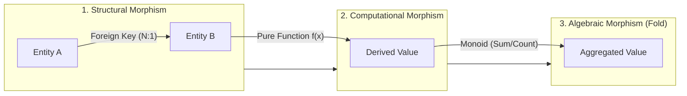
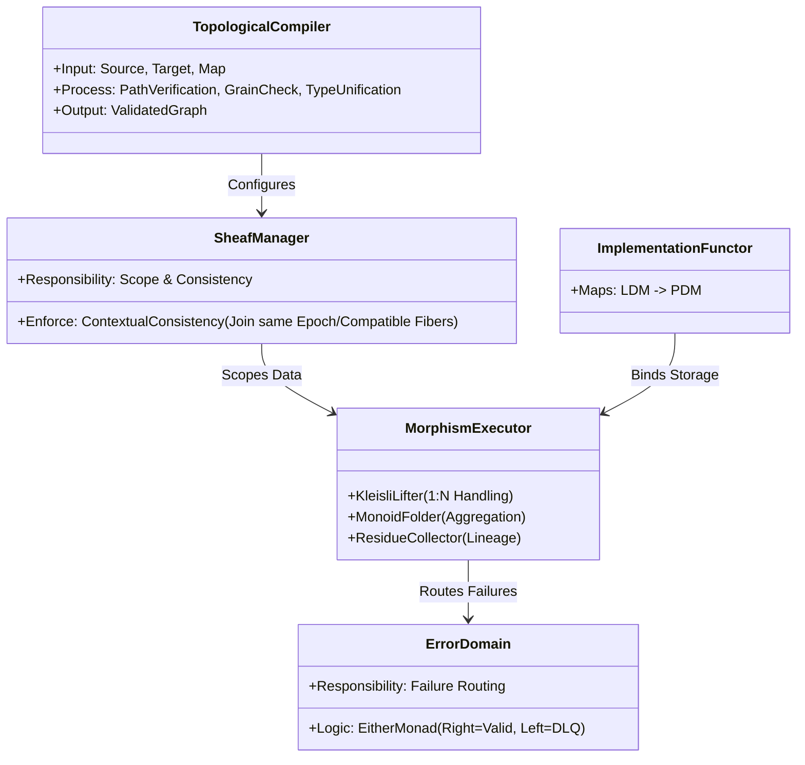
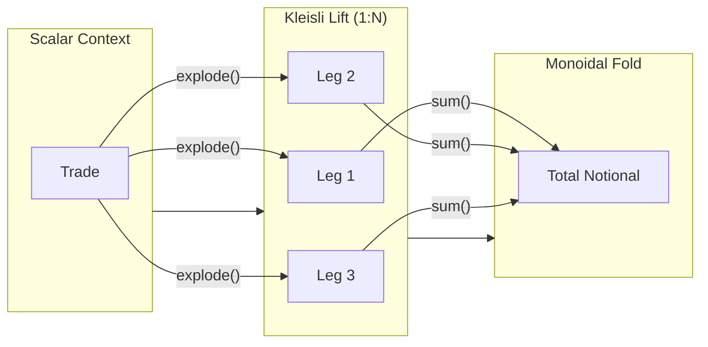
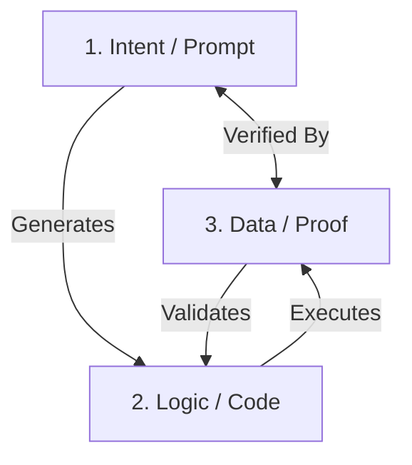

# Product Specification: Categorical Data Mapping & Computation Engine (CDME)

**Version:** 7.2  
**Status:** Approved for Architecture Design  
**Context:** First-Principles Data Engineering / Category Theory

-----

## 1. Executive Summary & Intent

The objective is to build a data mapping and computation engine from first principles, utilizing **Category Theory** to eliminate the "impedance mismatch" between logical business requirements and physical data execution.

Unlike traditional ETL tools that treat data as "buckets of bytes," the CDME treats **Schemas as Topologies** and **Transformations as Continuous Maps (Functors)**. This provides a mathematical guarantee that if a mapping definition is valid, the resulting pipeline is topologically correct, lineage is preserved, and granularities are respected.

**Universal Applicability:** While primarily described as a "Data Mapper," this architecture applies equally to **Computational Engines** (e.g., Cashflow Generators, Regulatory Calculators, Risk Engines). Whether the morphism is a simple field rename or a Monte Carlo simulation, the topological constraints (Lineage, Typing, Sheaf Consistency) remain identical.

**Strategic Value:** This strict topological enforcement positions the CDME as a critical **AI Assurance Layer**. As organizations adopt AI-generated pipelines, this engine serves as the deterministic compiler that prevents AI hallucinations, verifying that AI-generated code is mathematically sound before execution.

-----

## 2. Core Philosophy (The Axioms)

1. **Schema is a Topology:** A logical data model is a Category of Objects (Entities) and Morphisms (Relationships).
2. **Separation of Concerns:**
   * **LDM (Logical Data Model):** The invariant topology (The "What").
   * **PDM (Physical Data Model):** The implementation detail (The "Where").
   * **Binding:** A Functor mapping the LDM to the PDM.
3. **Transformations are Paths:** Deriving a value is the result of traversing a specific path in the graph and applying morphisms.
4. **Data Has Contextual Extent (Sheaf-like Constraint):** Data exists only within a specific Context (Epoch/Batch). Transformations must respect these boundaries.
5. **Grain is a Dimension:** Granularity is a formal property of an entity. Mixing grains without explicit aggregation is topologically forbidden.
6. **Lookups are Arguments:** Reference data and decision logic are input parameters to the transformation function. They must be versioned and immutable within an execution context.
7. **Types are Contracts:** A data type is not just a storage format (e.g., `int`), but a semantic guarantee (e.g., `PositiveInteger`). Data that violates the contract is topologically "Null" or "Error" and cannot propagate.
8. **Topology is the Guardrail:** The engine prioritizes **Verification over Generation**. Whether a mapping is written by a human or an AI, it must satisfy the topological constraints. AI hallucinations (invalid paths) are rejected at the definition stage.
9. **Calculations are Morphisms:** Any computation, no matter how complex (e.g., `GenerateCashflows(Trade)`), is treated as a standard Morphism in the topology. It consumes a Domain (Input Entity) and produces a Codomain (Output Entity), subject to the same traceability and type safety rules as simple data mappings.
10. **Failures are Data:** Errors (Type Failures, Constraint Violations) are not exceptions to be logged and forgotten; they are valid Objects in the **Error Domain**. The pipeline must explicitly map failed records to these objects (Dead Letter Queues).

-----

## 3. The Logical Ontology (The Meta-Model)

This section defines the rigorous "Universe of Discourse" for the system. It specifies the fundamental building blocks that constitute a valid pipeline.

### 3.1. The Objects (Entities)

An **Object** in the ontology is not just a table; it is a **Finite Typed Product** existing at a specific **Grain**.

* **Structure:**  
  \( E = \{ (Name, Type) \} \) (A structured tuple of typed attributes).
* **Identity:**  
  Every object must have a morphism \( Id_E: E \to E \).
* **Grain Property:**  
  Every object carries a **Grain Metadata** tag. This is a formal property used to validate composition, not just documentation.

### 3.2. The Morphisms (Relationships & Logic)

A **Morphism** \( f: A \to B \) represents *any* directed connection. The ontology classifies them into three distinct types that chain together to form processing pipelines.

1. **Structural Morphisms (Edges):**
   * Represent topological connections (Foreign Keys).
   * Types: `1:1` (Iso), `N:1` (Function), `1:N` (Kleisli).
2. **Computational Morphisms (Synthesis):**
   * Represent derivations (Formulas).
   * Example: \( f(Trade) \to Cashflow \).
   * Constraint: Must be **Pure** and **Total** (defined for all inputs or explicitly returning `Option`).
3. **Algebraic Morphisms (Folds):**
   * Represent grain reduction.
   * Constraint: Must form a **Monoid** \( (M, \cdot, e) \) where operation `·` is associative and `e` is an identity element.

### 3.3. Sheaf-like Contextual Extent (Clarification)

The system borrows intuitions from sheaf theory but does **not** claim to implement full categorical sheaf axioms.

* The engine enforces:
  * **Local Consistency:** Data within a Contextual Fiber (Entity, Epoch, Partition) is coherent.
  * **Gluing Constraints:** Joins are only allowed between compatible fibers (same epoch or explicit temporal semantics; compatible partitions).
* The engine does **not** require:
  * A full topological space structure over the base.
  * Formal restriction maps as in abstract sheaf theory.

For the purposes of this specification, **“sheaf-like”** means:

> Data is always interpreted in a **local context** (fiber), and any composition or join must respect that context or explicitly define how to move between contexts.

-----

## 4. Terminology Dictionary

To align Data Architects (ER-Modelers) with the Engineering Team (CT-Implementers):

| Category Theory Term | Data Architect Term | Definition |
| :--- | :--- | :--- |
| **Category / Topology** | **Bounded Context** | The scope of the domain (e.g., Trading, Risk). |
| **Object** | **Entity** | A node in the graph (e.g., Trade, Counterparty). |
| **Morphism** | **Relationship / Calc** | A directed edge (e.g., Trade `belongs_to` Portfolio OR Trade `generates` Cashflow). |
| **Functor** | **Physical Binding** | The mapping of Logical Entities to Tables/Files. |
| **Kleisli Arrow** | **One-to-Many** | A relationship that expands cardinality (List context). |
| **Fibration / Epoch** | **System Boundary** | The logical grouping of continuous data (e.g., Daily Batch). |
| **Synthesis / Fold** | **Aggregation** | Reducing a List context back to a Scalar context. |
| **Natural Transformation** | **Lookup Injection** | Injecting auxiliary Reference Data (e.g., Tax Rates) into the primary flow. |
| **Refinement Type** | **Data Quality Rule** | A basic type restricted by a predicate (e.g., `String` where `len > 0`). |
| **Writer Monad** | **Telemetry / Logs** | A side-channel for metadata (row counts, latency) attached to the data flow. |
| **Either Monad** | **Error Handling** | The branching logic that separates Valid Data (Right) from Failed Data (Left). |

-----

## 5. Logical Architecture (The Abstract Machine)

This describes the functional components of the system as an **Abstract Machine**. These components enforce the Ontology defined in Section 3.

### 5.1. The Topological Compiler (The Control Plane)

Responsible for **Validating** the user's request against the Ontology *before* any data processing occurs.

* **Path Verification:** Checks if path \( A \to B \to C \) exists in the graph and satisfies composition validity (REQ-LDM-03).
* **Grain Check:** Checks if composition implies an illegal grain mix (REQ-TRV-02).
* **Type Unification:** Checks if output types of Source \( f(x) \) match input types of Target \( g(x) \) (REQ-TYP-06).

### 5.2. The Sheaf Context Manager

Manages the "Scope" of execution.

* **The Contextual Extent:** Defines the **Local Section** of data (e.g., "Trades for Date T").
* **Consistency Enforcement:** Ensures that when two streams join, they belong to the same **Contextual Fiber**, or that explicit temporal semantics (REQ-TRV-03) are provided. Rejects joins between incompatible fibers unless a valid Temporal Morphism is applied.

### 5.3. The Morphism Executor (The Data Plane)

The engine that applies the functions.

* **Kleisli Lifter:** Automatically wraps scalar functions into list-processing functions when traversing `1:N` edges.
* **Monoid Folder:** Automatically applies the associative reduction logic and identity element when collapsing Lists, including the empty case.
* **Residue Collector:** A side-channel observer that captures the metadata of the transformation (Inputs → Outputs) for lineage.

### 5.4. The Error Domain (Failure Handling)

Defines a dedicated "Space" for errors.

* **The Fork:** Every operation potentially bifurcates the stream into `Valid` (Right) and `Error` (Left).
* **The Sink:** Errors flow into a dedicated Ontology (The "DLQ Schema") rather than being discarded.

-----

## 6. Functional Requirements

### 6.1. The Logical Topology (LDM)

* **REQ-LDM-01 (Strict Graph):**  
  The LDM must be defined as a directed multigraph.

* **REQ-LDM-02 (Cardinality Types):**  
  Every edge must define its categorical type:
  * `1:1` (Isomorphism/Bijection)
  * `N:1` (Standard Function)
  * `1:N` (Kleisli Arrow/List Monad)

* **REQ-LDM-03 (Strict Dot Hierarchy & Composition Validity):**  
  A path must be expressed using **Symbolic Dot Notation** (e.g., `Entity.Relationship.Attribute`). A path `a.b.c` is valid *if and only if*:
  1. Each referenced morphism (`a → b`, `b → c`, etc.) is defined in the LDM topology.  
  2. The codomain of each morphism equals the domain of the next, subject to the type unification rules (REQ-TYP-06).  
  3. The grains along the path do not violate grain safety (REQ-TRV-02).  
  4. The traversing principal has traversal permission on each morphism (REQ-LDM-05).  
  Any path that does not satisfy all of the above MUST be rejected at definition/compile time.

* **REQ-LDM-04 (Algebraic Aggregation):**  
  Any function defined for an Aggregation/Fold operation must satisfy the **Monoid Laws**:
  * Associativity of the binary operation.  
  * Existence of an identity element `e` such that `e ⊗ a = a ⊗ e = a`.  
  The system must reject non-associative aggregates (e.g., "First Value" without deterministic ordering) to guarantee distributed consistency and re-aggregation safety.

* **REQ-LDM-04-A (Empty Aggregation Behaviour):**  
  Aggregation over an empty input set MUST yield the identity element defined for that monoid.

* **REQ-LDM-05 (Topological Access Control):**  
  The LDM must support **Role-Based Access Control (RBAC)** on the morphisms themselves.
  * *Semantics:* Access Control implies **Denial of Traversal**. If a user/agent lacks permission for morphism `E`, that morphism effectively "does not exist" for them in the topology, preventing both read access and the ability to construct valid paths through it.

* **REQ-LDM-06 (Grain & Type Metadata):**  
  Every Entity in the LDM must be explicitly tagged with its **Grain** (e.g., Atomic, Aggregate) and its attributes must be typed using the Extended Type System (REQ-TYP-01).

---

### 6.2. Physical Binding & System Boundaries (PDM)

* **REQ-PDM-01 (Functorial Mapping):**  
  The system must abstract physical storage. Re-pointing a Logical Entity from one storage medium to another (e.g., File to Table) must not require changing any business logic / LDM definitions.

* **REQ-PDM-02 (Generation Grain):**  
  The PDM must declare the "Physics" of the source system.
  * *Enumeration:* The valid set of generation grains is **[Event, Snapshot]**.  
  * *Extensibility:* This set MAY be extended via future Non-Functional Requirements (NFRs) but is strictly validated against the allowed list.

* **REQ-PDM-02-A (Generation Grain Semantics):**  
  * **Event:** Data represents a continuous stream of immutable occurrences.  
    * Boundaries slice this stream into processing sets using temporal windows (e.g., “all events in hour H” or “all events on day D”).  
  * **Snapshot:** Data represents the state of an entity at a specific point in time.  
    * Boundaries slice this space by version or timestamp (e.g., “state as-of T”), and each snapshot supersedes prior states for that as-of time.

* **REQ-PDM-03 (Boundary Definition):**  
  The PDM must define how continuous flow is "sliced" into processing epochs, consistent with the semantics of the underlying Generation Grain (REQ-PDM-02-A).

* **REQ-PDM-04 (Lookup Binding):**  
  The PDM must support binding **Reference Data** (Lookups) as either Data-Backed or Logic-Backed.

* **REQ-PDM-05 (Temporal Binding):**  
  The PDM must support **Temporal Binding**, allowing a single Logical Entity to map to different Physical Tables/Schemas as a deterministic function of the Data Epoch. For a given epoch, the binding MUST be deterministic.

---

### 6.3. The Traversal Engine & The "Deficit"

* **REQ-TRV-01 (Context Lifting):**  
  When traversing a `1:N` edge, the engine must "lift" the execution context from Scalar to List (implementing proper flattening or explosion operations).

* **REQ-TRV-02 (Grain Safety):**  
  The engine must block operations that combine attributes from incompatible grains without explicit aggregation.  
  *Combining attributes from incompatible grains* includes:
  1. Projecting attributes from incompatible grains into the same output entity.  
  2. Using attributes from incompatible grains within the same expression (e.g., arithmetic or concatenation).  
  3. Joining entities at different grains in a way that implies direct comparability or combination of their values without an aggregation morphism.  

* **REQ-TRV-03 (Boundary Alignment & Temporal Semantics):**  
  The engine must detect if a traversal crosses a System Boundary (e.g., joining "Live Data" to "Prior Day Reference Data") and MUST:
  1. Require the morphism or mapping definition to declare temporal semantics (e.g., As-Of, Latest, Exact).  
  2. Apply the declared temporal semantics when validating and planning the traversal.  
  3. Reject any cross-boundary traversal for which no temporal semantics have been declared.

* **REQ-TRV-04 (Operational Telemetry / Writer Monad):**  
  The execution context must implement a **Writer Effect** (Accumulator) to capture row counts, quality metrics, and latency stats at every node traversal.

* **REQ-TRV-05 (Deterministic Reproducibility & Audit Traceability):**  
  Because all transformations and lookups are immutable and versioned, the system must guarantee that any target value is **deterministically derivable** from the source inputs.

* **REQ-TRV-06 (Computational Cost Governance):**  
  The engine must implement a **Cost Estimation Functor**. Before executing a plan, the system must estimate the Cardinality Explosion and block execution if it exceeds the **Budget**.
  * *Definition:* **Budget** is a declarative cardinality limit (e.g., Max Output Rows, Max Join Depth, Max Intermediate Size) defined in the **Execution Artifact (Job Configuration)** (see Section 8.1).

* **REQ-SHF-01 (Sheaf / Context Consistency):**  
  When joining two data streams, their Contextual Fibers MUST:
  1. Share the same Epoch, or  
  2. Use explicit temporal semantics in accordance with REQ-TRV-03, and  
  3. Have compatible partitioning scopes, or explicitly reconcile them (e.g., one side global over a dimension).  
  If these conditions are not met, the join MUST be rejected at validation time.

---

### 6.4. Integration & Synthesis

* **REQ-INT-01 (Isomorphic Synthesis):**  
  Users can define new attributes via Pure Functions over existing entities and attributes.

* **REQ-INT-02 (Subsequent Aggregation):**  
  The system must support aggregating over data that is *already* aggregated, if and only if:
  1. The aggregation function at each level satisfies the Monoid Laws (REQ-LDM-04).  
  2. The grain hierarchy permits the composition (e.g., Atomic → Daily → Monthly → Yearly), as defined in the LDM Grain metadata.  
  3. The morphism path explicitly encodes the multi-level aggregation steps (e.g., separate morphisms for each aggregation level).

* **REQ-INT-03 (Traceability):**  
  The system must provide full lineage, mapping every target value back to the specific Source Epoch and Entity (and path of morphisms) that generated it.

* **REQ-INT-04 (Complex Business Logic):**  
  The system must support **Advanced Formulations** within the synthesis map, including:
  1. Conditional expressions (if–then–else or equivalent).  
  2. Prioritised fallback logic (e.g., “if A present, else B, else C”).  
  3. Composition of multiple morphisms into a single synthesis.  
  4. Construction of product/tuple types from multiple inputs.  

* **REQ-INT-05 (Multi-Grain Formulation):**  
  The system must allow formulas that reference attributes at different grains *provided*:
  1. Any finer-grained attribute is wrapped in an explicit aggregation morphism that satisfies REQ-LDM-04.  
  2. The aggregation scope is aligned to the grain of the coarser entity.  
  3. Direct (unaggregated) reference to a finer-grained attribute in a coarser-grained expression MUST be rejected.

* **REQ-INT-06 (Versioned Lookups):**  
  All Reference Data usage in transformations must be **Explicitly Versioned**:
  1. A mapping that uses a lookup MUST specify version semantics using an explicit version identifier, a temporal constraint (e.g. "as-of epoch"), or a deterministic alias (e.g. “Production”, “Latest”) that resolves to a concrete version.  
  2. If version semantics are not specified for a lookup, the mapping MUST be rejected.  
  3. Within a single execution/sheaf context, repeated resolutions of the same lookup and key MUST yield the same value.

* **REQ-INT-07 (Identity Synthesis):**  
  The system must support **Deterministic Key Generation** (hashing/surrogate keys) such that the same input(s) always produce the same key.

* **REQ-INT-08 (External Computational Morphisms):**  
  The system must support the registration of **Black Box Calculators** (e.g., compiled Cashflow Engines) as standard Morphisms, subject to:
  1. Declared domain and codomain types that conform to the LDM type system.  
  2. A determinism assertion by the registrant (same inputs → same outputs), which the engine treats as a contract but does **not** independently verify at runtime.  
  3. A stable identifier or version so that their use can be traced in lineage and audit records.  

  The engine SHALL:
  * Enforce type signature compatibility at compile time (REQ-TYP-06).  
  * Trust the determinism assertion for reproducibility guarantees.  
  * Log the calculator version and identity in lineage (REQ-INT-03).  
  * NOT attempt runtime verification of determinism beyond type and contract checks.

---

### 6.5. Advanced Typing, Quality & Hierarchical Failure Handling

* **REQ-TYP-01 (Extended Type System):**  
  The LDM must support a Rich Type System (Primitives, Sum Types, Product Types).

* **REQ-TYP-02 (Refinement Types):**  
  The system must support **Refinement Types** (Type + Predicate).

* **REQ-TYP-03 (Error Domain Semantics):**  
  The system must handle failures via a strict **Either Monad** strategy (`Left(Error) | Right(Value)`).
  * Failures SHALL NOT short-circuit the entire execution unless explicitly configured by a Batch Threshold.  
  * All invalid records must be modeled as `Left(E)` and routed to the Error Sink; they must not be silently dropped.

* **REQ-TYP-03-A (Batch Failure Threshold):**  
  The **Execution Artifact (Job Configuration)** MAY define a Batch Failure Threshold as:
  1. An absolute count of errors (e.g., “fail job if > 1000 error records”).  
  2. A percentage of total records (e.g., “fail job if > 5% of records error”).  

  If the threshold is exceeded:
  * Execution MUST halt.  
  * Whether successfully processed records are committed or rolled back MUST be controlled by a Job Configuration setting.  
  * The Error Domain MUST contain all failures encountered prior to halt.

* **REQ-TYP-04 (Idempotency of Failure):**  
  The error handling logic must be **Idempotent**: re-processing the same failing records under the same conditions must produce the same Error results.

* **REQ-TYP-05 (Semantic Casting):**  
  Implicit casting is forbidden unless an explicit Morphism is defined. All type changes must be expressed as explicit morphisms in the LDM.

* **REQ-TYP-06 (Type Unification Rules):**  
  When composing morphisms `f: A → B` and `g: B → C`:
  1. Composition is valid if the codomain of `f` equals the domain of `g`.  
  2. Composition MAY be valid if the codomain of `f` is a subtype of the domain of `g`, according to the LDM type hierarchy.  
  3. If neither condition holds, the composition MUST be rejected and the mapping definition MUST be reported as invalid.  
  4. No implicit coercion is allowed; coercions must be modeled as explicit morphisms (REQ-TYP-05).

* **REQ-TYP-07 (Semantic Type Enforcement – Optional):**  
  The type system MAY support semantic type distinctions (e.g., `Money`, `Date`, `Percent`) beyond primitive types.  
  * If semantic types are defined in the LDM:
    * Operations between incompatible semantic types (e.g., `Money + Date`) MUST be rejected unless explicit conversion morphisms are provided.  
    * Such conversions MUST be modeled as explicit morphisms in the LDM (REQ-TYP-05).  
  * If only primitive types are used, detection of semantically nonsensical operations (e.g., category errors) is outside the scope of this specification and relies on business logic review.

* **REQ-ERROR-01 (Minimal Error Object Content):**  
  Each Error Object routed to the Error Domain MUST at minimum include:
  1. The type of constraint or refinement that failed.  
  2. The offending value(s).  
  3. The source Entity and Epoch.  
  4. The morphism path at which the failure occurred.  

---

### 6.6. AI Assurance & Automated Governance

* **REQ-AI-01 (Topological Validity Check):**  
  The engine must validate AI-generated mappings using the same structural rules as human-authored mappings and MUST reject any mapping that:
  1. References morphisms that do not exist in the LDM (hallucinated relationships).  
  2. Violates type unification rules (REQ-TYP-06).  
  3. Violates grain safety (REQ-TRV-02).  
  4. Violates morphism-level access control (REQ-LDM-05).  

  The engine is **not required** to validate domain-semantic correctness (e.g., whether a particular calculation makes business sense) beyond what is encoded in the type system (REQ-TYP-01/07).

* **REQ-AI-02 (Triangulation of Assurance):**  
  The system must support the linkage of Intent, Logic, and Proof for real-time verification.
  * *Definition:* **Proof** constitutes the generated Lineage Graph, the Execution Trace logs, and the Type Unification report demonstrating that the Output Data structurally matches the Intent.

* **REQ-AI-03 (Real-Time Dry Run):**  
  The system must support a "Dry Run" mode for immediate assurance signals, executing validation and planning without committing results to sinks.

-----

### 6.7. Record Accounting & Zero-Loss Guarantee

These requirements ensure that every input record is accounted for in the output, with no silent data loss. They implement a strict accounting invariant based on category-theoretic adjoint metadata.

* **REQ-ACC-01 (Accounting Invariant):**
  **Priority:** Critical
  Every input record MUST be accounted for in exactly one output partition (processed, filtered, errored, or aggregated).

  **Acceptance Criteria:**
  1. The following equation MUST hold for every run:
     `|input_keys| = |reverse_join_keys| + |filtered_keys| + |error_keys|`
  2. No record may appear in multiple partitions (mutual exclusivity).
  3. No record may be unaccounted (completeness).
  4. The verification MUST be performed before marking a run as COMPLETE.

* **REQ-ACC-02 (Accounting Ledger):**
  **Priority:** Critical
  Each run MUST produce a `ledger.json` file proving the accounting invariant holds.

  **Acceptance Criteria:**
  1. Ledger contains input record count and source key field name.
  2. Ledger contains partition breakdown with adjoint metadata locations:
     - Processed records: Location of ReverseJoinMetadata
     - Filtered records: Location of FilteredKeysMetadata
     - Error records: Location of error dataset with source_key field
  3. Ledger contains verification status (balanced/unbalanced).
  4. If unbalanced, ledger contains discrepancy details (missing keys, extra keys).
  5. Ledger is written atomically at run completion.
  6. Ledger format is machine-readable (JSON) and human-auditable.

* **REQ-ACC-03 (Adjoint Key Capture):**
  **Priority:** Critical
  All morphisms MUST capture source keys in appropriate adjoint metadata to enable backward traversal.

  **Acceptance Criteria:**
  1. **Aggregations:** All contributing source keys captured in ReverseJoinMetadata associated with the aggregate key.
  2. **Filters:** All excluded keys captured in FilteredKeysMetadata with filter condition identifier.
  3. **Errors:** All error records capture `source_key` field from input.
  4. **Explodes (1:N):** Parent-child mapping captured in metadata (parent_key → [child_keys]).
  5. Adjoint metadata is written to persistent storage (not ephemeral).
  6. Adjoint metadata locations are registered in the accounting ledger.

* **REQ-ACC-04 (Run Completion Gate):**
  **Priority:** Critical
  A run CANNOT be marked COMPLETE unless the accounting invariant verification passes.

  **Acceptance Criteria:**
  1. Verification runs automatically before setting run status to COMPLETE.
  2. If verification passes: Emit OpenLineage COMPLETE event with ledger reference.
  3. If verification fails:
     - Run status set to FAILED (not COMPLETE).
     - Emit OpenLineage FAIL event with discrepancy details.
     - Discrepancy details logged (missing keys, extra keys, counts).
  4. Partial outputs MAY be committed (controlled by Job Configuration), but run MUST be marked FAILED.
  5. The accounting ledger is persisted regardless of pass/fail status.

* **REQ-ACC-05 (Backward Traversal Proof):**
  **Priority:** High
  Any output record MUST be traceable back to its source records via adjoint metadata.

  **Acceptance Criteria:**
  1. **Given an aggregate key:** Can retrieve all contributing source keys from ReverseJoinMetadata.
  2. **Given a filtered key:** Can confirm it was intentionally excluded via FilteredKeysMetadata and identify which filter condition applied.
  3. **Given an error key:** Can retrieve original record from error dataset and failure reason.
  4. **Given an output record:** Can traverse backward through all morphisms to the original source records.
  5. Backward traversal does not require recomputation (metadata is sufficient).
  6. Backward traversal is deterministic (same query returns same lineage).

**Category-Theoretic Foundation:**

These requirements implement the concept of **adjoint functors** from category theory:

* The forward transformation (input → output) is the **left adjoint**.
* The lineage metadata (output → input) is the **right adjoint**.
* The accounting invariant ensures the adjunction is well-formed (no data is lost in the round-trip).

**Integration with Existing Requirements:**

* Extends **REQ-INT-03** (Traceability) with verifiable accounting proofs.
* Complements **REQ-TYP-03** (Error Domain) by ensuring errors are accounted, not just routed.
* Works with **Appendix A.1** (Lineage Constraints) for efficient storage of adjoint metadata.
* Supports **REQ-AI-02** (Triangulation of Assurance) by providing proof of data completeness.

---

## 7. Regulatory Compliance Drivers

This architecture is specifically designed to meet the following regulatory standards:

### 7.1. BCBS 239 (Risk Data Aggregation & Reporting)

* **Principle 3 (Accuracy and Integrity):**  
  Satisfied by **REQ-TYP-01/02**, **REQ-TYP-06**, and **REQ-TRV-05**.
* **Principle 4 (Completeness):**  
  Satisfied by **REQ-LDM-03** (complete and valid path specification), **REQ-TRV-02** (grain correctness), **REQ-INT-03** (lineage), and **REQ-ERROR-01** (explicit error capture).
* **Principle 6 (Adaptability):**  
  Satisfied by **REQ-PDM-01** and the separation of LDM/PDM/Logic/Execution artifacts.

### 7.2. FRTB (Fundamental Review of the Trading Book)

* **Requirement:** Granular attribution of risk factors.  
* **Solution:** **REQ-INT-03**, **REQ-TRV-05**, **REQ-TRV-02** (grain correctness).

### 7.3. GDPR / CCPA (Data Privacy)

* **Requirement:** Right to be Forgotten.  
* **Solution:** **REQ-INT-07** (Deterministic Identity) combined with LDM/PDM separation for targeted removal or anonymisation at physical level.

### 7.4. EU AI Act (Artificial Intelligence Act)

* **Requirement (Article 14 - Human Oversight):**  
  Satisfied by **REQ-AI-01**, **REQ-AI-02**, and **REQ-AI-03**.
* **Requirement (Article 15 - Robustness):**  
  Satisfied by topological strictness preventing invalid mappings and guaranteeing determinism (**REQ-LDM-03**, **REQ-TYP-06**, **REQ-TRV-05**).

-----

## 8. Architectural Constraints & Artifacts

### 8.1. Configuration Artifacts

The solution must accept four distinct structural/execution definitions:

1. **The Topology Artifact (LDM):**  
   Defines Entities, Relationships, and Hierarchical Grain. **Includes Type Definitions.**
2. **The Implementation Artifact (PDM):**  
   Defines Storage locations, Join Logic, Generation Grain semantics, and System Boundary definitions.
3. **The Logic Artifact (Mapping):**  
   Defines the Source → Target paths, synthesis formulas, lookup version requirements, and any temporal semantics required for boundary-crossing traversals.
4. **The Execution Artifact (Job Configuration):**  
   Defines runtime execution constraints and parameters, including:
   * Cardinality Budgets (REQ-TRV-06)  
   * Batch Failure Thresholds (REQ-TYP-03-A)  
   * Dry-Run vs. Live execution mode (REQ-AI-03)  
   * Output sink bindings and commit/rollback semantics for partial failures

### 8.2. Implementation Constraints

* **Functional Paradigm:**  
  Immutability and pure functions for business logic morphisms.
* **Distributed Compute:**  
  Capable of executing on distributed frameworks.
* **Type Safety:**  
  Strongly typed internal representation consistent with REQ-TYP-01/05/06.
* **Observability Standards:**  
  OpenLineage API support and emission of lineage/trace artifacts meeting REQ-INT-03 and REQ-AI-02.

-----

## 9. Success Criteria

The system is considered "Green" when:

1. A Source LDM is defined with atomic event grain.  
2. A Target LDM is defined with daily aggregate grain.  
3. A `1:N` path (Kleisli arrow) is mapped.  
4. A System Boundary is defined.  
5. **Result:** The engine generates an **Execution Plan** that correctly joins, handles cardinality expansion (`1:N`), calculates, aggregates, and produces the Target Report without manual query intervention.  
6. **Complex Logic Validation:** The engine correctly executes a mapping requiring a conditional priority selection.  
7. **Reference Integrity:** The engine ensures lookup results match the specified version semantics for the duration of the execution.  
8. **Quality Enforcement:** The engine successfully blocks/tags a row failing a Refinement Type, routing it to the Error Domain with required error information (REQ-ERROR-01).  
9. **Full Traceability:** An OpenLineage event is emitted upon completion, including lineage for all target attributes (REQ-INT-03).  
10. **Regulatory Audit Package:** The system generates an audit package containing:  
    * The LDM topology definition (versioned)  
    * PDM bindings (versioned)  
    * Logic artifacts (versioned)  
    * Lineage graph (per REQ-INT-03)  
    * Execution trace and type-unification proof set (per REQ-AI-02)  

    such that an independent auditor can:
    * Reconstruct the logical transformation path from sources to targets.  
    * Verify type and grain consistency.  
    * Trace any output value back to its source inputs and applicable lookups.

11. **AI Hallucination Rejection:** The system rejects generated mappings with non-existent relationships, incompatible types, or grain violations (REQ-AI-01).  
12. **Computation as Topology:** The system successfully registers and executes an external Cashflow Engine binary as a Morphism, with traceable type signature and version (REQ-INT-08).  
13. **Idempotent Partial Failure:** Re-running a job with partial errors under the same inputs and configurations produces bit-identical valid outputs and identical error outputs, including consistent Error Domain entries (REQ-TYP-04).

-----

## Appendix A — Requirements Implementation Constraints & Algorithmic Optimizations

**Version:** 1.1  
**Context:** Companion to CDME Specification v7.2  
**Purpose:** To define the physical and algorithmic constraints required to implement the idealistic logical requirements at scale, with particular focus on lineage, skew, error handling, aggregation, and physical storage alignment.

---

### A.1 Lineage & Backward Traversal Constraints (REQ-TRV-05, REQ-INT-03)

The main specification mandates full traceability. Naively, this implies storing every intermediate key and join key at every step, which is prohibitively expensive at scale. This appendix defines modes and constraints that maintain the ability to reconstruct lineage without always persisting every intermediate key.

#### A.1.1 Lineage Modes (RIC-LIN-01)

The engine MUST support at least three lineage modes per job/mapping, selectable via the **Execution Artifact (Job Configuration)**:

**Full Lineage Mode:**

* Persist all intermediate keys and morphism steps for every record.  
* Guarantee: Direct, record-precise backward traversal with no recomputation.

**Key-Derivable Lineage Mode:**

* Persist a compressed key envelope sufficient to reconstruct intermediate keys deterministically.  
* May omit explicit storage of every intermediate join key, relying on sorted keys and lossless morphism composition.

**Summary / Sampled Lineage Mode:**

* Persist lineage for a configurable sample or aggregate statistics per segment.  
* Used where full lineage is not required by regulation or policy.

---

#### A.1.2 Lossless vs Lossy Morphisms (RIC-LIN-06)

For lineage and checkpointing purposes, every morphism in the compiled execution plan MUST be classified as:

**Lossless Morphism:**  

Deterministic, injective with respect to record identity, does not drop records, does not merge records, and does not depend on volatile or non-versioned state.

Examples:

* Pure field derivations.  
* Reshaping that retains keys.  
* Deterministic enrichments using versioned lookups.

**Lossy Morphism:**  

Drops records (filters), merges records (aggregations), uses non-deterministic or non-versioned state, or irreversibly projects keys needed for reconstruction.

Examples:

* Sum / Count / Grouped aggregates.  
* Filters or inner joins that drop unmatched rows.  
* Non-versioned API calls or side-effectful services.

---

#### A.1.3 Checkpointing Policy (RIC-LIN-07)

Given a compiled execution DAG, the implementation:

MUST persist key envelopes at:

1. All graph inputs (sources).  
2. All graph outputs (sinks).  
3. Immediately after every lossy morphism.

MAY omit key capture at intermediate nodes that form a connected subgraph of lossless morphisms operating over sorted keys (see A.1.5).

**RIC-LIN-03 (Envelope Recording Requirement):**  
For each checkpointed segment, persist:

* Segment Identifier (e.g., Partition ID or Stage ID).  
* Start Key and End Key (under a total order within that partition).  
* Key Generation Function Identifier (hash or ID of the morphism chain producing the key).  
* Offset/Count metadata (e.g., start offset, count of records).

---

#### A.1.4 Reconstructability Invariant (RIC-LIN-04)

For jobs in **Key-Derivable Lineage Mode**, it MUST be algorithmically possible to reconstruct the set of source keys for any target record using only:

* The immutable input data.  
* The recorded checkpoint envelopes.  
* The compiled plan logic (morphism definitions, key derivation logic).

If a plan cannot guarantee this (e.g., unsorted keys in a nominally lossless segment, or non-deterministic morphisms), the engine MUST:

* Insert additional checkpoints, or  
* Downgrade the job (or relevant segment) to Full Lineage Mode.

---

#### A.1.5 Algorithmic Implementation Strategies

To satisfy the above constraints efficiently, the engine should employ the following optimizations:

**Range-Based Key Inference:**

* Strategy: If source data is strictly sorted by Time/Key, the "Residue" for a target aggregate can be represented as the tuple `(PartitionId, StartOffset, Count)`.  
* Benefit: Eliminates the need to store large lists of IDs (e.g., 50M record IDs) for a single daily total.

**Roaring Bitmap Compression:**

* Strategy: For high-cardinality sets that are not contiguous ranges (e.g., random ID filtering), map keys to dense 32-bit integers and store the lineage as a Roaring Bitmap.  
* Benefit: Compresses sparse lineage sets by ~100x compared to standard lists.

**Deterministic Replay (Predicate Pushdown):**

* Strategy: To trace a specific target record or aggregate, re-execute the corresponding slice of the DAG by pushing the target key predicate up toward the sources, rather than storing explicit mappings for every record at every step.  
* Trade-off: Increases compute (re-running logic for a subset) in exchange for reduced storage of lineage.

---

### A.2 Kleisli Lifting & Skew Management (REQ-TRV-01, REQ-TRV-06)

The ideal model lifts scalar context to list context for `1:N` relationships. In practice, data skew (e.g., "whale" keys) can cause executor imbalance and resource exhaustion.

#### A.2.1 Constraint: The Cardinality Budget (REQ-TRV-06)

The engine MUST enforce a cardinality budget for `1:N` expansions:

* Before executing a Kleisli lift, the engine SHOULD sample or estimate the data distribution.  
* If the predicted cardinality for a key or partition exceeds the configured Budget, the engine MUST either:
  * Apply skew-mitigation strategies, or  
  * Reject the execution plan as violating the budget.

**Algorithmic Note:** Reservoir sampling or other streaming sampling techniques MAY be used to estimate distribution without full scans.

#### A.2.2 Optimization: Salted Joins

To mitigate data skew:

* Add a random Salt in the range `[0..N)` to the source or expanded side.  
* Explode the target or join side `N` times with corresponding salts.  
* Perform the join on `(Key, Salt)` rather than just `Key`.

This distributes a high-cardinality key (“whale key”) across multiple executors, avoiding single-node overload while preserving join semantics.

---

### A.3 The Error Domain & Short-Circuiting (REQ-TYP-03)

The ideal specification requires routing all failures to the Error Domain without short-circuiting the job. In practice, a systemic upstream schema change or configuration error may cause nearly all rows to fail, creating a risk of overwhelming DLQ storage or logging infrastructure.

#### A.3.1 Optimization: Probabilistic Circuit Breakers

To avoid cascading failure:

* Maintain a Failure Counter and Total Counter during early stages of execution.  
* If the FailureRate exceeds a configured threshold (e.g., 5% of the first 10k rows, or other policy-defined sample window), the engine MUST:
  * Halt further processing.  
  * Emit a structural or configuration error for the job.  
  * Avoid attempting to write the remaining failed records to the DLQ.

This optimisation distinguishes **structural/configuration errors** from genuine **data quality errors** and prevents denial-of-service scenarios caused by mass error routing.

---

### A.4 Monoidal Aggregation (REQ-LDM-04)

The ideal requirement allows only monoidal aggregations for distributed correctness. In practice, users demand metrics such as Median, Mode, and Percentiles, which are not strictly monoids if implemented exactly.

#### A.4.1 Optimization: Approximate Data Structures (Sketches)

To reconcile the requirement with real-world needs:

* For large datasets, exact non-monoidal metrics SHOULD be prohibited or flagged as non-scalable.  
* Instead, the engine SHOULD support approximate, mergeable data structures (“sketches”), such as:
  * t-Digest for quantiles/percentiles.  
  * Q-Digest or similar structures for approximate median.  
  * HyperLogLog for approximate distinct counts.

These structures behave as monoids:

* They can be merged associatively across partitions.  
* They have well-defined identity states (empty sketch).  
* They allow bounded-error approximations with predictable memory and performance characteristics.

**Requirement Constraint:** The LDM (or associated configuration) SHOULD distinguish between:

* **ExactAgg:** Sum, Count, Min, Max, etc.  
* **ApproxAgg:** Median, Percentile, DistinctCount when implemented via sketches.

This distinction allows governance to control where approximations are permissible.

---

### A.5 Physical Storage Alignment (REQ-PDM-01)

Logical topology is independent of physical storage. However, performance and feasibility of the execution plan depend heavily on alignment of physical partitioning and sorting strategies.

#### A.5.1 Constraint: Partition Homomorphism

To execute joins and traversals efficiently in a distributed environment:

* The compiler SHOULD attempt to plan joins where the partitioning schemes of joined datasets are compatible, i.e.  
  `Partitioning(A) ≅ Partitioning(B)` on the join key(s).  

* If the physical layouts are incompatible (e.g., A partitioned by `Date`, B partitioned by `Region` while joining on `AccountId`), the compiler MUST inject one or more of:
  * Repartition-by-key morphisms.  
  * Sort-by-key morphisms.  

This ensures that:

* The execution runtime can perform local joins where possible.  
* Expensive global shuffles are limited to cases where they are strictly required by the topology and cannot be prevented by pre-alignment.

---

**End of Appendix A**
