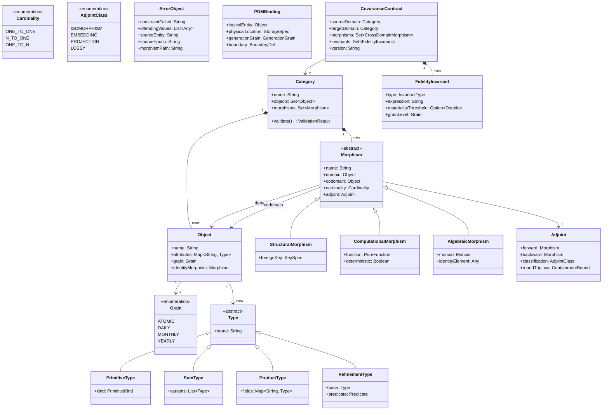

# Requirements Document: Categorical Data Mapping & Computation Engine (CDME)

**Project**: data_mapper.test10
**Version**: 1.0
**Status**: Approved for Design Stage
**Date**: 2026-02-27
**Source**: specification/INTENT.md (v7.2)
**Technology**: Scala 2.13 + Apache Spark 3.5

---

## 1. Overview

### 1.1 System Purpose

The CDME is a data mapping and computation engine built from first principles using **Category Theory**. It eliminates the impedance mismatch between logical business requirements and physical data execution by treating schemas as topologies and transformations as functors. The engine provides mathematical guarantees that valid mapping definitions produce topologically correct, lineage-preserving, grain-safe, type-enforced pipelines.

### 1.2 Scope Boundaries

**In Scope:**

- Logical Data Model (LDM) as a directed multigraph category
- Physical Data Model (PDM) with functorial binding to LDM
- Topological compiler for mapping validation at definition time
- Traversal engine with Kleisli lifting, monoidal folding, and grain safety
- Extended type system with refinement types and error domain semantics
- AI Assurance Layer for hallucination prevention in generated mappings
- Adjoint morphisms for reverse transformations, reconciliation, and impact analysis
- Cross-domain fidelity via covariance contracts
- Record accounting with zero-loss guarantees
- OpenLineage-compatible observability
- Regulatory compliance support (BCBS 239, FRTB, GDPR/CCPA, EU AI Act)

**Out of Scope:**

- Visual mapping designer / UI
- Data ingestion and extraction connectors (external to engine)
- Business logic authoring tools
- ML model training or inference
- Full categorical sheaf axiom implementation (sheaf-like constraints only)
- Frobenius algebra formalization (deferred to design; see Appendix A of specification)

### 1.3 Intent Traceability

All requirements trace to the following intents from `specification/INTENT.md`:

| Intent | Title | Summary |
|--------|-------|---------|
| **INT-001** | Categorical Data Mapping Engine | Core topology, lineage, grain safety, type enforcement |
| **INT-002** | Core Philosophy (The 10 Axioms) | Foundational axioms governing system design |
| **INT-003** | Universal Applicability | Computations (cashflows, risk, Monte Carlo) as morphisms |
| **INT-004** | Strategic Value — AI Assurance Layer | Hallucination prevention, triangulation, EU AI Act |
| **INT-005** | Adjoint Morphisms | Reverse transformations, reconciliation, impact analysis |
| **INT-006** | Frobenius Algebra (Speculative) | Deferred: optional enhancement for aggregate/expand duality |

---

## 2. Terminology

Every domain term used in this document is defined precisely below. The terminology bridges Category Theory concepts with Data Architecture concepts.

| Term | Definition |
|------|-----------|
| **Category** | A mathematical structure consisting of Objects and Morphisms with composition and identity laws. In CDME, the LDM is a category. |
| **Object (Entity)** | A node in the LDM directed multigraph. Represents a typed data structure (e.g., Trade, Counterparty) existing at a specific Grain. Formally a finite typed product: `E = {(Name, Type)}`. |
| **Morphism** | A directed edge in the LDM graph: `f: A → B`. Represents a relationship, derivation, or computation. Classified as Structural, Computational, or Algebraic. |
| **Structural Morphism** | A topological connection (foreign key). Carries cardinality: `1:1` (Isomorphism), `N:1` (Function), `1:N` (Kleisli Arrow). |
| **Computational Morphism** | A pure function derivation: `f(Entity) → DerivedValue`. Must be total or explicitly return `Option`. |
| **Algebraic Morphism (Fold)** | A grain-reducing aggregation satisfying Monoid Laws: associative binary operation with identity element. |
| **Functor** | A structure-preserving mapping between categories. In CDME, the PDM binding is a functor mapping LDM entities to physical storage. |
| **Kleisli Arrow** | A morphism of the form `A → List[B]`, modeling `1:N` relationships. Requires context lifting from scalar to list. |
| **Monoid** | An algebraic structure `(M, ⊗, e)` where `⊗` is associative and `e` is the identity element. All fold operations must form monoids. |
| **Adjoint** | A pair of morphisms `(forward: A → B, backward: B → A)` forming a Galois connection with round-trip containment laws. |
| **Grain** | The granularity dimension of an entity (e.g., Atomic, Daily, Monthly). Formal metadata property used for composition validation. |
| **Epoch** | A bounded processing context (e.g., daily batch, hourly window). Data exists within an epoch; cross-epoch operations require explicit temporal semantics. |
| **Contextual Fiber** | The intersection of Entity, Epoch, and Partition forming a coherent local data section. Joins must occur between compatible fibers. |
| **LDM (Logical Data Model)** | The invariant topology defining "what" data means. Independent of physical storage. |
| **PDM (Physical Data Model)** | The implementation detail defining "where" data resides. Bound to LDM via functor. |
| **Refinement Type** | A base type constrained by a predicate (e.g., `PositiveInteger = Int where x > 0`). |
| **Error Domain** | The dedicated space for failed records, modeled as `Left(Error)` in an Either monad. Errors are data, not exceptions. |
| **Topology Artifact** | The serialized LDM definition including entities, morphisms, grain hierarchy, and type definitions. |
| **Implementation Artifact** | The serialized PDM definition including storage locations, join logic, generation grain, and boundary definitions. |
| **Logic Artifact (Mapping)** | The source-to-target transformation definition including paths, synthesis formulas, and lookup versions. |
| **Execution Artifact** | The job configuration including cardinality budgets, failure thresholds, dry-run mode, and sink bindings. |
| **Covariance Contract** | A formal agreement between two domains defining cross-domain morphisms with grain alignment and fidelity invariants. |
| **Fidelity Invariant** | A mathematical assertion that must hold between domains at a given grain level (e.g., `sum(A.amount) == sum(B.amount)`). |
| **Fidelity Certificate** | A cryptographically bound proof that cross-domain invariants hold at a specific point in time. |
| **OpenLineage** | An open standard for data lineage metadata emission and consumption. |
| **Generation Grain** | The physical data generation pattern of a source system: `Event` (immutable stream) or `Snapshot` (point-in-time state). |
| **Writer Monad** | A side-channel accumulator capturing operational telemetry (row counts, latency, quality metrics) without affecting computation determinism. |
| **Reverse-Join Table** | Metadata captured during forward aggregation that maps group keys to constituent source record keys, enabling backward traversal. |
| **Accounting Ledger** | A per-run JSON artifact proving every input record is accounted for in output partitions (processed, filtered, errored). |

---

## 3. Domain Model

---

## 4. Functional Requirements (REQ-F-CDME-*)

### 4.1 Logical Topology (LDM)

#### REQ-F-CDME-001: Directed Multigraph Structure

**Priority**: Critical
**Traces To**: INT-001, INT-002 (Axiom 1: Schema is a Topology)

The LDM shall be defined as a directed multigraph where entities are Objects (nodes) and relationships are Morphisms (edges).

**Acceptance Criteria**:
- AC-001.1: The LDM shall represent multiple edges between the same pair of entities
- AC-001.2: Each entity shall have an identity morphism `Id_E: E → E`
- AC-001.3: All relationships shall be directed edges with explicit source (domain) and target (codomain)
- AC-001.4: The graph structure shall be queryable and traversable programmatically via Scala 2.13 API

---

#### REQ-F-CDME-002: Morphism Cardinality Declaration

**Priority**: Critical
**Traces To**: INT-001, INT-002 (Axiom 3: Transformations are Paths)

Every edge (morphism) in the LDM shall declare its categorical cardinality type.

**Acceptance Criteria**:
- AC-002.1: Every morphism shall have exactly one cardinality type from: `1:1`, `N:1`, `1:N`
- AC-002.2: `1:1` morphisms shall be validated as isomorphisms/bijections
- AC-002.3: `N:1` morphisms shall be validated as standard functions
- AC-002.4: `1:N` morphisms shall be validated as Kleisli arrows (List monad context)
- AC-002.5: Cardinality metadata shall be queryable at runtime

---

#### REQ-F-CDME-003: Path Composition Validity

**Priority**: Critical
**Traces To**: INT-001, INT-002 (Axiom 3), INT-004 (AI Assurance)

A path shall be expressed using Symbolic Dot Notation (e.g., `Entity.Relationship.Attribute`). A path `a.b.c` shall be valid if and only if all composition rules are satisfied.

**Acceptance Criteria**:
- AC-003.1: Each referenced morphism (`a → b`, `b → c`) shall be defined in the LDM topology
- AC-003.2: The codomain of each morphism shall equal the domain of the next (or satisfy subtype rules per REQ-F-CDME-027)
- AC-003.3: Grain safety shall not be violated along the path (per REQ-F-CDME-009)
- AC-003.4: The traversing principal shall have permission on each morphism (per REQ-F-CDME-005)
- AC-003.5: Invalid paths shall be rejected at definition/compile time with error messages identifying which composition constraint failed

---

#### REQ-F-CDME-004: Monoidal Aggregation Laws

**Priority**: Critical
**Traces To**: INT-001, INT-002 (Axiom 5: Grain is a Dimension)

Any function defined for aggregation/fold operations shall satisfy Monoid Laws to guarantee distributed consistency and re-aggregation safety.

**Acceptance Criteria**:
- AC-004.1: The aggregation function shall have an associative binary operation: `(a ⊗ b) ⊗ c = a ⊗ (b ⊗ c)`
- AC-004.2: The aggregation function shall have an identity element `e` where `e ⊗ a = a ⊗ e = a`
- AC-004.3: Non-associative aggregates (e.g., "First Value" without deterministic ordering) shall be rejected
- AC-004.4: Monoid properties shall be validated at mapping definition time
- AC-004.5: Aggregation over an empty input set shall yield the identity element for that monoid (e.g., 0 for Sum, 1 for Product)

---

#### REQ-F-CDME-005: Topological Access Control

**Priority**: High
**Traces To**: INT-001, INT-002 (Axiom 8: Topology is the Guardrail)

The LDM shall support Role-Based Access Control (RBAC) on morphisms. Access control shall imply denial of traversal — morphisms without permission shall not exist for that principal.

**Acceptance Criteria**:
- AC-005.1: Morphisms shall carry RBAC metadata (roles/permissions)
- AC-005.2: Unauthorized principals shall not traverse restricted morphisms
- AC-005.3: Path validation shall respect access control (restricted morphisms shall appear non-existent to unauthorized principals)
- AC-005.4: Denied traversal attempts shall be logged for audit
- AC-005.5: Access control shall be evaluated at compile time

---

#### REQ-F-CDME-006: Grain and Type Metadata

**Priority**: Critical
**Traces To**: INT-001, INT-002 (Axiom 5, Axiom 7)

Every Entity in the LDM shall be explicitly tagged with Grain and typed attributes using the Extended Type System.

**Acceptance Criteria**:
- AC-006.1: Every entity shall have explicit Grain metadata (e.g., Atomic, Daily, Monthly, Yearly)
- AC-006.2: Grain metadata shall be used for composition validation
- AC-006.3: All entity attributes shall be typed per REQ-F-CDME-024
- AC-006.4: Grain hierarchy shall be queryable for validation of multi-level aggregation

---

### 4.2 Physical Binding (PDM)

#### REQ-F-CDME-007: Functorial Physical Binding

**Priority**: High
**Traces To**: INT-001, INT-002 (Axiom 2: Separation of Concerns)

The system shall abstract physical storage as a Functor mapping LDM to PDM. Re-pointing storage shall not require business logic changes.

**Acceptance Criteria**:
- AC-007.1: Logical entities shall be re-bindable to different storage (file, table, API) without LDM changes
- AC-007.2: Physical bindings shall be defined separately from logical topology
- AC-007.3: Business logic shall reference only logical entity names, not physical paths
- AC-007.4: Storage re-binding shall not invalidate existing mappings

---

#### REQ-F-CDME-008: Generation Grain and Boundary Semantics

**Priority**: High
**Traces To**: INT-001, INT-002 (Axiom 4: Data Has Contextual Extent)

The PDM shall declare the generation grain and boundary definition for each physical source.

**Acceptance Criteria**:
- AC-008.1: Generation grain shall be one of: `Event`, `Snapshot`
- AC-008.2: Event semantics: immutable occurrences sliced by temporal windows
- AC-008.3: Snapshot semantics: state at a point in time where each snapshot supersedes prior states
- AC-008.4: Boundary definition shall specify slicing strategy (temporal window, version, batch ID)
- AC-008.5: Boundaries shall be consistent with generation grain
- AC-008.6: Generation grain and boundary definitions shall be explicit, not defaulted

---

### 4.3 Traversal Engine

#### REQ-F-CDME-009: Grain Safety Enforcement

**Priority**: Critical
**Traces To**: INT-001, INT-002 (Axiom 5), INT-004 (AI Assurance)

The engine shall block operations that combine attributes from incompatible grains without explicit aggregation.

**Acceptance Criteria**:
- AC-009.1: Projecting attributes from incompatible grains into the same output entity shall be blocked
- AC-009.2: Using attributes from incompatible grains in the same expression shall be blocked
- AC-009.3: Joining entities at different grains without aggregation morphism shall be blocked
- AC-009.4: Violations shall be detected at compile time with clear error messages
- AC-009.5: Explicit aggregation morphisms shall allow grain mixing when valid

---

#### REQ-F-CDME-010: Kleisli Context Lifting

**Priority**: Critical
**Traces To**: INT-001, INT-002 (Axiom 3), INT-003

When traversing a `1:N` edge, the engine shall lift execution context from Scalar to List, implementing proper flattening or explosion operations.

**Acceptance Criteria**:
- AC-010.1: Scalar context shall automatically lift to List context on `1:N` traversal
- AC-010.2: Flattening/explosion shall be implemented via Kleisli arrow semantics
- AC-010.3: Lifted context shall propagate correctly through subsequent morphisms
- AC-010.4: Context shall be collapsible via Monoidal Fold (REQ-F-CDME-004)

---

#### REQ-F-CDME-011: Boundary Alignment and Temporal Semantics

**Priority**: High
**Traces To**: INT-001, INT-002 (Axiom 4)

The engine shall detect cross-boundary traversals and require declared temporal semantics.

**Acceptance Criteria**:
- AC-011.1: Cross-boundary traversals shall be detected at compile time
- AC-011.2: The mapping shall declare temporal semantics (As-Of, Latest, Exact)
- AC-011.3: Temporal semantics shall be applied during validation and execution planning
- AC-011.4: Cross-boundary traversals without declared semantics shall be rejected

---

#### REQ-F-CDME-012: Sheaf Context Consistency

**Priority**: Critical
**Traces To**: INT-001, INT-002 (Axiom 4)

When joining two data streams, their Contextual Fibers shall share the same Epoch or use explicit temporal semantics, and have compatible partitioning.

**Acceptance Criteria**:
- AC-012.1: Joins between same-epoch fibers shall be allowed
- AC-012.2: Cross-epoch joins shall require explicit temporal semantics (REQ-F-CDME-011)
- AC-012.3: Partitioning compatibility shall be validated
- AC-012.4: Incompatible fiber joins shall be rejected at validation time with messages identifying the incompatibility

---

#### REQ-F-CDME-013: Deterministic Reproducibility

**Priority**: Critical
**Traces To**: INT-001, INT-002 (Axiom 6, Axiom 8)

Any target value shall be deterministically derivable from source inputs. Same inputs + same mapping + same lookups shall produce same outputs.

**Acceptance Criteria**:
- AC-013.1: Same inputs, mapping, and lookups shall produce bit-identical outputs
- AC-013.2: All dependencies shall be versioned and immutable within execution context
- AC-013.3: Non-deterministic operations (random, timestamps) shall be explicitly forbidden or wrapped in deterministic abstractions
- AC-013.4: Audit trail shall capture all versions and inputs used

---

#### REQ-F-CDME-014: Immutable Run Hierarchy

**Priority**: Critical
**Traces To**: INT-001, INT-002 (Axiom 8), INT-004

Every execution shall be bound to an immutable snapshot of configuration, code, and design artifacts, enabling exact reproduction.

**Acceptance Criteria**:
- AC-014.1: Every run shall be assigned a unique, immutable RunID
- AC-014.2: RunID shall cryptographically bind to hashes of configuration, code, and design artifacts
- AC-014.3: Run manifest shall be stored immutably (write-once)
- AC-014.4: Historical runs shall be exactly reproducible given the manifest
- AC-014.5: Run comparison shall be supported: `diff(run_A, run_B)` showing changes at each level

---

### 4.4 Integration and Synthesis

#### REQ-F-CDME-015: Pure Function Synthesis

**Priority**: High
**Traces To**: INT-001, INT-003

Users shall define new attributes via Pure Functions over existing entities and attributes.

**Acceptance Criteria**:
- AC-015.1: Pure functions shall be registerable as synthesis morphisms
- AC-015.2: Functions shall be stateless and deterministic
- AC-015.3: Synthesized attributes shall be first-class members of the entity
- AC-015.4: Synthesis functions shall compose with other morphisms

---

#### REQ-F-CDME-016: Multi-Level Aggregation

**Priority**: Medium
**Traces To**: INT-001, INT-002 (Axiom 5)

The system shall support aggregating over already-aggregated data under strict conditions.

**Acceptance Criteria**:
- AC-016.1: Each aggregation level shall satisfy Monoid Laws (REQ-F-CDME-004)
- AC-016.2: Grain hierarchy shall permit composition (e.g., Atomic → Daily → Monthly → Yearly)
- AC-016.3: Morphism path shall explicitly encode multi-level aggregation steps
- AC-016.4: Invalid multi-level aggregations shall be rejected

---

#### REQ-F-CDME-017: Full Lineage Traceability

**Priority**: Critical
**Traces To**: INT-001, INT-004

The system shall provide full lineage, mapping every target value back to the Source Epoch, Entity, and morphism path that generated it.

**Acceptance Criteria**:
- AC-017.1: Every target value shall trace to specific source entities and epochs
- AC-017.2: Morphism path (traversal sequence) shall be recorded in lineage
- AC-017.3: Lineage shall include lookup versions used
- AC-017.4: Lineage shall be exportable via OpenLineage API
- AC-017.5: Lineage shall support backward traversal (target → sources)

---

#### REQ-F-CDME-018: Complex Business Logic Support

**Priority**: High
**Traces To**: INT-001, INT-003

The system shall support advanced formulations within synthesis including conditionals, fallbacks, composition, and tuple construction.

**Acceptance Criteria**:
- AC-018.1: Conditional expressions (if-then-else) shall be supported
- AC-018.2: Prioritized fallback logic (if A present, else B, else C) shall be supported
- AC-018.3: Multiple morphisms shall compose into single synthesis
- AC-018.4: Product/tuple types shall be constructible from multiple inputs

---

#### REQ-F-CDME-019: Multi-Grain Formulation

**Priority**: High
**Traces To**: INT-001, INT-002 (Axiom 5)

Formulas shall reference attributes at different grains if finer-grained attributes are wrapped in explicit aggregation morphisms.

**Acceptance Criteria**:
- AC-019.1: Finer-grained attributes shall be wrapped in aggregation morphisms (REQ-F-CDME-004)
- AC-019.2: Aggregation scope shall align to coarser entity's grain
- AC-019.3: Direct unaggregated reference to finer grain shall be rejected at compile time

---

#### REQ-F-CDME-020: Versioned Lookups

**Priority**: Critical
**Traces To**: INT-001, INT-002 (Axiom 6)

All Reference Data usage in transformations shall be explicitly versioned.

**Acceptance Criteria**:
- AC-020.1: Mappings using lookups shall specify version semantics (explicit version, temporal constraint, or deterministic alias)
- AC-020.2: Mappings without lookup version semantics shall be rejected
- AC-020.3: Within single execution context, same lookup + key shall yield same value (immutability)
- AC-020.4: Lookup version shall be recorded in lineage

---

#### REQ-F-CDME-021: Deterministic Key Generation

**Priority**: Medium
**Traces To**: INT-001

The system shall support deterministic key generation (hashing/surrogate keys) where same inputs always produce same keys.

**Acceptance Criteria**:
- AC-021.1: Key generation functions shall be deterministic
- AC-021.2: Same input attributes shall produce bit-identical keys
- AC-021.3: Key generation algorithms shall be configurable
- AC-021.4: Keys shall be stable across re-runs

---

#### REQ-F-CDME-022: External Computational Morphisms

**Priority**: High
**Traces To**: INT-001, INT-003, INT-004

The system shall support registration of external calculators (e.g., compiled Cashflow Engines) as standard Morphisms.

**Acceptance Criteria**:
- AC-022.1: External calculators shall register with domain/codomain type declarations conforming to LDM type system
- AC-022.2: Registrants shall declare determinism as a contract
- AC-022.3: Each calculator shall have a stable identifier/version for lineage tracing
- AC-022.4: Type compatibility shall be enforced at compile time
- AC-022.5: The engine shall NOT attempt runtime verification of determinism beyond contract checks

---

#### REQ-F-CDME-023: Lookup Binding

**Priority**: Medium
**Traces To**: INT-001, INT-002 (Axiom 6)

The PDM shall support binding Reference Data (lookups) as either data-backed (tables/files) or logic-backed (functions).

**Acceptance Criteria**:
- AC-023.1: Lookups shall be bindable to physical tables/files
- AC-023.2: Lookups shall be bindable to pure functions (logic-backed)
- AC-023.3: Both binding types shall provide the same logical interface
- AC-023.4: Lookup versioning shall be enforced (REQ-F-CDME-020)

---

### 4.5 Type System and Error Handling

#### REQ-F-CDME-024: Extended Type System

**Priority**: Critical
**Traces To**: INT-001, INT-002 (Axiom 7: Types are Contracts)

The LDM shall support a rich type system including Primitives, Sum Types, and Product Types.

**Acceptance Criteria**:
- AC-024.1: Primitives supported: `Int`, `Long`, `Float`, `Double`, `String`, `Boolean`, `Date`, `Timestamp`
- AC-024.2: Sum types (`Either`, `Option`) shall be first-class types
- AC-024.3: Product types (tuples, records) shall be first-class types
- AC-024.4: Types shall be composable (nested products/sums)
- AC-024.5: The type system shall be extensible for domain-specific types

---

#### REQ-F-CDME-025: Refinement Types

**Priority**: High
**Traces To**: INT-001, INT-002 (Axiom 7)

The system shall support Refinement Types (base type + predicate) for data quality enforcement.

**Acceptance Criteria**:
- AC-025.1: Refinement types shall combine base type with predicate (e.g., `PositiveInteger = Int where x > 0`)
- AC-025.2: Predicate violations shall route to Error Domain (REQ-F-CDME-026)
- AC-025.3: Runtime validation shall enforce refinement predicates
- AC-025.4: Error objects shall capture the violated refinement

---

#### REQ-F-CDME-026: Error Domain Semantics

**Priority**: Critical
**Traces To**: INT-001, INT-002 (Axiom 10: Failures are Data)

The system shall handle failures via Either Monad strategy where failures are data, not exceptions.

**Acceptance Criteria**:
- AC-026.1: Failures shall be modeled as `Left(Error)`, valid data as `Right(Value)`
- AC-026.2: Failures shall NOT short-circuit entire execution (unless batch threshold exceeded per REQ-F-CDME-028)
- AC-026.3: Invalid records shall be routed to Error Sink, never silently dropped
- AC-026.4: Error Domain shall be queryable and exportable

---

#### REQ-F-CDME-027: Type Unification Rules

**Priority**: Critical
**Traces To**: INT-001, INT-002 (Axiom 7), INT-004

When composing morphisms `f: A → B` and `g: B → C`, type compatibility shall be validated according to strict unification rules.

**Acceptance Criteria**:
- AC-027.1: Composition shall be valid if `codomain(f) = domain(g)`
- AC-027.2: Composition shall be valid if `codomain(f)` is subtype of `domain(g)` per LDM type hierarchy
- AC-027.3: Composition shall be invalid otherwise — the mapping shall be rejected
- AC-027.4: No implicit coercion shall be allowed (REQ-F-CDME-029)

---

#### REQ-F-CDME-028: Batch Failure Threshold

**Priority**: High
**Traces To**: INT-001, INT-002 (Axiom 10)

The Execution Artifact (Job Configuration) may define a Batch Failure Threshold to halt execution on systemic failures.

**Acceptance Criteria**:
- AC-028.1: Threshold shall be configurable as absolute count or percentage
- AC-028.2: Execution shall halt when threshold is exceeded
- AC-028.3: Job configuration shall control commit/rollback of successful records on threshold breach
- AC-028.4: Error Domain shall contain all failures encountered prior to halt

---

#### REQ-F-CDME-029: Explicit Semantic Casting

**Priority**: High
**Traces To**: INT-001, INT-002 (Axiom 7), INT-004

Implicit casting shall be forbidden. All type changes shall be expressed as explicit morphisms in the LDM.

**Acceptance Criteria**:
- AC-029.1: No implicit type coercion (e.g., `String → Int`, `Int → Float`)
- AC-029.2: All type conversions shall be explicit morphisms with defined semantics
- AC-029.3: Implicit cast attempts shall be rejected at compile time
- AC-029.4: Conversion morphisms shall handle failure cases

---

#### REQ-F-CDME-030: Idempotent Error Handling

**Priority**: High
**Traces To**: INT-001, INT-002 (Axiom 8)

Error handling logic shall be idempotent: re-processing the same failing records under the same conditions shall produce the same Error results.

**Acceptance Criteria**:
- AC-030.1: Same failing input + same mapping shall yield bit-identical error output
- AC-030.2: Error routing shall be deterministic
- AC-030.3: Re-runs shall produce identical Error Domain contents

---

#### REQ-F-CDME-031: Minimal Error Object Content

**Priority**: High
**Traces To**: INT-001, INT-002 (Axiom 10)

Each Error Object routed to the Error Domain shall include minimum diagnostic information.

**Acceptance Criteria**:
- AC-031.1: Error object shall contain the failed constraint/refinement type
- AC-031.2: Error object shall contain the offending value(s)
- AC-031.3: Error object shall contain source Entity and Epoch
- AC-031.4: Error object shall contain morphism path where failure occurred
- AC-031.5: Error objects shall be structured for programmatic analysis

---

### 4.6 AI Assurance

#### REQ-F-CDME-032: Topological Validity Check for AI Mappings

**Priority**: Critical
**Traces To**: INT-004, INT-002 (Axiom 8)

The engine shall validate AI-generated mappings using the same structural rules as human-authored mappings and reject hallucinations.

**Acceptance Criteria**:
- AC-032.1: AI-generated mappings shall be validated against LDM topology
- AC-032.2: Hallucinated morphisms (non-existent relationships) shall be rejected
- AC-032.3: Type unification violations shall be rejected
- AC-032.4: Grain safety violations shall be rejected
- AC-032.5: Access control violations shall be rejected
- AC-032.6: Rejection shall occur at compile time with clear error messages
- AC-032.7: Domain-semantic correctness (business logic) is NOT required to be validated beyond the type system

---

#### REQ-F-CDME-033: Triangulation of Assurance

**Priority**: High
**Traces To**: INT-004

The system shall support linkage of Intent, Logic, and Proof for real-time verification of AI-generated pipelines.

**Acceptance Criteria**:
- AC-033.1: Proof shall include Lineage Graph, Execution Trace, and Type Unification Report
- AC-033.2: Intent → Logic → Proof linkage shall be traceable
- AC-033.3: Proof artifacts shall be exportable for human review

---

#### REQ-F-CDME-034: Dry Run Mode

**Priority**: High
**Traces To**: INT-004

The system shall support "Dry Run" mode for immediate assurance signals without committing results.

**Acceptance Criteria**:
- AC-034.1: Dry Run shall execute validation and execution planning without writing to sinks
- AC-034.2: Dry Run shall produce Lineage Graph, Type Unification Report, and Cost Estimate
- AC-034.3: Dry Run mode shall be configurable in the Execution Artifact

---

### 4.7 Adjoint Morphisms

#### REQ-F-CDME-035: Adjoint Interface

**Priority**: High
**Traces To**: INT-005, INT-002 (Axiom 3)

Every morphism `f: A → B` shall have a corresponding backward morphism `f⁻: B → A` forming a Galois connection.

**Acceptance Criteria**:
- AC-035.1: Every morphism shall implement the `Adjoint[T, U]` interface with `forward` and `backward`
- AC-035.2: Round-trip containment: `backward(forward(x)) ⊇ x`
- AC-035.3: Round-trip contraction: `forward(backward(y)) ⊆ y`
- AC-035.4: Contravariant composition: `(g ∘ f)⁻ = f⁻ ∘ g⁻`
- AC-035.5: Identity shall be self-adjoint: `id⁻ = id`

---

#### REQ-F-CDME-036: Adjoint Classification

**Priority**: High
**Traces To**: INT-005

Every morphism shall be classified by its adjoint properties.

**Acceptance Criteria**:
- AC-036.1: Classifications shall include: `Isomorphism`, `Embedding`, `Projection`, `Lossy`
- AC-036.2: `Isomorphism`: `f⁻(f(x)) = x` and `f(f⁻(y)) = y`
- AC-036.3: `Embedding`: `f⁻(f(x)) = x` but `f(f⁻(y)) ⊆ y`
- AC-036.4: `Projection`: `f⁻(f(x)) ⊇ x` but `f(f⁻(y)) = y`
- AC-036.5: `Lossy`: `f⁻(f(x)) ⊇ x` and `f(f⁻(y)) ⊆ y`
- AC-036.6: Classification shall be inferred automatically where possible

---

#### REQ-F-CDME-037: Self-Adjoint Morphisms (Isomorphisms)

**Priority**: High
**Traces To**: INT-005

Self-adjoint morphisms (isomorphisms) shall have exact backward computed automatically.

**Acceptance Criteria**:
- AC-037.1: `1:1` morphisms shall have automatic inverse backward
- AC-037.2: Pure field derivations shall have backward computed from formula if algebraically invertible
- AC-037.3: Non-invertible formulas (e.g., hash functions) shall be classified as `Lossy`

---

#### REQ-F-CDME-038: Aggregation Backward via Reverse-Join

**Priority**: Critical
**Traces To**: INT-005, REQ-F-CDME-004

Aggregation morphisms shall capture reverse-join metadata during forward execution to enable backward traversal.

**Acceptance Criteria**:
- AC-038.1: Aggregation wrappers shall capture mapping of group keys → constituent record keys
- AC-038.2: Reverse-join table shall be stored alongside aggregation output
- AC-038.3: `backward(group_key)` shall return set of original record keys
- AC-038.4: Storage format shall be configurable (inline, separate table, compressed)

---

#### REQ-F-CDME-039: Filter Backward

**Priority**: High
**Traces To**: INT-005

Filter morphisms shall capture filtered-out keys during forward execution to enable complete set reconstruction.

**Acceptance Criteria**:
- AC-039.1: Filter wrappers shall capture keys of both passed and filtered-out records
- AC-039.2: `backward(passed_keys) ∪ filtered_out_keys = original_input_keys`
- AC-039.3: Filtered-out key storage shall be configurable
- AC-039.4: When disabled, classification shall be `Lossy`

---

#### REQ-F-CDME-040: Kleisli Backward

**Priority**: High
**Traces To**: INT-005, REQ-F-CDME-010

Kleisli arrow (1:N expansion) morphisms shall capture parent-child mapping during forward execution to enable backward.

**Acceptance Criteria**:
- AC-040.1: `1:N` expansion shall capture child keys → parent key mapping
- AC-040.2: `backward(child_keys)` shall return the unique parent key
- AC-040.3: Parent-child mapping shall be stored as part of expansion metadata

---

#### REQ-F-CDME-041: Adjoint Composition Validation

**Priority**: High
**Traces To**: INT-005, REQ-F-CDME-003

The compiler shall validate that adjoint composition follows contravariant rules and propagates classification correctly.

**Acceptance Criteria**:
- AC-041.1: Composed backward `(g ∘ f)⁻` shall be computed as `f⁻ ∘ g⁻`
- AC-041.2: Composition of `Isomorphism` adjoints shall yield `Isomorphism`
- AC-041.3: Composition involving `Lossy` adjoints shall yield `Lossy`
- AC-041.4: Adjoint composition validation shall occur at compile time

---

#### REQ-F-CDME-042: Data Reconciliation via Adjoints

**Priority**: High
**Traces To**: INT-005

The system shall support data reconciliation by computing `backward(forward(x))` and validating containment against original input.

**Acceptance Criteria**:
- AC-042.1: Reconciliation operation shall compute `backward(forward(x))`
- AC-042.2: For isomorphisms: `backward(forward(x)) = x` (exact equality)
- AC-042.3: For projections/lossy: `backward(forward(x)) ⊇ x` (containment validated)
- AC-042.4: Reconciliation results shall be exportable for audit

---

#### REQ-F-CDME-043: Impact Analysis via Adjoints

**Priority**: High
**Traces To**: INT-005

The system shall support impact analysis by computing `backward(target_subset)` to identify contributing source records.

**Acceptance Criteria**:
- AC-043.1: Given a subset of target records, the system shall compute contributing source records via backward
- AC-043.2: Impact analysis shall traverse composed backward path
- AC-043.3: Result shall include all source entities and records on the path
- AC-043.4: Impact analysis shall respect epoch/context boundaries

---

#### REQ-F-CDME-044: Bidirectional Sync

**Priority**: Medium
**Traces To**: INT-005

The system shall support bidirectional synchronization via a single adjoint definition.

**Acceptance Criteria**:
- AC-044.1: Single adjoint `f: A ⇌ B` shall enable bidirectional sync
- AC-044.2: Changes to A shall propagate to B via `forward`
- AC-044.3: Changes to B shall propagate to A via `backward`
- AC-044.4: Conflict detection shall apply when both sides have changes
- AC-044.5: Conflict resolution strategies shall include: source-wins, target-wins, merge, fail

---

### 4.8 Record Accounting

#### REQ-F-CDME-045: Accounting Invariant

**Priority**: Critical
**Traces To**: INT-001, INT-005

Every input record shall be accounted for in exactly one output partition.

**Acceptance Criteria**:
- AC-045.1: The equation `|input_keys| = |reverse_join_keys| + |filtered_keys| + |error_keys|` shall hold for every run
- AC-045.2: No record shall appear in multiple partitions
- AC-045.3: No record shall be unaccounted
- AC-045.4: Verification shall be performed before marking a run as COMPLETE

---

#### REQ-F-CDME-046: Accounting Ledger

**Priority**: Critical
**Traces To**: INT-001, INT-005

Each run shall produce a `ledger.json` file proving the accounting invariant holds.

**Acceptance Criteria**:
- AC-046.1: Ledger shall contain input record count and source key field name
- AC-046.2: Ledger shall contain partition breakdown with adjoint metadata locations
- AC-046.3: Ledger shall contain verification status (balanced/unbalanced)
- AC-046.4: If unbalanced, ledger shall contain discrepancy details
- AC-046.5: Ledger shall be written atomically at run completion

---

#### REQ-F-CDME-047: Run Completion Gate

**Priority**: Critical
**Traces To**: INT-001, INT-005

A run shall not be marked COMPLETE unless the accounting invariant verification passes.

**Acceptance Criteria**:
- AC-047.1: Verification shall run automatically before setting status to COMPLETE
- AC-047.2: If verification passes: emit OpenLineage COMPLETE event with ledger reference
- AC-047.3: If verification fails: set status to FAILED and emit OpenLineage FAIL event with discrepancy details

---

### 4.9 Cross-Domain Fidelity

#### REQ-F-CDME-048: Covariance Contracts

**Priority**: High
**Traces To**: INT-001, INT-002 (Axiom 8), INT-005

The system shall support formal Covariance Contracts between domains defining cross-domain morphisms with grain alignment and fidelity invariants.

**Acceptance Criteria**:
- AC-048.1: Contracts shall define morphisms between domains with explicit grain alignment
- AC-048.2: Cross-domain morphisms shall declare cardinality
- AC-048.3: Grain alignment shall be enforced: ATOMIC↔ATOMIC, DAILY↔DAILY, etc.
- AC-048.4: Contracts shall be versioned and immutable
- AC-048.5: Contract violations shall be detected at compile time where possible

---

#### REQ-F-CDME-049: Fidelity Invariants

**Priority**: Critical
**Traces To**: INT-001, INT-002 (Axiom 7), REQ-F-CDME-048

Covariance contracts shall support Fidelity Invariants — mathematical assertions that must hold between domains at each grain level.

**Acceptance Criteria**:
- AC-049.1: Invariant types shall include: Conservation, Coverage, Alignment, Containment
- AC-049.2: Invariants shall support materiality thresholds
- AC-049.3: Violations shall be contract breaches, not warnings
- AC-049.4: Breach severity levels: IMMATERIAL, MATERIAL, CRITICAL

---

#### REQ-F-CDME-050: Fidelity Verification

**Priority**: Critical
**Traces To**: INT-001, REQ-F-CDME-048, REQ-F-CDME-049

The system shall provide Fidelity Verification producing cryptographically bound Fidelity Certificates.

**Acceptance Criteria**:
- AC-050.1: Fidelity Certificate shall be cryptographically bound to source/target domain states, contract version, and evaluation results
- AC-050.2: Certificate shall include pass/fail status per invariant with actual vs expected values
- AC-050.3: Certificates shall be immutable and stored with run manifest
- AC-050.4: Historical certificates shall be queryable for audit

---

#### REQ-F-CDME-051: Contract Breach Detection

**Priority**: Critical
**Traces To**: INT-001, REQ-F-CDME-049, REQ-F-CDME-050

The system shall detect invariant violations exceeding materiality thresholds and treat them as Contract Breaches.

**Acceptance Criteria**:
- AC-051.1: Breach severity classification: IMMATERIAL, MATERIAL, CRITICAL
- AC-051.2: Breach record shall include contract/invariant violated, entities involved, expected vs actual, contributing records
- AC-051.3: Configurable breach response: ALERT, QUARANTINE, HALT, ROLLBACK
- AC-051.4: Breach records shall be queryable for regulatory reporting

---

#### REQ-F-CDME-052: Fidelity Certificate Chain

**Priority**: High
**Traces To**: INT-001, REQ-F-CDME-050, REQ-F-CDME-014

Fidelity certificates shall form an immutable chain enabling proof of continuous fidelity over time.

**Acceptance Criteria**:
- AC-052.1: Each certificate shall reference the previous certificate (hash chain)
- AC-052.2: Gaps in verification shall be detectable
- AC-052.3: Chain shall be queryable: "Prove fidelity between date A and date B"

---

### 4.10 Temporal Binding and Late Arrival

#### REQ-F-CDME-053: Temporal Binding

**Priority**: Medium
**Traces To**: INT-001, INT-002 (Axiom 4)

The PDM shall support Temporal Binding where a single Logical Entity maps to different Physical Tables as a function of Data Epoch.

**Acceptance Criteria**:
- AC-053.1: Single logical entity shall resolve to multiple physical tables by epoch
- AC-053.2: Resolution shall be deterministic for a given epoch
- AC-053.3: Schema compatibility shall be validated across temporal physical targets

---

#### REQ-F-CDME-054: Late Arrival Handling

**Priority**: High
**Traces To**: INT-001, INT-002 (Axiom 4)

The system shall handle late-arriving data with explicit strategies maintaining determinism and auditability.

**Acceptance Criteria**:
- AC-054.1: Late arrival detection shall identify records arriving after epoch closure
- AC-054.2: Configurable strategies: REJECT, REPROCESS, ACCUMULATE, BACKFILL
- AC-054.3: Strategy selection shall be explicit in PDM source configuration
- AC-054.4: Late arrival records shall never be silently dropped

---

### 4.11 Semantic Types

#### REQ-F-CDME-055: Semantic Type Enforcement (Optional)

**Priority**: Medium
**Traces To**: INT-001, INT-002 (Axiom 7)

The type system may support semantic type distinctions (Money, Date, Percent) beyond primitive types to prevent category errors.

**Acceptance Criteria**:
- AC-055.1: Semantic types shall be definable in LDM
- AC-055.2: Operations between incompatible semantic types shall be rejected
- AC-055.3: Semantic enforcement shall be opt-in (system works with primitives alone)

---

## 5. Non-Functional Requirements (REQ-NFR-CDME-*)

#### REQ-NFR-CDME-001: Operational Telemetry

**Priority**: Medium
**Traces To**: INT-001

The execution context shall implement a Writer Effect to capture row counts, quality metrics, and latency stats at every morphism execution.

**Acceptance Criteria**:
- AC-NFR-001.1: Telemetry shall be captured at every morphism execution
- AC-NFR-001.2: Metrics shall include: row counts, latency, quality stats
- AC-NFR-001.3: Telemetry shall not affect determinism of computation
- AC-NFR-001.4: Telemetry shall be exported via OpenLineage API
- AC-NFR-001.5: Telemetry overhead shall be less than 5% of execution time

---

#### REQ-NFR-CDME-002: Computational Cost Governance

**Priority**: High
**Traces To**: INT-001

The engine shall implement a Cost Estimation Functor to estimate cardinality explosion and enforce execution budgets.

**Acceptance Criteria**:
- AC-NFR-002.1: Cardinality budget shall be declared in Execution Artifact
- AC-NFR-002.2: Cost estimation shall occur before execution begins
- AC-NFR-002.3: Budget shall include: Max Output Rows, Max Join Depth, Max Intermediate Size
- AC-NFR-002.4: Execution shall be blocked if estimated cost exceeds budget

---

#### REQ-NFR-CDME-003: Adjoint Metadata Storage Efficiency

**Priority**: Medium
**Traces To**: INT-005

Adjoint backward metadata shall be stored efficiently with configurable strategies.

**Acceptance Criteria**:
- AC-NFR-003.1: Storage strategies: inline, separate table, compressed
- AC-NFR-003.2: Compression options: Roaring Bitmaps for key sets, range encoding for sorted keys
- AC-NFR-003.3: Storage overhead budget shall be configurable per job (e.g., max 20% of output size)
- AC-NFR-003.4: Metadata shall be prunable after configurable retention period

---

#### REQ-NFR-CDME-004: Distributed Execution

**Priority**: High
**Traces To**: INT-001

The engine shall execute on Apache Spark 3.5 as the distributed compute framework.

**Acceptance Criteria**:
- AC-NFR-004.1: All morphism execution shall be distributable across Spark executors
- AC-NFR-004.2: Monoidal aggregations shall be distributable (associativity guarantees parallel reduction)
- AC-NFR-004.3: Skew mitigation (salted joins) shall be supported for `1:N` expansions
- AC-NFR-004.4: Partition homomorphism shall be maintained where possible for join efficiency

---

#### REQ-NFR-CDME-005: Functional Paradigm

**Priority**: High
**Traces To**: INT-001

Business logic morphisms shall follow the functional paradigm with immutability and pure functions.

**Acceptance Criteria**:
- AC-NFR-005.1: All computational morphisms shall be pure functions (no side effects)
- AC-NFR-005.2: Data structures shall be immutable within the transformation pipeline
- AC-NFR-005.3: The implementation shall use Scala 2.13 functional idioms (case classes, sealed traits, pattern matching)

---

#### REQ-NFR-CDME-006: Impact Analysis Performance

**Priority**: High
**Traces To**: INT-005

Impact analysis via adjoint backward traversal shall be efficient.

**Acceptance Criteria**:
- AC-NFR-006.1: Impact analysis shall be `O(|target_subset|)` not `O(|full_dataset|)`
- AC-NFR-006.2: Backward traversal shall not require recomputation of the full pipeline
- AC-NFR-006.3: Metadata-based traversal shall be sufficient

---

#### REQ-NFR-CDME-007: Immutable Run Retention

**Priority**: High
**Traces To**: INT-001, INT-004

Immutable run manifests and associated artifacts shall have configurable retention.

**Acceptance Criteria**:
- AC-NFR-007.1: Default retention shall be 7 years for regulatory compliance
- AC-NFR-007.2: Retention period shall be configurable per pipeline
- AC-NFR-007.3: Deletion of referenced artifacts shall be forbidden during retention

---

#### REQ-NFR-CDME-008: Dry Run Performance

**Priority**: Medium
**Traces To**: INT-004

Dry Run mode shall complete efficiently relative to full execution.

**Acceptance Criteria**:
- AC-NFR-008.1: Dry Run shall complete in less than 10% of full execution time (target)

---

## 6. Data Requirements (REQ-DATA-CDME-*)

#### REQ-DATA-CDME-001: Four Configuration Artifacts

**Priority**: Critical
**Traces To**: INT-001, INT-002

The system shall accept four distinct structural/execution definitions.

**Acceptance Criteria**:
- AC-DATA-001.1: **Topology Artifact (LDM)**: Entities, Relationships, Grain Hierarchy, Type Definitions
- AC-DATA-001.2: **Implementation Artifact (PDM)**: Storage locations, Join Logic, Generation Grain, Boundary Definitions
- AC-DATA-001.3: **Logic Artifact (Mapping)**: Source → Target paths, synthesis formulas, lookup versions, temporal semantics
- AC-DATA-001.4: **Execution Artifact (Job Configuration)**: Cardinality Budgets, Failure Thresholds, Dry-Run mode, Sink bindings, Commit/Rollback semantics

---

#### REQ-DATA-CDME-002: Artifact Versioning

**Priority**: High
**Traces To**: INT-001, REQ-F-CDME-014

All artifacts shall be versioned and bound to specific runs.

**Acceptance Criteria**:
- AC-DATA-002.1: Every artifact shall have an explicit version identifier (semantic version or content hash)
- AC-DATA-002.2: Artifact modification shall create new version, never overwrite existing
- AC-DATA-002.3: Runs shall reference artifacts by version, not mutable name
- AC-DATA-002.4: Deletion of referenced artifacts shall be forbidden

---

#### REQ-DATA-CDME-003: Lineage Modes

**Priority**: High
**Traces To**: INT-001, INT-005

The engine shall support configurable lineage modes per job/mapping.

**Acceptance Criteria**:
- AC-DATA-003.1: **Full Lineage Mode**: Persist all intermediate keys and morphism steps for every record
- AC-DATA-003.2: **Key-Derivable Lineage Mode**: Persist compressed key envelopes sufficient for deterministic reconstruction
- AC-DATA-003.3: **Summary/Sampled Lineage Mode**: Persist lineage for configurable sample or aggregate statistics
- AC-DATA-003.4: Mode shall be selectable via Execution Artifact

---

#### REQ-DATA-CDME-004: Morphism Classification Metadata

**Priority**: High
**Traces To**: INT-001, INT-005

Every morphism in the compiled execution plan shall be classified for lineage and checkpointing.

**Acceptance Criteria**:
- AC-DATA-004.1: **Lossless Morphism**: Deterministic, injective, does not drop/merge records, no volatile state
- AC-DATA-004.2: **Lossy Morphism**: Drops records (filters), merges records (aggregations), uses non-deterministic state, or irreversibly projects keys
- AC-DATA-004.3: Classification shall be determined at compile time

---

#### REQ-DATA-CDME-005: Checkpointing Policy

**Priority**: High
**Traces To**: INT-001, INT-005

The implementation shall persist key envelopes at defined points in the execution DAG.

**Acceptance Criteria**:
- AC-DATA-005.1: Key envelopes shall be persisted at: all graph inputs, all graph outputs, and immediately after every lossy morphism
- AC-DATA-005.2: Key capture may be omitted at intermediate nodes forming connected subgraphs of lossless morphisms over sorted keys
- AC-DATA-005.3: For each checkpoint: persist Segment Identifier, Start Key, End Key, Key Generation Function Identifier, and Offset/Count metadata

---

#### REQ-DATA-CDME-006: OpenLineage Event Format

**Priority**: High
**Traces To**: INT-001, INT-004

Lineage and telemetry shall be emitted in OpenLineage-compatible format.

**Acceptance Criteria**:
- AC-DATA-006.1: Run start/complete/fail events shall follow OpenLineage specification
- AC-DATA-006.2: Facets shall include lineage graph, type unification report, and cost estimates
- AC-DATA-006.3: Ledger reference shall be included in completion events

---

## 7. Business Rules (REQ-BR-CDME-*)

#### REQ-BR-CDME-001: Compile-Time Rejection Principle

**Priority**: Critical
**Traces To**: INT-002 (Axiom 8), INT-004

Invalid mappings shall be rejected at definition/compile time, not at runtime. The system shall prioritize verification over generation.

**Acceptance Criteria**:
- AC-BR-001.1: All structural, type, grain, and access control violations shall be detected before any data processing
- AC-BR-001.2: Runtime failures shall be limited to data-quality issues (refinement type violations) and systemic errors (source unavailability)

---

#### REQ-BR-CDME-002: No Silent Data Loss

**Priority**: Critical
**Traces To**: INT-002 (Axiom 10), INT-005

No record shall ever be silently dropped. Every record shall be accounted for as processed, filtered, or errored.

**Acceptance Criteria**:
- AC-BR-002.1: The accounting invariant (REQ-F-CDME-045) shall hold for every run
- AC-BR-002.2: Records failing refinement types shall be routed to Error Domain, not discarded

---

#### REQ-BR-CDME-003: AI and Human Mapping Parity

**Priority**: Critical
**Traces To**: INT-004

AI-generated mappings and human-authored mappings shall undergo identical validation. No special treatment for either origin.

**Acceptance Criteria**:
- AC-BR-003.1: The topological compiler shall not distinguish between AI and human origins
- AC-BR-003.2: All validation rules shall apply equally regardless of mapping source

---

#### REQ-BR-CDME-004: Regulatory Audit Package

**Priority**: Critical
**Traces To**: INT-001, INT-004

The system shall generate an audit package sufficient for independent regulatory audit.

**Acceptance Criteria**:
- AC-BR-004.1: Package shall contain: LDM topology (versioned), PDM bindings (versioned), Logic artifacts (versioned), Lineage graph, Execution trace, and Type-unification proof set
- AC-BR-004.2: An independent auditor shall be able to reconstruct the logical transformation path from sources to targets
- AC-BR-004.3: An independent auditor shall be able to verify type and grain consistency
- AC-BR-004.4: An independent auditor shall be able to trace any output value back to source inputs and applicable lookups

---

#### REQ-BR-CDME-005: Approximate Aggregation Governance

**Priority**: Medium
**Traces To**: INT-001, INT-002 (Axiom 5)

The system shall distinguish between exact and approximate aggregations for governance control.

**Acceptance Criteria**:
- AC-BR-005.1: LDM shall distinguish **ExactAgg** (Sum, Count, Min, Max) from **ApproxAgg** (Median, Percentile via sketches)
- AC-BR-005.2: Approximate aggregations shall use mergeable sketch structures (t-Digest, HyperLogLog)
- AC-BR-005.3: Governance policy shall control where approximations are permissible

---

## 8. Success Criteria

The system shall be considered "Green" (minimum viable) when the following are demonstrated, each traceable to specific requirements:

| # | Criterion | Traces To |
|---|-----------|-----------|
| SC-01 | Source LDM defined with atomic event grain and Target LDM defined with daily aggregate grain | REQ-F-CDME-001, REQ-F-CDME-006, REQ-F-CDME-008 |
| SC-02 | A `1:N` path (Kleisli arrow) is mapped and traversed correctly | REQ-F-CDME-002, REQ-F-CDME-010 |
| SC-03 | System Boundary defined and enforced for cross-boundary joins | REQ-F-CDME-011, REQ-F-CDME-012 |
| SC-04 | Engine generates Execution Plan that correctly joins, handles cardinality expansion, calculates, aggregates, and produces Target without manual intervention | REQ-F-CDME-003, REQ-F-CDME-004, REQ-F-CDME-010 |
| SC-05 | Conditional priority selection executes correctly in mapping | REQ-F-CDME-018 |
| SC-06 | Lookup results match specified version semantics for execution duration | REQ-F-CDME-020 |
| SC-07 | Row failing Refinement Type is blocked and routed to Error Domain with diagnostic info | REQ-F-CDME-025, REQ-F-CDME-026, REQ-F-CDME-031 |
| SC-08 | OpenLineage event emitted with full lineage for all target attributes | REQ-F-CDME-017, REQ-DATA-CDME-006 |
| SC-09 | Regulatory audit package generated and independently verifiable | REQ-BR-CDME-004 |
| SC-10 | AI-generated mapping with non-existent relationship is rejected at compile time | REQ-F-CDME-032 |
| SC-11 | External Cashflow Engine registered and executed as Morphism with traceable type signature | REQ-F-CDME-022 |
| SC-12 | Re-running job with partial errors produces bit-identical valid and error outputs | REQ-F-CDME-013, REQ-F-CDME-030 |
| SC-13 | Accounting ledger balances for every run | REQ-F-CDME-045, REQ-F-CDME-046, REQ-F-CDME-047 |
| SC-14 | Impact analysis via `backward(target_subset)` returns contributing source records | REQ-F-CDME-043 |
| SC-15 | Adjoint round-trip `backward(forward(x)) ⊇ x` validates for aggregation morphism | REQ-F-CDME-042 |

---

## 9. Assumptions and Dependencies

### 9.1 Assumptions

| ID | Assumption |
|----|-----------|
| A-01 | Apache Spark 3.5 is the target distributed compute framework |
| A-02 | Scala 2.13 is the implementation language |
| A-03 | LDM, PDM, Mapping, and Execution artifacts are provided as structured configuration (YAML/JSON) |
| A-04 | Physical storage systems (files, databases, APIs) are pre-existing and accessible |
| A-05 | OpenLineage consumers exist in the deployment environment |
| A-06 | External computational morphisms (e.g., Cashflow Engines) expose deterministic interfaces |
| A-07 | The Frobenius algebra formalization (INT-006) is deferred to design; `Adjoint` is the base interface |
| A-08 | Full categorical sheaf axioms are not required; sheaf-like contextual constraints are sufficient |
| A-09 | Lookup reference data is available in immutable, versioned form |
| A-10 | Regulatory retention requirements (default 7 years) govern artifact storage |

### 9.2 Dependencies

| ID | Dependency | Impact |
|----|-----------|--------|
| D-01 | Apache Spark 3.5 runtime availability | REQ-NFR-CDME-004 |
| D-02 | Scala 2.13 toolchain (sbt, compiler) | All requirements |
| D-03 | OpenLineage-compatible metadata store | REQ-F-CDME-017, REQ-DATA-CDME-006 |
| D-04 | Immutable artifact storage (e.g., object store, versioned repository) | REQ-F-CDME-014, REQ-DATA-CDME-002 |
| D-05 | Cryptographic hashing library | REQ-F-CDME-014, REQ-F-CDME-050, REQ-F-CDME-052 |
| D-06 | Roaring Bitmap library (Scala-compatible) | REQ-NFR-CDME-003, REQ-DATA-CDME-005 |
| D-07 | Sketch libraries (t-Digest, HyperLogLog) for approximate aggregations | REQ-BR-CDME-005 |

---

## 10. Requirement Index

| REQ Key | Title | Section |
|---------|-------|---------|
| REQ-F-CDME-001 | Directed Multigraph Structure | 4.1 |
| REQ-F-CDME-002 | Morphism Cardinality Declaration | 4.1 |
| REQ-F-CDME-003 | Path Composition Validity | 4.1 |
| REQ-F-CDME-004 | Monoidal Aggregation Laws | 4.1 |
| REQ-F-CDME-005 | Topological Access Control | 4.1 |
| REQ-F-CDME-006 | Grain and Type Metadata | 4.1 |
| REQ-F-CDME-007 | Functorial Physical Binding | 4.2 |
| REQ-F-CDME-008 | Generation Grain and Boundary Semantics | 4.2 |
| REQ-F-CDME-009 | Grain Safety Enforcement | 4.3 |
| REQ-F-CDME-010 | Kleisli Context Lifting | 4.3 |
| REQ-F-CDME-011 | Boundary Alignment and Temporal Semantics | 4.3 |
| REQ-F-CDME-012 | Sheaf Context Consistency | 4.3 |
| REQ-F-CDME-013 | Deterministic Reproducibility | 4.3 |
| REQ-F-CDME-014 | Immutable Run Hierarchy | 4.3 |
| REQ-F-CDME-015 | Pure Function Synthesis | 4.4 |
| REQ-F-CDME-016 | Multi-Level Aggregation | 4.4 |
| REQ-F-CDME-017 | Full Lineage Traceability | 4.4 |
| REQ-F-CDME-018 | Complex Business Logic Support | 4.4 |
| REQ-F-CDME-019 | Multi-Grain Formulation | 4.4 |
| REQ-F-CDME-020 | Versioned Lookups | 4.4 |
| REQ-F-CDME-021 | Deterministic Key Generation | 4.4 |
| REQ-F-CDME-022 | External Computational Morphisms | 4.4 |
| REQ-F-CDME-023 | Lookup Binding | 4.4 |
| REQ-F-CDME-024 | Extended Type System | 4.5 |
| REQ-F-CDME-025 | Refinement Types | 4.5 |
| REQ-F-CDME-026 | Error Domain Semantics | 4.5 |
| REQ-F-CDME-027 | Type Unification Rules | 4.5 |
| REQ-F-CDME-028 | Batch Failure Threshold | 4.5 |
| REQ-F-CDME-029 | Explicit Semantic Casting | 4.5 |
| REQ-F-CDME-030 | Idempotent Error Handling | 4.5 |
| REQ-F-CDME-031 | Minimal Error Object Content | 4.5 |
| REQ-F-CDME-032 | Topological Validity Check for AI Mappings | 4.6 |
| REQ-F-CDME-033 | Triangulation of Assurance | 4.6 |
| REQ-F-CDME-034 | Dry Run Mode | 4.6 |
| REQ-F-CDME-035 | Adjoint Interface | 4.7 |
| REQ-F-CDME-036 | Adjoint Classification | 4.7 |
| REQ-F-CDME-037 | Self-Adjoint Morphisms (Isomorphisms) | 4.7 |
| REQ-F-CDME-038 | Aggregation Backward via Reverse-Join | 4.7 |
| REQ-F-CDME-039 | Filter Backward | 4.7 |
| REQ-F-CDME-040 | Kleisli Backward | 4.7 |
| REQ-F-CDME-041 | Adjoint Composition Validation | 4.7 |
| REQ-F-CDME-042 | Data Reconciliation via Adjoints | 4.7 |
| REQ-F-CDME-043 | Impact Analysis via Adjoints | 4.7 |
| REQ-F-CDME-044 | Bidirectional Sync | 4.7 |
| REQ-F-CDME-045 | Accounting Invariant | 4.8 |
| REQ-F-CDME-046 | Accounting Ledger | 4.8 |
| REQ-F-CDME-047 | Run Completion Gate | 4.8 |
| REQ-F-CDME-048 | Covariance Contracts | 4.9 |
| REQ-F-CDME-049 | Fidelity Invariants | 4.9 |
| REQ-F-CDME-050 | Fidelity Verification | 4.9 |
| REQ-F-CDME-051 | Contract Breach Detection | 4.9 |
| REQ-F-CDME-052 | Fidelity Certificate Chain | 4.9 |
| REQ-F-CDME-053 | Temporal Binding | 4.10 |
| REQ-F-CDME-054 | Late Arrival Handling | 4.10 |
| REQ-F-CDME-055 | Semantic Type Enforcement (Optional) | 4.11 |
| REQ-NFR-CDME-001 | Operational Telemetry | 5 |
| REQ-NFR-CDME-002 | Computational Cost Governance | 5 |
| REQ-NFR-CDME-003 | Adjoint Metadata Storage Efficiency | 5 |
| REQ-NFR-CDME-004 | Distributed Execution | 5 |
| REQ-NFR-CDME-005 | Functional Paradigm | 5 |
| REQ-NFR-CDME-006 | Impact Analysis Performance | 5 |
| REQ-NFR-CDME-007 | Immutable Run Retention | 5 |
| REQ-NFR-CDME-008 | Dry Run Performance | 5 |
| REQ-DATA-CDME-001 | Four Configuration Artifacts | 6 |
| REQ-DATA-CDME-002 | Artifact Versioning | 6 |
| REQ-DATA-CDME-003 | Lineage Modes | 6 |
| REQ-DATA-CDME-004 | Morphism Classification Metadata | 6 |
| REQ-DATA-CDME-005 | Checkpointing Policy | 6 |
| REQ-DATA-CDME-006 | OpenLineage Event Format | 6 |
| REQ-BR-CDME-001 | Compile-Time Rejection Principle | 7 |
| REQ-BR-CDME-002 | No Silent Data Loss | 7 |
| REQ-BR-CDME-003 | AI and Human Mapping Parity | 7 |
| REQ-BR-CDME-004 | Regulatory Audit Package | 7 |
| REQ-BR-CDME-005 | Approximate Aggregation Governance | 7 |

---

# Implements: REQ-F-CDME-001, REQ-F-CDME-002, REQ-F-CDME-003, REQ-F-CDME-004, REQ-F-CDME-005, REQ-F-CDME-006, REQ-F-CDME-007, REQ-F-CDME-008, REQ-F-CDME-009, REQ-F-CDME-010, REQ-F-CDME-011, REQ-F-CDME-012, REQ-F-CDME-013, REQ-F-CDME-014, REQ-F-CDME-015, REQ-F-CDME-016, REQ-F-CDME-017, REQ-F-CDME-018, REQ-F-CDME-019, REQ-F-CDME-020, REQ-F-CDME-021, REQ-F-CDME-022, REQ-F-CDME-023, REQ-F-CDME-024, REQ-F-CDME-025, REQ-F-CDME-026, REQ-F-CDME-027, REQ-F-CDME-028, REQ-F-CDME-029, REQ-F-CDME-030, REQ-F-CDME-031, REQ-F-CDME-032, REQ-F-CDME-033, REQ-F-CDME-034, REQ-F-CDME-035, REQ-F-CDME-036, REQ-F-CDME-037, REQ-F-CDME-038, REQ-F-CDME-039, REQ-F-CDME-040, REQ-F-CDME-041, REQ-F-CDME-042, REQ-F-CDME-043, REQ-F-CDME-044, REQ-F-CDME-045, REQ-F-CDME-046, REQ-F-CDME-047, REQ-F-CDME-048, REQ-F-CDME-049, REQ-F-CDME-050, REQ-F-CDME-051, REQ-F-CDME-052, REQ-F-CDME-053, REQ-F-CDME-054, REQ-F-CDME-055, REQ-NFR-CDME-001, REQ-NFR-CDME-002, REQ-NFR-CDME-003, REQ-NFR-CDME-004, REQ-NFR-CDME-005, REQ-NFR-CDME-006, REQ-NFR-CDME-007, REQ-NFR-CDME-008, REQ-DATA-CDME-001, REQ-DATA-CDME-002, REQ-DATA-CDME-003, REQ-DATA-CDME-004, REQ-DATA-CDME-005, REQ-DATA-CDME-006, REQ-BR-CDME-001, REQ-BR-CDME-002, REQ-BR-CDME-003, REQ-BR-CDME-004, REQ-BR-CDME-005
