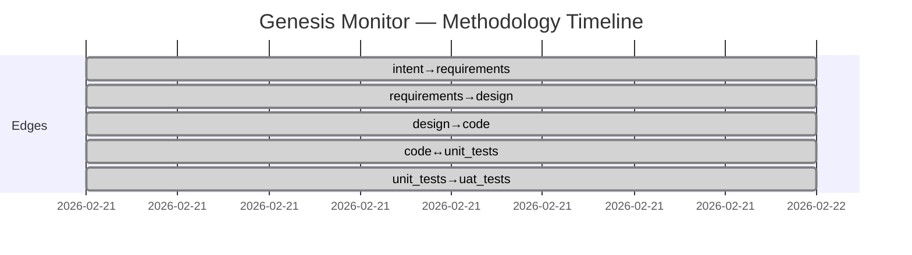

# Genesis Monitor — Project Status

**Generated**: 2026-02-21T10:00:00Z
**Feature**: REQ-F-GMON-001 (Real-Time Methodology Dashboard)
**Methodology**: AI SDLC Asset Graph Model v2.1

## Phase Completion Summary

| Edge | Status | Iterations | Evaluators | Source Findings | Process Gaps |
|------|--------|------------|------------|-----------------|-------------|
| intent→requirements | CONVERGED | 1 | 6/6 (agent) | 6 | 0 |
| requirements→design | CONVERGED | 1 | 5/5 (agent) | 5 | 0 |
| design→code | CONVERGED | 1 | 17/17 (agent+deterministic) | 0 | 0 |
| code↔unit_tests | CONVERGED | 1 | 70/70 (pytest) | 0 | 0 |
| unit_tests→uat_tests | CONVERGED | 1 | 20/20 (pytest) | 0 | 0 |
| **Totals** | **5/5** | **5** | **118/118** | **11** | **0** |

## Asset Summary

| Asset Type | Path | Size |
|-----------|------|------|
| Intent | docs/specification/INTENT.md | 3 intent items, 16 outcomes |
| Requirements | docs/specification/REQUIREMENTS.md | 26 REQ keys |
| Design | docs/design/genesis_monitor/DESIGN.md | 7 components, 3 ADRs |
| Code | src/genesis_monitor/ | 17 modules, 10 templates |
| Unit Tests | tests/ | 7 test files, 70 tests |
| UAT Tests | tests/test_server.py | 20 integration tests |

## REQ Traceability

| Stage | Coverage |
|-------|----------|
| Requirements | 26/26 (100%) |
| Design | 26/26 (100%) |
| Code | 26/26 (100%) — all modules tagged with Implements: REQ-* |
| Unit Tests | 26/26 (100%) — all test files tagged with Validates: REQ-* |
| UAT Tests | 8/26 (31%) — server integration tests |

## Self-Reflection (TELEM Signals)

### TELEM-001: Single-session full-pipeline traversal
**Signal**: All 5 edges converged in 1 iteration each within a single Claude Code session
**Concern**: No human evaluator review at any edge — entire pipeline was agent-evaluated
**Recommendation**: Human review of requirements and design before next iteration

### TELEM-002: Parser robustness validated against real data
**Signal**: All 6 parsers tested against live CDME (test04) workspace data
**Concern**: Only one real-world workspace format tested; other projects may have variations
**Recommendation**: Test against test03 and test05 data to validate parser generality

### TELEM-003: Consciousness loop closed
**Signal**: Genesis monitor can observe its own .ai-workspace during development
**Observation**: This is the first concrete instance of the consciousness loop described in v2.5 §7.7 — the tool observes methodology execution while being methodology execution

## Aggregate Metrics

- **Total REQ keys**: 26
- **Total tests**: 90 (70 unit + 20 UAT)
- **Test pass rate**: 100%
- **Test execution time**: 0.56s
- **Source findings**: 11 (6 in requirements, 5 in design)
- **Process gaps**: 0
