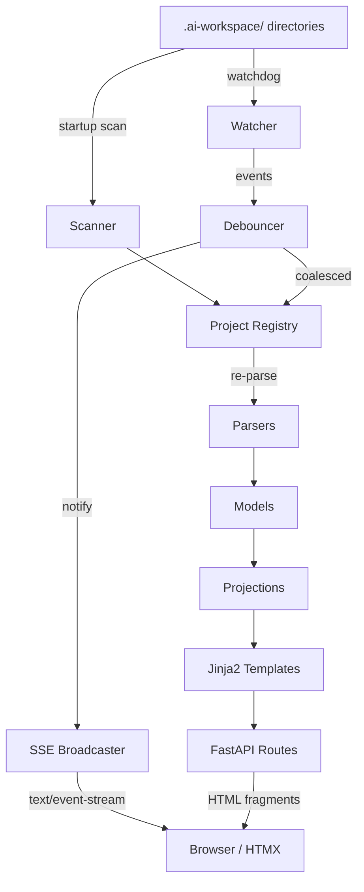

# Genesis Monitor — Technical Design Document

**Version**: 1.0.0
**Date**: 2026-02-21
**Status**: Draft — Generated by v2.1 iterate(requirements→design)
**Feature**: REQ-F-GMON-001
**Source Asset**: docs/specification/REQUIREMENTS.md v1.0.0 (26 REQ keys)
**Methodology**: AI SDLC Asset Graph Model v2.1

---

## Table of Contents

1. [Architecture Overview](#1-architecture-overview)
2. [Component Design](#2-component-design)
3. [Data Model](#3-data-model)
4. [API Design](#4-api-design)
5. [Template Design](#5-template-design)
6. [Package Structure](#6-package-structure)
7. [Configuration](#7-configuration)
8. [Traceability Matrix](#8-traceability-matrix)
9. [ADR Index](#9-adr-index)

---

## 1. Architecture Overview

### 1.1 Design Philosophy

- **Parser-Model-Projection**: Raw filesystem data → typed models → derived views
- **Push, not pull**: Watchdog events drive SSE push; browsers never poll
- **Server-rendered HTML**: Jinja2 templates + HTMX swaps; no client-side state management
- **Graceful degradation**: Missing or corrupt data produces partial views, not errors

### 1.2 High-Level Architecture



### 1.3 Key Design Decisions

- **In-memory state only** — no database, no cache files. State rebuilt from filesystem on startup; incremental updates via watchdog. (ADR-001)
- **SSE over WebSocket** — unidirectional push is sufficient; SSE auto-reconnects and works through proxies. (ADR-002)
- **HTMX for reactivity** — server returns HTML fragments; HTMX swaps them into the DOM on SSE events. No client-side framework. (ADR-003)

---

## 2. Component Design

### 2.1 Scanner (`scanner.py`)

**Implements**: REQ-F-DISC-001, REQ-F-DISC-003

Recursively walks configured root directories to find `.ai-workspace/` directories. Returns a list of project paths.

```python
def scan_roots(roots: list[Path]) -> list[Path]:
    """Find all directories containing .ai-workspace/."""
```

**Design**:
- Uses `os.walk()` with early pruning (skip `.git`, `node_modules`, `__pycache__`, `.venv`)
- Returns parent of `.ai-workspace/` (the project root)
- Called once at startup; watcher handles incremental updates

### 2.2 Project Registry (`registry.py`)

**Implements**: REQ-F-DISC-002

In-memory registry of discovered projects. Thread-safe for concurrent access from watcher thread and async request handlers.

```python
class ProjectRegistry:
    def __init__(self) -> None: ...
    def add_project(self, path: Path) -> Project: ...
    def remove_project(self, path: Path) -> None: ...
    def get_project(self, project_id: str) -> Project | None: ...
    def list_projects(self) -> list[Project]: ...
    def refresh_project(self, project_id: str) -> None: ...
```

**Design**:
- `project_id` = slugified directory name (unique within registry)
- `refresh_project()` re-runs all parsers for that project
- Thread safety via `threading.Lock` on mutations
- Holds parsed `Project` model objects in a `dict[str, Project]`

### 2.3 Parsers (`parsers/`)

**Implements**: REQ-F-PARSE-001 through REQ-F-PARSE-006

Each parser is a standalone function: takes a `Path`, returns a typed model or `None`.

| Parser | Input | Output Model | REQ |
|--------|-------|-------------|-----|
| `parse_status` | `STATUS.md` | `StatusReport` | REQ-F-PARSE-001 |
| `parse_feature_vectors` | `features/active/*.yml` | `list[FeatureVector]` | REQ-F-PARSE-002 |
| `parse_graph_topology` | `graph/graph_topology.yml` | `GraphTopology` | REQ-F-PARSE-003 |
| `parse_events` | `events/events.jsonl` | `list[Event]` | REQ-F-PARSE-004 |
| `parse_tasks` | `tasks/active/ACTIVE_TASKS.md` | `list[Task]` | REQ-F-PARSE-005 |
| `parse_constraints` | `context/project_constraints.yml` | `ProjectConstraints` | REQ-F-PARSE-006 |

**Design**:
- All parsers return `None` (or empty list) on missing/corrupt files — never raise
- YAML parsing via `pyyaml`; markdown parsing via regex (STATUS.md has known structure)
- STATUS.md parser extracts sections by heading: phase completion table, TELEM signals, Gantt mermaid block

### 2.4 Watcher (`watcher.py`)

**Implements**: REQ-F-WATCH-001, REQ-F-WATCH-002

Wraps `watchdog.observers.Observer` to monitor filesystem changes.

```python
class WorkspaceWatcher:
    def __init__(self, registry: ProjectRegistry, broadcaster: SSEBroadcaster,
                 debounce_ms: int = 500) -> None: ...
    def start(self, roots: list[Path]) -> None: ...
    def stop(self) -> None: ...
```

**Design**:
- `watchdog.events.FileSystemEventHandler` subclass filters to `.ai-workspace/` paths
- Debouncing: `threading.Timer` per project_id; resets on each event within window
- On debounce fire: calls `registry.refresh_project(project_id)` then `broadcaster.send(event)`
- Observer runs in its own thread (watchdog default); debounce timers also use threading

### 2.5 SSE Broadcaster (`broadcaster.py`)

**Implements**: REQ-F-STREAM-001

Manages connected SSE clients and pushes events.

```python
class SSEBroadcaster:
    async def subscribe(self) -> AsyncGenerator[dict, None]: ...
    def send(self, event_type: str, data: dict) -> None: ...
```

**Design**:
- Uses `asyncio.Queue` per connected client
- `send()` is called from watcher thread; uses `loop.call_soon_threadsafe()` to enqueue
- `subscribe()` yields from the queue as an async generator for `sse-starlette`
- Client disconnect detected when queue consumer stops; queue removed from active set

### 2.6 FastAPI Application (`server/app.py`)

**Implements**: REQ-F-DASH-001 through REQ-F-DASH-005, REQ-F-STREAM-002, REQ-NFR-002

```python
app = FastAPI(title="Genesis Monitor")

# Page routes (full HTML)
@app.get("/")                           # Project index
@app.get("/project/{project_id}")       # Project detail dashboard

# Fragment routes (HTMX partials)
@app.get("/fragments/project-list")     # Project list table
@app.get("/fragments/project/{id}/graph")      # Asset graph (Mermaid)
@app.get("/fragments/project/{id}/edges")      # Edge status table
@app.get("/fragments/project/{id}/features")   # Feature vector list
@app.get("/fragments/project/{id}/events")     # Recent events
@app.get("/fragments/project/{id}/convergence") # Convergence view
@app.get("/fragments/project/{id}/gantt")      # Gantt chart
@app.get("/fragments/project/{id}/telem")      # TELEM signals

# SSE
@app.get("/events/stream")             # SSE endpoint

# API
@app.get("/api/health")                # Health check
```

**Design**:
- Lifespan handler starts scanner + watcher on startup, stops watcher on shutdown
- Templates served via `Jinja2Templates`
- Fragment endpoints return `HTMLResponse` with rendered template partials
- SSE endpoint uses `sse_starlette.sse.EventSourceResponse`

### 2.7 Projections (`projections/`)

**Implements**: REQ-F-DASH-002 through REQ-F-DASH-005, REQ-F-TELEM-001

Transform parsed models into view-specific data structures.

| Projection | Input | Output | REQ |
|-----------|-------|--------|-----|
| `build_graph_mermaid` | `GraphTopology`, `StatusReport` | Mermaid string | REQ-F-DASH-002 |
| `build_convergence_table` | `StatusReport` | `list[EdgeConvergence]` | REQ-F-DASH-003 |
| `build_gantt_mermaid` | `StatusReport` | Mermaid string or None | REQ-F-DASH-004 |
| `collect_telem_signals` | `list[Project]` | `list[TelemSignal]` | REQ-F-TELEM-001 |

**Design**:
- `build_graph_mermaid`: Generates a Mermaid `graph LR` with node colors based on edge status (green=converged, yellow=in-progress, grey=not-started)
- `build_gantt_mermaid`: Extracts raw Mermaid gantt block from STATUS.md if present
- Pure functions — no side effects, no state

---

## 3. Data Model

### 3.1 Core Models (`models/`)

All models are `dataclasses` with type hints. No ORM, no Pydantic — plain dataclasses for simplicity.

```python
@dataclass
class Project:
    project_id: str              # Slugified directory name
    path: Path                   # Filesystem path
    name: str                    # Display name
    status: StatusReport | None
    features: list[FeatureVector]
    topology: GraphTopology | None
    events: list[Event]
    tasks: list[Task]
    constraints: ProjectConstraints | None
    last_updated: datetime

@dataclass
class StatusReport:
    project_name: str
    phase_summary: list[PhaseEntry]
    telem_signals: list[TelemSignal]
    gantt_mermaid: str | None    # Raw Mermaid block
    metrics: dict[str, str]

@dataclass
class PhaseEntry:
    edge: str                    # e.g., "intent→requirements"
    status: str                  # converged | in_progress | not_started
    iterations: int
    evaluator_results: dict[str, str]  # evaluator_name → pass/fail/skip
    source_findings: int
    process_gaps: int

@dataclass
class FeatureVector:
    feature_id: str              # e.g., REQ-F-GMON-001
    title: str
    status: str
    vector_type: str
    trajectory: dict[str, EdgeTrajectory]  # edge_name → trajectory

@dataclass
class EdgeTrajectory:
    status: str
    iteration: int
    evaluator_results: dict[str, str]

@dataclass
class GraphTopology:
    asset_types: list[AssetType]
    transitions: list[Transition]

@dataclass
class AssetType:
    name: str
    description: str

@dataclass
class Transition:
    source: str
    target: str
    edge_type: str

@dataclass
class Event:
    timestamp: datetime
    event_type: str
    project: str
    data: dict

@dataclass
class Task:
    task_id: str
    title: str
    status: str
    priority: str | None

@dataclass
class TelemSignal:
    signal_id: str
    category: str
    description: str
    project_id: str | None       # Set during aggregation

@dataclass
class ProjectConstraints:
    language: str
    tools: dict[str, dict]
    thresholds: dict[str, str]
    raw: dict                    # Full YAML preserved

@dataclass
class EdgeConvergence:
    edge: str
    iterations: int
    evaluator_summary: str       # e.g., "3/4 pass"
    source_findings: int
    process_gaps: int
    status: str
```

---

## 4. API Design

### 4.1 Page Routes

| Method | Path | Template | Description |
|--------|------|----------|-------------|
| GET | `/` | `index.html` | Project index with auto-updating list |
| GET | `/project/{id}` | `project.html` | Project detail dashboard |

### 4.2 Fragment Routes (HTMX)

| Method | Path | Template Partial | Trigger |
|--------|------|-----------------|---------|
| GET | `/fragments/project-list` | `_project_list.html` | SSE `project_updated` |
| GET | `/fragments/project/{id}/graph` | `_graph.html` | SSE `project_updated` |
| GET | `/fragments/project/{id}/edges` | `_edges.html` | SSE `project_updated` |
| GET | `/fragments/project/{id}/features` | `_features.html` | SSE `project_updated` |
| GET | `/fragments/project/{id}/events` | `_events.html` | SSE `project_updated` |
| GET | `/fragments/project/{id}/convergence` | `_convergence.html` | SSE `project_updated` |
| GET | `/fragments/project/{id}/gantt` | `_gantt.html` | SSE `project_updated` |
| GET | `/fragments/project/{id}/telem` | `_telem.html` | SSE `project_updated` |

### 4.3 SSE Endpoint

| Method | Path | Content-Type | Events |
|--------|------|-------------|--------|
| GET | `/events/stream` | `text/event-stream` | `project_updated`, `project_added`, `project_removed` |

Event payload: `{"project_id": "...", "changed_files": [...]}`

### 4.4 Health

| Method | Path | Response |
|--------|------|----------|
| GET | `/api/health` | `{"status": "ok", "projects": N, "uptime": "..."}` |

---

## 5. Template Design

### 5.1 Template Hierarchy

```
src/genesis_monitor/templates/
├── base.html                  # HTML skeleton, CDN includes, SSE setup
├── index.html                 # Project index page
├── project.html               # Project detail page
└── fragments/
    ├── _project_list.html     # Project list table rows
    ├── _graph.html            # Mermaid asset graph
    ├── _edges.html            # Edge status table
    ├── _features.html         # Feature vector cards
    ├── _events.html           # Event feed
    ├── _convergence.html      # Convergence dashboard
    ├── _gantt.html            # Gantt chart
    └── _telem.html            # TELEM signals
```

### 5.2 Base Template (`base.html`)

- CDN includes: HTMX (1.9.x), Mermaid.js (10.x), minimal CSS (Pico CSS or custom)
- SSE connection setup: `<div hx-ext="sse" sse-connect="/events/stream">`
- Navigation header with project name / breadcrumb
- Flash message area for errors

### 5.3 HTMX Integration Pattern

Each dashboard section follows this pattern:

```html
<!-- Initial load via hx-get, auto-update via SSE -->
<div id="edges-section"
     hx-get="/fragments/project/{{ project_id }}/edges"
     hx-trigger="load, sse:project_updated[detail.project_id=='{{ project_id }}']"
     hx-swap="innerHTML">
    Loading...
</div>
```

### 5.4 Mermaid Rendering

Mermaid diagrams are rendered client-side:
```html
<pre class="mermaid">{{ mermaid_code }}</pre>
<script>mermaid.run()</script>
```

After HTMX swaps, call `mermaid.run()` via `htmx:afterSwap` event handler.

---

## 6. Package Structure

```
src/genesis_monitor/
├── __init__.py
├── models/
│   ├── __init__.py
│   └── core.py              # All dataclasses
├── parsers/
│   ├── __init__.py
│   ├── status.py            # STATUS.md parser
│   ├── features.py          # Feature vector YAML parser
│   ├── topology.py          # Graph topology YAML parser
│   ├── events.py            # events.jsonl parser
│   ├── tasks.py             # ACTIVE_TASKS.md parser
│   └── constraints.py       # project_constraints.yml parser
├── projections/
│   ├── __init__.py
│   ├── graph.py             # Mermaid graph generation
│   ├── convergence.py       # Convergence table
│   ├── gantt.py             # Gantt extraction
│   └── telem.py             # TELEM aggregation
├── watcher/
│   ├── __init__.py
│   └── observer.py          # Watchdog watcher + debouncer
├── server/
│   ├── __init__.py
│   ├── app.py               # FastAPI application + lifespan
│   ├── routes.py            # Page + fragment routes
│   └── broadcaster.py       # SSE broadcaster
├── scanner.py               # Workspace discovery
├── registry.py              # Project registry
├── config.py                # Configuration loading
└── templates/               # Jinja2 templates (see §5)
```

---

## 7. Configuration

### 7.1 Config File (`config.yml`)

```yaml
watch_dirs:
  - ~/src/apps/ai_sdlc_examples/local_projects

server:
  host: "0.0.0.0"
  port: 8000

watcher:
  debounce_ms: 500
  exclude_patterns:
    - "*.pyc"
    - "__pycache__"
    - ".git"
```

### 7.2 CLI Arguments

```
uvicorn genesis_monitor.server.app:app [uvicorn args]

# Or via entry point:
genesis-monitor --watch-dir PATH [--watch-dir PATH2] [--config config.yml] [--port 8000]
```

### 7.3 Config Loading (`config.py`)

**Implements**: REQ-F-DISC-003

```python
@dataclass
class AppConfig:
    watch_dirs: list[Path]
    host: str = "0.0.0.0"
    port: int = 8000
    debounce_ms: int = 500
    exclude_patterns: list[str] = field(default_factory=lambda: [".git", "__pycache__", ".venv", "node_modules"])

def load_config(config_path: Path | None = None, cli_watch_dirs: list[Path] | None = None) -> AppConfig:
    """Load config from YAML, override with CLI args."""
```

---

## 8. Traceability Matrix

| Component | REQ Keys |
|-----------|----------|
| `scanner.py` | REQ-F-DISC-001, REQ-F-DISC-003 |
| `registry.py` | REQ-F-DISC-002 |
| `parsers/status.py` | REQ-F-PARSE-001 |
| `parsers/features.py` | REQ-F-PARSE-002 |
| `parsers/topology.py` | REQ-F-PARSE-003 |
| `parsers/events.py` | REQ-F-PARSE-004 |
| `parsers/tasks.py` | REQ-F-PARSE-005 |
| `parsers/constraints.py` | REQ-F-PARSE-006 |
| `watcher/observer.py` | REQ-F-WATCH-001, REQ-F-WATCH-002 |
| `server/broadcaster.py` | REQ-F-STREAM-001 |
| `server/routes.py` | REQ-F-DASH-001..005, REQ-F-STREAM-002 |
| `projections/graph.py` | REQ-F-DASH-002 |
| `projections/convergence.py` | REQ-F-DASH-003 |
| `projections/gantt.py` | REQ-F-DASH-004 |
| `projections/telem.py` | REQ-F-DASH-005, REQ-F-TELEM-001 |
| `config.py` | REQ-F-DISC-003 |
| All components | REQ-NFR-001 (read-only), REQ-NFR-002 (single process) |
| Templates | REQ-NFR-004 (zero build step) |

---

## 9. ADR Index

| ADR | Decision | Drives |
|-----|----------|--------|
| [ADR-001](adrs/ADR-001.md) | In-memory state only — no database | REQ-NFR-002 |
| [ADR-002](adrs/ADR-002.md) | SSE over WebSocket for real-time push | REQ-F-STREAM-001 |
| [ADR-003](adrs/ADR-003.md) | HTMX for reactive UI without JS framework | REQ-F-STREAM-002, REQ-NFR-004 |

---

## 10. Source Findings

| # | Type | Finding | Resolution |
|---|------|---------|------------|
| 1 | GAP | REQ-F-PARSE-001 does not specify STATUS.md section headings | Design assumes known heading structure from CDME dogfood |
| 2 | AMBIGUITY | REQ-F-DISC-002 "thread-safe" — mechanism unspecified | Resolved: `threading.Lock` (ADR implicit in registry design) |
| 3 | GAP | No error/404 page template specified | Added graceful "not found" handling in routes |
| 4 | UNDERSPEC | REQ-F-STREAM-002 fragment endpoint list not enumerated | Resolved: 8 fragment endpoints defined in §4.2 |
| 5 | GAP | No CLI entry point specified in requirements | Added `genesis-monitor` entry point in §7.2 |
