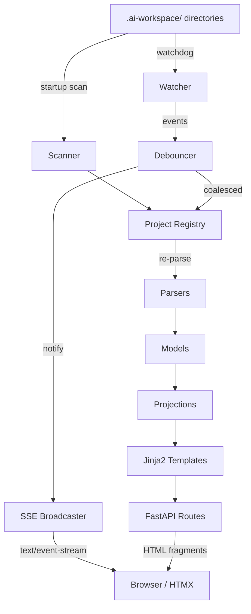

# Genesis Monitor — Technical Design Document

**Version**: 3.0.0
**Date**: 2026-02-23
**Status**: Draft — iterate(requirements→design) for INT-GMON-004
**Feature**: REQ-F-GMON-001, REQ-F-GMON-002
**Source Asset**: specification/REQUIREMENTS.md v3.0.0 (61 REQ keys incl. REQ-F-DASH-006)
**Methodology**: AI SDLC Asset Graph Model v2.8

---

## Table of Contents

1. [Architecture Overview](#1-architecture-overview)
2. [Component Design](#2-component-design)
3. [Data Model](#3-data-model)
4. [API Design](#4-api-design)
5. [Template Design](#5-template-design)
6. [Package Structure](#6-package-structure)
7. [Configuration](#7-configuration)
8. [Traceability Matrix](#8-traceability-matrix)
9. [ADR Index](#9-adr-index)

---

## 1. Architecture Overview

### 1.1 Design Philosophy

- **Parser-Model-Projection**: Raw filesystem data → typed models → derived views
- **Push, not pull**: Watchdog events drive SSE push; browsers never poll
- **Server-rendered HTML**: Jinja2 templates + HTMX swaps; no client-side state management
- **Graceful degradation**: Missing or corrupt data produces partial views, not errors

### 1.2 High-Level Architecture



### 1.3 Key Design Decisions

- **In-memory state only** — no database, no cache files. State rebuilt from filesystem on startup; incremental updates via watchdog. (ADR-001)
- **SSE over WebSocket** — unidirectional push is sufficient; SSE auto-reconnects and works through proxies. (ADR-002)
- **HTMX for reactivity** — server returns HTML fragments; HTMX swaps them into the DOM on SSE events. No client-side framework. (ADR-003)

---

## 2. Component Design

### 2.1 Scanner (`scanner.py`)

**Implements**: REQ-F-DISC-001, REQ-F-DISC-003

Recursively walks configured root directories to find `.ai-workspace/` directories. Returns a list of project paths.

```python
def scan_roots(roots: list[Path]) -> list[Path]:
    """Find all directories containing .ai-workspace/."""
```

**Design**:
- Uses `os.walk()` with early pruning (skip `.git`, `node_modules`, `__pycache__`, `.venv`)
- Returns parent of `.ai-workspace/` (the project root)
- Called once at startup; watcher handles incremental updates

### 2.2 Project Registry (`registry.py`)

**Implements**: REQ-F-DISC-002

In-memory registry of discovered projects. Thread-safe for concurrent access from watcher thread and async request handlers.

```python
class ProjectRegistry:
    def __init__(self) -> None: ...
    def add_project(self, path: Path) -> Project: ...
    def remove_project(self, path: Path) -> None: ...
    def get_project(self, project_id: str) -> Project | None: ...
    def list_projects(self) -> list[Project]: ...
    def refresh_project(self, project_id: str) -> None: ...
```

**Design**:
- `project_id` = slugified directory name (unique within registry)
- `refresh_project()` re-runs all parsers for that project
- Thread safety via `threading.Lock` on mutations
- Holds parsed `Project` model objects in a `dict[str, Project]`

### 2.3 Parsers (`parsers/`)

**Implements**: REQ-F-PARSE-001 through REQ-F-PARSE-006

Each parser is a standalone function: takes a `Path`, returns a typed model or `None`.

| Parser | Input | Output Model | REQ |
|--------|-------|-------------|-----|
| `parse_status` | `STATUS.md` | `StatusReport` | REQ-F-PARSE-001 |
| `parse_feature_vectors` | `features/active/*.yml` | `list[FeatureVector]` | REQ-F-PARSE-002 |
| `parse_graph_topology` | `graph/graph_topology.yml` | `GraphTopology` | REQ-F-PARSE-003 |
| `parse_events` | `events/events.jsonl` | `list[Event]` (typed subclasses) | REQ-F-PARSE-004, REQ-F-EVSCHEMA-001 |
| `parse_tasks` | `tasks/active/ACTIVE_TASKS.md` | `list[Task]` | REQ-F-PARSE-005 |
| `parse_constraints` | `context/project_constraints.yml` | `ProjectConstraints` | REQ-F-PARSE-006 |
| `detect_bootloader` | `CLAUDE.md` (project root) | `bool` | REQ-F-DASH-006 |

**Design**:
- All parsers return `None` (or empty list) on missing/corrupt files — never raise
- YAML parsing via `pyyaml`; markdown parsing via regex (STATUS.md has known structure)
- STATUS.md parser extracts sections by heading: phase completion table, TELEM signals, Gantt mermaid block
- **Bootloader parser**: Checks project-root `CLAUDE.md` for `<!-- GENESIS_BOOTLOADER_START -->` marker. Returns `bool` stored on `Project.has_bootloader`

#### v2.5 Parser Extensions

**Feature vector parser** (extended for REQ-F-VREL-001, REQ-F-TBOX-001, REQ-F-PROF-001):
- Extracts `parent_id`, `spawned_by`, `profile`, `time_box` from feature YAML
- After all vectors are parsed, a cross-reference pass populates `children` lists from `parent_id` links
- Missing fields default to `None` (backward compatible with v2.1 vectors)

**Topology parser** (extended for REQ-F-CDIM-001, REQ-F-PROF-001):
- Extracts `constraint_dimensions` section: list of `{name, mandatory, resolves_via}`
- Extracts `profiles` section: list of named projection profiles with graph/evaluator/convergence/context config
- Missing sections return empty lists (backward compatible with v2.1 topologies)
- **Dual-format asset_types**: Handles both dict-format (`name: {description: ...}`) and list-format (`[{id: ..., description: ...}]`). The list format is emitted by some v2.8 topology generators (e.g., e2e test runs). List items use `id` field (falling back to `name`) for the asset type identifier.

**Event parser** (rewritten for REQ-F-EVSCHEMA-001):
- Dispatch on `event_type` field to construct type-specific Event subclass
- Known types: `iteration_completed`, `edge_converged`, `evaluator_ran`, `finding_raised`, `context_added`, `feature_spawned`, `feature_folded_back`, `intent_raised`, `spec_modified`, `telemetry_signal_emitted`
- Unknown types: construct base `Event` with raw `data` dict (forward compatible)
- Missing required fields: log warning, construct partial model

```python
EVENT_TYPE_MAP: dict[str, type[Event]] = {
    "iteration_completed": IterationCompletedEvent,
    "edge_converged": EdgeConvergedEvent,
    "evaluator_ran": EvaluatorRanEvent,
    "finding_raised": FindingRaisedEvent,
    "feature_spawned": FeatureSpawnedEvent,
    "feature_folded_back": FeatureFoldedBackEvent,
    "intent_raised": IntentRaisedEvent,
    "spec_modified": SpecModifiedEvent,
    "telemetry_signal_emitted": TelemetrySignalEmittedEvent,
}

def parse_event(line: dict) -> Event:
    """Dispatch to typed event or fall back to generic Event."""
    event_type = line.get("event_type", "unknown")
    cls = EVENT_TYPE_MAP.get(event_type, Event)
    return cls(**extract_fields(line, cls))
```

### 2.4 Watcher (`watcher/observer.py`)

**Implements**: REQ-F-WATCH-001, REQ-F-WATCH-002

Two-tier filesystem monitoring: targeted watchdog observers per project + periodic discovery rescan.

```python
class WorkspaceWatcher:
    def __init__(self, registry: ProjectRegistry, broadcaster: SSEBroadcaster,
                 debounce_ms: int = 500) -> None: ...
    def start(self, roots: list[Path]) -> None: ...
    def stop(self) -> None: ...
```

**Design**:
- **Targeted watching**: One `FileSystemEventHandler` per known `.ai-workspace/` directory (not the entire root tree). This avoids processing thousands of irrelevant filesystem events from IDE caches, git operations, and unrelated file saves that caused periodic UI stalls.
- **Per-project debouncing**: Each handler has its own `threading.Timer`; resets on each event within the debounce window. On fire: `registry.refresh_project(project_id)` → `broadcaster.send("project_updated", ...)`
- **Periodic rescan**: A daemon timer re-runs `scan_roots()` every 30 seconds to discover new projects (e.g., e2e test runs creating fresh `.ai-workspace/` directories). New projects are registered, watched, and announced via `project_added` SSE event.
- Observer runs in its own thread (watchdog default); debounce and rescan timers also use threading

### 2.5 SSE Broadcaster (`broadcaster.py`)

**Implements**: REQ-F-STREAM-001

Manages connected SSE clients and pushes events.

```python
class SSEBroadcaster:
    async def subscribe(self) -> AsyncGenerator[dict, None]: ...
    def send(self, event_type: str, data: dict) -> None: ...
```

**Design**:
- Uses `asyncio.Queue` per connected client
- `send()` is called from watcher thread; uses `loop.call_soon_threadsafe()` to enqueue
- `subscribe()` yields from the queue as an async generator for `sse-starlette`
- Client disconnect detected when queue consumer stops; queue removed from active set

### 2.6 FastAPI Application (`server/app.py`)

**Implements**: REQ-F-DASH-001 through REQ-F-DASH-005, REQ-F-STREAM-002, REQ-NFR-002

```python
app = FastAPI(title="Genesis Monitor")

# Page routes (full HTML)
@app.get("/")                           # Project index
@app.get("/project/{project_id}")       # Project detail dashboard

# Fragment routes (HTMX partials)
@app.get("/fragments/project-list")     # Project list table
@app.get("/fragments/project/{id}/graph")      # Asset graph (Mermaid)
@app.get("/fragments/project/{id}/edges")      # Edge status table
@app.get("/fragments/project/{id}/features")   # Feature vector list
@app.get("/fragments/project/{id}/events")     # Recent events
@app.get("/fragments/project/{id}/convergence") # Convergence view
@app.get("/fragments/project/{id}/gantt")      # Gantt chart
@app.get("/fragments/project/{id}/telem")      # TELEM signals

# SSE
@app.get("/events/stream")             # SSE endpoint

# API
@app.get("/api/health")                # Health check
```

**Design**:
- Lifespan handler starts scanner + watcher on startup, stops watcher on shutdown
- Templates served via `Jinja2Templates`
- Fragment endpoints return `HTMLResponse` with rendered template partials
- SSE endpoint uses `sse_starlette.sse.EventSourceResponse`

### 2.7 Projections (`projections/`)

**Implements**: REQ-F-DASH-002 through REQ-F-DASH-005, REQ-F-TELEM-001

Transform parsed models into view-specific data structures.

| Projection | Input | Output | REQ |
|-----------|-------|--------|-----|
| `build_graph_mermaid` | `GraphTopology`, `StatusReport` | Mermaid string | REQ-F-DASH-002 |
| `build_convergence_table` | `StatusReport` | `list[EdgeConvergence]` | REQ-F-DASH-003 |
| `build_gantt_mermaid` | `StatusReport`, `list[FeatureVector]` | Mermaid string or None | REQ-F-DASH-004 |
| `build_project_tree` | `list[Project]` | Nested tree dict | REQ-F-DASH-006 |
| `collect_telem_signals` | `list[Project]` | `list[TelemSignal]` | REQ-F-TELEM-001 |
| `build_spawn_tree` | `list[FeatureVector]` | Mermaid string or nested dict | REQ-F-VREL-003 |
| `build_dimension_matrix` | `GraphTopology`, design artifacts | `list[DimensionCoverage]` | REQ-F-CDIM-002 |
| `build_regime_summary` | `list[Event]`, `StatusReport` | `list[RegimeSummary]` | REQ-F-REGIME-001 |
| `build_consciousness_timeline` | `list[Event]` | `list[ConsciousnessEvent]` | REQ-F-CONSC-001, REQ-F-CONSC-002 |
| `build_protocol_compliance` | `list[Event]` | `list[ComplianceEntry]` | REQ-F-PROTO-001 |

**Design**:
- `build_graph_mermaid`: Generates a Mermaid `graph LR` with node colors based on edge status (green=converged, yellow=in-progress, grey=not-started)
- `build_gantt_mermaid`: Generates Mermaid gantt from feature vector edge trajectories using real `started_at`/`converged_at` timestamps when available. Falls back to status-only sequential rendering (done/active/pending) when timestamps are missing. Last resort: embedded gantt block from STATUS.md
- `build_project_tree`: Builds a hierarchical filesystem tree from the flat project list. Finds the longest common ancestor path, builds a trie from relative paths, then prunes single-child non-project directory chains. Returns nested dict with `{name, path, is_project, project, children}` nodes
- `build_spawn_tree`: Traverses parent/child links to build a Mermaid tree diagram showing vector relationships, spawn triggers, and fold-back state
- `build_dimension_matrix`: Cross-references topology constraint_dimensions against design artifacts (ADR filenames, design section headings) to determine resolution status
- `build_regime_summary`: Groups evaluator results per edge into conscious vs reflex buckets, counts completeness
- `build_consciousness_timeline`: Extracts `intent_raised` and `spec_modified` events, chains `prior_intents` into lineage
- `build_protocol_compliance`: For each `iteration_completed` event, checks for expected reflex events (feature vector update, STATUS regen) within a time window
- Pure functions — no side effects, no state

```python
@dataclass
class DimensionCoverage:
    dimension: str
    mandatory: bool
    resolves_via: str
    resolved: bool
    resolution_artifact: str | None  # e.g., "adrs/ADR-002.md" or "DESIGN.md §3.2"

@dataclass
class RegimeSummary:
    edge: str
    conscious_evaluators: list[str]  # Names of human/agent evaluators
    reflex_evaluators: list[str]     # Names of deterministic evaluators
    reflex_complete: bool            # All expected reflexes fired

@dataclass
class ConsciousnessEvent:
    event: Event                     # The intent_raised or spec_modified event
    prior_chain: list[str]           # Full causal chain of intent IDs
    phase: int                       # 1, 2, or 3

@dataclass
class ComplianceEntry:
    iteration_event: IterationCompletedEvent
    expected_reflexes: list[str]     # e.g., ["feature_vector_update", "status_regen"]
    observed_reflexes: list[str]     # What was actually found in events
    compliant: bool
```

---

## 3. Data Model

### 3.1 Core Models (`models/`)

All models are `dataclasses` with type hints. No ORM, no Pydantic — plain dataclasses for simplicity.

```python
@dataclass
class Project:
    project_id: str              # Slugified directory name
    path: Path                   # Filesystem path
    name: str                    # Display name
    status: StatusReport | None
    features: list[FeatureVector]
    topology: GraphTopology | None
    events: list[Event]
    tasks: list[Task]
    constraints: ProjectConstraints | None
    has_bootloader: bool         # [v3.0] Genesis Bootloader detected in CLAUDE.md
    last_updated: datetime

@dataclass
class StatusReport:
    project_name: str
    phase_summary: list[PhaseEntry]
    telem_signals: list[TelemSignal]
    gantt_mermaid: str | None    # Raw Mermaid block
    metrics: dict[str, str]

@dataclass
class PhaseEntry:
    edge: str                    # e.g., "intent→requirements"
    status: str                  # converged | in_progress | not_started
    iterations: int
    evaluator_results: dict[str, str]  # evaluator_name → pass/fail/skip
    source_findings: int
    process_gaps: int

@dataclass
class FeatureVector:
    feature_id: str              # e.g., REQ-F-GMON-001
    title: str
    status: str
    vector_type: str             # feature | discovery | spike | poc | hotfix
    trajectory: dict[str, EdgeTrajectory]  # edge_name → trajectory
    # v2.5 additions
    profile: str | None          # Projection profile: full, standard, poc, spike, hotfix, minimal
    parent_id: str | None        # Parent vector ID (if spawned)
    spawned_by: str | None       # Spawn trigger: gap, risk, feasibility, incident, scope
    children: list[str]          # Child vector IDs (populated by cross-reference)
    fold_back_status: str | None # pending | complete (for spawned vectors)
    time_box: TimeBox | None     # Time-boxing config (if applicable)

@dataclass
class TimeBox:
    duration: str                # e.g., "3 weeks", "2 days"
    check_in: str | None         # e.g., "weekly", "daily"
    on_expiry: str               # fold_back | terminate
    partial_results: bool
    deadline: datetime | None    # Computed from created + duration
    convergence_reason: str | None  # completed | timed_out (set at convergence)

@dataclass
class EdgeTrajectory:
    status: str
    iteration: int
    evaluator_results: dict[str, EvaluatorResult]

@dataclass
class EvaluatorResult:
    name: str
    result: str                  # pass | fail | skip
    regime: str                  # conscious | reflex

@dataclass
class GraphTopology:
    asset_types: list[AssetType]
    transitions: list[Transition]
    # v2.5 additions
    constraint_dimensions: list[ConstraintDimension]
    profiles: list[ProjectionProfile]

@dataclass
class AssetType:
    name: str
    description: str

@dataclass
class Transition:
    source: str
    target: str
    edge_type: str

@dataclass
class ConstraintDimension:
    name: str                    # e.g., ecosystem_compatibility
    mandatory: bool
    resolves_via: str            # adr | design_section | adr_or_design_section
    resolved: bool | None        # Set by dimension coverage checker

@dataclass
class ProjectionProfile:
    name: str                    # full | standard | poc | spike | hotfix | minimal
    graph_edges: list[str]       # Which edges are active
    evaluator_types: list[str]   # Which evaluator types apply
    convergence: str             # Convergence description
    context_density: str         # full | project+adrs | intent_only
    iteration_budget: str | None # unlimited | per-sprint | 1 week | hours
    vector_types: list[str]      # Supported vector types

# --- Typed Event Hierarchy (v2.5 §7.5.1) ---

@dataclass
class Event:
    """Base event — all events share these fields."""
    timestamp: datetime
    event_type: str
    project: str
    data: dict                   # Raw data preserved for forward compatibility

@dataclass
class IterationCompletedEvent(Event):
    edge: str
    feature: str
    iteration: int
    evaluators: dict[str, str]
    context_hash: str

@dataclass
class EdgeConvergedEvent(Event):
    edge: str
    feature: str
    convergence_time: str

@dataclass
class EvaluatorRanEvent(Event):
    edge: str
    evaluator_type: str          # human | agent | deterministic
    result: str
    delta: str | None

@dataclass
class FindingRaisedEvent(Event):
    finding_type: str            # backward | forward | inward
    description: str
    edge: str | None
    feature: str | None

@dataclass
class FeatureSpawnedEvent(Event):
    parent_vector: str
    child_vector: str
    reason: str                  # gap | risk | feasibility | incident | scope

@dataclass
class FeatureFoldedBackEvent(Event):
    parent_vector: str
    child_vector: str
    outputs: list[str]

@dataclass
class IntentRaisedEvent(Event):
    trigger: str                 # telemetry_deviation | gap_found | ecosystem_change
    signal_source: str
    prior_intents: list[str]     # Causal chain

@dataclass
class SpecModifiedEvent(Event):
    previous_hash: str
    new_hash: str
    delta: str
    trigger_intent: str

@dataclass
class TelemetrySignalEmittedEvent(Event):
    signal_id: str
    category: str
    value: str

@dataclass
class Task:
    task_id: str
    title: str
    status: str
    priority: str | None

@dataclass
class TelemSignal:
    signal_id: str
    category: str
    description: str
    project_id: str | None       # Set during aggregation

@dataclass
class ProjectConstraints:
    language: str
    tools: dict[str, dict]
    thresholds: dict[str, str]
    raw: dict                    # Full YAML preserved

@dataclass
class EdgeConvergence:
    edge: str
    iterations: int
    evaluator_summary: str       # e.g., "3/4 pass"
    source_findings: int
    process_gaps: int
    status: str
```

---

## 4. API Design

### 4.1 Page Routes

| Method | Path | Template | Description |
|--------|------|----------|-------------|
| GET | `/` | `index.html` | Project index with auto-updating list |
| GET | `/project/{id}` | `project.html` | Project detail dashboard |

### 4.2 Fragment Routes (HTMX)

| Method | Path | Template Partial | Trigger |
|--------|------|-----------------|---------|
| GET | `/fragments/tree` | `_tree.html` | SSE `project_updated` |
| GET | `/fragments/project-list` | `_project_list.html` | SSE `project_updated` |
| GET | `/fragments/project/{id}/graph` | `_graph.html` | SSE `project_updated` |
| GET | `/fragments/project/{id}/edges` | `_edges.html` | SSE `project_updated` |
| GET | `/fragments/project/{id}/features` | `_features.html` | SSE `project_updated` |
| GET | `/fragments/project/{id}/events` | `_events.html` | SSE `project_updated` |
| GET | `/fragments/project/{id}/convergence` | `_convergence.html` | SSE `project_updated` |
| GET | `/fragments/project/{id}/gantt` | `_gantt.html` | SSE `project_updated` |
| GET | `/fragments/project/{id}/telem` | `_telem.html` | SSE `project_updated` |
| GET | `/fragments/project/{id}/spawn-tree` | `_spawn_tree.html` | SSE `project_updated` |
| GET | `/fragments/project/{id}/regimes` | `_regimes.html` | SSE `project_updated` |
| GET | `/fragments/project/{id}/consciousness` | `_consciousness.html` | SSE `project_updated` |
| GET | `/fragments/project/{id}/dimensions` | `_dimensions.html` | SSE `project_updated` |
| GET | `/fragments/project/{id}/compliance` | `_compliance.html` | SSE `project_updated` |

### 4.3 SSE Endpoint

| Method | Path | Content-Type | Events |
|--------|------|-------------|--------|
| GET | `/events/stream` | `text/event-stream` | `project_updated`, `project_added`, `project_removed` |

Event payload: `{"project_id": "...", "changed_files": [...]}`

### 4.4 Health

| Method | Path | Response |
|--------|------|----------|
| GET | `/api/health` | `{"status": "ok", "projects": N, "uptime": "..."}` |

---

## 5. Template Design

### 5.1 Template Hierarchy

```
src/genesis_monitor/templates/
├── base.html                  # HTML skeleton, CDN includes (no Mermaid), SSE setup
├── index.html                 # Project index page (tree navigator)
├── project.html               # Project detail page (loads Mermaid via block)
└── fragments/
    ├── _tree.html             # [v3.0] Hierarchical project tree (REQ-F-DASH-006)
    ├── _project_list.html     # Project list table rows (legacy flat view)
    ├── _graph.html            # Mermaid asset graph
    ├── _edges.html            # Edge status table
    ├── _features.html         # Feature vector cards (v2.5: profile, parent, time-box)
    ├── _events.html           # Event feed (v2.5: typed event display)
    ├── _convergence.html      # Convergence dashboard (v2.5: regime column)
    ├── _gantt.html            # Gantt chart
    ├── _telem.html            # TELEM signals
    ├── _spawn_tree.html       # [v2.5] Vector relationship tree (Mermaid)
    ├── _regimes.html          # [v2.5] Conscious vs reflex summary per edge
    ├── _consciousness.html    # [v2.5] Intent causal chains, spec modification timeline
    ├── _dimensions.html       # [v2.5] Constraint dimension coverage matrix
    └── _compliance.html       # [v2.5] Protocol compliance per iteration
```

### 5.2 Base Template (`base.html`)

- CDN includes: HTMX (1.9.x), Pico CSS (2.x). Provides `` and `` for page-specific assets
- **Mermaid lazy-loading**: Mermaid.js (10.x) is loaded only in `project.html` via ``, not in `base.html`. This avoids ~800KB JS payload on the index page where no diagrams exist
- SSE connection setup: `<body hx-ext="sse" sse-connect="/events/stream">`
- Navigation header with project name / breadcrumb

### 5.3 HTMX Integration Pattern

Each dashboard section follows this pattern:

```html
<!-- Initial load via hx-get, auto-update via SSE -->
<div id="edges-section"
     hx-get="/fragments/project/{{ project_id }}/edges"
     hx-trigger="load, sse:project_updated[detail.project_id=='{{ project_id }}']"
     hx-swap="innerHTML">
    Loading...
</div>
```

### 5.4 Mermaid Rendering

Mermaid diagrams are rendered client-side:
```html
<pre class="mermaid">{{ mermaid_code }}</pre>
<script>mermaid.run()</script>
```

After HTMX swaps, call `mermaid.run()` via `htmx:afterSwap` event handler.

---

## 6. Package Structure

```
src/genesis_monitor/
├── __init__.py
├── models/
│   ├── __init__.py
│   ├── core.py              # Base models (Project, StatusReport, Task, etc.)
│   ├── features.py          # [v2.5] FeatureVector, TimeBox, EvaluatorResult
│   └── events.py            # [v2.5] Typed event hierarchy (9 event types)
├── parsers/
│   ├── __init__.py
│   ├── status.py            # STATUS.md parser
│   ├── features.py          # Feature vector YAML parser (v2.5: parent, profile, time-box)
│   ├── topology.py          # Graph topology YAML parser (v2.5: dimensions, profiles; v3.0: dual-format asset_types)
│   ├── events.py            # events.jsonl parser (v2.5: typed dispatch)
│   ├── tasks.py             # ACTIVE_TASKS.md parser
│   ├── constraints.py       # project_constraints.yml parser
│   └── bootloader.py        # [v3.0] Genesis Bootloader detection in CLAUDE.md
├── projections/
│   ├── __init__.py
│   ├── graph.py             # Mermaid graph generation
│   ├── convergence.py       # Convergence table (v2.5: regime column)
│   ├── gantt.py             # Gantt generation from feature vector timestamps (v3.0: replaces extraction-only)
│   ├── tree.py              # [v3.0] Filesystem hierarchy tree from flat project list
│   ├── telem.py             # TELEM aggregation
│   ├── spawn_tree.py        # [v2.5] Vector relationship tree
│   ├── dimensions.py        # [v2.5] Constraint dimension coverage
│   ├── regimes.py           # [v2.5] Conscious/reflex summary
│   ├── consciousness.py     # [v2.5] Intent chains, spec modification timeline
│   └── compliance.py        # [v2.5] Protocol compliance checker
├── watcher/
│   ├── __init__.py
│   └── observer.py          # Watchdog watcher + debouncer
├── server/
│   ├── __init__.py
│   ├── app.py               # FastAPI application + lifespan
│   ├── routes.py            # Page + fragment routes (v2.5: 5 new fragments)
│   └── broadcaster.py       # SSE broadcaster
├── scanner.py               # Workspace discovery
├── registry.py              # Project registry
├── config.py                # Configuration loading
└── templates/               # Jinja2 templates (see §5)
```

---

## 7. Configuration

### 7.1 Config File (`config.yml`)

```yaml
watch_dirs:
  - ~/src/apps/ai_sdlc_examples/local_projects

server:
  host: "0.0.0.0"
  port: 8000

watcher:
  debounce_ms: 500
  exclude_patterns:
    - "*.pyc"
    - "__pycache__"
    - ".git"
```

### 7.2 CLI Arguments

```
uvicorn genesis_monitor.server.app:app [uvicorn args]

# Or via entry point:
genesis-monitor --watch-dir PATH [--watch-dir PATH2] [--config config.yml] [--port 8000]
```

### 7.3 Config Loading (`config.py`)

**Implements**: REQ-F-DISC-003

```python
@dataclass
class AppConfig:
    watch_dirs: list[Path]
    host: str = "0.0.0.0"
    port: int = 8000
    debounce_ms: int = 500
    exclude_patterns: list[str] = field(default_factory=lambda: [".git", "__pycache__", ".venv", "node_modules"])

def load_config(config_path: Path | None = None, cli_watch_dirs: list[Path] | None = None) -> AppConfig:
    """Load config from YAML, override with CLI args."""
```

---

## 8. Traceability Matrix

| Component | REQ Keys |
|-----------|----------|
| `scanner.py` | REQ-F-DISC-001, REQ-F-DISC-003 |
| `registry.py` | REQ-F-DISC-002 |
| `parsers/status.py` | REQ-F-PARSE-001 |
| `parsers/features.py` | REQ-F-PARSE-002, REQ-F-VREL-001, REQ-F-TBOX-001, REQ-F-PROF-002 |
| `parsers/topology.py` | REQ-F-PARSE-003, REQ-F-CDIM-001, REQ-F-PROF-001 |
| `parsers/events.py` | REQ-F-PARSE-004, REQ-F-EVSCHEMA-001, REQ-F-CONSC-001, REQ-F-CONSC-002 |
| `parsers/tasks.py` | REQ-F-PARSE-005 |
| `parsers/constraints.py` | REQ-F-PARSE-006 |
| `models/features.py` | REQ-F-VREL-001, REQ-F-TBOX-001, REQ-F-PROF-002, REQ-F-REGIME-001 |
| `models/events.py` | REQ-F-EVSCHEMA-001 |
| `watcher/observer.py` | REQ-F-WATCH-001, REQ-F-WATCH-002 |
| `server/broadcaster.py` | REQ-F-STREAM-001 |
| `parsers/bootloader.py` | REQ-F-DASH-006 |
| `server/routes.py` | REQ-F-DASH-001..006, REQ-F-STREAM-002 (+ 5 v2.5 + 1 v3.0 fragments) |
| `projections/graph.py` | REQ-F-DASH-002 |
| `projections/convergence.py` | REQ-F-DASH-003, REQ-F-REGIME-002 |
| `projections/gantt.py` | REQ-F-DASH-004 |
| `projections/tree.py` | REQ-F-DASH-006 |
| `projections/telem.py` | REQ-F-DASH-005, REQ-F-TELEM-001 |
| `projections/spawn_tree.py` | REQ-F-VREL-002, REQ-F-VREL-003 |
| `projections/dimensions.py` | REQ-F-CDIM-002 |
| `projections/regimes.py` | REQ-F-REGIME-001 |
| `projections/consciousness.py` | REQ-F-CONSC-001, REQ-F-CONSC-002, REQ-F-CONSC-003 |
| `projections/compliance.py` | REQ-F-PROTO-001, REQ-F-REGIME-002 |
| `config.py` | REQ-F-DISC-003 |
| All components | REQ-NFR-001 (read-only), REQ-NFR-002 (single process) |
| Templates | REQ-NFR-004 (zero build step) |

---

## 9. ADR Index

| ADR | Decision | Drives |
|-----|----------|--------|
| [ADR-001](adrs/ADR-001.md) | In-memory state only — no database | REQ-NFR-002 |
| [ADR-002](adrs/ADR-002.md) | SSE over WebSocket for real-time push | REQ-F-STREAM-001 |
| [ADR-003](adrs/ADR-003.md) | HTMX for reactive UI without JS framework | REQ-F-STREAM-002, REQ-NFR-004 |

---

## 10. Source Findings

| # | Type | Finding | Resolution |
|---|------|---------|------------|
| 1 | GAP | REQ-F-PARSE-001 does not specify STATUS.md section headings | Design assumes known heading structure from CDME dogfood |
| 2 | AMBIGUITY | REQ-F-DISC-002 "thread-safe" — mechanism unspecified | Resolved: `threading.Lock` (ADR implicit in registry design) |
| 3 | GAP | No error/404 page template specified | Added graceful "not found" handling in routes |
| 4 | UNDERSPEC | REQ-F-STREAM-002 fragment endpoint list not enumerated | Resolved: 13 fragment endpoints defined in §4.2 (8 original + 5 v2.5) |
| 5 | GAP | No CLI entry point specified in requirements | Added `genesis-monitor` entry point in §7.2 |
| 6 | DECISION | v2.5 models split across files vs single core.py | Split: `models/core.py` (base), `models/features.py` (v2.5 feature models), `models/events.py` (typed event hierarchy) — complexity warrants separation |
| 7 | AMBIGUITY | REQ-F-CDIM-002 "resolved status" detection — grep ADR filenames or parse content? | Resolved: filename match first (ADR-*-{dimension}.md), fall back to section heading grep in DESIGN.md |
| 8 | GAP | REQ-F-EVSCHEMA-002 cross-event linkage — how to index efficiently | Resolved: in-memory index by feature_id and intent_id built during parse pass |
| 9 | DECISION | Consciousness phase detection — heuristic vs explicit event | Resolved: heuristic from event presence (Phase 1: has intent_raised; Phase 2: has spec_modified; Phase 3: has intent_raised with prior_intents referencing spec_modified triggers) |
| 10 | GAP | Protocol compliance time window — how close must reflex events be to iteration_completed? | Resolved: within same iteration count for same feature/edge (not time-based) |
| 11 | PERF | Recursive watchdog on large root trees causes UI stalls from processing thousands of irrelevant filesystem events | Resolved: targeted watching of `.ai-workspace/` dirs only + 30s periodic rescan for new projects |
| 12 | PERF | Mermaid.js (~800KB) loaded on index page where no diagrams exist | Resolved: Mermaid moved to `` in project.html only |
| 13 | GAP | `build_gantt_mermaid` only extracted pre-written gantt from STATUS.md; most projects had no gantt | Resolved: generate Mermaid gantt from feature vector `started_at`/`converged_at` timestamps; fall back to STATUS.md embedded gantt |
| 14 | COMPAT | Topology `asset_types` can be dict or list depending on generator version | Resolved: parser accepts both formats, list items use `id` then `name` field |
| 15 | BUG | Tree template used exclusive if/elif for project vs folder nodes; projects with children lost their subtrees | Resolved: three-case rendering — pure leaf, folder, project+folder (project link in separate div below summary toggle) |
