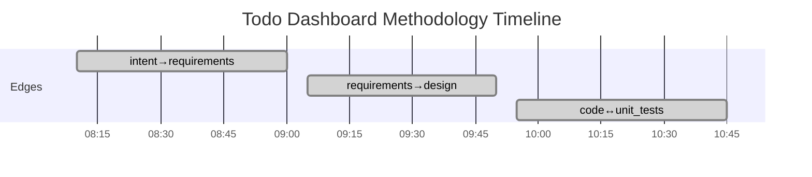

# Project Status: todo-demo

Generated: 2026-03-04T10:45:00Z

## Phase Completion Summary

| Edge | Status | Iterations | Evaluators | Source Findings | Process Gaps |
|------|--------|------------|------------|-----------------|-------------|
| intent→requirements | converged | 2 | 2/2 (2h) | 0 | 0 |
| requirements→design | converged | 2 | 2/2 (2h) | 0 | 0 |
| code↔unit_tests | converged | 2 | 5/5 (3d+2h) | 0 | 0 |

## Self-Reflection (TELEM Signals)

### TELEM-001: Human review enabled quality improvement
**Signal**: Requirements edge required 2 iterations after human added priority field and ISO date constraint.

### TELEM-002: Deterministic engine caught 3 issues in first code iteration
**Signal**: test_coverage 62%<80%, 3 lint violations, missing REQ tag in routes.py. All fixed in iteration 2.

## Aggregate Metrics

- **Total REQ keys**: 1 (REQ-F-TODO-001)
- **Edges converged**: 3/3
- **Total iterations**: 6
- **Human reviews**: 3
